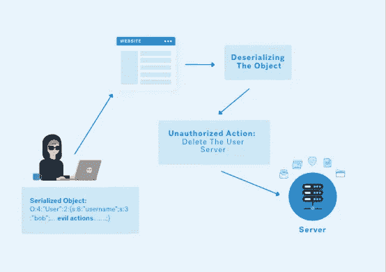
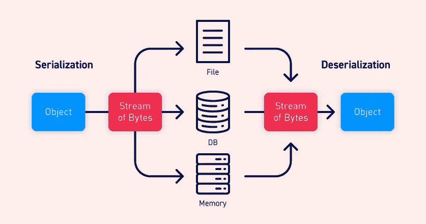
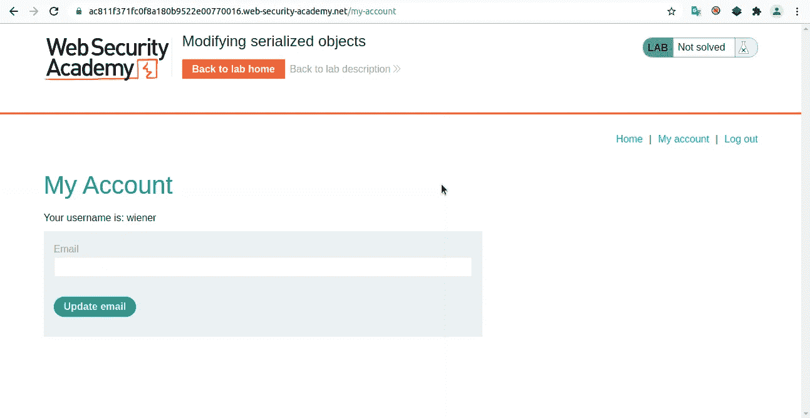
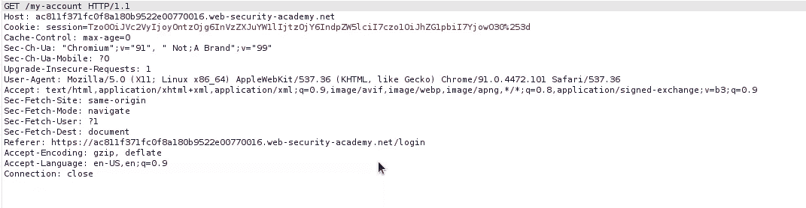
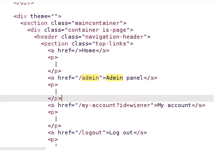
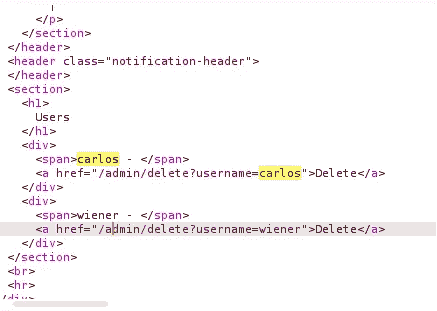
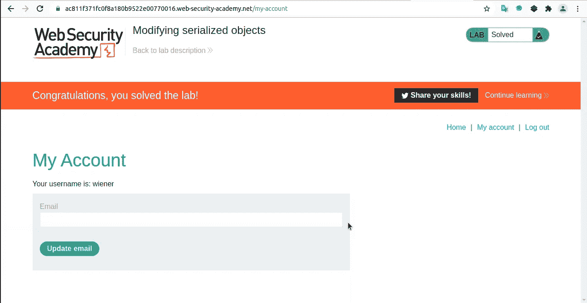
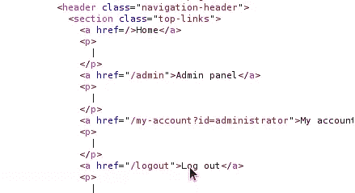
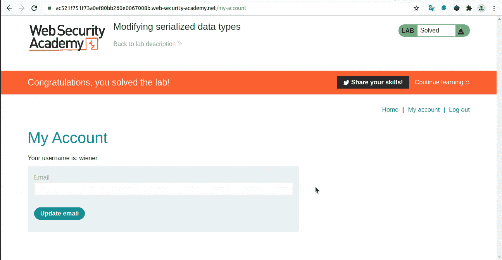

# 不安全的反序列化？

> 原文：<https://infosecwriteups.com/insecure-deserialization-2a8dbdb94a81?source=collection_archive---------4----------------------->



你好，欢迎来到这个博客，在这个博客中，我们将发现什么是不安全的反序列化？我们将采用 PHP & Python 中的一些代码示例和一些利用场景，同时解决 Portswigger 中的两个实验，不会浪费任何时间；我们走吧！

# 序列化与反序列化:

*   **序列化:**它是将对象转换为某种形式的数据并将其保存在文件、数据库或内存中的过程，这些数据以字节流的形式发送和接收，序列化的目的可以是保存数据以备后用，或者使用它通过网络、应用程序的不同组件或 API 发送数据。

**注意:**编程语言支持序列化，但是每种编程语言都有不同的方法来处理序列化的过程，然而要使这个过程通用并且与编程语言无关；应用程序使用 JSON 和 XML 等格式..序列化在其他编程语言中也有一些缩写，比如 Ruby 中的 marshalling 和 Python 中的 pickle！

*   **反序列化:**这是序列化的逆过程，反序列化的目的是以保留的方式恢复对象，以便恢复对象及其属性等..就像序列化之前的第一次一样！



序列化与反序列化

# 不安全的反序列化？

什么是不安全的反序列化？好吧，让我们放松一下，你记得连载吗？我们说过，一些数据为了使用而被序列化，如果这些数据是用户可控制的数据，并且在反序列化中这些数据没有经过验证就通过了，那么这绝对是一种不安全的反序列化。

攻击者也可以用其他类中的另一个对象替换序列化的对象，这就是为什么这个漏洞在 PHP 中被称为示例；对象注入，但是如果对象是从意外的类注入的；可能会出现例外。

不安全的反序列化用于实现任意代码执行[RCE]、权限提升(我们将在实验中看到)、访问控制旁路、拒绝服务等

# 减轻

一些应用程序以列入黑名单的方式使用一些检查和验证，然而这些检查可以通过一些额外的努力来绕过，正确的方法是永远不要反序列化用户可控制的数据，如果这是不可能的，则需要数字签名来添加一些完整性检查；加密还可以用来防止用户读取数据，然后更改数据，或者只是理解他们被创建的模式！

# 示例[Python 和 PHP]

我们举几个 PHP 的例子，可以在 PHP 中利用不安全的反序列化(对象注入)吗？

# 示例 1[权限提升]:

让我们考虑一个具有用户和管理员权限的应用程序，一个会话 cookie 包含具有**角色**属性的序列化对象，值为 user，但是该应用程序已经有了一个处理用户和管理员权限的机制，我们能绕过它吗？我们能实现权限升级吗？

这是 PHP 代码:

```
<?php
    $user = unserialized($_COOKIE);
    if ($serialized['role'] == 'administrator') {

        // Admin Privileges Code
    }

    else {
      // User Privileges Code
    }
?> 
```

问题是，对象以不安全的方式被反序列化，没有验证或完整性检查；攻击者可以将**角色**属性的值从**用户**更改为**管理员**，他将获得完全权限提升！！！

# 例 2【价格参数篡改】:

在示例 2 中，让我们考虑一个购物应用程序，其中用户可以买东西，一个购物车 cookie 将包含一个 **checkout** 属性，值是项目的总数，假设是 1000 美元，我们可以使用不安全的反序列化来更改这个在应用程序逻辑中有缺陷的价格吗？动手吧:)

```
<php?
    $cart = unserialized($_COOKIE);

    if ($cart) {
       $total_amount = $cart['checkout']; 
    }

   // other code
?>
```

本例中的问题是，当 if 条件设置为 true(购物车 cookie 在 HTTP 请求中发送)时，用户可以控制 total_amount 而无需任何验证，total_amount 变量设置为 checkout 属性的值！！攻击者可以很容易地将该值更改为类似 0 的值，因此 total_amount 将从$1000 更改为$0！！

现在，是 python:)让我们来检查一下这个容易受到不安全反序列化的 python 代码的例子，我们这里会用到 pickle 模块，这个过程在 Python 中叫做 pickle。

# 例 1 [RCE]:

```
import pickle

with open('payload', 'r') as file:
     pickle.loads(file.read())
```

这里的问题是，代码执行不安全的反序列化，这将加载名为**有效负载**的文件，而不进行任何验证或检查，但是攻击者可以生成一个序列化的有效负载，其中包含像 whoami 这样的操作系统命令，当代码执行时，攻击者将收到 whoami 命令的结果，这是一个 RCE！！

# 实验室:

# lab 1[权限提升]:

让我们来解决 Portswigger Academy 的这个实验，这里需要的操作是获得管理员权限并删除一个名为 carlos 的用户的帐户，让我们开始吧:)

在以正常用户权限登录过程后，这是易受攻击的应用程序:



普通用户界面

现在，让我们重新加载页面，并用 Burp 拦截请求:



会话 cookie 包含一个 base64 编码的字符串，如果我们使用类似于 [CyberChef](https://gchq.github.io/) 的在线工具对其进行解码，我们应该会得到这个对象字符串: **O:4:“用户”:2:{s:8:“用户名”；生:6:“维纳”；s:5:“admin”；b:0；}** ，有趣的是 admin 属性的值是一个布尔值 0，这意味着它是假的！！我觉得那是个条件，我们试着改成 1 吧。所以现在的对象应该是 **O:4:“用户”:2:{s:8:“用户名”；生:6:“维纳”；s:5:“admin”；b:1；}** ，我们将在会话 cookie 中将对象字符串编码为 base64 格式，并使用 Burp 的 repeater 选项卡发送请求。

我们来看看回应:



嘣！！我现在是管理员了！让我们尝试使用 GET 方法请求/admin 端点，并搜索 carlos，我们将删除他的帐户以解决此实验:



这里有两个用户，我(wiener)和 carlos，让我们通过请求 **/admin/delete 来删除 carlos 的帐户。使用 GET 方法的 username=carlos** 端点。



解决了！！

# lab 2[认证旁路]:

要理解本实验的解决方案，我们必须理解 PHP 如何处理数据类型，PHP by origin 是一种松散类型的语言，在 **==** 操作符中，这意味着它只寻找值，而不是两个操作数的数据类型，让我们用下面的代码来理解这一点:

```
<?php
   $value_1 = 10;
   $value_2 = "10";

   if ($value_1 == $value_2) {

       echo "Same !";
   }

?>
```

正如您所看到的，value_1 是一个整数(整数),但是 value_2 是一个字符串，即使不考虑数据类型，这两个值也是相同的，if 条件使用 **==** 运算符查找这两个值之间的相等性，而不查找数据类型，因此条件将计算为 true，因此将执行 echo 语句来打印 **Same！**。

第二件事是带有 **==** 操作符的 0 产生了一个有趣的问题需要研究。让我们来研究下面的代码:

```
<php?
      $string = "Welcome to my blog !";
      if (0 == $string) {
          echo "Same !";
      }
?>
```

字符串变量是一个字符串(数据类型)，if 条件比较 0 和我们的字符串变量，那么，if 条件将计算为真，因此 echo 语句将执行，但是为什么呢？

正如我之前所说，PHP 是一种松散类型的语言，所以我们的字符串不包含任何整数，如 9，10 或 8 … 0 整数在那里，条件为真！**一样！**应该印在什么地方！

本实验的目的是绕过身份验证以获得具有管理员权限的帐户，但是，让我们来寻找相同情况下的易受攻击代码，以及我们如何从源代码绕过身份验证，从而解决本实验，在 HTTP 请求期间，序列化对象在会话 Cookie 中传输。让我们检查一下这段代码:

```
<php?
    $serial = unserialized($_COOKIE);

    // $password variable in the if condition is a pre-defined 
    // password for admin

    if ($serial['password'] == $password) {
        // admin login  success!
    }
?>
```

上面的代码演示了一个在 PHP 中实现的小型认证机制，它容易受到不安全的反序列化的攻击，这是一个绕过认证的很好的 bug，用户可控制的数据(即序列化的对象)包含一个密码属性，值是用户提供的密码，条件是将密码的属性值与预定义的管理员密码进行比较，还记得 0 和 PHP 松散类型的符号吗！我打赌你记得它！攻击者会将 password 属性中的序列化对象的值从某个密码更改为 0！现在，如果管理员密码不是以数字开头，登录将会成功，从而绕过身份验证机制！

现在，我们明白了 PHP 是怎么回事，让我们来解决实验室！

考虑到基于序列化会话的机制，为了删除 carlos 的帐户，所需的操作是绕过身份验证，让我们开始吧！

以普通用户身份登录后，引入一个默认的普通用户界面，让我们重新加载页面，用 Burp 拦截请求，session cookie 包含一个 base64 编码的字符串，让我们解码一下，看看是怎么回事，收到的结果是这个 object**O:4:" User ":2:{ s:8:" username "；生:6:“维纳”；s:12:“access _ token”；s:32:“sfzfvdy 6 lk 5y 3 K5 wd 24 tipbrdgsj 8 ggf”；}** 用一个设置为 wiener 的 user_name 和一个访问令牌，这里需要注意的重要一点是，对象中有一个 **s** ，它是数据类型标签，s 代表字符串，I 代表整数等等……在 s: some 数字之后还有一个，这个数字是对应属性/值的长度！所以我们必须非常小心地改变这里的事情！

我首先尝试将**用户名**属性的值更改为 admin，但是我在响应中得到一个 500 内部服务器错误，所以让我们尝试将其更改为**管理员**但是请记住，我们必须将对象的长度从 6 更改为 13，但是我们再次得到一个服务器错误，所以这里的问题是 access_token，让我们编写一些 PHP 代码来创建一个假想的情况:

```
<php?
    $serial = unserialized($_COOKIE);

    // $admin_access_token is a pre-defined variable that contains
    // the access token of the admin !
    if($serial['username'] == 'administrator' && 
       $serial['access_token'] == $admin_access_token) {

           // admin logic code here !
       }
?>
```

让我们试着看看，是的，我看到你明白:)这里看到的是 **==** 运算符，第一个操作数将获得 **access_token** 的值，将其与预定义的 admin_access_token 进行比较，如果 admin_access_token 字符串不是以数字开头，攻击者可以将 **access_token** 的值从 sfzfvdy 6 lk 5y 3 K5 wd 24 tipbrdgsj8ggf 更改为 0，例如作为一个整数值！请回到 0 和==记数法了解更多！

我们已经有了这个对象 **O:4:“用户”:2:{s:8:“用户名”；生:6:“维纳”；s:12:“access _ token”；s:32:“sfzfvdy 6 lk 5y 3 K5 wd 24 tipbrdgsj 8 ggf”；}** ，让我们将**用户名**属性的值更改为**管理员**，长度为 13，并将**访问令牌**属性的值更改为 0，数据类型标签为整数[i]，因此新对象现在是:

**O:4:“用户”:2:{s:8:“用户名”；s:13:《管理员》；s:12:“access _ token”；I:0；}**

我们现在将使用 base64 编码格式对这个新对象进行编码，在 HTTP POST 请求中的会话 cookie 中发送它，并查看服务器的响应。



嘣，我们现在是管理员了！！导航到管理端点后，让我们尝试请求 **/admin/delete？用户名=卡洛斯**:



厉害了，解决了！

注意:在对象的反序列化过程中，它保留了数据类型，即 integer 是 integer，string 是 string！！在带有对象的普通请求中，数据类型被转换以适应这种情况！

另请注意:我的英语不是很好，所以请期待一些语法错误，技术错误也在意料之中！

对于卡洛斯，我很抱歉删除了你的帐户两次，请忘记这一点，并创建一个新的帐户:(

感谢您的阅读，我希望您理解什么是不安全的反序列化，并且我希望代码示例是更多理解它的支持材料！！如果你有任何问题、编辑、技术/语言错误修正，欢迎你在 akhrazmoad14@gmail.com 联系我，你也可以在 [Github](https://www.github.com/mdakh404) 和 [Twitter](https://www.twitter.com/akhraz_moad) 上关注我


干杯，@mdakh404