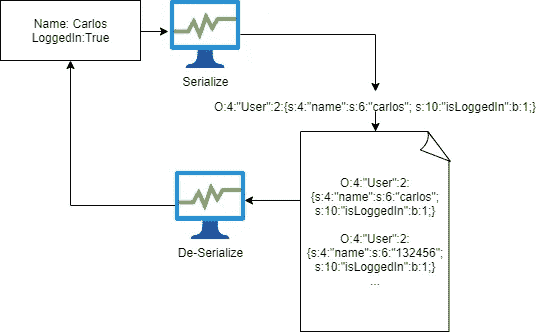

# 不安全的反序列化:超级难！或者是？

> 原文：<https://infosecwriteups.com/insecure-deserialization-its-super-hard-or-is-it-94d89e2847?source=collection_archive---------0----------------------->

# 介绍

不安全的去军事化通常被视为一种非常严重的漏洞类型，但也不尽然。这确实需要对所讨论的编程语言有相当的了解，但是如果你对编程语言有所了解的话，这种情况也会发生。

在本模块中，我们将通过 portswigger 实验室中的实际例子来了解 PHP 和 Ruby 的反序列化过程。这将让我们更好地理解这个概念。

Java 序列化和反序列化使用二进制格式，这种格式很难阅读，超出了本文的范围。

# 序列化

如果我们想了解去序列化过程，我们首先需要了解什么是序列化。当我们谈到序列化时，我们指的是将复杂的结构(如对象，例如一个人的年龄、性别和姓名)处理成一种更简单的格式，这样它就可以在一个连续的字节流中发送和接收。这使得我们可以将复杂的数据结构写入内存、文件或数据库，还可以通过网络将数据发送给不同的 API。

当我们序列化数据时，我们保存它的属性和它们的值，记住这一点非常重要。例如名为“Sophie Kent”的 16 岁女性将变成类似{female|16|Sophie|kent}的东西

例如，考虑一个具有 PHP 属性的用户对象:

```
$user->name = "carlos";
$user->isLoggedIn = true;
```

序列化时，该对象可能如下所示:

```
O:4:"User":2:{s:4:"name":s:6:"carlos"; s:10:"isLoggedIn":b:1;}
```

这可以解释如下:

```
O:4:"User" - An object with the 4-character class name "User"
2 - the object has 2 attributes
s:4:"name" - The key of the first attribute is the 4-character string "name"
s:6:"carlos" - The value of the first attribute is the 6-character string "carlos"
s:10:"isLoggedIn" - The key of the second attribute is the 10-character string "isLoggedIn"
b:1 - The value of the second attribute is the boolean value true
```

**Python 将序列化称为酸洗**

**Ruby 将序列化称为编组**

# 反序列化

当我们反序列化我们相反，我们使用创建的字节流，并把它变成一个对象。狂热的黑客应该已经发现了哪里会出错。



序列化具体如何发生在很大程度上取决于编程语言，有些语言可能将对象转换成二进制格式，而其他语言可能使用不同的字符串格式。有些很容易读，有些很难读。

# 不安全的去军事化

# 它是如何发生的？

无论哪里涉及到用户输入，我们现在或以后都有可能出现问题。在非军事化的情况下，现在正是时候。很难安全地正确序列化或反序列化用户输入，因为开发人员必须创建自己的过滤和黑名单。想想看，现代网站有如此多的依赖项和库，以至于无法预测攻击者可以调用哪些方法。如果攻击者真的下定决心，他们甚至会在通过接收器传递数据时链接不同的方法。

不安全的反序列化令人担忧的是，攻击甚至在反序列化完成之前就发生了。人们普遍缺乏对整个反序列化过程的理解，也不知道反序列化用户输入有多危险。

即使在反序列化数据上增加额外的检查也是无效的，因为缺陷发生在反序列化过程之前。

理想情况下，你永远不应该忽视用户输入！

由于这个过程的工作方式，我们可以用 web 应用程序可以访问的任何对象替换序列化对象。这也是为什么不安全的反序列化有时被称为对象注入的原因。

# 如何鉴别？

识别不安全的反序列化通常非常简单。不同的语言都使用特定的格式，如果你知道它看起来像什么，就很容易识别。

# 服务器端编程语言（Professional Hypertext Preprocessor 的缩写）

```
O:4:"User":2:{s:4:"name":s:6:"carlos"; s:10:"isLoggedIn":b:1;}
```

我们之前已经看过这个例子了，PHP 将以人类可读的格式序列化数据。

```
O:4:"User" - An object with the 4-character class name "User"
2 - the object has 2 attributes
s:4:"name" - The key of the first attribute is the 4-character string "name"
s:6:"carlos" - The value of the first attribute is the 6-character string "carlos"
s:10:"isLoggedIn" - The key of the second attribute is the 10-character string "isLoggedIn"
b:1 - The value of the second attribute is the boolean value true
```

# 红宝石

```
marshalled = Marshal.dump([1, 2, 'string', Object.new])
This dump method will create a seriliazed object. Our input contains numbers, a string and even an object. We can easily seriliaze those into one and then later deserialize it when we need it. 
Result => "\\x04\\b[\\ti\\x06i\\aI\\"\\vstring\\x06:\\x06ETo:\\vObject\\x00"
```

正如您所看到的，ruby 似乎用十六进制表示法(\x04)来表示它的“编组”数据(记住编组是 Ruby 的序列化术语)。

如果我们遇到这种情况，最重要的是我们可以创建一个非常简单的 ruby 脚本来反序列化这个对象。

```
Marshal.load("\\x04\\b[\\ti\\x06i\\aI\\"\\vstring\\x06:\\x06ETo:\\vObject\\x00")
# => [1, 2, "string", #<Object:0x00000002643000>]
```

然后，我们可以进行任何需要的更改，并用我们前面看到的封送转储方法对其重新编码。

```
marshalled = Marshal.dump([2, 2, 'string', Object.new])
```

# 那么我该如何利用这一点呢？

我们可以用两种方式来利用这个缺陷，在本文中我将主要介绍函数方式，因为这是我的工作方式，而对象注入通常需要访问源代码。我还将在一定程度上介绍对象注入方法，以便您可以习惯它，如果您对它感兴趣，我希望您能进一步研究它。

# 功能测试

当我们测试纯粹的功能时，我们依赖于这样一个事实，即我们可能在某个地方找到这些序列化对象中的一个，我们可以操纵它的值。Portswigger labs 使用 cookies 作为示例，但它也可以出现在其他位置，例如可能发送序列化对象的表单中的隐藏字段。我们可以找到 serliliazed 对象的另一个地方是在 javascript 代码中，因为它可能需要将其中一个值传递给后端。

如果我们看一看 portswigger 实验室，我们可以看到一些简单的 PHP 示例。所有这些都依赖于被设置为序列化 PHP 对象的 cookie。如果您检查 cookies，您应该会发现与我们的示例类似的内容。你可以简单地编辑这个 cookie 来做你不应该做的事情。这方面的一个基本示例是，通过更改以下实验中可以找到的布尔值来使自己成为管理员:

[https://ports wigger . net/we B- security/deserialization/exploining/la B- deserialization-modificing-serialized-objects](https://portswigger.net/web-security/deserialization/exploiting/lab-deserialization-modifying-serialized-objects)

像 PHP 这样的编程语言有一种叫做松散比较运算符的东西。在 PHP 中这是一个例子。

```
if("a"=="b")
```

这个==被称为操作符，在这种情况下，两个=符号意味着 PHP 将检查提供的变量的值，而不是类型。这意味着，如果真正的密码不是以数字开头，并且我们能够将密码设置为 0，则以下条件成立。

```
$login = unserialize($_COOKIE)
if ($login['password'] == $password)
```

[https://ports wigger . net/we B- security/deserialization/exploining/la B- deserialization-modificing-serialized-data-types](https://portswigger.net/web-security/deserialization/exploiting/lab-deserialization-modifying-serialized-data-types)

最后一个实验实际上非常聪明，因为它试图让您将几个漏洞链接在一起。你必须在服务器上删除一个文件，这可能是非常具有破坏性的，但删除该文件并不那么容易。毕竟，你怎么能删除一个不属于你的网络服务器上的文件呢？

这个实验室的 cookies 中也有序列化的数据，这次它允许您通过提供链接来设置用户头像。这看起来影响不大，因为简单的设定一个头像不会造成太大的伤害，所以让我们继续。

然而，一个聪明的黑客正在思考他们的可能性，他们发现每当他们删除他们的帐户时，通过创建一个新帐户并尝试浏览他的旧头像，头像图片也会被删除，在那里他们会收到 404-not found 消息。这种行为给了黑客一个主意，他会把头像的位置设置到他想删除的文件上，然后删除账户。突然，他们不能再在网站上冲浪了，他们笑着知道他们刚刚删除了所有的配置文件

[https://ports wigger . net/we B- security/deserialization/exploining/la B- deserialization-using-application-functional-to-exploi-unsecured-deserialization](https://portswigger.net/web-security/deserialization/exploiting/lab-deserialization-using-application-functionality-to-exploit-insecure-deserialization)

所有这些实验都讨论 PHP 序列化和反序列化，但是当然所有这些攻击在任何其他语言上都是可能的，因为它们都围绕着简单地反序列化这些对象，同时我们进行一些更改并再次序列化有效负载(通过在语言手册中查找要使用的命令并编写一个简单的脚本)。

# 对象注入

[https://ports wigger . net/we B- security/deserialization/exploining/la B- deserialization-arbitrary-object-injection-in-PHP](https://portswigger.net/web-security/deserialization/exploiting/lab-deserialization-arbitrary-object-injection-in-php)

在本实验中，您将学习如何通过在文件名后输入波浪号(~)来查看文件的源代码。这是因为一些编辑器和 ide 创建了备份文件，并用波形符进行标记。有时候开发人员忘记了他们不应该上传这些文件。

在浏览源代码时，我们可以找到 __destruct()方法，它将调用 lock_file_path 属性上的 unlink()方法，这将根据 PHP 手册删除该路径上的文件。

```
unlink ( string $filename , resource $context = ? ) : bool
==> Deletes filename. Similar to the Unix C unlink() function. An E_WARNING level error will be generated on failure.
```

该网站不断引用一些自定义模板 PHP 站点，所以让我们在这里应用我们的波浪号技巧。

```
[https://[[YOUR-LAB-ID]].web-security-academy.net/libs/CustomTemplate.php~](https://[[YOUR-LAB-ID]].web-security-academy.net/libs/CustomTemplate.php~)
```

这给了我们一个很酷的源代码文件，里面有我们讨论过的所有方法。销毁方法是一个所谓的魔法方法，当我们删除一个序列化的对象时，这个方法会被激活。

```
<?phpclass CustomTemplate {
    private $template_file_path;
    private $lock_file_path; public function __construct($template_file_path) {
        $this->template_file_path = $template_file_path;
        $this->lock_file_path = $template_file_path . ".lock";
    } private function isTemplateLocked() {
        return file_exists($this->lock_file_path);
    } public function getTemplate() {
        return file_get_contents($this->template_file_path);
    } public function saveTemplate($template) {
        if (!isTemplateLocked()) {
            if (file_put_contents($this->lock_file_path, "") === false) {
                throw new Exception("Could not write to " . $this->lock_file_path);
            }
            if (file_put_contents($this->template_file_path, $template) === false) {
                throw new Exception("Could not write to " . $this->template_file_path);
            }
        }
    } **function __destruct() {**
        // Carlos thought this would be a good idea
        if (file_exists($this->lock_file_path)) {
            unlink($this->lock_file_path);
        }
    }
}?>
```

有了这些信息，我们就能解决实验室的问题。因为在我们的 cookies 中有一个序列化的对象，我们可以用它来构造一个序列化的对象，它包含指向我们想要删除的文件的 lock_file_path。如果我们现在用修改后的会话 cookie 替换我们的会话 cookie，服务器将自动调用 __destruct 方法并销毁我们的目标文件。

不要在 BUG 奖励或 PENTESTING 中删除重要或随机的文件！

# 下一步是什么？

当然，对象注入和功能测试并不是我们在这里唯一能做的两件事。您还可以进一步了解:

*   二元不安全反序列化
*   小工具链
*   创建您自己的漏洞
*   PHAR 反序列化
*   使用内存损坏的去串行化

# 资源

[https://stack overflow . com/questions/410186/how-do-ruby-serialization-marshaling-work](https://stackoverflow.com/questions/410186/how-does-ruby-serialization-marshaling-work)

[https://ports wigger . net/we B- security/deserialization/exploining](https://portswigger.net/web-security/deserialization/exploiting)

【https://docs.python.org/3/library/pickle.html 