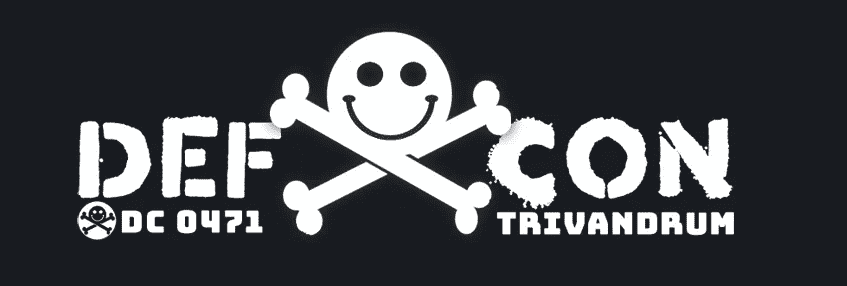
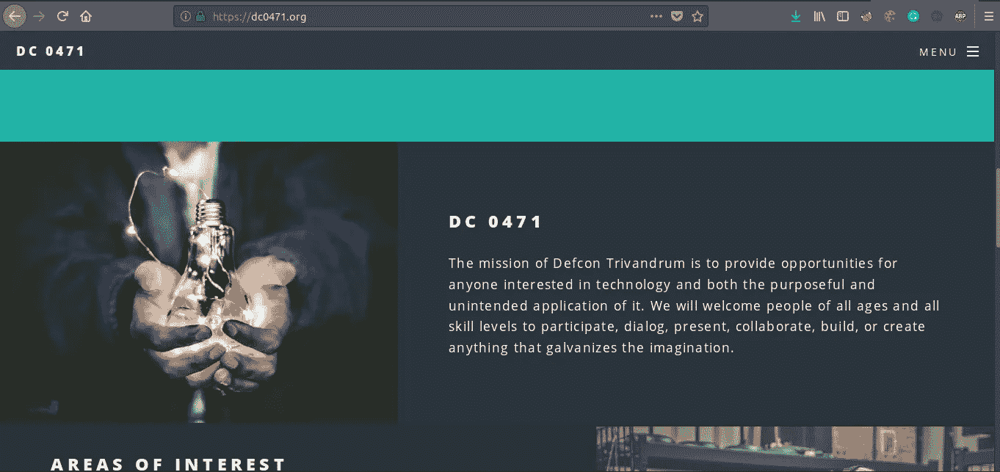
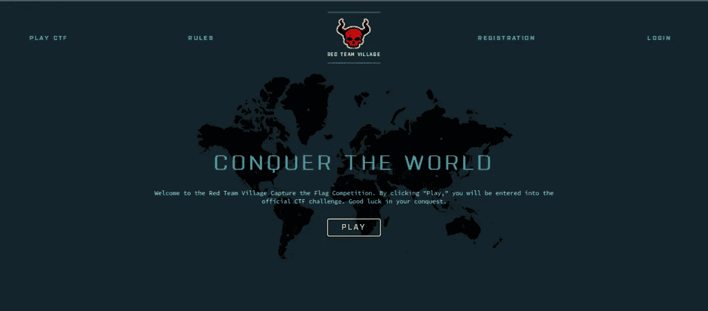
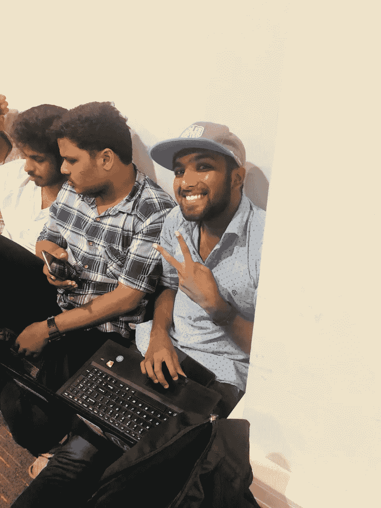
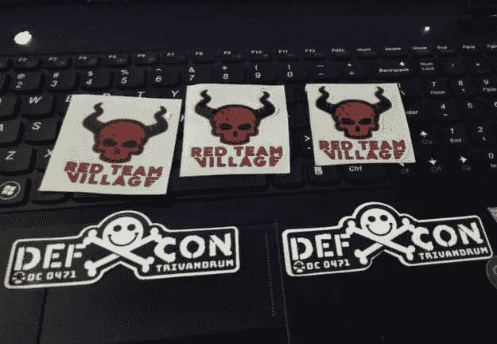

# 我第一次参加夺旗比赛的感悟

> 原文：<https://infosecwriteups.com/insight-on-my-first-capture-the-flag-competition-4e549e4aaaed?source=collection_archive---------0----------------------->

已经等了一年的第二版 Defcon Trivandrum([DC 0471](https://dc0471.org/))Meetup

虽然第一次聚会缺少一些元素，但这一次太好了，有关于 Windows 利用、黑暗网络、恶意软件分析、无线电黑客、红色团队的谈话等等。

虽然我从来没有机会参加每一次演讲，但这是一次很棒的经历

**DC0471 见面会上的下一件大事是[红队村](https://redteamvillage.org/)的夺旗比赛**

当我与最著名的队伍( [Katta Locals](https://www.hackthebox.eu/home/teams/profile/166) ) ≤== 1337s 竞争时

这是一次非常棒的经历，因为我们像是获得和失去了位置，我们从第三名开始变成了第一名，然后第二名，最后第三名结束

这些挑战非常简单，但是你需要冷静的头脑来理解 LOL (f14g)

从 N00b 的角度来看，我在比赛中度过了美好的时光，并获得了第三名，因为我可以保证**你还没有看到我的最后一次**。

冲向卡塔地方队 [**赫曼思**](https://www.facebook.com/hemanthjoseph1)**[**金尼什**](https://www.facebook.com/jineesh.ak1)**[**苏丁**](https://www.facebook.com/sudin.nk)**[**斯雷哈里**](https://www.facebook.com/xss.py)**[**宝石**](https://www.facebook.com/gemgrge)********

******也感谢 DC0471 社区为我们举办这样的活动******

******活动中的一些图片******

************

******那是我在计算一个 200 分的挑战 XD******

************

******一些很酷的贴纸******