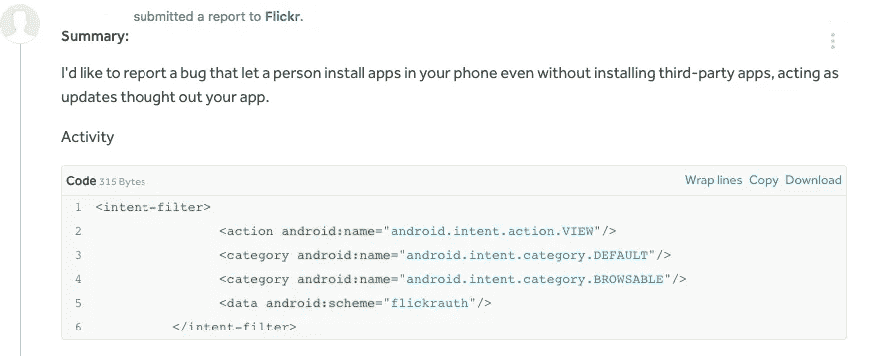
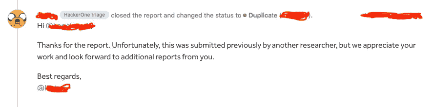

# 远程安装不可见的恶意应用程序，充当更新

> 原文：<https://infosecwriteups.com/install-invisible-malicious-apps-remotely-acting-as-updates-71178979ff13?source=collection_archive---------2----------------------->

## 使用 Flickr 应用程序远程安装恶意应用程序作为更新。

在 [Unsplash](https://unsplash.com?utm_source=medium&utm_medium=referral) 上由 [Rishabh Dharmani](https://unsplash.com/@rishabhdharmani?utm_source=medium&utm_medium=referral) 拍摄的照片

# 101 个关键词:

*   *深度链接*
*   *更新*
*   *Flickr*

## *深度链接；*

是一种将用户直接导向应用程序而不是网站或商店的链接？它们用于将用户直接发送到特定的应用内位置，节省用户自己定位特定页面的时间和精力，从而显著改善用户体验。

深度链接通过指定一个自定义 URL 方案( **iOS** 通用链接)或一个意向 URL(在 **Android** 设备上)来实现这一点，如果你已经安装了应用程序，它会打开你的应用程序。还可以设置深层链接，将用户引导至特定的事件或页面，这些链接可能与您想要开展的活动相关联。

## 更新；

用同一产品的新版本替换该产品的过程。在计算和消费电子产品中，升级是指用更新或更好的版本替换硬件、软件或固件，以更新系统或改进其特性。

## Flickr

一个美国的图像托管和视频托管服务，以及一个在线社区，成立于加拿大，总部设在美国。它由 Ludicorp 于 2004 年创建，是业余和专业摄影师用来存放高分辨率照片的流行方式。

在 Flickr 上建了一个账户后，我想找到任何我可以报告的漏洞，然后从中赚点钱。让我们记住，这个应用程序维护得很好，这就是为什么我不期望找到任何至关重要的东西。但众所周知，没有什么是不可能的，只有努力。Bug 猎人只关注 web 应用程序。没有多少人尝试破解手机应用程序，让我们面对它，没有太多的人知道如何去做，因为在野外没有太多的教程。了解到这一点后，我把重点放在了他们的移动应用上。几个小时后，在使用移动应用程序**反编译器**时，我发现了一个不寻常的错误。

这是 android 应用程序上的*活动计划*，它滥用了 android 手机中的 Deeplink 和远程更新功能。我做了一个链接，一旦你点击它，它会在你的手机上安装一个恶意应用程序，作为你手机的更新。

活动被导出，可以通过浏览器访问。当任何 **WebView** (在客户端应用程序或浏览器中)遇到 **flickrauth://etc** URL 时，它将自动启动 Flickr 应用程序。

文件`com/yahoo/mobile/client/android/flickr/activity/DeepLinkingActivity.java`

无需深入细节，我所要做的就是使用这段代码来远程滥用人们手机上的 **flickr** 应用程序。使用网络意图`<a href="smdm://yourserver.com"</a>`

在成功地测试了我的发现以确保它是合法的之后，我开始幻想用这份报告的钱买一台新电脑，结果发现这是一个复制品。

几个月前，我报告了类似的事情，我甚至提到了这个漏洞，我想他们只是没有发现这个问题，其他人作为个人报告再次报告了这个问题，并在我之前得到了它。但是经过一些来回，因为我无法访问重复的报告，他们告诉我，那个人报告了这个漏洞 2 年前我的，但对于一些奇怪的，我仍然不知道，它被密封在某种分类报告。

## 摘要

我之前说过，没有什么是不可能的，简单来说就是难，这也是为什么别人比我先发现了这个漏洞。对于刚开始涉足这个领域的人来说，有些段落可能不清楚，但这是故意的，所以这个漏洞不会被滥用，因为他们还没有修复它。

# 🔈 🔈Infosec Writeups 正在组织其首次虚拟会议和网络活动。如果你对信息安全感兴趣，这是最酷的地方，有 16 个令人难以置信的演讲者和 10 多个小时充满力量的讨论会议。[查看更多详情并在此注册。](https://iwcon.live/)

 [## IWCon2022 - Infosec 书面报告虚拟会议

### 与世界上最优秀的信息安全专家建立联系。了解网络安全专家如何取得成功。将新技能添加到您的…

iwcon.live](https://iwcon.live/)