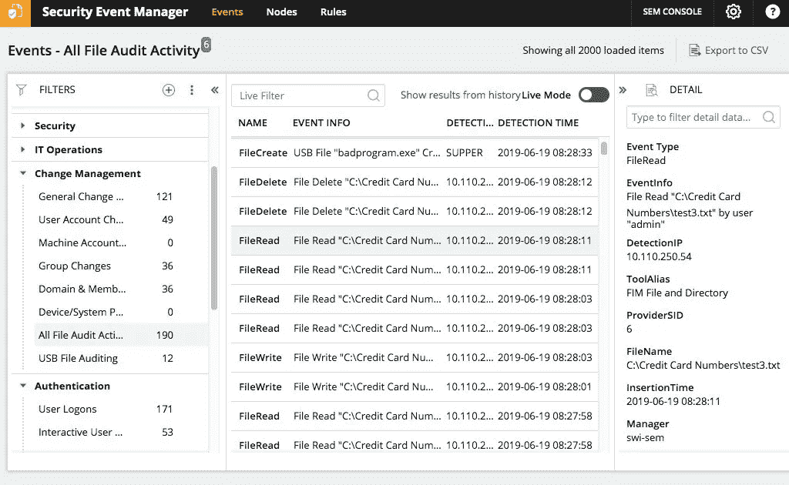
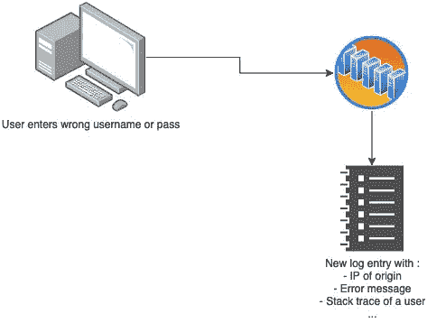

# 记录和监控不足

> 原文：<https://infosecwriteups.com/insufficient-logging-and-monitoring-65f2bc42b6d5?source=collection_archive---------1----------------------->

[戈兰·伊沃斯](https://unsplash.com/@goran_ivos?utm_source=unsplash&utm_medium=referral&utm_content=creditCopyText)上 [Unsplash](https://unsplash.com/@goran_ivos?utm_source=unsplash&utm_medium=referral&utm_content=creditCopyText)

# 介绍

当您试图找出如何修复服务器时，它出现了问题。这可能是因为您使用了错误的命令，也可能有其他原因。因此，要找出哪里出了问题，通常需要运行 history 命令，它会向您显示在命令行中运行过的所有命令。在此之后，很容易找出是哪个命令导致了这种情况，或者如果不是命令，是什么样的外部因素导致了系统重新启动。Linux 记录在终端上执行的所有命令，一旦您运行 history 命令，它就会显示日志本身的结果。

所以通过这个例子，你很容易理解日志记录有多重要。

[来源](https://www.dnsstuff.com/wp-content/uploads/2019/09/Security-Event-Manager-SEM.jpg)

假设你从 XYZ 的官方网站购买。交易没有成功，但是你的钱已经从你的银行账户中扣除了。您现在已经提交了一张关于退款的支持票，但尚未下订单。XYZ 有办法证明你说的是真的吗？是的，有。你对 XYZ 的网络服务器或任何其他公司的服务器所做的每一笔交易和每一个请求都被记录在一个日志文件中。银行和 XYZ 网站保留了正在处理的每笔交易的日志，无论它们的状态是失败还是成功。

日志文件是表示所执行活动列表的日志条目的集合。例如，您向 ABC 网站发出请求。ABC 的网络服务器会在其日志文件中记录时间、URL 以及您的用户代理和 IP 地址。每个公司都有独特的日志文件格式和可以记录的信息。例如，一些组织可能会在日志文件中记录地理位置和其他详细信息，如登录和其他信息，而其他组织可能不会。

但是，他们为什么要浪费资源来记录通常无用的东西呢？因为只有在发生重大事件时才会检查日志，而这可能需要长达 6-7 个月的时间才能有人查看日志。一个更简单也更复杂的原因是日志提供了对组织活动的可见性。生成的日志使组织能够进行故障排除、跟踪事件、检测事故以及审核和合规性。

它只是一扇通向过去的窗户，让我们看一眼所有发生过的事情。谁做了什么？

另一方面，在不同的场景中，监视可能意味着不同的事情。在这里，它涉及收集和分析信息，以检测可疑行为和未经授权的系统更改，以便尽快妥善解决问题。可以手动完成，也可以自动完成。

可以使用多种技术来实现监控。一些组织使用 SIEM 工具来监控网络上发生的事情，并在检测到恶意请求或行为时发出危险信号。如果检测到恶意行为，将自动向团队发送通知，使他们能够更快、更有效地调查情况。通常有减少攻击面，增加责任的效果。由于它只匹配条件，因此可能会产生误报。

我们还有一种手动方法，在这种方法中，在固定的时间表(如每周或每两周)后调查日志文件。手动方法可以避免误报，但效率不高，因为它会因大量信息而错过许多指标。因此，自动化系统和软件被用于此目的。

日志记录和监控是为了实现一个目标而做的两件不同的事情，即检查您的整体基础设施的健康状况。Web 服务器只是一个大馅饼的一小部分。

# 能达到什么目的？

事件响应团队可以利用日志记录和监控来检测任何数据泄漏以及异常行为和各种其他原因。它们还可以用作机器学习算法的输入，以检测未来的类似攻击。

[来源](https://assets.website-files.com/5ff66329429d880392f6cba2/61029edb14044252f3cd3960_Insufficient%20Logging%20%26%20Monitoring.jpg)

许多组织没有适当的日志格式，或者没有日志，或者日志以不安全的方式存储。例如，一些高度敏感的操作(如登录、密码重置和其他高度敏感的事情)不会被组织记录，因为组织不生成日志。如果出现问题，这将在检查或调查时造成许多困难，因为他们无法确定发起攻击的起点。

一些组织只在他们的计算机上保存日志，这意味着如果有人访问他们的网络并删除他们的所有日志，他们将很难恢复信息并找出攻击的原因。

日志记录和监控不足可能意味着很多事情。它可以是:

1.  缺少重要的安全信息日志。
2.  缺少重要的安全信息日志。
3.  缺乏存储和安全性以及及时响应。
4.  仅将日志存储在本地服务器上。
5.  对于非常敏感的任务，不执行日志记录。
6.  没有适当的警报级别，也没有有效的响应上报协议。

通常建议您维护一个单独的数据库或文件来保存日志，并且您还需要设置一个中央服务器来收集网络中所有系统的日志。这样做是为了确保如果您的主服务器遭到破坏，攻击者获得特权访问，他将无法删除所有日志和记录。因为如果他这么做了，你就不能确定系统是否被入侵了。

# 预防措施

您可以采取的一些措施有:

1.  确保记录所有登录(无论成功还是失败)、访问控制失败、输入验证失败和高度敏感的事务。
2.  确保所有日志都以您可以理解的适当格式生成，或者由任何其他自动化程序/软件生成。
3.  保护所有日志。如果需要，保留一个单独的日志数据库。
4.  应密切监控日志审查。
5.  遵循适当的标准。
6.  将日志保存在不同的地方，而不仅仅是本地。

# 案例研究:

这一事件是日志记录不足但监控不足的一个例子——2013 年的一次数据泄露，攻击者窃取了 4000 万张信用卡。该公司甚至没有被告知任何未经授权的访问。受影响的公司必须支付 1850 万英镑作为违约和解的一部分，许多用户遭受了损失，因为他们需要封锁他们的信用卡并申请一张新的信用卡。它还会在用户和网站之间产生信任问题，使组织无法正确保护他们的信息。

# 结论

互联网彻底改变了我们相互交流的方式。新的和不可想象的事情现在只需点击鼠标就有可能实现。这最终会在任何公司的数据库中产生大量的流量和日志条目。这使得内部安全团队很难从正常日志中过滤出恶意日志。通常，攻击者已经破坏了网络，并由于各种原因带走了数据。

这是更多公司应该努力的地方，为他们公司的安全负责。应对日志进行适当的维护和监控，以确保客户的身份及其公司/组织/企业的声誉得到妥善保管。

## 来自 Infosec 的报道:Infosec 每天都有很多内容，很难跟上。[加入我们的每周简讯](https://weekly.infosecwriteups.com/)以 5 篇文章、4 条线索、3 个视频、2 个 Github Repos 和工具以及 1 个工作提醒的形式免费获取所有最新的 Infosec 趋势！