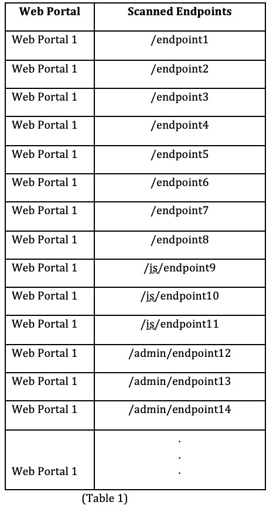
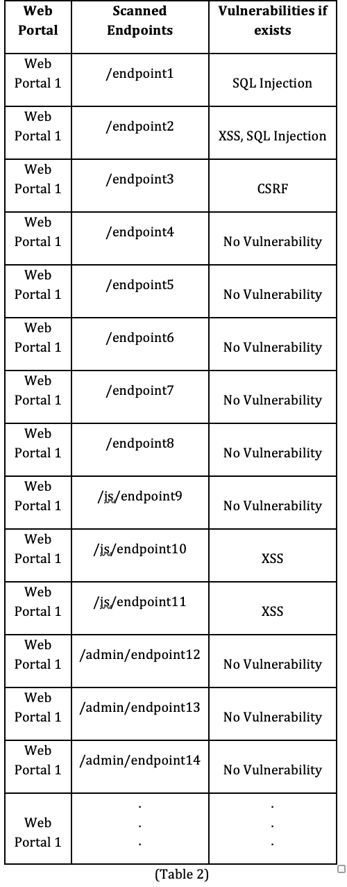
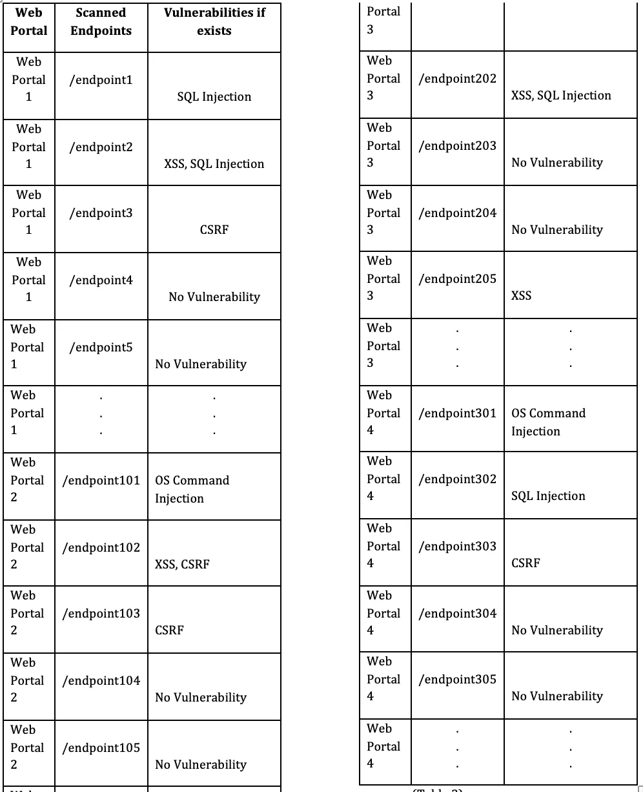
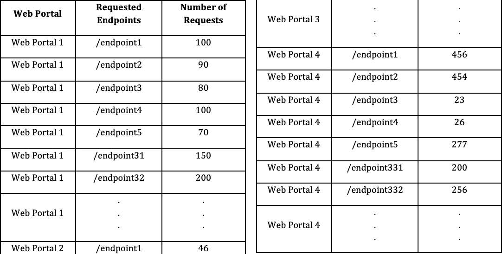
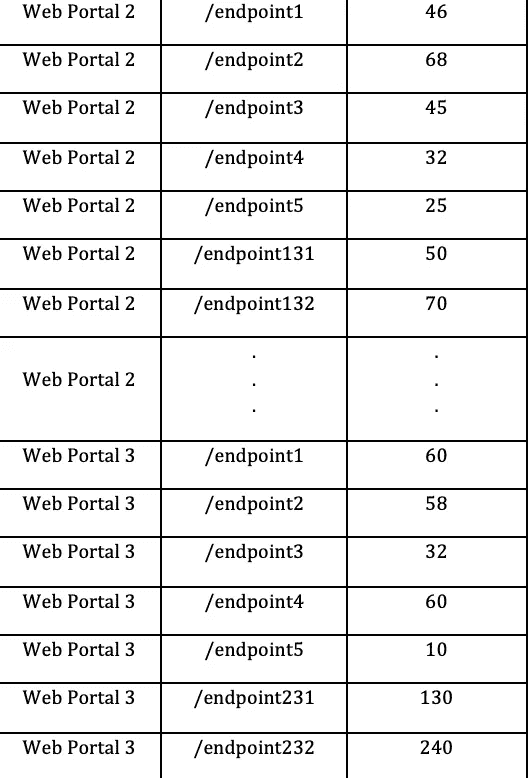
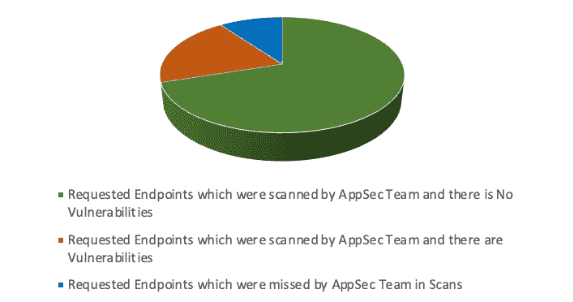
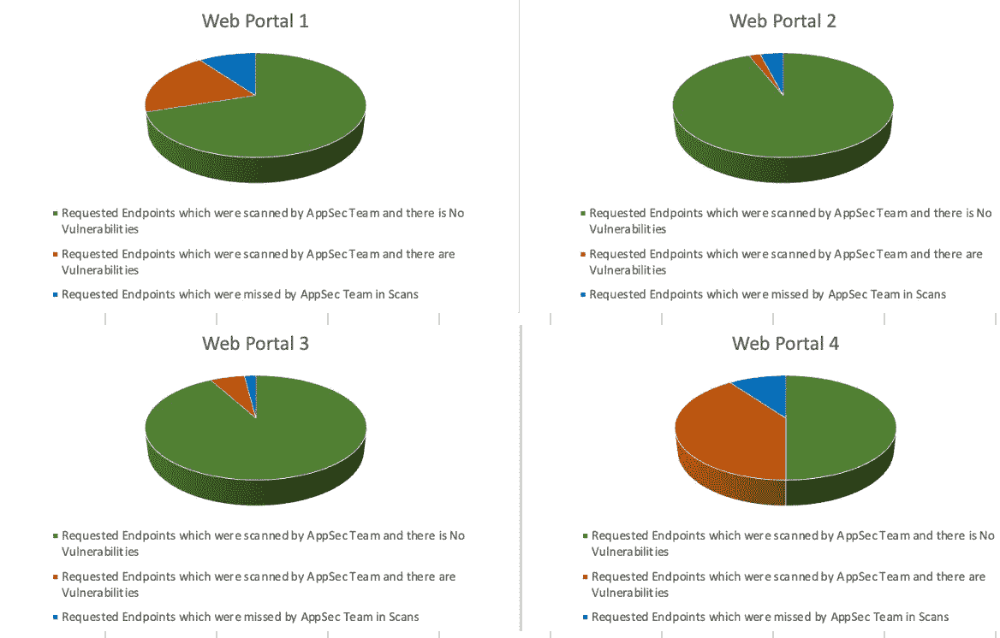

# 使用数据关联和机器学习的应用安全和安全运营中心的集成方法

> 原文：<https://infosecwriteups.com/integrated-approach-for-application-security-and-security-operations-center-using-data-correlation-dc723f493316?source=collection_archive---------7----------------------->

**摘要** — *一个组织典型的网络安全部门至少由两个团队组成，即应用安全(AppSec)团队和安全运营中心(SOC)团队。应用程序安全团队的职责主要是在不良分子发现/利用安全漏洞之前发现它们。SOC 团队持续监控攻击，并使用各种技术消除它们。本文阐述了一种将各个团队的信息结合起来使其他团队受益的方法。*

**1。简介**

运行多个 web 门户的组织的应用程序安全团队使用不同的工具和技术扫描所有的 web 门户，寻找安全漏洞。

这个团队发现安全漏洞，并与 IT 和开发团队互动来解决问题。应用安全团队使用的所有扫描工具和技术都有一定的局限性。一个主要的限制是端点的不完全爬行。

SOC 团队使用 web 应用程序防火墙和 Modsecurity 规则等工具持续监控和防止针对组织门户网站的攻击。SOC 团队不掌握攻击成功概率的信息。

**2。应用安全流程的弱点**

AppSec 团队使用自动或手动技术扫描门户网站的安全漏洞。扫描的主要部分之一是搜索门户网站的端点。无论是自动还是手动方式，爬行仍然是不完整的。如果 web 门户由“n”个端点组成，爬行不能保证覆盖所有“n”个端点。这是由于 AppSec 团队不知道的 web 门户中的条件流很少，基于 Ajax 的请求被自动爬虫错过，以及只有用户角色和选择的特定组合使用的端点很少。
AppSec 团队不知道如何找出扫描中遗漏的端点。这使组织面临风险，因为许多终端从未接受漏洞扫描，最终也从未得到修补

**3。安全运营中心的弱点**

SOC 团队监控组织门户网站上发生的攻击，但无法确定哪些攻击需要紧急手动关注。足球队不知道正在进行攻击成功与否的概率。在今天的场景中，很多时候黑客会同时攻击一个组织的所有“x”个门户网站，耗尽 SOC 团队的带宽。还不知道哪个门户网站比其他门户网站面临的风险更大。

**4。AppSec 和 SOC 团队的集成方法**

**假设:**组织运行 4 个门户网站。每个门户网站分别有 125、260、300、170 个端点。

由于爬行效率低且不完整，AppSec 团队在漏洞扫描中遗漏了 10、15、20、40 个端点。

**集成方法:** AppSec 团队从自动化工具中导出漏洞扫描所覆盖的端点列表，或者在表格中手动列出扫描的端点。

样本数据:

每个端点的公开漏洞(如果存在)也在下一列的同一电子表格中提及。

样本数据:

结合所有门户网站的端点/漏洞数据，如下表所示:

根据下面的假设，漏洞扫描遗漏了 Web 门户 1 的端点:

端点 30 至端点 39

根据以下假设，漏洞扫描遗漏了 Web 门户 2 的端点:

端点 130 至端点 144

根据下面的假设，漏洞扫描遗漏了 Web 门户 3 的端点:

端点 30 至端点 49

根据以下假设，漏洞扫描遗漏了 Web 门户 4 的端点:

端点 330 至 Ednpoint369

**SOC 团队**通过 web 应用防火墙(WAF)、Mod 安全规则或对传入请求的手动监控来监控传入的 Web 流量。

每隔“n”分钟，收到请求的唯一端点列表以及每个端点收到的请求数都会记录在一个表中。

为了避免垃圾数据，只记录 HTTP 响应代码为 200、301、302 的有效请求。

样本数据:

每隔“n”分钟，将请求的端点数据(表 4)与扫描的端点数据(表 3)进行比较。

这是一个合理的假设，即使 AppSec 团队在扫描中遗漏了一些端点，攻击者也不会遗漏它们。原因是攻击者有无限的攻击时间，攻击者人数更多，攻击者拥有的工具比 AppSec 团队更多。

当将请求的端点数据与扫描的端点数据进行比较时，会出现 3 个观察结果，这在下面提到的饼状图中进行了解释。

**图例:**

绿色:请求的端点已被 AppSec 团队扫描，没有漏洞

橙色:AppSec 团队扫描的请求的端点存在漏洞

蓝色:AppSec 团队在扫描中遗漏的请求端点

收到请求但这些端点不在 AppSec 团队扫描范围内的端点(在附件 1 中显示为蓝色)是 AppSec 团队的即时反馈。

这些信息被传递给 AppSec 团队，他们将计划另一次扫描，并在后续扫描中覆盖遗漏的端点。

端点(在展示 1 中以橙色显示)是向 SOC 团队发出的信号，表明这些端点存在公开的漏洞。因此，如果在许多门户网站上发现攻击，SOC 团队可以根据公开的漏洞而不是扫描的端点来确定优先级。

例如，为足球队提供了这样的正在进行的攻击的可视化:

从视觉效果来看，SOC 团队更容易确定优先级。Web Portal 4 的攻击成功概率最高，因为在 AppSec 团队的扫描中有许多公开的漏洞和许多端点被遗漏。

应向漏洞管理团队、IT 和开发团队传递另一个信息，即几乎没有公开的漏洞(在端点 x、端点 y 上..)并且在相同的端点上观察到“n”次攻击。漏洞被利用的可能性更高。

**5。正常流量和受到攻击时的异常检测**

用于异常检测的机器学习算法将应用“未扫描端点上的请求数”和“存在公开漏洞的端点上的请求数”的数据

异常检测是一种用于跟踪每个数据集中罕见事件的方法。这些罕见事件在统计学上不同于其他数据。这将用于检测异常值和识别异常流量。

有一个无监督的异常检测算法将在这个解决方案中应用。无监督异常检测方法不需要训练数据，其工作原理是非常小百分比的数据不同于其余数据，并且是异常值。

如果“未扫描的端点”或“存在公开漏洞的端点”上的请求数量出现异常峰值，异常检测方法将触发警报

对“未扫描的端点”或“存在公开漏洞的端点”的攻击越多，就越有可能被不良行为者利用。

这种使用机器学习算法的警报可以帮助确定行动计划的优先次序。

**6。结论**

这种方法可以通过对遗漏的端点给出即时反馈，帮助 AppSec 团队提高扫描覆盖率。足球队可以配备一种方法，帮助他们了解攻击成功或失败的概率。此外，当 IT 和开发团队的带宽有限时，他们可以根据每个端点上发生的攻击数量，了解与每个端点上的每个漏洞相关的风险。

## 来自 Infosec 的报道:Infosec 每天都有很多内容，很难跟上。[加入我们的每周时事通讯](https://weekly.infosecwriteups.com/)以 5 篇文章、4 个线程、3 个视频、2 个 GitHub Repos 和工具以及 1 个工作提醒的形式免费获取所有最新的 Infosec 趋势！