# 英特尔向上写黑客盒子

> 原文：<https://infosecwriteups.com/intel-writeup-hackthebox-c343bd68a8e9?source=collection_archive---------2----------------------->

tomshow.it

嗨伙计们！欢迎回到另一篇文章。

今天我们要解决 intel，一个黑客盒子提出的新挑战。

开始吧！

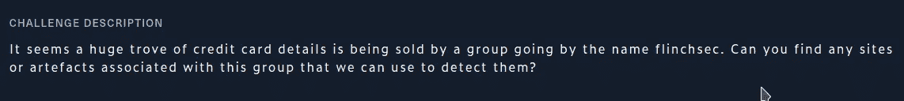

阅读以上内容

因此，挑战告诉我们，一群名为"**flichsec "**的黑客已经出售了大量信用卡信息，我们的目标是找到任何可以帮助我们发现它们的信息。

如果你在谷歌上搜索**flichsec**，第一个结果是一个 LinkedIn 页面，上面有这个简介。

我们试试看他的网站。

他的网站好像关了，也没给我们什么有用的信息。

所以我们能做的就是用 wayback 机器看看有没有保存下来的这个网站的拷贝能帮到我们。

> 注意:wayback machine 是一个保存了过去网站拷贝的网站。

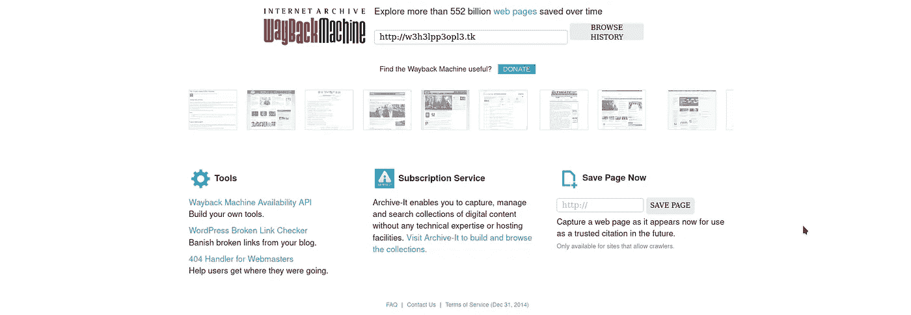

让我们看看我们是否幸运…

是啊！！！该网站保存了一份日期为 2020 年 10 月 30 日的副本。

网站完全不同，它有一个多汁的 GitHub 链接，让我们看看它包含什么。

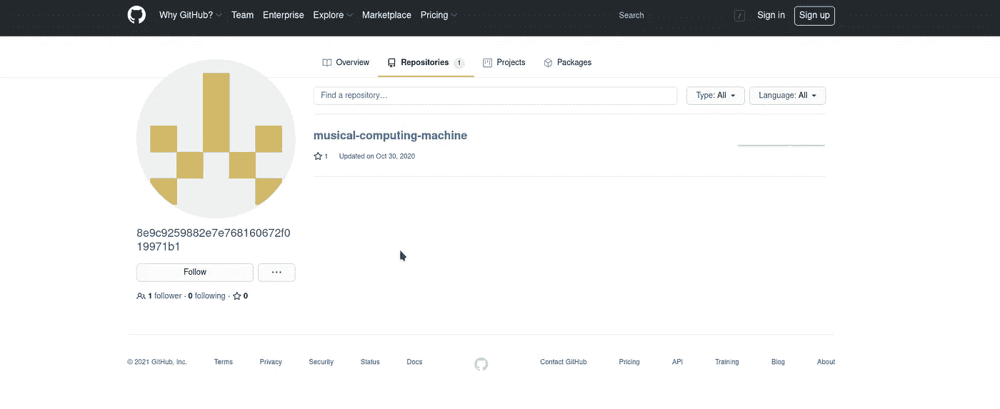

我们看到这个 GitHub 页面有一个名为**音乐计算机器**的项目，用户有一个加密的名字，也许我们可以解密。

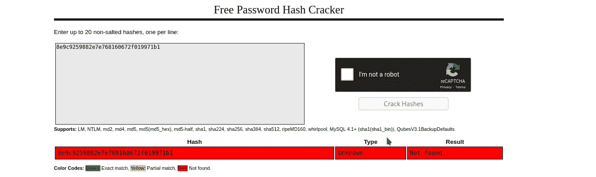

不幸的是，哈希无法破解。

让我们更好地检查这个项目。

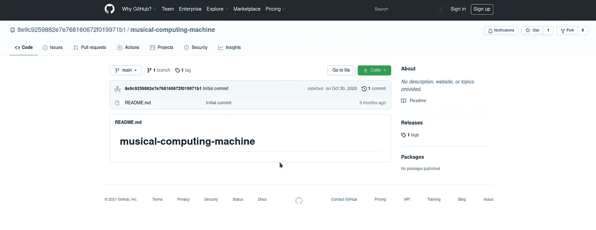

这个项目没有任何有用的东西，但它有一个标签，也许这可以帮助我们。

> 注意:标签是项目的保存版本。

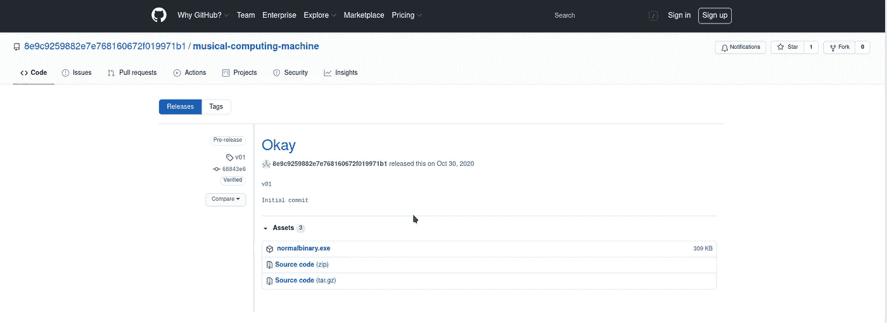

v01 有一个当前版本没有的 exe 文件，让我们下载它。

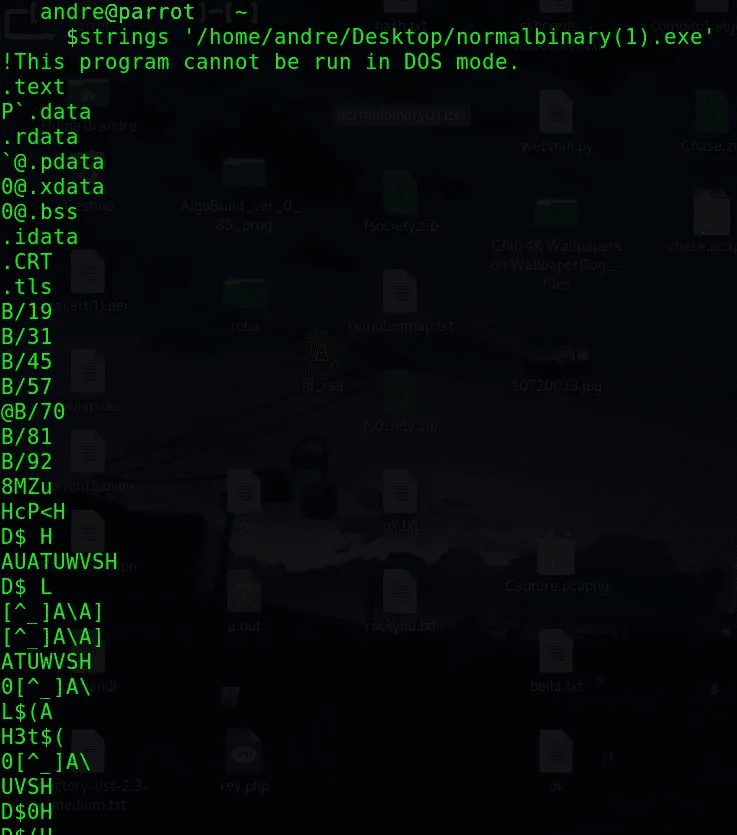

我尝试的第一件事是使用字符串命令来查看是否有任何人类可打印的信息可以帮助我们，但是没有任何感兴趣的显示…

我尝试的第二件事是对文件进行逆向工程，但这也没有给我们任何有用的信息。

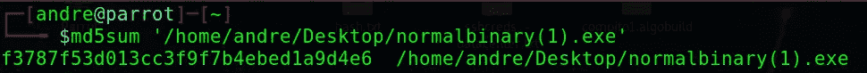

我尝试的另一件事是检查文件的校验和，看看这个文件是否是恶意软件，这样也许我们可以获得有用的信息。

> 注意:[**校验和**(有时也称为散列)是一个字母数字值，它唯一地表示了**文件**的内容。](http://a2hosting.com)

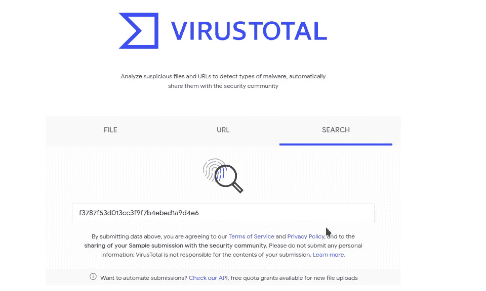

我们可以使用[病毒总量](http://virustotal.com)来做到这一点。

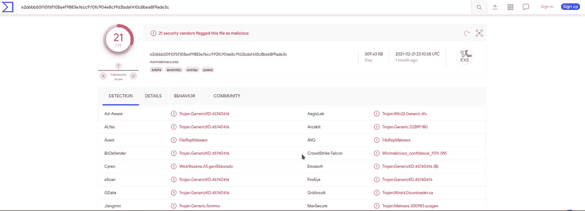

这个文件是木马！😱

如果我们去的细节，看到木马的名字，我们终于得到了旗帜！🙌

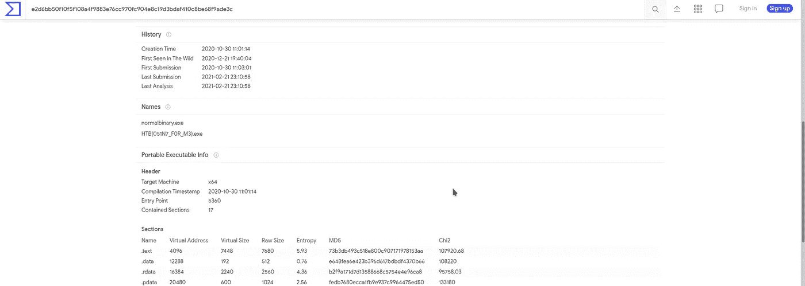

感谢你们阅读我的故事，希望对你们有用。

再见！