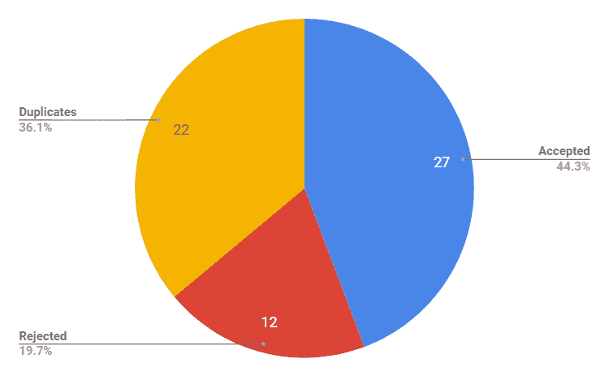
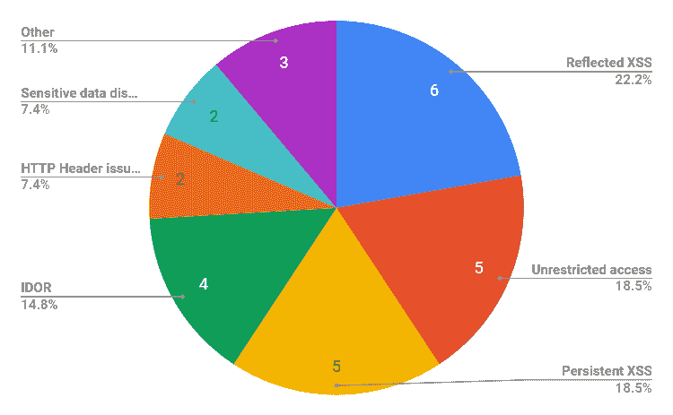

# 应用程序间漏洞和 HTTP 头问题。我对 2018 年 Bug 赏金计划的总结。

> 原文：<https://infosecwriteups.com/inter-application-vulnerabilities-and-http-header-issues-23e961c55421?source=collection_archive---------0----------------------->

[freestocks.org](https://unsplash.com/@freestocks?utm_source=medium&utm_medium=referral)在 [Unsplash](https://unsplash.com?utm_source=medium&utm_medium=referral) 上拍照

**总结**

在过去的几年里，我参加了各种各样的昆虫奖励计划。通常这些程序是由安全成熟的公司运行的，他们花了很多努力来确保他们的应用程序是安全的。因此，他们怎么可能仍然容易受到众所周知的问题的影响，如 XSS 或伊多尔，这些问题在 2018 年就不应该再存在了？

本文将分享在测试过程中遇到的常见“应用程序间”漏洞的信息，并强调在系统生命周期的每个阶段进行适当的安全测试的必要性。

不幸的是，由于保密政策，我不能分享所有的技术细节，但希望在阅读这篇文章后，你将能够加强贵公司的漏洞测试过程，或识别更多的漏洞奖金计划。

**前言**

我是一名安全人员，参与公共和私人的臭虫奖励计划。除此之外，我还参加了联合航空公司、荷兰国际集团、苏格兰皇家银行、欧盟 CERT 的课程，并通过 Synack 平台参加了一些私人课程(0x03 级)。

说到我的背景——捕虫不是我的全职工作。可能平均来说，我每周花在这项任务上的时间不超过 5 个小时。我不在谷歌的 0x0A 名单上，我仍然很容易被其他研究人员的文章打动。

尽管如此，在过去的 12 个月里，我设法报告了 27 个独特的 web 应用程序漏洞。在包括电子商务网站、安全供应商、银行和航空公司在内的知名全球公司的 web 应用程序中发现了问题。

也许这还不是一项世界纪录，但这足以分享我对一种特定类型问题的一些想法，我经常在各种公司的所有类型的应用程序中发现这种问题——“应用程序间”漏洞。

此外，由于我将提供一些关于已识别漏洞的统计数据，因此本文也可以被视为从安全研究人员的角度对 2018 年 bug bounty 计划的独立总结。

**测试理念**

切中要害。我知道“测试哲学”可能听起来有些牵强，但是在搜索 web 应用程序中的漏洞时，我试图遵循一条规则，这条规则到目前为止对我很有效:

> *安全漏洞发生在安全测试的职责模糊或者没有定义的地方。*

我这么说是什么意思？我曾经为许多国际组织进行漏洞评估和渗透测试。通常，提供给我的测试环境不允许我测试所有的应用程序功能，因为测试范围只包括一个系统，而不包括与被测试系统接口的所有其他系统。

我不得不想当然地认为:

*   与测试系统连接的其他系统也要接受安全测试
*   进行了集成测试(包括安全方面)
*   在测试过程中不可用的功能将在稍后进行测试。

不幸但显然的是，现实往往是不同的。各种应用程序由不同的测试团队进行测试，他们并不完全了解所有其他系统、界面和功能。集成测试的安全方面在测试过程中经常被忽略。

希望你现在理解我的方法，因为它相对简单。

如果有人不能测试某些应用程序模块，或者只是没有被要求测试某些东西，那么该组件中出现安全漏洞的机会就会增加。

**数字**

正如我已经提到的，今年我已经报告了 27 个独特的漏洞。然而，为了让你对 bug bounty 项目有一个全面的了解，我的另外 12 份报告被拒绝，另外 22 份被标记为重复。

Bug 赏金提交统计

我很快了解到，报告明显的漏洞，如站点范围的跨站点请求伪造或扫描仪可检测的跨站点脚本反射只是浪费时间，因为在 95%的情况下，其他研究人员已经报告过了。因此，关注不能简单检测的“应用程序间”漏洞对我来说更有意义。

我说的“应用程序间”漏洞是什么意思？所有漏洞，这需要混合在至少两个不同的系统(或系统组件)中才能成功执行。

**漏洞**

下图显示了已识别漏洞的分布情况。可以观察到，它们中的大多数是 OWASP 前 10 名的最后 3 个版本中存在的漏洞。重要的是要提到，其中一半以上的识别或开发过程涉及到一些其他系统、组件或应用程序。

Bug 赏金漏洞分布

以下是我对具体问题的一些想法:

**跨站脚本**——我喜欢在 bug-bounty 项目中报道跨站脚本，因为它们毫无争议且报道迅速。也许这就是我花大部分时间专门寻找它们的原因。

那么，在谈到 XSSes 时，有哪些“应用程序间”问题的真实例子呢？

*   一组网页运行“类似单点登录”机制，因此用户详细信息在应用程序之间复制。大多数情况下，输入过滤和输出编码都被实现。有趣的是，其中一个网页没有启用输入过滤，而另一个网页没有执行输出编码。长话短说-储存的 XSS。
*   在应用程序中注册不会导致向最终用户发送任何电子邮件。尽管如此，用户仍然能够访问所有应用程序功能。注册两天后，用户收到了某种“迟到的欢迎电子邮件”，其中包括几个以前没有遇到过的参数超链接。结果—使用标准 *<脚本>警报(1)</脚本>* 有效负载反映 XSS。

一般来说，来自电子邮件中超链接的漏洞是如此普遍，以至于我强烈怀疑是否有人测试过这一点。

**访问控制问题(IDOR 和未授权访问)**

嗯，2018 年 web 应用不应该存在的另一组漏洞。同样，大多数时候，它们是作为诸如“安全集成测试”或“应用程序间数据分析”之类的东西而存在的。

今年发现了另外两个现实生活中的例子:

*   允许桌面应用程序通过 API 枚举产品标识符。此时，它被视为低影响漏洞。但是，后来发现同一组织的一些其他应用程序允许根据这些产品标识符获取个人的电子邮件地址。加上缺乏速率限制机制，有可能在短时间内转储大量的客户电子邮件地址。
*   IDOR 漏洞，最终升级为账户接管。攻击过程始于访问一个特定系统组件通过“邀请电子邮件”发送给用户的超链接。

这又是两个“应用程序间”漏洞的例子，在孤立环境中的常规 web 应用程序测试中，这些漏洞永远不会被发现。

**HTTP 报头问题**

这是我所理解的 web 应用程序中存在的一类漏洞。尽管它打破了一些常见的 web 应用程序安全概念(例如不信任用户提供的输入)，但在 OWASP Top 10 或 OWASP Testing Guide 等出版物中从未描述过它。该漏洞最常见的例子是通过*主机*标题修改来改变电子邮件内容。关于这些问题的更多例子，你可以参考我的 OWASP 波兰[演讲](https://www.slideshare.net/OWASP_Poland/insecure-http-headers-marcin-szydowski)或者@albinowax 的大黑帽[演讲](https://i.blackhat.com/us-18/Thu-August-9/us-18-Kettle-Practical-Web-Cache-Poisoning-Redefining-Unexploitable.pdf)。

谈到责任模糊和缺乏在适当环境下的测试？

根据您的基础设施和系统架构，这些漏洞的测试结果可能会有所不同。因此，在您的供应商的开发环境中没有发现漏洞的应用程序在您将其部署到您的服务器后可能是不安全的。此外，添加/删除负载平衡器或不安全的 CDN 配置也可能导致这些漏洞的存在。

这些问题并不广为人知，相对容易识别，没有争议，也很快就会被报道出来。这四件事使他们成为完美的漏洞候选人。

**敏感信息泄露**

广泛的谷歌搜索允许识别数据或功能，应该限制为授权个人。

导致公认漏洞的这两个案例是由两个因素造成的:

1.  GET 请求中传递的敏感数据
2.  错误设置“索引保护”(如 robots.txt 或 meta 标签)。

这两起已确认的案件有什么共同之处？应用程序发送的电子邮件中包含包含敏感数据的超链接。(我是否提到过我非常怀疑这些电子邮件发送功能是否经过测试？).

**如何避免这些漏洞？**

我决定将这些建议分为“基本”和“高级”步骤，因为实现其中一些建议可能需要大量的工作。

**基本:**

1.  在测试过程中，分析所有的应用程序接口和非标准的数据输入方式
2.  确保您的测试环境尽可能类似于生产环境
3.  确保您的集成测试涵盖了安全性方面，比如输入验证
4.  确保遵循深度防御原则(例如，尽可能实现输入过滤和输出编码)
5.  确保安全测试的范围包括所有的系统组件和功能。请特别注意:

*   电子邮件发送功能和电子邮件
*   帐户创建和密码重置流程
*   使用第三方服务(谷歌、脸书等)进行认证。)

**高级:**

1.  确保您的安全测试团队:

*   了解应用程序支持的业务流程
*   知道与其他应用程序的所有接口，并有足够的支持来执行集成测试期间的安全场景
*   对整个经过测试的生态系统有很好的了解

2.定期执行 Google dorking，以识别任何无意公开访问敏感数据或功能的情况

3.分析任何可能导致未经授权的个人获取敏感信息的跨系统数据依赖情况。执行这种分析需要详细了解每个应用程序处理的特定功能和数据集

4.分析实施跨系统职责分离的可能性，以防止利用跨系统依赖性的攻击