# 使用 magisk 拦截带有 burp 的 Android 模拟器 SSL 流量

> 原文：<https://infosecwriteups.com/intercepting-android-emulator-ssl-traffic-with-burp-using-magisk-bc948dca68f9?source=collection_archive---------0----------------------->

在 android 安全测试中，拦截来自 apk 的 SSL 流量是基本要求之一。有许多方法可以做到这一点

*   使用 Genymotion

Genymotion 是最简单的一个，因为它附带的模拟器是根的。这篇文章很好地解释了如何用 genymotion 配置 burp[https://blog . ROP nop . com/configuring-burp-suite-with-Android-nougat/](https://blog.ropnop.com/configuring-burp-suite-with-android-nougat/)

*   物理设备

每个人都没有实际的物理设备来对 android apk 进行安全测试(你可以相信我，也可以不相信)

*   Android 模拟器

Android 模拟器可以很容易地使用 AVD 进行配置，AVD 是在您安装 android studio 时预装的。如果模拟器是根模拟器，那么我们可以使用与 genymotion 相同的过程来配置 burp，但是根模拟器有其自身的挑战，即绕过许多应用程序中实现的根检测。

因此，我将一步一步地放下(这些都在互联网上，但不是一个整体)，在这个过程中，我们将使用一个简单的仿真器，并在 magisk 的帮助下安装 burp 证书作为系统证书

## 安装 Android Studio

假设每个人都能做到这一点

## 在 AVD 中创建设备

1.  启动 android studio 并选择虚拟设备管理器

2.使用“创建设备”按钮创建虚拟设备

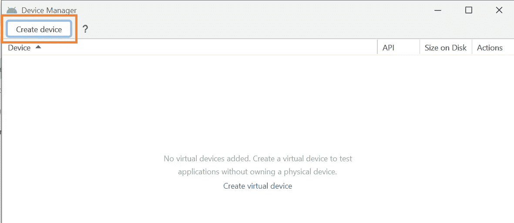

3.选择任何设备定义或像素 5，因为这样看起来不错

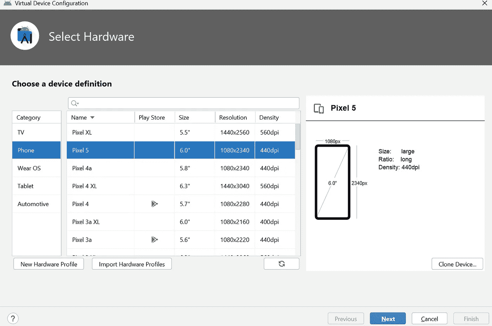

4.选择一个系统映像，我现在将使用 API 30(下载它，并在发布名称列中提供链接),然后在下一个屏幕上单击 finish

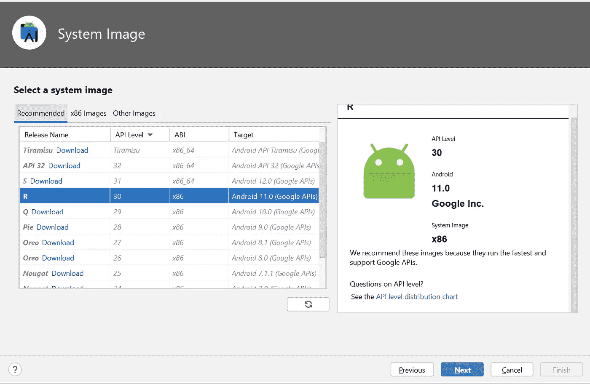

现在您已经创建了一个设备，您可以从设备管理器屏幕启动它

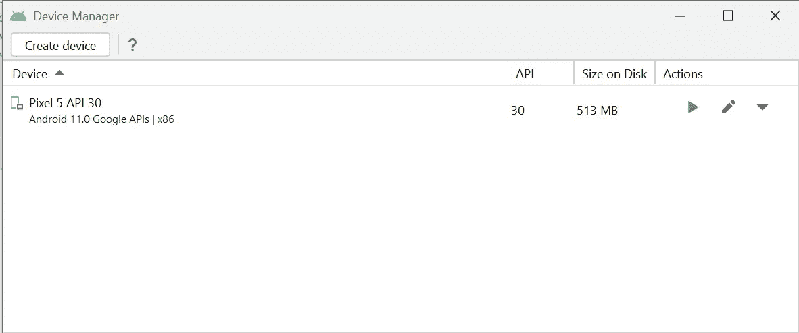

点击播放按钮启动设备

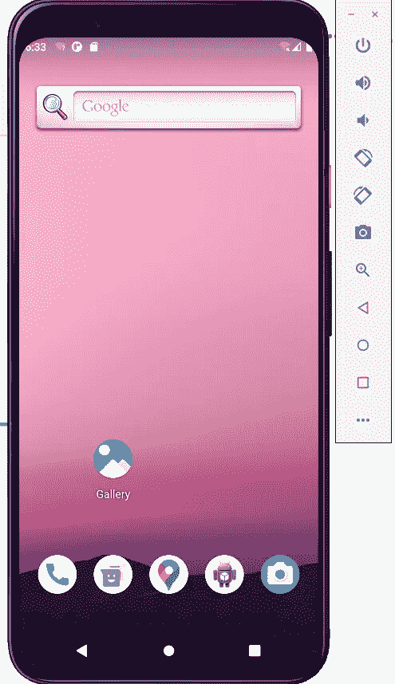

确保仿真器有互联网连接，如果没有，使用设备管理器窗口上的下拉按钮并点击**擦除数据**(也可能重启仿真器)。模拟器现在应该有一个工作的互联网

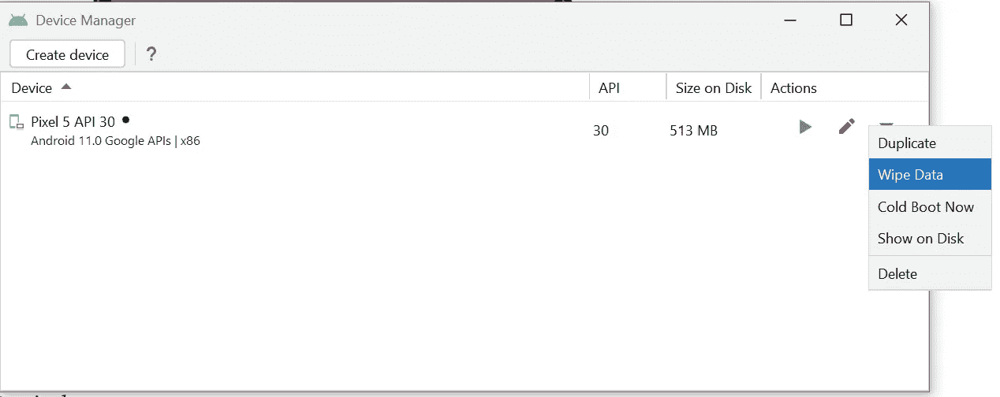

## 安装 Magisk

很少额外津贴

*   下载平台工具[https://developer . Android . com/studio/releases/platform-tools](https://developer.android.com/studio/releases/platform-tools)
*   Magisk apk[https://github . com/topjohnwu/Magisk/releases/download/v 24.1/Magisk-v 24.1 . apk](https://github.com/topjohnwu/Magisk/releases/download/v24.1/Magisk-v24.1.apk)
*   从[https://github.com/newbit1/rootAVD](https://github.com/newbit1/rootAVD)下载 rootAVD 回购

我们将使用 magisk 作为我们的根解决方案和 rootAVD 脚本来安装 Magisk。YouTube 上的这段视频包含了与 magisk[https://www.youtube.com/watch?v=JR4gDRYzY2c](https://www.youtube.com/watch?v=JR4gDRYzY2c)合作的所有步骤

1.  在系统路径变量中添加平台工具

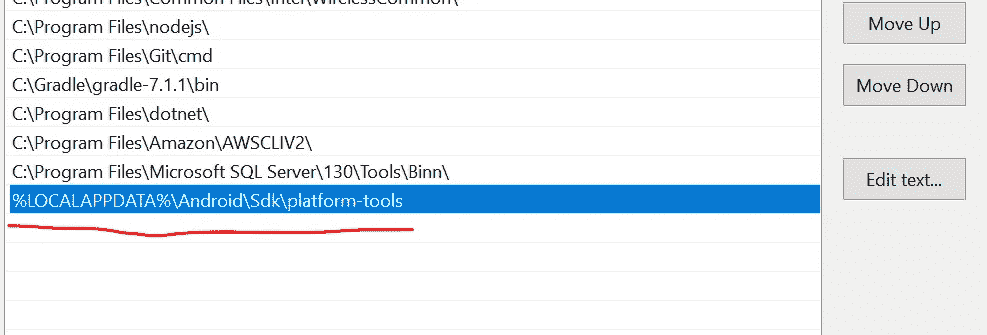

2.解压缩 rootAVD

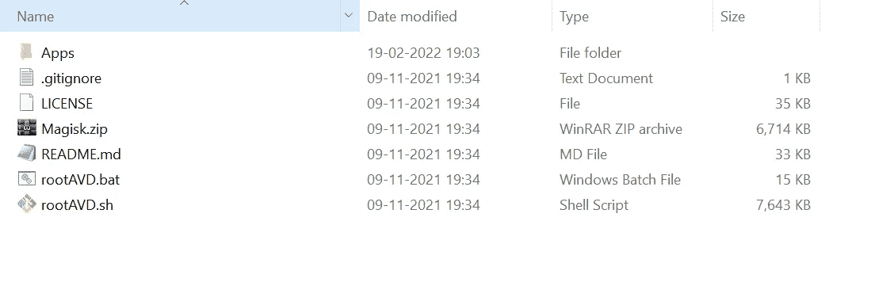

3.将下载的 magisk apk 放入 Apps 文件夹(解压后的 rootAVD repo)。将名称更改为 Magisk.apk

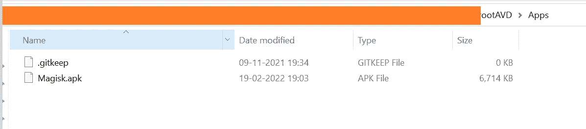

4.使用命令 **adb start-server** 启动 adb 服务器

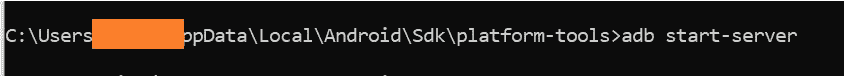

5.运行 **rootAVD.bat InstallApps，**这将在模拟器设备上安装 Magisk 应用程序

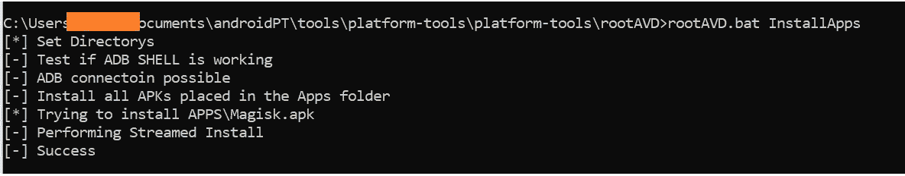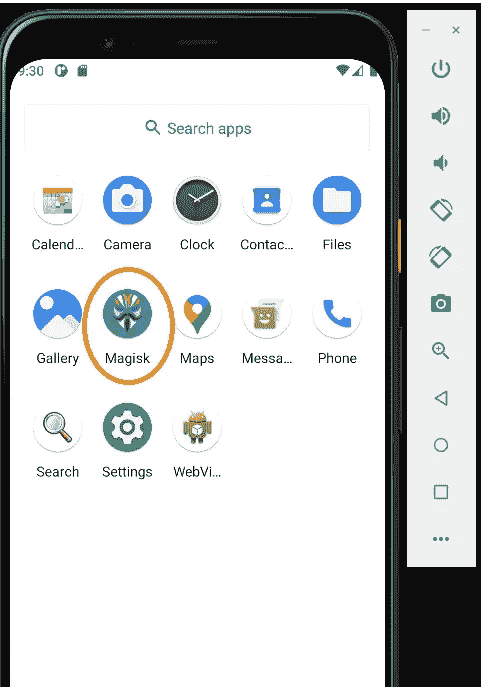

6.找到系统映像 **ramdisc.img** 文件的位置。这个图像文件属于我们在从设备管理器配置设备时使用的 API。它的位置将是% local appdata % \ Android \ Sdk \ system-images \ Android-30 \ Google _ APIs \ x86 \ ramdisk . img，创建原始 ramdisc.img 文件的备份并运行命令

**rootavd . bat****% local appdata % \ Android \ Sdk \ system-images \ Android-30 \ Google _ APIs \ x86 \ ramdisk . img**

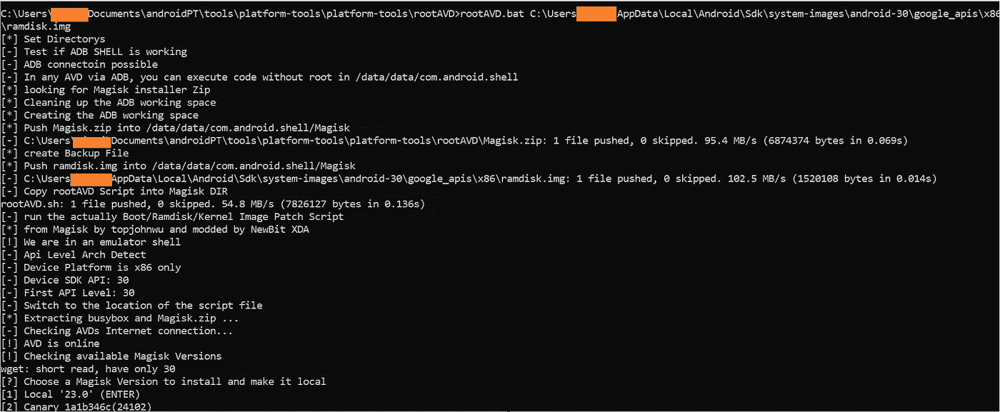

运行上述故障排除命令的完整日志[https://github . com/nirajchoubey 12/Android-security/blob/main/Configuring % 20 burp % 20 with % 20 Android % 20 emulator/RamdiskImgLog _ root avd . txt](https://github.com/nirajchoubey12/Android-security/blob/main/Configuring%20burp%20with%20android%20emulator/RamdiskImgLog_rootAVD.txt)

## 正在安装“AlwaysTrustUserCerts”Magisk 模块

启动 Magisk，如果它要求额外设置，选择确定

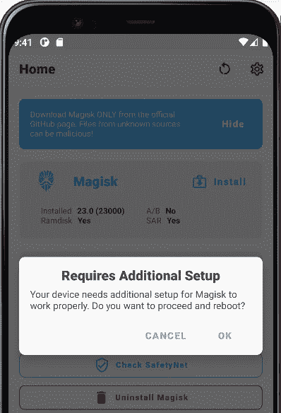

这将重新启动模拟器。再次启动 Magisk 应用程序，点击屏幕底部的第四个图标

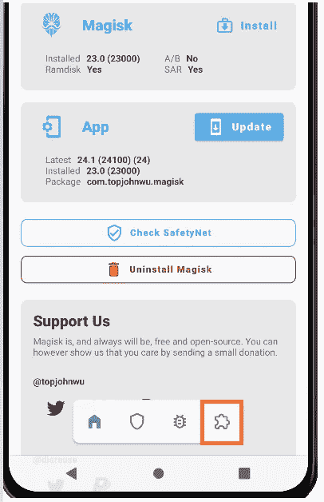

从此链接下载 Alwaystrustusercerts.zip 文件[https://github . com/NVISOsecurity/magisktrususercerts/releases/download/v 0 . 4 . 1/alwaystrustusercerts . zip 并使用命令**ADB push alwaystrustusercerts . zip/SD card/download**将其传输到仿真器](https://github.com/NVISOsecurity/MagiskTrustUserCerts/releases/download/v0.4.1/AlwaysTrustUserCerts.zip)

如果您想知道，AlwaysTrustUserCerts.zip 是一个 Magisk 模块，它会将安装的用户证书转换为系统证书

在模块屏幕上，单击从存储安装

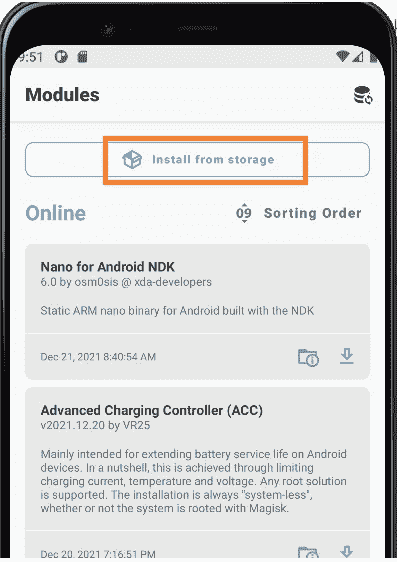

选择下载的 zip 文件

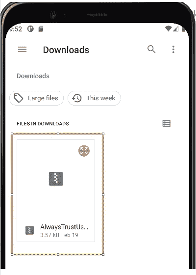

这将安装模块

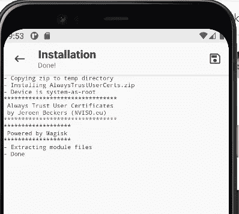

## 将 burp 证书安装为系统证书

经过这么多麻烦，我们已经到了最后一步

1.  导出 burp 证书并将其保存为 cacert.cer。将 cacert.cer 推送到仿真器，就像之前对 AlwaysTrustUserCert zip 文件所做的那样

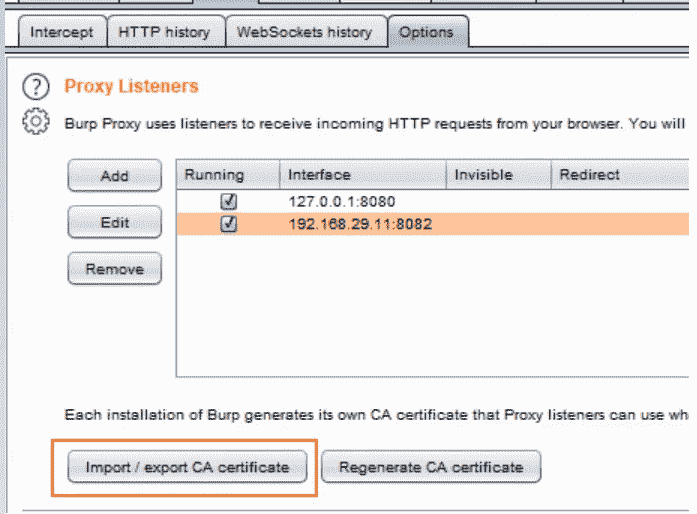

2.在模拟器中，进入设置>安全>加密和证书>安装证书(这些选项可能因不同类型的设备而异),然后单击 CA 证书

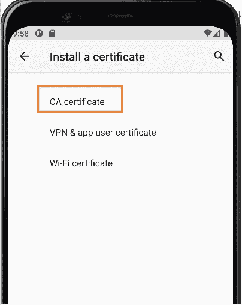

模拟器会显示一个警告，忽略它，然后点击安装。选择 cacert.cer 文件

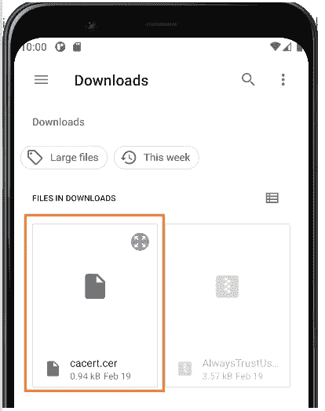

这将安装 burp 证书作为用户证书。设置>安全>加密和凭证>可信凭证，用户选项卡

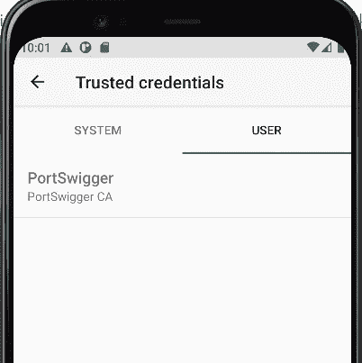

现在，我们必须重新启动模拟器，AlwaysTrustUserCert magisk 模块将施展魔法，将 burp 证书添加为系统证书。设备重新启动后，burp 证书将被添加到系统证书中

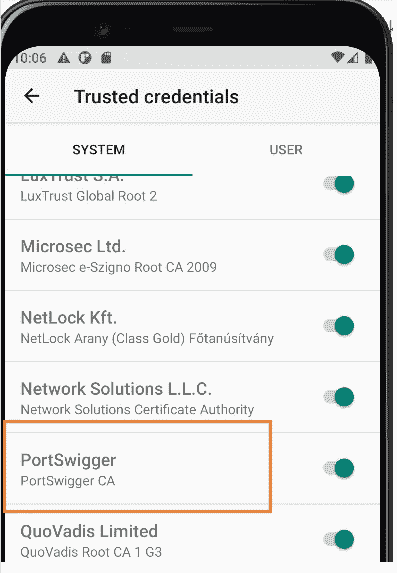

## 配置模拟器代理以拦截带有 burp 的流量

现在我们只需要配置模拟器代理，让流量通过 burp。按照下图配置模拟器代理。点击底部的 3 个点，进入设置>代理>手动代理配置。点击应用。代理状态应该显示为成功

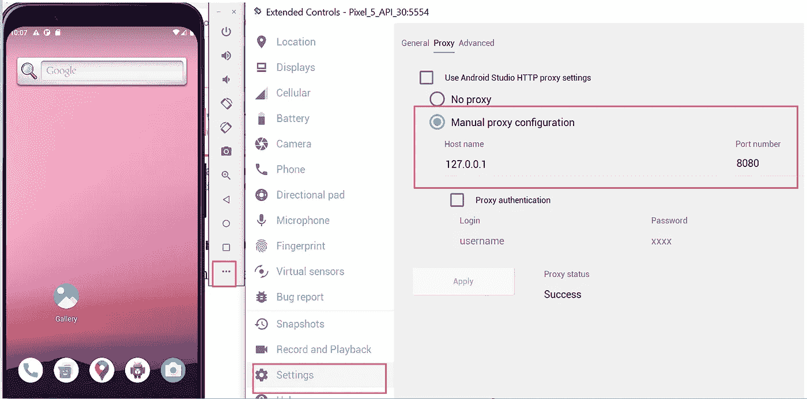

现在，拦截从仿真器到打嗝的 ssl 流量不会有问题了

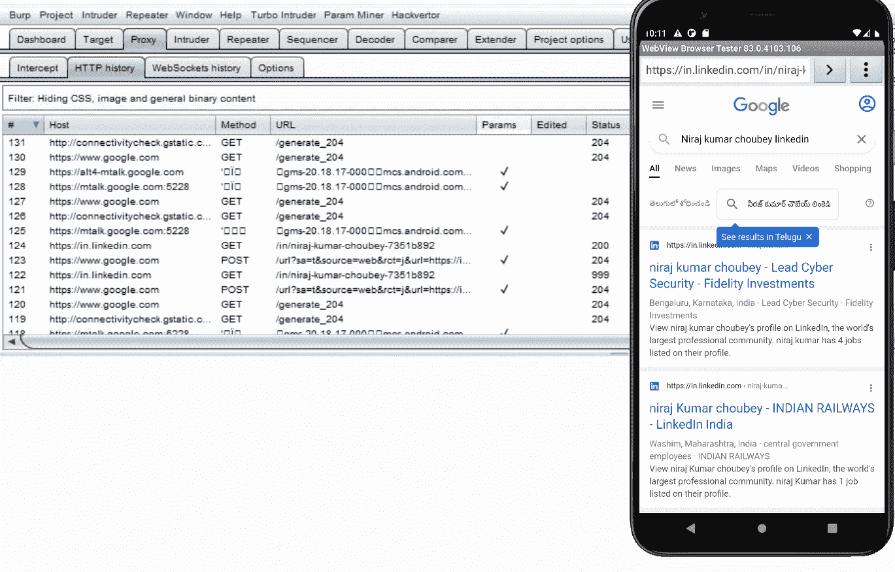

我希望这能帮助一些人开始他们的 android 安全测试之旅，并为我提供参考。

在 LinkedIn[https://www.linkedin.com/in/niraj-kumar-choubey-7351b892/](https://www.linkedin.com/in/niraj-kumar-choubey-7351b892/)上联系我，向我问好。如果你坚持以上任何一个过程。如果可以，我会尽力解决。

# 🔈 🔈Infosec Writeups 正在组织其首次虚拟会议和网络活动。如果你对信息安全感兴趣，这是最酷的地方，有 16 个令人难以置信的演讲者和 10 多个小时充满力量的讨论会议。[查看更多详情并在此注册。](https://iwcon.live/)

 [## IWCon2022 - Infosec 书面报告虚拟会议

### 与世界上最优秀的信息安全专家建立联系。了解网络安全专家如何取得成功。将新技能添加到您的…

iwcon.live](https://iwcon.live/)