# 在 Android 上使用 OpenVPN 拦截 HTTP 流量

> 原文：<https://infosecwriteups.com/intercepting-http-traffic-with-openvpn-on-android-5835fa40466d?source=collection_archive---------1----------------------->

**总结**

在本文中，我们将向您展示如何在 Android 上拦截 HTTP 流量。我们的方法基于 VPN 隧道方法。

**免责声明**

本文仅用于信息和教育目的，并且面向那些愿意并好奇了解安全性和渗透测试的人。内容不得用于非法目的。如果你准备好学习新的好东西，那么继续读下去。

**详情**

在 Android 应用中使用 Burp 代理拦截 HTTP 流量不像在传统浏览器 web 应用中那么容易。在传统的 web 应用程序中拦截 HTTP 流量就像用代理服务器配置浏览器一样简单。Android(和 iOS)应用没有代理服务器配置。这使得很难将 HTTP 流量重定向到代理服务器，如 Burp Suite。很难，但不是不可能。一般来说，有三种方法可以将流量从移动应用重定向到代理服务器。耶鲁安·贝克尔斯写了一篇出色的文章，解释了 iOS 的所有三种方法([https://blog . nviso . eu/2020/06/12/intercepting-flutter-traffic-on-iOS](https://blog.nviso.eu/2020/06/12/intercepting-flutter-traffic-on-ios)/)。

本文描述了如何在您的移动应用程序和攻击(pentester)机器之间使用 VPN 连接。此外，我们将展示如何将 Burp 代理服务器证书传输到移动设备，以及如何为移动设备流量拦截配置 Burp 代理。

POC 由 1 台移动设备和 Kali Linux 组成:受害者(三星 JBOY3 乐队)和攻击者机器(Kali Linux 2022.3)。

受害者:

—三星 JBOY3 乐队(安卓 5.1，非 root)
—IP 地址:192.168.43.136

攻击者(对于 Burp 代理):
— Kali Linux
— IP 地址:192.168.43.136

以下部分将向您展示如何在 Kali 机器上安装 OpenVPN 服务器，如何在移动设备上安装 OpenVPN 客户端，如何导入 burp 代理证书，以及如何使用 burp 代理拦截 HTTP 流量。

**准备 PoC 环境**

在我们开始 PoC 之前，让我先向您展示一下 PoC 要求。为了执行这些步骤，您必须:
-使用物理移动设备(Android 虚拟设备不可用)
-启用 Android 开发人员选项
-在 Kali 攻击者机器和移动设备之间建立 TCP 连接(例如，两者都连接到同一个 Wifi 网络或通过 USB 连接)

在本次概念验证中，我们将使用 USB 连接来建立与 Kali 主机的 TCP 连接。您也可以使用 WiFi，而不是使用 USB 连接。在这种情况下，您的移动设备和 Kali Linux 系统必须连接到同一个 WiFi 网络。如果您选择使用 WiFi 网络，可以跳过这一部分，从第 7 步继续。

1.于 192.168.43.1 执行(受害者，三星 JBOY3 乐队)。

在我们的移动设备上启用开发者选项。

进入“设置”
点击“关于设备”或“关于手机”
点击“软件信息”
点击“建立号码”七次。...
可选输入您的模式、PIN 或密码以启用开发者选项菜单。
“开发者选项”菜单将出现在您的设置菜单中。

[https://www . Samsung . com/uk/support/mobile-devices/how-do-I-turn-on-the-developer-options-menu-on-my-Samsung-galaxy-device/](https://www.samsung.com/uk/support/mobile-devices/how-do-i-turn-on-the-developer-options-menu-on-my-samsung-galaxy-device/)

注意:这些步骤是针对三星 JBOY3 乐队设备的。请查看您的供应商网站以获取相关说明。

2.在 192.162.43.1 执行(受害者，三星 JBOY3 乐队)。

在开发者选项中启用 USB 调试选项。

确保“打开”图标上的“开发人员选项”开关(位于右上角)已打开。

轻按 USB 调试开关将其打开。

[https://www.youtube.com/watch?v=-SpUm2_eliA](https://www.youtube.com/watch?v=-SpUm2_eliA)

3.在 192.162.43.1 执行(受害者，三星 JBOY3 乐队)。

将移动设备连接到 Kali 攻击者机器的空闲 USB 端口。选择 Linux 作为要连接的目标设备。


4.在 192.168.43.136 上执行(攻击者机器，Kali Linux)。

如果还没有完成，安装 Android 调试桥工具。打开 Bash 终端选项卡并执行:

```
sudo apt install android-tools-adb
```

5.在 192.168.43.136 上执行(攻击者机器，Kali Linux)。

使用 adb 列出可用设备。你应该看看三星 JBOY3 乐队设备。

```
adb devices
```

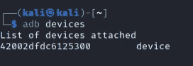

6.在 192.168.43.136 上执行(攻击者机器，Kali Linux)。

使用 adb 测试对移动设备的外壳访问。尝试使用 ping 测试我们的 Kali 攻击(pentesting)机器和互联网的连接性。

```
adb shell
```


```
ping -c 2 192.168.43.136
```


**总结**
我们将受害者设备(三星 JBOY3 乐队)通过 USB 连接到我们的 Kali 机器。该设备与我们的 Kali 攻击者机器有 TCP 连接。

**PoC 安装 OpenVPN 服务器**

我们已经具备了在 Kali pen 测试机和移动设备之间设置 VPN 的所有要求。

7.在 192.168.43.136 上执行(攻击者机器，Kali Linux)。

安装 OpenVPN 服务器。我们将使用耶鲁安·贝克尔斯的安装脚本。

```
wget https://git.io/vpn -O openvpn-install.sh
sed -i "$(($(grep -ni "debian is too old" openvpn-install.sh | cut  -d : -f 1)+1))d" ./openvpn-install.sh
chmod +x openvpn-install.sh 
sudo ./openvpn-install.sh
```

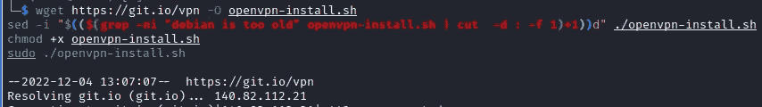

8.在 192.168.43.136 上执行(攻击者机器，Kali Linux)。

OpenVPN 安装脚本向导:选择连接到互联网的网络设备。

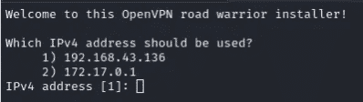

9.在 192.168.43.136 上执行(攻击者机器，Kali Linux)。

OpenVPN 安装脚本向导:键入终止 VPN 的 ip 地址。在我们的例子中，它是 ip 地址 192.168.43.136。


10.在 192.168.43.136 上执行(攻击者机器，Kali Linux)。

OpenVPN 安装脚本向导:选择 UDP 作为首选协议。

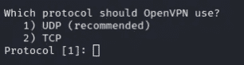

11.在 192.168.43.136 上执行(攻击者机器，Kali Linux)。

OpenVPN 安装脚本向导:我们将为接下来的选项使用默认设置。按 ENTER 键输入端口规格、系统解析器和客户端名称。按任意键继续…

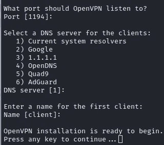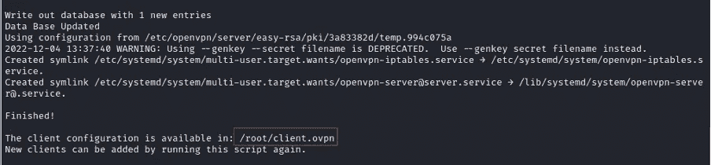

我们已经安装了 VPN 服务器。我们的客户机概要文件存储在/root/client.ovpn。

12.在 192.168.43.136 上执行(攻击者机器，Kali Linux)。

启动 OpenVPN 服务

```
sudo service openvpn start
```

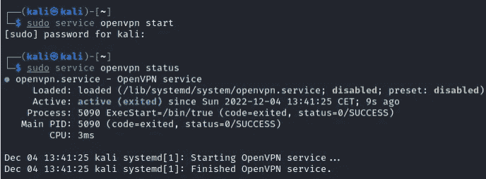

我们的 OpenVPN 服务器现在已经启动并运行。是时候在我们的移动设备上安装 OpenVPN 客户端软件了。

**PoC 安装 OpenVPN 客户端**

在接下来的部分中，我们将把文件从 Kali Linux 机器复制到您的移动设备上。它涉及以下文件:

*   client . ovpn(OpenVPN profile)
    -OpenVPN-connect-3-3-0 . apk(OpenVPN 客户端软件)
    - cert-pro.cer (Burp Suite 服务器证书)

下一节中的步骤基于在您的移动设备和 Kali Linux 系统之间使用 USB 连接。如前所述，不需要 USB 连接。也可以使用共享的 WiFi 网络。当使用 WifI 网络时，将文件放在 Kali Linux 系统上的/tmp 目录中，并通过临时 http 服务器(*python 3-m http . server 80—directory/tmp*)为该目录提供服务，就可以将必要的文件复制到移动设备上。然后，可以使用现有的网络浏览器从移动设备下载所需的文件。

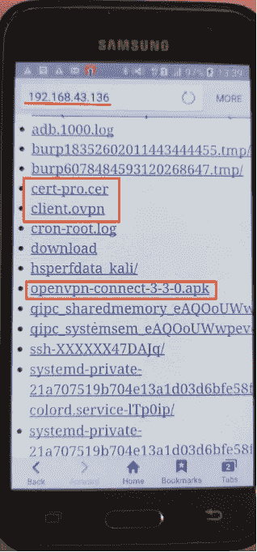

三星 JBOY3 乐队公司可访问 http://192.168.43.136

13.在 192.168.43.136 上执行(攻击者机器，Kali Linux)。

使用 adb 将配置文件 client.ovpn 复制到我们的 Android 设备的 sdcard 中。

```
sudo cp /root/client.ovpn /tmp
adb push /tmp/client.ovpn /sdcard/Download/client.ovpn
```

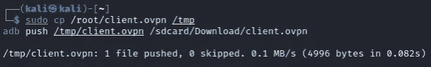

14.在 192.168.43.136 上执行(攻击者机器，Kali Linux)。

下载 OpenVPN 客户端*。apk 安装包。打开网页浏览器(Firefox)并导航至:[https://openvpn-connect.en.uptodown.com/android/download](https://openvpn-connect.en.uptodown.com/android/download)。点击绿色的[下载]按钮。

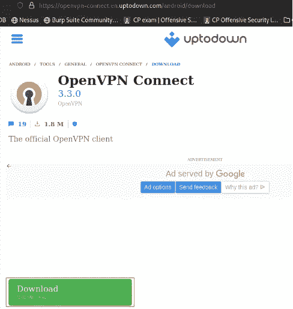

来源:[https://openvpn.net/community-downloads/](https://openvpn.net/community-downloads/)

将下载的 apk 文件移动到/tmp。

```
mv ~/Downloads/openvpn-connect-3–3–0.apk /tmp
```

15.在 192.168.43.136 上执行(攻击者机器，Kali Linux)。

使用 adb 在我们的 Android 设备上安装 openvpn-connect-3–3–0 . apk。

```
adb install /tmp/openvpn-connect-3–3–0.apk
```

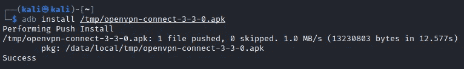

16.于 192.168.43.1 执行(受害者，三星 JBOY3 乐队)。

打开内置的文件浏览器应用程序，浏览到/sdcard/Downloads/client.ovpn。

点击 client.ovpn 并安装 OpenVPN 配置文件。继续安装步骤。

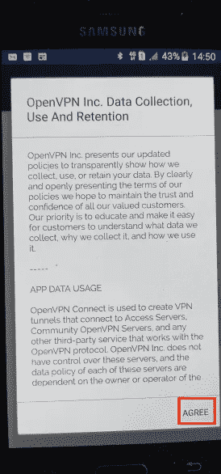

点击[同意]

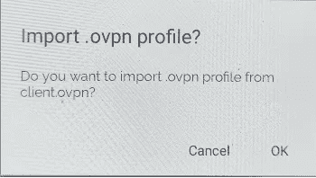

单击[确定]

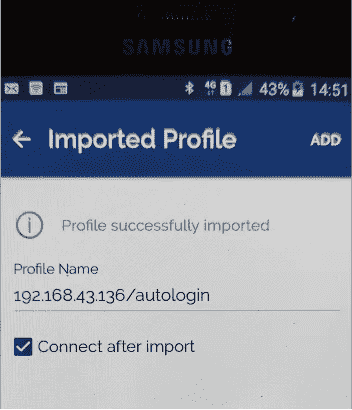

单击[添加]


我们在移动设备和 Kali Linux 之间建立了成功的 VPN 隧道

我们在移动设备和 Kali 攻击者机器之间有一个成功的 VPN 隧道。从现在开始，我们能够拦截来自 Android 设备的流量。为了使用 Burp 代理进行 HTTPS 拦截，我们仍然需要导入 Burp 代理服务器证书。

**PoC 安装 Burp 服务器证书**

17.在 192.168.43.136 上执行(攻击者机器，Kali Linux)。

开始打嗝社区版。保留默认代理设置(127.0.0.1:8080)。

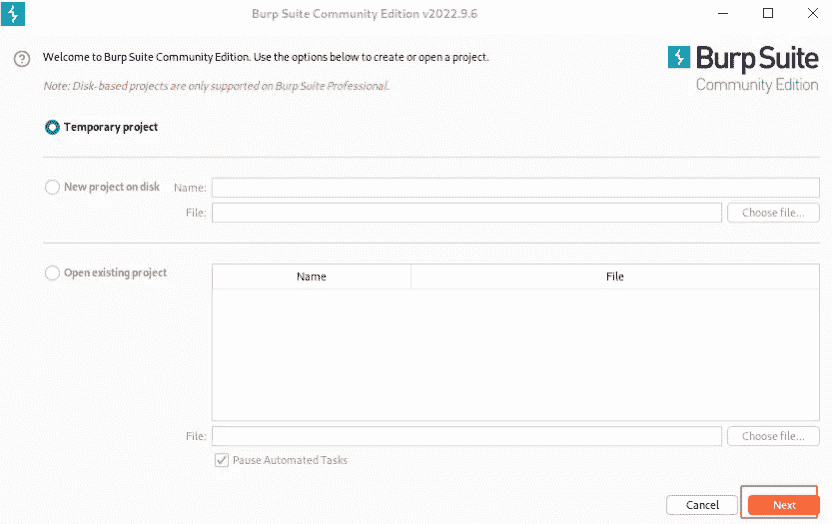

单击“下一步”在 TCP 端口 8080 上开始 Burp 侦听。

18.在 192.168.43.136 上执行(攻击者机器，Kali Linux)。

使用 wget 下载 Burp 服务器证书。重要提示:证书文件需要*。cer 扩展。

```
wget http://127.0.0.1:8080/cert -O /tmp/cert-pro.cer
```

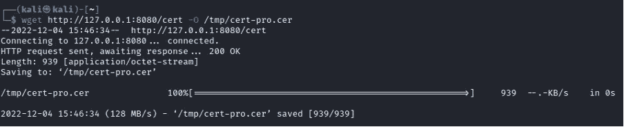

19.在 192.168.43.136 上执行(攻击者机器，Kali Linux)。

使用 adb 将 Burp 证书(cert-pro.cer)复制到我们 Android 设备的 sdcard 中。

```
adb push /tmp/cert-pro.cer sdcard/Download/cert-pro.cer
```

20.于 192.168.43.1 执行(受害者，三星 JBOY3 乐队)。

在我们的移动设备上安装 Burp 证书。

打开内置的文件浏览器应用程序，浏览到/sdcard/Downloads/cert-pro.cer。检查是否选择了“用于 VPN 和应用程序”。点击 cert-pro.cer 并导入服务器证书。

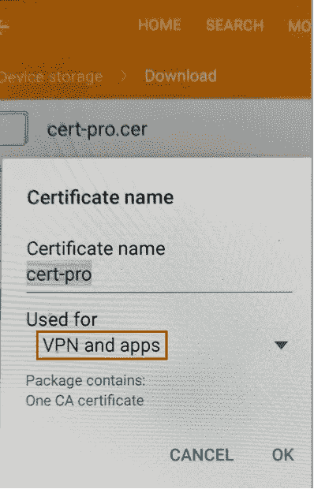

21.在 192.168.43.136 上执行(攻击者机器，Kali Linux)。

配置 Burp 代理监听所有接口。转到代理>选项>选择接口>[编辑]>选项卡绑定；选择“所有接口”。单击[确定]

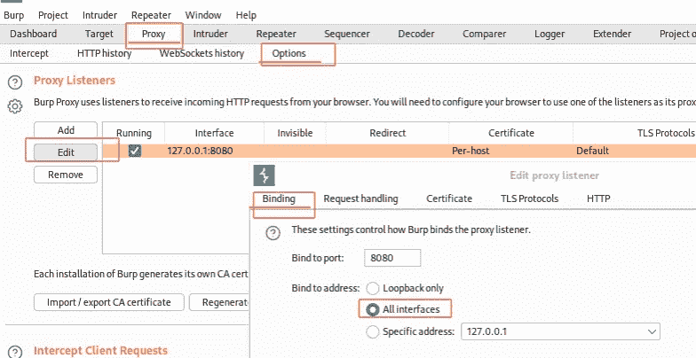

22.在 192.168.43.136 上执行(攻击者机器，Kali Linux)。

将 Burp 代理配置为使用“不可见代理”。转到代理>选项>选择接口>[编辑]>选项卡上的请求处理；选择“支持隐形代理”。单击[确定]。

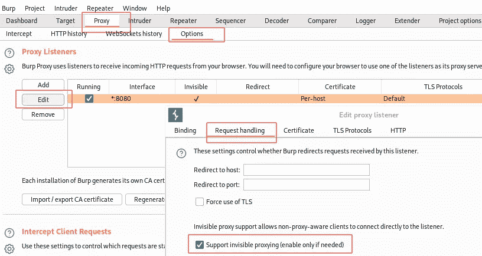

23.在 192.168.43.136 上执行(攻击者机器，Kali Linux)。

配置 iptables 将端口 80 和 443 上的传入流量重定向到监听端口 8080 的 Burp 代理。

```
sudo iptables -t nat -A PREROUTING -i tun0 -p tcp - dport 80 -j REDIRECT - to-port 8080
sudo iptables -t nat -A PREROUTING -i tun0 -p tcp - dport 443 -j REDIRECT - to-port 8080
```

**PoC 使用手机应用拦截流量**

24.于 192.168.43.1 执行(受害者，三星 JBOY3 乐队)。

您现在已经准备好拦截来自您的移动应用程序的 HTTP 流量。出于演示目的，我们将使用荷兰公司 Talpa 拥有的 Radio10 应用程序。您可以使用任何其他通过 TCP 端口 80 或 443 进行 HTTP 通信的应用程序。你**不允许**使用这个应用程序进行实际的笔测试或任何(其他)误用它的方式。请首先咨询 Talpa 关于他们的 bug 赏金计划和负责任的披露。

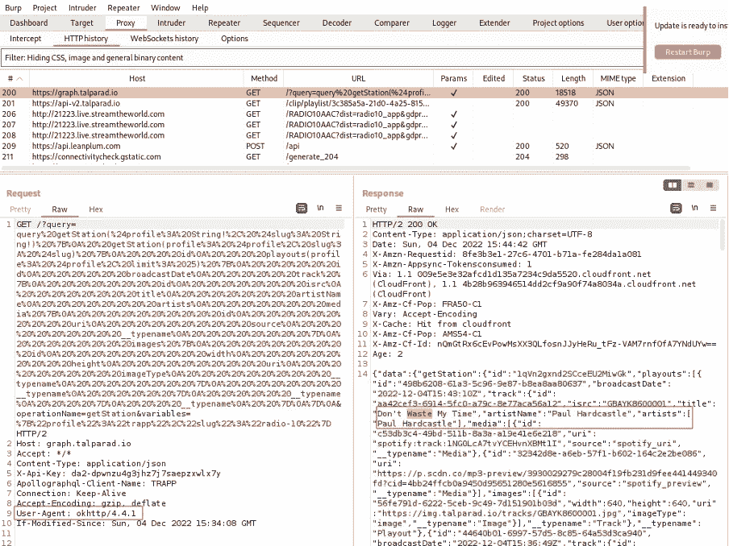

正如你所看到的，我们从移动应用中获得了流量。用户代理被识别为 okhttp/4.4.1。

就是这样！我希望你喜欢它。在我的下一篇博客中，我将向你展示一些你可以用 Burp Suite 做的有趣的事情。

**感谢**
——耶鲁安·贝克尔斯出色的 OpenVPN 安装脚本。

## 来自 Infosec 的报道:Infosec 每天都有很多内容，很难跟上。[加入我们的每周简讯](https://weekly.infosecwriteups.com/)以 5 篇文章、4 个线程、3 个视频、2 个 GitHub Repos 和工具以及 1 个工作提醒的形式免费获取所有最新的 Infosec 趋势！