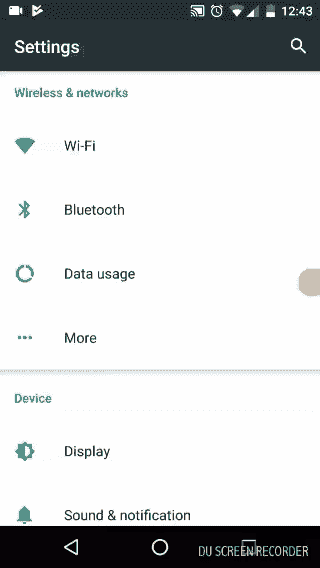
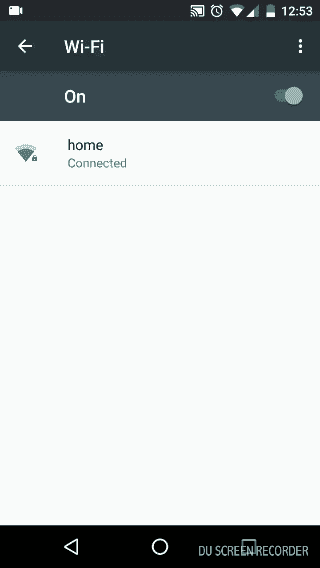

# 在 MacOS 上用 MITMProxy 拦截网络数据

> 原文：<https://infosecwriteups.com/intercepting-network-data-with-mitmproxy-on-macos-3e3f2f0123b2?source=collection_archive---------0----------------------->

# 要求

对于我最近工作的一个客户来说，需要在网络上截取数据。在对截取的数据应用业务逻辑之后，需要采取某些行动。


# 方法

在评估了其他工具后，我们认为我们会在 MITMProxy 上有所突破，这是一个 HTTP 和 HTTPS 的中间人代理，具有交互式控制台界面。它提供了各种代理模式，如:

1.  规则的
2.  透明代理√
3.  反向代理
4.  上游代理

这里详细解释了 [**运行模式**](http://docs.mitmproxy.org/en/stable/modes.html) **。**

我们希望设置一个透明的代理，因为我们可以控制连接到网络的设备，所以在这些设备上设置证书不成问题。

# 设置

我有一台运行 MacOS HighSierra 的 Mac 和一台连接到**同一个 Wi-Fi 网络**的 Android 测试设备。我用 [**Brew**](https://brew.sh/) **，**安装了 MITMProxy，预建的二进制文件也可以从他们的[发布页面](https://github.com/mitmproxy/mitmproxy/releases)下载。

> **mitmproxy** 使用 **pf 包过滤**实现透明模式。在 OSX，它被整合在自《OSX 狮子》以来的版本中。这意味着 mitmproxy 不支持 OSX 早期版本的透明模式。

## 在设备上安装证书

MITMProxy 通过在客户端设备上安装其自定义证书来支持 HTTPS 和 HTTP。通过运行以下命令，在基本模式下启动代理

```
mitmproxy --host
```

您将能够看到交互式控制台。现在更新 ***Wi-Fi 设置- >选择网络- >高级设置- >代理配置。*** 添加主机的 IP 地址作为代理。



在设置中设置代理配置

在设备的浏览器上访问`mitm.it`，然后选择相关平台并按照提供的说明进行操作。这个过程相当简单。

## 配置透明代理模式

一旦我们在设备上安装了 mitmproxy 证书。只需完成以下步骤即可启用它:

1.  启用 IP 转发

```
sudo sysctl **-**w net**.**inet**.**ip**.**forwarding**=**1
```

2.更新 ***pfctl*** 配置，将端口 **80** 和 **443** 上的流量重定向到端口 **8080** 上运行的 mitmproxy 实例。假设您的网络接口是`en0`,将以下配置添加到一个名为 pf.conf 的文件中

```
rdr on en0 inet proto tcp to any port {80, 443} -> 127.0.0.1 port 8080
```

> 上面 **pf.conf** 中的 **rdr 规则**仅适用于入站流量。它们将**而不是**重定向来自运行 pf 本身的机器的流量。

运行以下命令更新规则并启用 pfctl

```
sudo pfctl **-**f pf**.**conf
sudo pfctl -e
```

3.配置 sudoers 以允许 mitmproxy 访问 pfctl。以 root 用户身份编辑系统上的文件 **/etc/sudoers** 。这仅允许检查状态表，因此不应该有不必要的安全风险。将以下行添加到文件末尾时要小心，覆盖其他行会导致用户无法访问 **sudo** :

```
ALL ALL=NOPASSWD: /sbin/pfctl -s state
```

4.开始 mitmproxy。

```
mitmproxy -T --host
```

`-T`标志打开透明模式，`--host`参数告诉 mitmproxy 使用主机头的值来显示 URL。

5.最后，将设备配置为使用 Mac 作为网络的默认网关。将 Mac 的 IP 地址添加为默认网关。



为 Wifi 网络配置默认网关

现在，您将能够拦截和处理来自连接到网络的设备的请求。

## 好的读物:

1.  [http://docs.mitmproxy.org/en/stable/mitmproxy.html](http://docs.mitmproxy.org/en/stable/mitmproxy.html)
2.  [http://docs.mitmproxy.org/en/stable/transparent/osx.html](http://docs.mitmproxy.org/en/stable/transparent/osx.html)
3.  [https://gist.github.com/tracphil/4353170](https://gist.github.com/tracphil/4353170)

**补遗(2018 年 2 月 20 日)**

官方文档现在包含了我推荐的 MacOS 设置的修改。那也可以作为参考。

希望你喜欢读这篇文章，就像我喜欢写这篇文章一样。
*你是否认为这样会对某人有所帮助？不要犹豫分享。如果你喜欢，点击下面的* ***拍拍*** *，这样其他人会在媒体上看到。别忘了在博客后用* ***来表达爱意！***