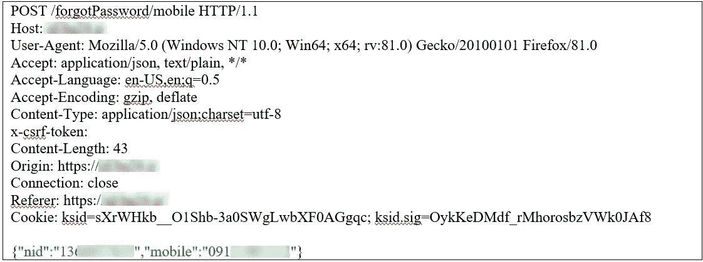
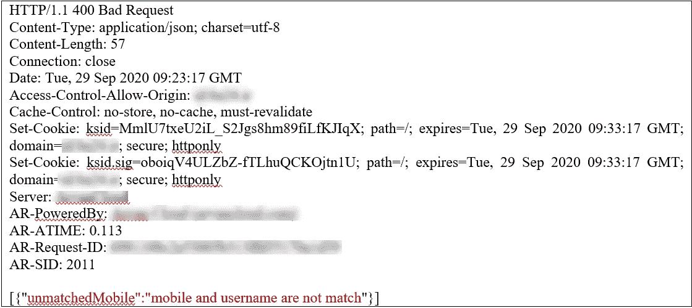
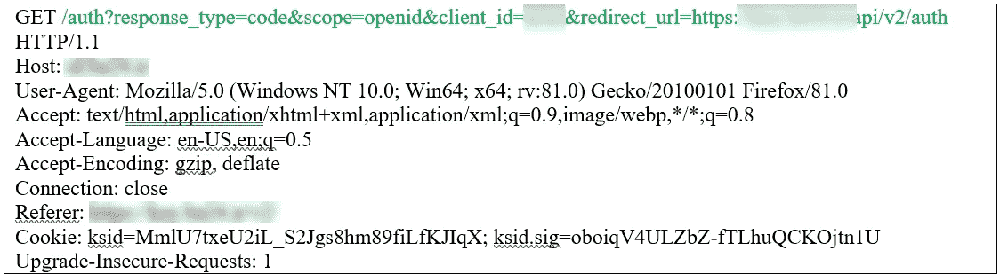
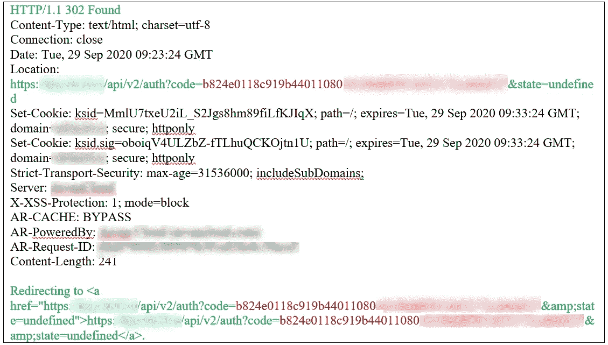
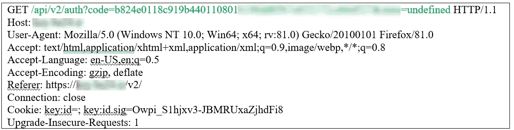
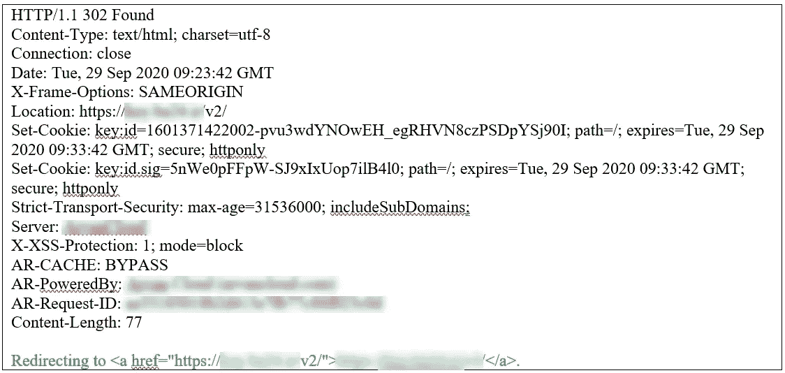
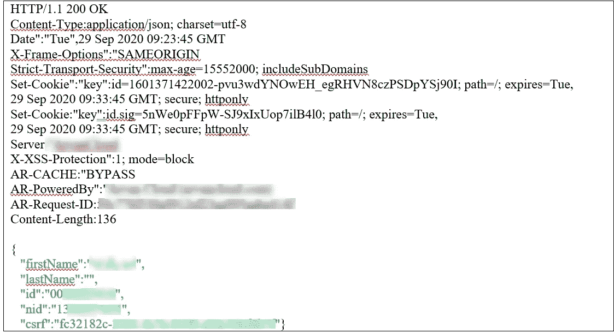
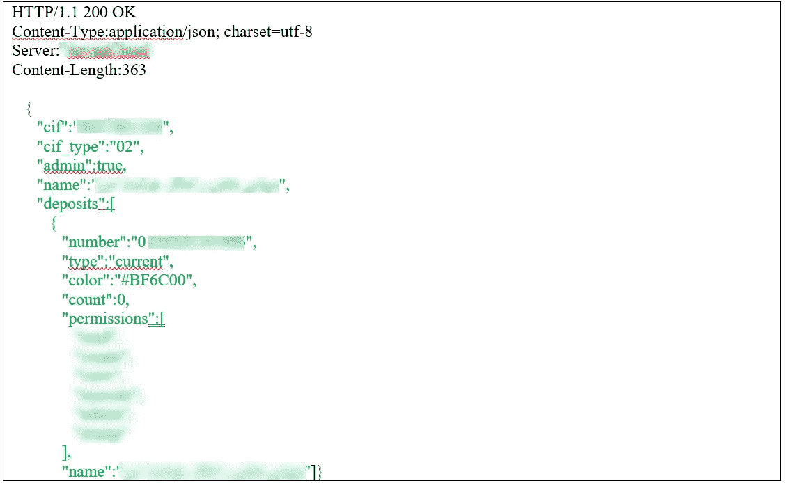
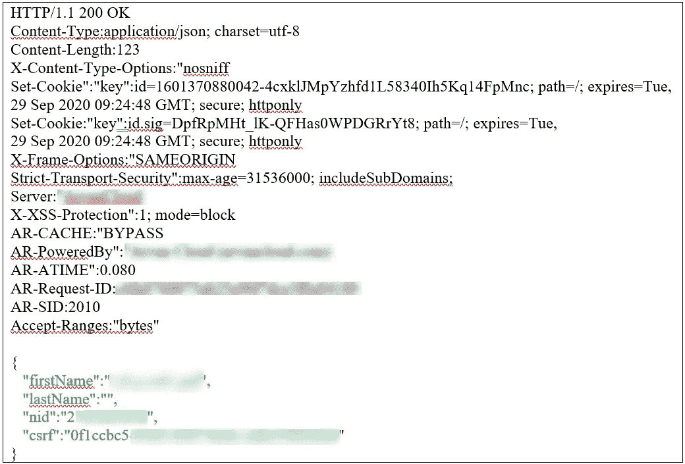

# 在没有用户交互的情况下接管超过 100 万用户的互联网银行账户

> 原文：<https://infosecwriteups.com/internet-bank-account-takeover-of-1m-users-without-user-interaction-75bd184936c5?source=collection_archive---------0----------------------->

OAuth 是一个开放的协议，允许以简单的标准方法从 web、移动和桌面应用程序进行授权。OAuth 是一种开放的访问授权标准，通常用于互联网用户授权网站或应用程序访问他们在其他网站上的信息，但不需要给他们密码。亚马逊、谷歌、脸书、微软和 Twitter 等公司使用这种机制来允许用户与第三方应用程序或网站共享其帐户信息。[维基百科]

OpenID Connect 1.0 是 OAuth 2.0 协议之上的一个简单的身份层。它允许客户端基于授权服务器执行的身份验证来验证最终用户的身份，并以可互操作和类似 REST 的方式获取关于最终用户的基本配置文件信息。OpenID Connect 允许所有类型的客户端(包括基于 Web 的客户端、移动客户端和 JavaScript 客户端)请求和接收关于经过身份验证的会话和最终用户的信息。[https://openid.net/]

著名的网上银行应用之一是使用 OAuth 2.0 协议和 OpenID Connect 1.0 对用户进行认证和授权。让我解释一下这个场景。

银行授权服务器接受包含 OAuth 2.0 和 OpenID Connect 1.0 规范定义的参数的身份验证请求。您必须输入包含用户名/身份证号和密码的凭据才能登录您的网上银行帐户。

如果您已经被识别并在银行注册，您可以使用您的用户名/身份证和密码登录您的帐户。

接下来，我点击“忘记密码了？”按钮。在此步骤中，用户必须输入她/他的身份证和手机号码来更改密码，同时为了确认输入的信息，会向用户的手机号码发送一个 OTP 代码。

然后，我输入身份信息，得到这个错误信息:“手机和用户名不匹配”。原因是我的手机号码在数据库中不存在，我没有用这个手机号码注册。

请求如下:

答案是:

OMG！当我再次点击登录按钮时，状态代码变为 302，并成功登录到我的互联网银行帐户！发生了什么事？

请求如下:

回应是:

而下一个请求和响应如下。

要求是:

回应是:

最后，我登录了我的网上银行账户。

要求是:

回应是:

我使用了一个国家 ID 数据库，并编写了一个方便的漏洞来入侵 **+1M** 账户。在图 1 到图 3 中，你可以看到一些被入侵的账户。

图 2:受害者账户被接管

图 3:受害者账户被接管

好的。造成这种漏洞的原因是什么？

OAuth 协议的不正确实现是这一安全漏洞的原因。在这种情况下，开发人员在将 OTP 发送到电话号码进行验证之前，会为用户帐户分配一个访问令牌。如果受害者的国家 ID 在数据库中，它将由 OpenID 进行身份验证，用户将通过 URL 片段中的访问令牌重定向回应用程序。这是 OAuth 的隐式授权类型！

注意:该漏洞已被修补，本文仅供研究和学习之用。