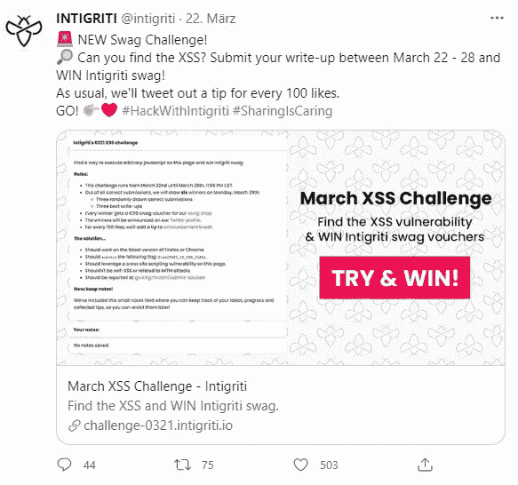
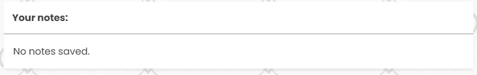
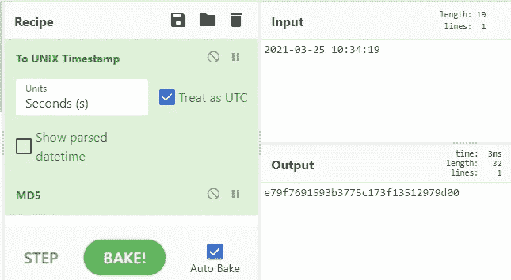

# Intigriti — XSS 挑战赛 0321

> 原文：<https://infosecwriteups.com/intigriti-xss-challenge-0321-472ae0a48254?source=collection_archive---------0----------------------->

## XSS 与 CSRF 旁路



推特上的挑战公告

那是三月，Intigriti 出版了新的 XSS 挑战。因为好的 XSS 挑战总是学习新的有趣方法的一种方式，我给了它一个尝试。

# XSS

挑战赛网站([https://challenge-0321.intigriti.io/](https://challenge-0321.intigriti.io/))包含一般规则和输入注释的输入框。



注释输入字段

如果我们输入并存储一个注释，浏览器会向服务器发送一个 POST 请求，其中包含注释、CSRF 令牌和用户的 PHP 会话 id。

```
POST / HTTP/1.1
Host: challenge-0321.intigriti.io
Content-Type: application/x-www-form-urlencoded
Content-Length: 49
Cookie: PHPSESSID=<session id>
[...]

csrf=<csrf token>&notes=this+is+an+example
```

因此，服务器将使用网站内容进行响应，包括新的注释、新的 CSRF 令牌和网站创建时的时间戳。

```
<html>
[...]
     <div class="card-container">
         <form method="POST" action="./" id="update-notes">
            <div class="card-header">Your notes:<span id="actions"><a id="notes-save" href="#">save</a></span></div>
            <p id="notes-display" class="card-content" contenteditable="true">this is an example</p>
            <input type="hidden" name="csrf" value="e79f7691593b3775c173f13512979d00"/>
            <input type="hidden" id="notes-value"  name="notes" value=""/>
         </form>
      </div>
    [...]
   <!-- page generated at 2021-03-25 10:34:19 -->
</html>
```

在服务器端，后端检查提交的笔记。如果我们发送一个特殊字符来转义 HTML 元素，比如`<`或`>`，服务器会对它们进行净化以防止注入攻击。此外，如果注释中包含 URL 或电子邮件地址，服务器会将它们转换为包含 URL 或邮件的`<a>`元素作为 href。

例如，注释“ *http://a.b 或 a@b.com*”将被转换为:

```
<a href="http://a.b" target="_blank">http://a.b</a> or <a href="mailto:a@b.com">a@b.com</a>
```

摆弄电子邮件地址并阅读 [RFC 5322](https://tools.ietf.org/html/rfc5322) ，我们知道电子邮件地址的第一部分，即@之前的部分，可以用双引号括起来。在这种情况下，服务器不会清理电子邮件地址周围的双引号，我们可以对 HTML 元素进行转义。

和以前一样，在前面的例子*"a"@b.com*中添加双引号会导致`<a href="mailto:"a"@b.com">"a"@b.com</a>`中的字母`a`不属于任何属性。

考虑到这一点，很容易向`<a>`元素添加任何属性，并滥用它来触发 XSS。mouseover 属性就是一个例子:

```
"onmousemove=alert('flag{THIS_IS_THE_FLAG}');"@evil.com
```

被转换为

```
<a href="mailto:" onmousemove="alert('flag{THIS_IS_THE_FLAG}');&quot;[@evil](http://twitter.com/evil).com&quot;">"onmousemove=alert('flag{THIS_IS_THE_FLAG}');"[@evil](http://twitter.com/evil).com</a>
```

# CSRF 旁路

为了将 XSS 传递给任何用户，我们仍然必须绕过 CSRF 令牌。

查看一个示例 CSRF 令牌*e79f 7691593 b 3775 c 173 f 13512979d 00*，我们可以从长度和使用的字符猜测它可能是一个 MD5 散列。在网页的底部，我们还可以看到服务器端创建网站时的时间戳。由于获取当前的 UNIX 时间戳、对其进行哈希处理并将其用作 CSRF 令牌是一个典型的错误，所以我们应该尝试一下。

为了快速检查，我们可以使用前面例子中的 [CyberChef](https://gchq.github.io/CyberChef/#recipe=To_UNIX_Timestamp('Seconds%20(s)',true,false)MD5()&input=MjAyMS0wMy0yNSAxMDozNDoxOQ) 以及时间戳和 CSRF 令牌。



将时间戳转换为 UNIX 时间，并在[赛博网](https://gchq.github.io/CyberChef/#recipe=To_UNIX_Timestamp('Seconds%20(s)',true,false)MD5()&input=MjAyMS0wMy0yNSAxMDozNDoxOQ)中使用 MD5 对其进行哈希运算

正如我们所看到的，输出散列与前面提到的 CSRF 令牌相匹配。

了解这一点后，我们现在可以创建一个受害者会打开的 PoC 网页。网站首先向服务器发送初始请求，以生成新的 CSRF 令牌。由于 CORS，网页不能简单地从响应中读取新生成的 CSRF 令牌，但它可以猜测它，因为我们大约知道创建的时间戳。然后，网站发送第二个带有 XSS 负载的请求。

# 完整概念验证

要重现该漏洞，可以在 Firefox 中使用以下 HTML 页面。

1.  用 Firefox 打开 https://challenge-0321.intigriti.io/的[创建一个会话 ID](https://challenge-0321.intigriti.io/)
2.  用火狐打开 poc.html
3.  点击几次*发送有效载荷*，因为有时时间戳不正确
4.  返回[https://challenge-0321.intigriti.io/](https://challenge-0321.intigriti.io/)并将鼠标悬停在注释字段

**poc.html**

# 摘要

一如既往，这是一个有趣的挑战。此外，它是真实的，因为这个 XSS 漏洞在微软 Outlook 中被类似地[发现。](https://www.cyberark.com/resources/threat-research-blog/outlook-for-android-xss)

我的解决方案只适用于用户交互，因为用户需要将鼠标悬停在 notes 字段上。不幸的是，我没有找到没有用户交互的解决方案，并期待其他文章。

稍微跟进一下:
我被选为最佳文章作者之一，并赢得了一张€50 英镑的代金券。感谢 Intigriti 的巨大挑战和奖品！