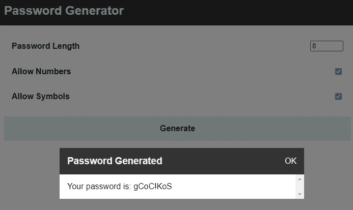
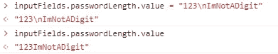
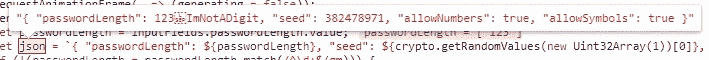
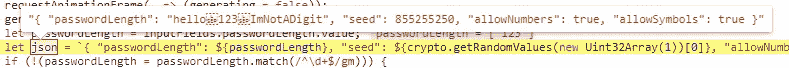
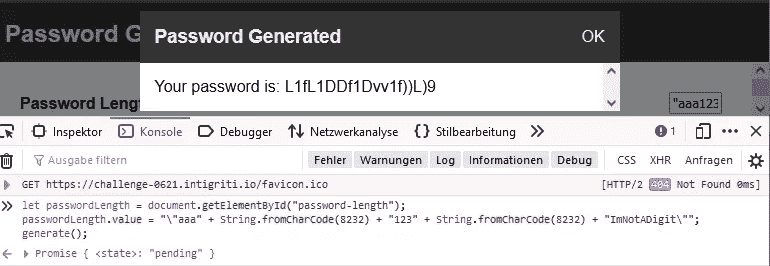
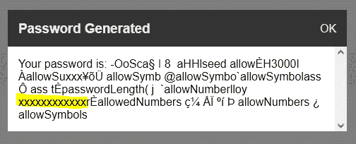
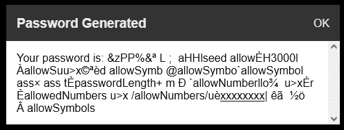
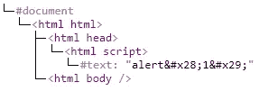
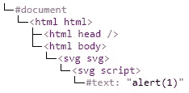
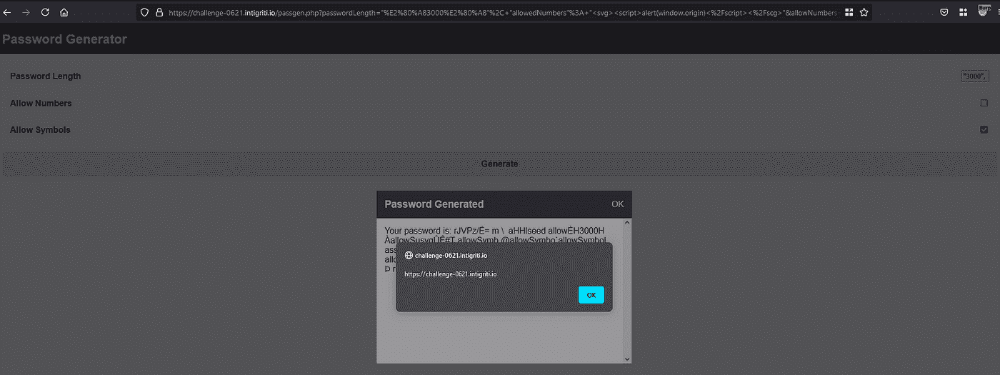

# Intigriti — XSS 挑战赛 0621

> 原文：<https://infosecwriteups.com/intigriti-xss-challenge-0621-cf76c28840c1?source=collection_archive---------1----------------------->

## 通过 web assembly XSS

# 挑战

在浏览我的 Twitter feed 时，我看到了 Intigriti 的一个新帖子——一个新的 XSS 挑战。由于我有一些空闲时间，我决定试一试。在下面的文章中，我回顾了我的思考过程，并解释了我的方法。在撰写本文时，在挑战赛的最后一天，22 份申请中只有 14 份被接受。因此，我希望很多人欣赏这篇文章，并从中吸取一些东西。

对于每一个 Intigriti XSS 挑战赛，目标都是在给定的域上执行一个`alert(document.domain)`。不允许有自我 XSS 或中间人，这应该适用于最新的 Firefox 或 Chrome 版本。

查看挑战赛的网站，我们可以看到内嵌了一个 iframe，从`/passgen.php`加载内容。Passgen 包含一个密码生成器，主要在一个名为`program.wasm`的 web assembly (wasm)文件中实现。当用户生成新密码时，wasm 文件被调用，其输出被传递给函数`showMessage`。该函数获取输出，对其进行净化，并将其显示为弹出消息。



在/passgen.php 上，用户可以生成密码。

# 黑盒测试

挑战的第一部分是理解 wasm 文件的作用。由于 wasm 文件没有源代码(只是后来 Intigriti 发布了一个 [Pastebin](https://pastebin.com/n0vWtyQN) )，剩下的两个选择要么是反转文件，要么是黑盒测试。

我使用的策略是查看文件的输入参数，摆弄它，然后查看结果——黑盒测试。让我们来看看代码及其输入参数:

我们可以看到有三个输入参数:`passwordLength`、`allowNumber`和`allowSymbols`。所有三个参数都包含在 JSON 字符串中，该字符串随后作为`option`参数传递给函数`generate_password`。这个函数是 wasm 文件的一部分。我们得到的输出是生成的密码，包含在参数`password`中。

首先，我们分析参数`passwordLength`，因为它似乎比其他参数更相关。它还在 malloc 中用于为生成的密码分配字节。但是，在第 11 到 14 行的检查和操作之前，它已经被复制到 JSON 中了。这意味着 JSON 中的密码长度(长度-1)和后来使用的密码长度(长度-2)可能不同。让我们看看如何验证这一点。

regex 在第 11 行分析中检查密码长度是否仅由数字组成。不幸的是，检查是无效的，可以通过插入一个换行符来绕过它。这是由于 regex 字符串中的[多行参数](https://javascript.info/regexp-multiline-mode):

```
"123\nImNotADigit".match(/^\d+$/gm)
-> Array [ "123" ]"123\nImNotADigit".match(/^\d+$/g)
-> null
```

如果我们现在将`inputFields.passwordLength.value`设置为`123\nImNotADigit`并调用生成函数，理论上我们应该看到检查运行通过，导致不同的变量 length-1 和 length-2。

该死，没那么快…每次我们试图设置值的时候，换行符就消失了，因为 HTML 输入字段默认不允许换行符。



HTML 输入字段删除每个换行符

尽管不允许使用常规换行符，但我们可以使用一个简单的模糊技巧来找到另一个有效字符:

上面的代码片段尝试 10000 个字符来查找会破坏检查的奇怪的 Unicode 字符。相应地，我们可以看到字符 8232，Unicode 行分隔符，是我们需要的字符——这是有意义的。

如果我们现在尝试我们的“ImNotADigit”字符串，它工作并通过。但是，由于 length-1 和 length-2 不同，生成的密码为空；有东西坏了。当然，由于 JSON 字符串中的非数字字符，它不再是一个有效的 JSON，所以有效负载被破坏了(参见下面的两张图片)。因此，让我们修复它并重新检查结果。解决方法是用引号将值括起来，这样输入就不再作为数字来处理，而是作为 JSON 字符串中的一个字符串来处理。



input " 123 "+string . from charcode(8232)+" imnotaditch "中断 JSON 字符串



解决方法是将输入放在引号中

要自己测试，您可以使用下面的代码片段:

```
let passwordLength = document.getElementById("password-length");
passwordLength.value = "\"hello" + String.fromCharCode(8232) + "123" + String.fromCharCode(8232) + "ImNotADigit\"";
generate();
```



操纵 JSON 字符串是可行的。

正如我们在上面看到的，修复工作。接下来，我们可以尝试对 JSON 进行转义，并包含其他键。我们能用这个做什么？

我尝试的第一件事是更改种子参数。因此，密码总是相同的。但是除了密码保持不变之外，没有任何好处。

```
inputFields.passwordLength.value = "\"" + String.fromCharCode(8232) + "10" +  String.fromCharCode(8232) + "\", \"seed\": 1";
generate();
```

然后，我尝试了各种输入和密码长度，最终发现当密码长度足够大时，一些输入会被反射回来。这可能是由于 wasm 文件溢出造成的；但是，我没有反转 wasm 文件，所以我不知道确切的原因。

下面的代码片段将输入长度设置为 3000。在网站的控制台中执行，弹出窗口将显示我们在`allowedNumbers`中设置的 Xs。

```
inputFields.passwordLength.value = "\"" + String.fromCharCode(8232) + "3000" +  String.fromCharCode(8232) + "\", \"allowedNumbers\": \"xxxxxxxxxxxx\"";
generate();
```



因此，我们可以控制弹出消息中显示的输出。让我们尽快将此事升级为 XSS。

# 消毒剂旁路

弹出窗口是由使用杀毒函数`sanitize`的函数`showMessage`生成的。

在第一个视图中，看起来我们可以注入 HTML，因为`<`、`>`和`/`不包含在不安全字符中。然而，许多标准有效载荷由于消毒剂而失效。例如，下面的例子确实注入了 HTML。

```
inputFields.passwordLength.value = "\"" + String.fromCharCode(8232) + "3000" +  String.fromCharCode(73769) + "\", \"allowedNumbers\": \"<u>xxxxxxxx</u>\"";
generate();
```



然而，如果我们将基本的`<script>alert(1)</script>`有效载荷放入杀毒软件，它会返回`<script>alert&#x28;1&#x29;</script>`。尽管如此，我发现了一个有效负载，利用它可以绕过使用`<svg>`的杀毒程序，或者更好地说，甚至可以通过`<svg>`执行 javascript。

将`<svg><script>alert(1)</script></svg>`放入杀毒器会返回正确的杀毒输出(`<svg><script>alert&#x28;1&#x29;</script></svg>`)，尽管如此，还是会执行 javascript。

如果您想知道为什么应用程序会有这样的行为，请看下面的两个 DOM 树。左图显示了没有 SVG 标记的 DOM。就我的理解而言，如果我错了，请纠正我，一切都在 HTML 上下文中，HTML 实体按照我们预期的方式处理。相反，在右侧，SVG 标签中包含的部分不再在 HTML 上下文中，而是在 SVG 中。这意味着 HTML 解析器将 HTML 实体转换回字符，因为它不再是 HTML 上下文。因此，可以将 HTML 编码的 javascript 放在脚本标签中，并使用`showMessage`弹出菜单执行有效负载。



用[https://livedom.lab.xss.academy/](https://livedom.lab.xss.academy/)生成的两个不同的 DOM 树

# 最终概念验证

综合考虑，最终攻击如下:

1.  控制 wasm 调用的 JSON 输入
2.  使用 Unicode 行分隔符对 JSON 进行转义
3.  将 SVG 有效负载放入 JSON 字符串以执行 javascript

以下代码片段演示了这种攻击:

```
inputFields.passwordLength.value = "\"" + String.fromCharCode(8232) + "3000" +  String.fromCharCode(8232) + "\", \"allowedNumbers\": \"<svg><script>alert(window.origin)</script></scg>\"";
generate();
```

鉴于此，对于反射的 https://challenge-0621.intigriti.io/passgen.php?，受害者必须点击下面的链接并生成(仅适用于 Firefox):
[password length = % 22% E2 % 80% a 83000% E2 % 80% A8 % 22% 2C+% 22 允许的号码% 22% 3A+% 22% 3c SVG % 3E % 3c script % 3e alert % 28 window . origin % 29% 3C % 2f script % 3E % 3C % 2f SCG % 3E % 22&allow numbers = false&allow symbols = true&timestamp = 1624322408826】](https://challenge-0621.intigriti.io/passgen.php?passwordLength=%22%E2%80%A83000%E2%80%A8%22%2C+%22allowedNumbers%22%3A+%22%3Csvg%3E%3Cscript%3Ealert%28window.origin%29%3C%2Fscript%3E%3C%2Fscg%3E%22&allowNumbers=false&allowSymbols=true&timestamp=1624322408826)



在屏幕截图中，演示了成功的攻击

# 摘要

综上，又一个优秀的 Intigriti 解决了。第一次测试 web assembly，学到了新招，增长了见识。寻找 Unicode 字符的技巧和奇异的 XSS 有效载荷是我下次一定会记住的两件事！

一个额外的提示:我在写报告的时候才意识到，我的攻击只对火狐有效，对 Chrome 无效。我还没有时间想出另一种方法，因此我对其他 14 个黑客中的一个如何解决挑战非常感兴趣。