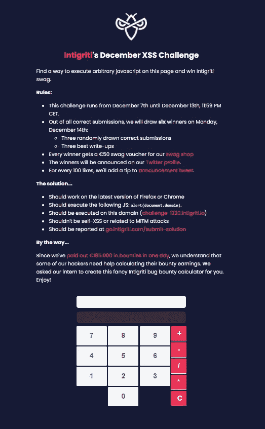
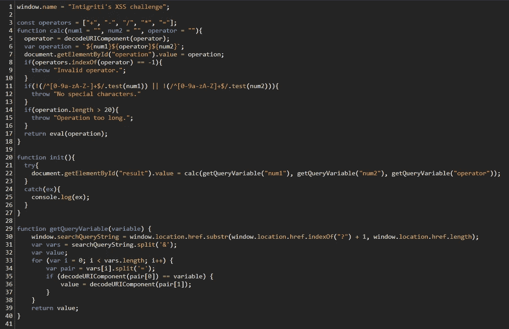
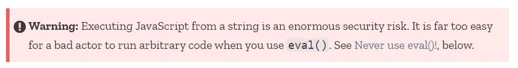
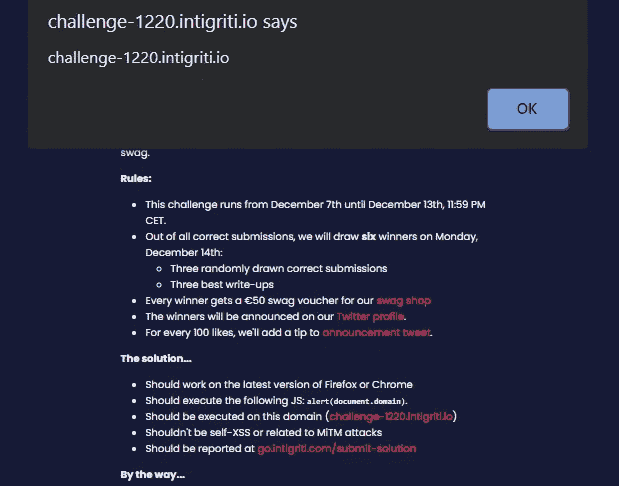

# Intigriti 的 12 月 XSS 挑战 2020(非预期解决方案)

> 原文：<https://infosecwriteups.com/intigritis-december-xss-challenge-2020-unintended-solution-8205b4a4b95b?source=collection_archive---------1----------------------->

和往常一样，我从阅读规则开始。目标是在[challenge-1220 . intigriti . io](https://challenge-1220.intigriti.io/)域上执行`alert(document.domain)`。Self XSS 和 MiTM 攻击不在范围内，该解决方案应该可以在最新版本的 Firefox 和 Chrome 上运行。



挑战页面

我做的第一件事是像使用计算器一样使用它，看看它对我的输入有什么反应。看起来第一个数字、运算符和计算的第二个数字被设置为 URL 中的参数。看起来我们应该在这些参数中注入一个有效载荷，所以我开始查看 JavaScript，看看它是如何处理这些参数的。

作为解决方案一部分的代码有三个功能。`init()`、`calc(num1="", num2="", operator="")`和`getQueryVariable(variable)`。



挑战代码

init 函数尝试执行 calc，并给它三个参数，这些参数是从 getQueryVariable 中检索的。Calc 将对参数进行一些检查，如果它们有效，它将执行 eval 来计算操作。

GetQueryVariable，取第一个问号之后的 URL 部分。它在' & '上拆分这个字符串，然后再在' = '上拆分，以检索每个参数及其值。如果参数名等于变量实参，则此参数的值将放在 value 变量中。迭代完参数后，返回 value 变量。这意味着在重复的情况下，将返回最后一个参数。

我在这段代码中注意到的第一件事是第 17 行的`eval(operation)`。我知道这个功能容易受到 XSS 的攻击，Mozilla 页面[在页面顶部警告了这一点。](https://developer.mozilla.org/en-US/docs/Web/JavaScript/Reference/Global_Objects/eval)



Mozilla 警告

我的想法是在操作变量中编译一个有效载荷，这样它就可以被 eval 函数执行。然而，这看起来并不容易。有效载荷必须由三部分组成，`num1`、`num2`和`operator`。Num1 只能包含数字和字母(小写和大写)以及'-'。Num2 也可以只包含数字和字母，但不能包含'-'。我觉得这很可疑。为什么 num1 上的正则表达式不同于 num2 上的正则表达式？这是不是开发者的错别字( [@securinti 在 twitter 上](https://twitter.com/securinti))？我在 num1 中找不到任何可能使用'-'的有效负载。所以我开始看剩下的代码。

运算符必须在常量数组运算符中。这里我注意到运算符包含' = '，但是计算器没有这个按钮。由此，我得出结论，我必须将操作符设置为' = '(在 URL 中，您必须用' %3D '来指定它，否则`getQueryVariable()`将在' = '字符上拆分，并且字符本身不会被传递给 calc 函数。最后，操作的长度不能超过 20 个字符。

那么我们能给`eval()`什么样的有效载荷呢？我们可以分配变量！我尝试了以下搜索查询

```
?num1=a&operator=%3D&num2=123
```

为了检查它是否工作，我来到控制台，键入`a`来查看变量的内容，确实，它工作了。

我们如何利用这些知识来执行警报？在 JavaScript 中，可以覆盖函数。例如，如果我们有函数 a

```
function a() {
    console.log("a");
}
```

和功能 b

```
function b {
    console.log("b");
}
```

现在，如果我们执行`a()`，我们将在控制台中看到“a”，如果我们执行`b()`，我们将看到“b”。

如果我们现在执行下面的`a=b`，然后我们执行`a()`，这一次我们将在控制台中看到“b”。这是因为我们告诉网页将函数 a 设置为等于函数 b，所以现在如果我们执行函数 a，函数 b 的代码就会被执行。所以现在如果我们尝试下面的搜索查询

```
?num1=eval&operator=%3D&num2=alert
```

我们按下计算器上的一个按钮后，会弹出一个警报。这是因为我们告诉网页应该将 eval 设置为 alert，现在调用的不是原来的 eval 函数，而是 alert 函数。此时，我们可以弹出一个警报，但是我们不能将 document.domain 传递给警报，因为之前在操作中已经进行了检查。这意味着我们必须寻找另一个函数来覆盖。我认为 calc 函数是理想的，因为这是挑战中唯一的另一个函数，我们可以操纵传递哪些参数。我没有用 alert 来覆盖这个函数，而是用 eval 来覆盖这个函数，因为参数将是一个字符串，而`alert(“document.domain")`在 alert 中只会说‘document . domain ’,而不是所需的域。所以现在我们有了下面的搜索查询，但是我们仍然需要找到一种方法将我们的代码传递给被覆盖的函数。

```
?num1=calc&operator=%3D&num2=eval
```

我在这一部分被卡住了一段时间，但 twitter 上给出的一个提示说' hashoo '，并附有以下 GIF。


来自 Intigriti tip 的 GIF

从这篇技巧中，我得出结论，我应该使用 URL 散列(#)。在尝试了许多不同的东西之后，我注意到我可以在“？”之前添加一些文本并且在 URL 中的“/”之后。文本必须以' # '开头，这样浏览器就不会将文本视为文件名，而是散列值。我现在得到的网址是:

```
[https://challenge-1220.intigriti.io/#sometext?num1=calc&operator=%3D&num2=eval](https://challenge-1220.intigriti.io/#sometext?num1=calc&operator=%3D&num2=eval)
```

这是变得棘手的部分。老实说，我不明白为什么浏览器会有下面提到的一些行为，但是我很确定它会被利用。

转到这个链接后，按下一个数字或操作按钮(不是清除按钮)，我注意到`#sometext?`被添加到 num2 或操作参数中，这取决于您按下了哪个按钮。

```
[https://challenge-1220.intigriti.io/?num2=NaN#sometext?num1=calc&operator=%3D&num2=eval](https://challenge-1220.intigriti.io/?num2=NaN#sometext?num1=calc&operator=%3D&num2=eval)
```

num1 参数这次被否定了，因为在`?num1`前又加了一个问号。所以现在 JavaScript 没有把它当作`num1`，而是当作`?num1`，因为 getQueryVariable 只否定了 URL 中的第一个问号。现在我们不再检查 calc 中的 num1 变量，我们有一种方法使第一个 num1 无效。剩下唯一要做的就是添加一个新的有效 num1，这样我们的 eval(以前是 calc)就会执行它。

注意:我们必须使用 num1，因为如果我们向 eval 函数传递多个参数，那么只有第一个参数会被执行(在我们的例子中是 num1)。

添加这个新的有效 num1 的方法是将它作为我们之前的散列来添加。警报过后，我又加了一句'；//'所以 JS 会处理 num1('？num1=calc ')作为注释。最终的网址是:

```
[https://challenge-1220.intigriti.io/#&num1=alert(document.domain);//?num1=calc&operator=%3D&num2=eval](https://challenge-1220.intigriti.io/#&num1=alert(document.domain);//?num1=calc&operator=%3D&num2=eval) 
```

现在，当我们按下计算器上的一个数字时，`alert(document.domain)`被执行，URL 如下所示:

```
[https://challenge-1220.intigriti.io/?num2=NaN#&num1=alert(document.domain);//?num1=calc&operator=%3D&num2=eval](https://challenge-1220.intigriti.io/?num2=NaN#&num1=alert(document.domain);//?num1=calc&operator=%3D&num2=eval)
```



这是我(无意中)解决挑战的方法，我很好奇想知道这种方法是什么！

如果您有任何问题，请随时联系我，我会尽可能回答您的问题。