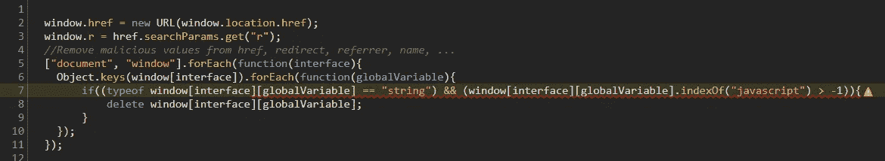
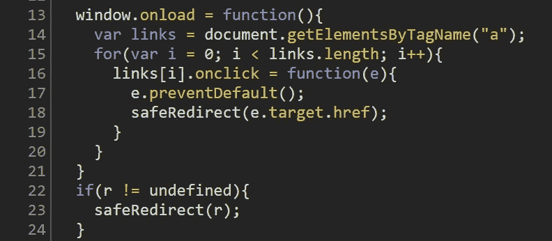
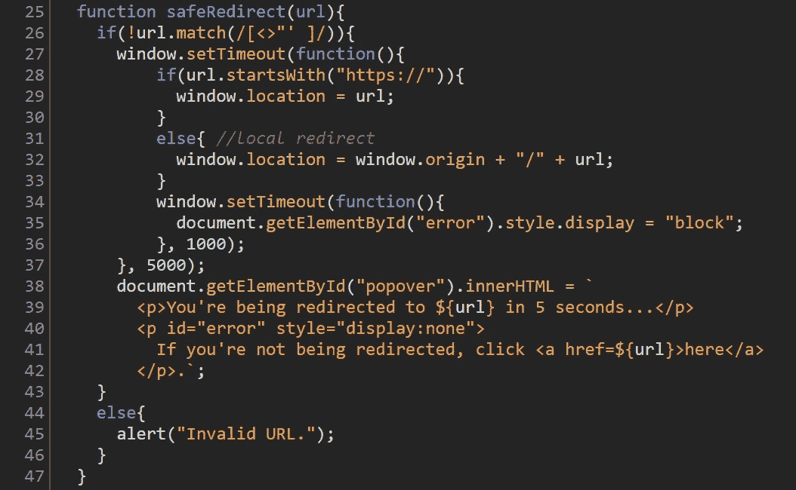
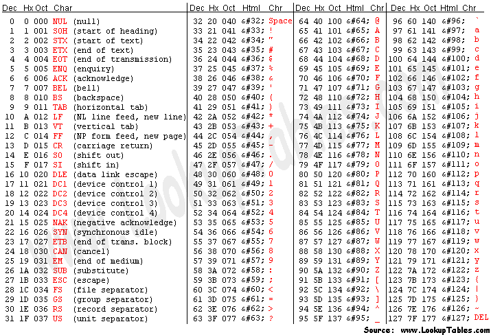
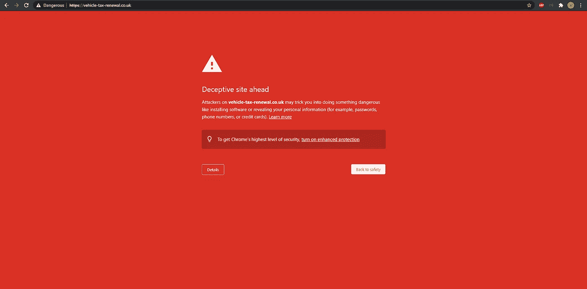

# Intigriti 的 2021 年 1 月 XSS 挑战赛

> 原文：<https://infosecwriteups.com/intigritis-january-xss-challenge-4475265edaa7?source=collection_archive---------0----------------------->

# 目录

*   [简介](#7741)
*   [解释代码](#7fa5)
*   [初步的解决思路和方法](#01d9)
*   [解决方案](#4c0e)

# 介绍

和往常一样，我从阅读规则开始。目标是`alert()`下面的标志:`{THIS_IS_THE_FLAG}`。嗯（表示踌躇等）..这是新的！我已经解决了之前的挑战，目标是执行`document.domain`。该解决方案应该利用该页面上的跨站点脚本漏洞，不应该是 self-xss 或与 MiTM 攻击相关，并且应该在最新版本的 Firefox 和 Chrome 上工作。


# 解释代码

阅读完规则后，我通常会像使用它的目的一样使用网页，但乍一看，似乎没有任何功能，所以我立即潜入源代码。

就在那里，`script.js`的 2 号线。该代码似乎处理了`r`搜索参数！

```
2| window.r = href.searchParams.get("r");
```

好了，现在我们知道我们可以通过这个参数注入，让我们看看`script.js`中还有什么。



script.js 第一部分

起初，`forEach()`函数看起来有点难以理解，但是多亏了注释行和一些调试，很容易理解它。我在第 7 行放了一个断点并刷新页面，看看`interface`和`globalVariable`的内容会是什么。原来这个函数循环遍历文档和窗口的每个属性。如果属性类型是字符串，并且包含字符串`javascript`，该属性将被删除。

> 我们可以否认代码中的警告，我很快谷歌了一下，但这似乎不是这个挑战的问题

如果我们将 searchParameter `r`设置为包含字符串`javascript`的值，它将被删除。并且控制台会显示`r`未定义的错误。

```
https://challenge-0121.intigriti.io/?r=javascript
```

好了，接下来是代码的下一部分！



script.js 的第二部分

这里我们看到页面上每个 URL ( `a`标签)的默认动作都被一个叫做`safeRedirect()`的函数覆盖了。参数`e.target.href`被传递给这个函数，它只是锚标记的 href 属性的内容。

我们还可以看到，如果`r`，记住这是我们的搜索参数，是未定义的，`safeRedirect()`函数被调用与参数`r`。

那么这个`safeRedirect()`功能是什么呢？



安全重定向功能

首先，我们看到搜索参数`r`是一个 URL/路径(该参数字面上称为`url`)。接下来我们可以看到，参数不应该包含以下任何字符:`<`、`>`、`"`、`'`和一个空格。

如果 URL ( `r`参数)以`https://`开头，`window.location`将被设置为 URL，它将用户重定向到任何指定的站点。耶，打开重定向！否则`window.location`将被设置为`window.origin + "/" + url`。

此重定向将在 5 秒(5000 毫秒)后发生。如果在 5 秒钟内没有发生重定向，将显示一条错误消息，并带有一个`a`标签，以便用户可以单击该 URL。

# 初步想法和解决方法

好吧，在这一点上，有一些事情可能会阻碍我们解决这个问题。我把它们记了下来，并开始一个接一个地为它们寻找旁路。我开始只有两个问题，后来在列表中添加了一些问题。

```
List of problems:1\. r variable can't contain "javascript" string2\. r variable can't contain <, >, ", ' or a space3\. inject in a tag of error message4\. Don't make the browser redirect so that the error message will be displayed as a block5\. the URL will always start with https:// since window.origin is [https://challenge-0121.intigriti.io](https://challenge-0121.intigriti.io)
```

前两个问题很容易绕过。

## 问题 1

对`javascript`字符串的检查是区分大小写的，所以我们可以只通过`Javascript`、`JaVaScRiPt`等..这个变量，它不会被删除。

## 问题 2

第二个问题是我们不能注入任何 html，因为`<`和`>`不能在我们的输入中使用。我们仍然有我们的`a`标签，我们可以在那里注入恶意代码，这可能是一条路要走！这里需要注意的一点是，我们应该`alert()`下面的标志:`{THIS_IS_THE_FLAG}`。这个标志应该作为字符串传递，但是`"`和`'`不能用于此。幸运的是，我们还有其他允许使用的字符，比如反勾```。如果您不知道可以为此使用反勾号，只需适当地查看一下 script.js，您就会看到它们是在错误消息周围使用的。

## 问题 3

第三个问题稍微难一点。要插入 a 标签，您需要空格来转义`href`属性，正如我们之前发现的，我们不能使用空格。为了绕过这一点，我看了一下 [ascii 表](http://www.asciitable.com/)。我尝试了前几个十六进制代码，一个接一个，找到了一个在注入时充当空格的。我使用的十六进制代码是`%0a`,它作为一个新行，但是在 html 中将显示为一个普通的空白。这里重要的是，如果我们想对`href`属性进行转义，我们需要在我们的第一个`%0a`前添加一个类似于字符`b`的东西，否则浏览器会这样渲染它:`<a href="onclick=alert(1)">here</a>`。它将忽略`%0a`，并将其后的所有内容视为`href`。



ascii 表；来源:[lookuptables.com](http://www.lookuptables.com/)

现在我能够注入`a`标签，但是像`onclick`和`onmouseover`这样的东西不能工作，因为`display`被设置为`none`，并且没有办法覆盖它。为此，我们需要解决问题 4。

## 问题 4

我首先尝试的事情之一是在 URL 中传递一个%00a，希望它不会因为 0 字节而重定向我，事实上，它没有。但是这里的问题是它给出了一个 DOM 异常，并阻止了其他 JavaScript 的运行…

我开始做一些关于如何防止浏览器重定向的研究，很快找到了谷歌 Chrome 设置`privacy and security`>`Site Settings`>`Content`>`Pop-ups and redirects`。这被设置为`Blocked`，但是由于某种原因，它允许挑战页面上的重定向。我不知道这个设置阻止了哪些重定向，但我开始搜索那些被谷歌透明报告标记为不安全的网站。令我惊讶的是，这些网站比我想象的更难找到，因为我找到的大多数网站都不再活跃了。在谷歌搜索了一段时间后，我找到了以下网址:

```
[https://vehicle-tax-renewal.co.uk/](https://vehicle-tax-renewal.co.uk/)
```

我试图重定向到这个网址，但结果是 Chrome 并不阻止重定向到这个网址，它只是在这个网址上显示一条警告消息，通知用户这个网站是恶意的。



到目前为止，我们还没有解决这个问题的方法，但是我们稍后会回到这个问题上来。

## 问题 5

第五个问题可能是最难的。一旦这个问题解决了，我们也将能够解决问题 4。要解决问题 5，让我们看看第一个技巧:

嗯，瞄准镜…哦，等一下。记得规则吗？其中之一如下:

> 应利用此页面上的跨站点脚本漏洞。

就我记忆所及，上两次挑战的规则有点不同，但我不确定。为了验证这一点，我查阅了我以前的一篇文章，其中的规则是:

> 应在此域上执行(challenge.intigriti.io)

这里有明显的区别！

为了证实这一点，我还查看了 Intigriti 上[挑战程序的范围。以下域在作用域中:`*.challenge-0121.intigriti.io`。我不知道以前的挑战是否也是如此，但我认为可以肯定地说，我们可以得出结论，我们应该用子域做些什么。](https://app.intigriti.com/researcher/programs/intigriti/challenge0121/detail)

在这一点上，我可能使用过也可能没有使用过 [Sublist3r](https://github.com/aboul3la/Sublist3r) 来查找子域(当然没有任何结果)。那么我们能做些什么来包含一个子域呢？我尝试使用`a`作为子域，结果我们只是停留在挑战页面！

现在我们可以回到删除包含`javascript`的文档和窗口的任何字符串属性的代码。让我们在第 8 行(以`delete`开头)放一个断点，输入子域`javascript`，看看删除了哪些窗口属性。原来只删除了`window.origin`。现在，如果我们尝试以下网址

```
[https://javascript.challenge-0121.intigriti.io/?r=1](https://javascript.challenge-0121.intigriti.io/?r=1)
```

我们将被重定向到

```
[https://javascript.challenge-0121.intigriti.io/undefined/1](https://javascript.challenge-0121.intigriti.io/undefined/1)
```

这样，我们就可以解决问题 5 了，但是让我们先回到我们的问题列表上。

```
List of problems:1\. r variable can't contain "javascript" string
    --> use capital letters (Javascript)2\. r variable can't contain <, >, ", ' or a space
    --> use backticks (`)3\. inject in a tag of error message
    --> use %0a instead of a space4\. Don't make the browser redirect so that the error message will be displayed as a block
    --> TODO5\. the URL will always start with https:// since window.origin is [https://challenge-0121.intigriti.io](https://challenge-0121.intigriti.io)
    --> use subdomain javascript
    --> TODO: inject in window.origin
```

找到一种方法在 window.origin 中注入…我确信这将是解决方案，但我不确定我如何能够做到这一点。我开始做这方面的研究，但是没有任何正确的答案，除了因为挑战页面是跨源的，所以这是不可能的。在这一点上，我一无所知，并决定再看看 twitter 上的提示。

带 id，嗯时间回到问题 3，我想我们需要在这里注入一个 ID。但是我们需要什么身份证明呢？我尝试了 JavaScript 代码中使用的两个 id(`popover`和`error`)，但是看起来这两个 id 对解决这个挑战没有用…

经过一番尝试，我注意到`window.error`返回了 id 为`error`的 html 标签。这个看起来很有前景！如果我给`a`标签注入`id=origin`会怎么样？

> 注意:如果我们不删除 window.origin，这是不可能的。

此时，我得到了以下 URL:

```
[https://javascript.challenge-0121.intigriti.io/?r=b%0aid=origin](https://javascript.challenge-0121.intigriti.io/?r=a%0aid=origin%0aonclick=alert(1))
```

这会重定向到

```
[https://javascript.challenge-0121.intigriti.io/b/aid=origin](https://javascript.challenge-0121.intigriti.io/a/aid=origin)
```

正如你所看到的，浏览器移除了我们有效载荷中的`%0a`，但是`/b/`也指向我们在第一个`%0a`之前添加的字符。现在我把 URL 中的这个字符替换成`Javascript:alert(1);`(记住大写字母)。我们的完整网址是:

```
[https://javascript.challenge-0121.intigriti.io/?r=Javascript:alert(1);%0aid=origin](https://javascript.challenge-0121.intigriti.io/?r=a%0aid=origin%0aonclick=alert(1))
```

有了这个有效负载，我期望页面重定向到`Javascript:alert(1);`，但看起来情况并非如此。相反，我刚刚解决了我们的问题 3。正如我们在控制台中看到的，有一个意外的标记“:”。

原来我们并不需要`Javascript:alert(1)`，但是我们可以用任何东西代替它，只要它有下面的结构:`string:random-chars`。

> *注意:* `*Javascript:alert(1)*` *如果把* `*//*` *放在后面就可以了。例如:*[*https://javascript.challenge-0121.intigriti.io/?
> r = Javascript:alert(1)//% 0aid = origin*](https://javascript.challenge-0121.intigriti.io/?r=Javascript:alert(1)//%0aid=origin)

由于错误现在显示为一个块，我们可以注入类似`onmouseover=alert(1)`的东西。我认为这是一个意想不到的解决方案，因为将鼠标悬停在 URL 上仍然是用户交互，但后来我想到了添加一个非常大的填充。

现在，将鼠标悬停在屏幕上的任何位置都会执行警报！

当我们现在回到我们的问题列表时，我们看到我们实际上不需要解决问题 1，对字符串`javascript`的检查只是在那里，所以我们可以删除`window.origin`。然后，我们使用问题 2 的解决方案将标志字符串传递给警报，问题 3 的解决方案注入到`a`标签中，问题 4 和 5 的解决方案注入到`window.origin`中并防止重定向。

# 解决方案

## 我的意见:

```
[https://javascript.challenge-0121.intigriti.io/?r=a:b;%0aid=origin%0aonmouseover=alert(`{THIS_IS_THE_FLAG}`)%0astyle=padding:800000px](https://javascript.challenge-0121.intigriti.io/?r=Javascript:alert(1);%0aid=origin%0aonmouseover=alert(%60%7BTHIS_IS_THE_FLAG%7D%60)%0aonchange=alert(1)%0astyle=padding:800000px);
```

## 预定方式:

```
[*https://javascript.challenge-0121.intigriti.io/?r=Javascript:alert(*](https://javascript.challenge-0121.intigriti.io/?r=Javascript:alert(1)//%0aid=origin)[`{THIS_IS_THE_FLAG}`](https://javascript.challenge-0121.intigriti.io/?r=Javascript:alert(1);%0aid=origin%0aonmouseover=alert(%60%7BTHIS_IS_THE_FLAG%7D%60)%0aonchange=alert(1)%0astyle=padding:800000px)[*)//%0aid=origin*](https://javascript.challenge-0121.intigriti.io/?r=Javascript:alert(1)//%0aid=origin)
```

感谢阅读！我希望你喜欢它！