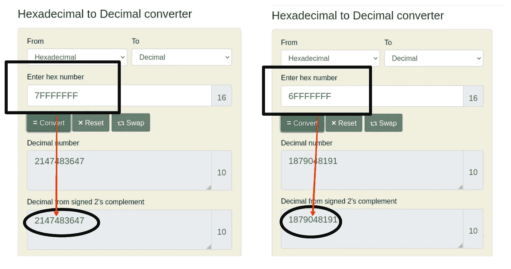
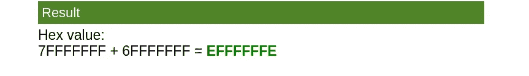
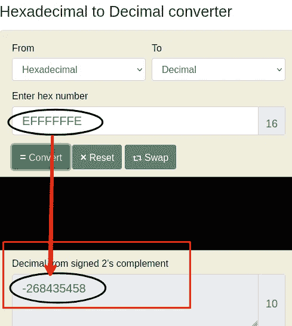
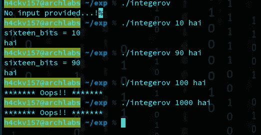
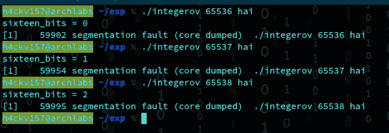
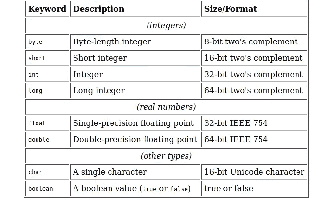
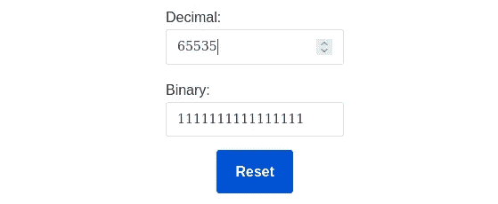
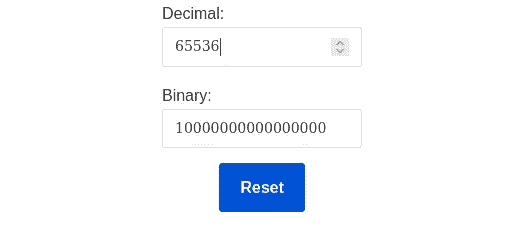
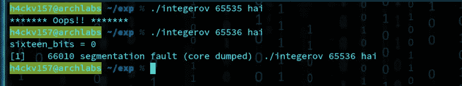

# 进入二进制开发的艺术 0x 000003[整数溢出的突出]

> 原文：<https://infosecwriteups.com/into-the-art-of-binary-exploitation-0x000003-prominence-of-integer-overflow-cea6abd2cce4?source=collection_archive---------0----------------------->


知道是容易的，但理解是一门艺术。因为只有 1%的顶尖 1%的人取得了成功。

嘿，黑客✋✋，
我又带着我们企业的另一部分——二进制开发系列回来了。以防你第一次阅读我的文章？？我谦逊地请求您在继续之前花一点时间阅读我的系列文章的前几部分。**你可以在这里找到→**PART-1:[0x 000001](/into-the-art-of-binary-exploitation-0x000001-stack-based-overflow-50fe48d58f10)| PART-2:[0x 000002](https://7h3h4ckv157.medium.com/into-the-art-of-binary-exploitation-0x000002-sorcery-of-rop-b4658238ee62)

> ***注*** *:-*
> 
> **这次我不是专门来剥削的。相反，我想与我的读者分享我关于整数溢出的知识，它的发生和后果。在接下来的文章中，我将完美地介绍每种开发技术&策略。我不准备跳过任何主题，所以我写了关于“整数溢出”的第三部分。**

只有当你自信现在已经知道这些东西时，才跳过“台词”。你不是在浪费你的一点时间，而是在钻研你永远不知道的东西。趁早学习提升自己。没有任何耽搁，让我们开始吧。

**什么是算术溢出？**

当没有足够的位来描述算术运算的结果时，就会出现这种情况。即计算结果超过了指定的存储空间。从技术上讲，当加法器/减法器电路使用带符号(+/-)算术时，如果出现算术溢出，符号位中的最高有效幅度位将溢出。当需要一个 4 位算术结果时会发生这种情况&当两个 3 位数字相加在一起，并且电路中的第四位已经被分配用于显示答案的符号(+/-)。洪水发生时的后果:

1.两个正数相加给出否定答案
2。两个负数的相加给出了肯定的答案

我举个例子，
考虑到 7FFFFFFF & 6FFFFFFF，我们把这 2 个&加起来看看会发生什么。



结果

> 结果是:EFFFFFFE

> 计算值大于给定寄存器或存储单元所能存储的量。因此，我们添加了 2 +ve 来产生-ve 结果。



结果

希望概念对你来说很清楚。

**但这有什么关系呢？在真实世界中，这怎么会是一个严重的问题呢？？**

> 想想看，在互联网时代，我们运行在数字世界(悲惨的事实)。举例来说，在预算计算或其他相关工作中，接受方内部的结果可能会受到意想不到的控制。剥削的艺术打开了没有任何规则的无限入口。我不想分享“邪恶的东西”。所以我让你发现为什么这不是一个问题。

但是，如果一个算术运算试图得到一个超出给定位数所能表示的范围的数值呢？？


让我们开始吧…

# 整数溢出

一个**整数溢出**是一种算术溢出，当一个整数值增加到一个大到可以存储在相关表示中的值时就会发生。出现这种情况时，该值可能会绕成一个小的或负数。万一包装是不可预见的，它会产生安全后果。典型地，尤其是在可以利用用户提供的输入来激活数字洪流的情况下。这将成为一个关键的安全问题。这一弱点有时会**触发缓冲区溢出，攻击者可利用该漏洞执行任意代码。这通常会导致未定义的行为，从而导致崩溃。在涉及循环文件因素的泛洪情况下，无限循环的概率会更高。如果地址中的值对信息至关重要(限于流)，则会发生简单的数据损坏。此外，在缓冲区溢出等其他情况下发生回绕的可能性极小，这可能会导致内存降低。**

发现和预测异常困难。没有错误，没有警告，你基本上得到了一个错误的操作结果。找到它们的方法是在运算前查看操作数，或者查看两个正数相加后的结果。根据语言的不同，您将能够找到帮助您避免和发现整数溢出的库或机制。

**代码分析|示例**

毫无疑问，这是我自己做的一个案例，这可能永远不会出现在现实生活中。

```
#include<stdio.h>
#include<string.h>
#include<stdlib.h>int main(int argc, char *argv[])
{           

           char buffer[100];
           int Integer_value;
           unsigned short sixteen_bits;if(argc < 3)
                         {
                          printf("No input provided...!");
                          return -1;
                         }Integer_value = atoi(argv[1]);
            sixteen_bits = Integer_value;if(sixteen_bits >= 100)
                        {
                         printf("******* Oops!! *******\n");
                         return -1;
                         }

   printf("sixteen_bits = %d\n", sixteen_bits); 
   memcpy(buffer, argv[2], Integer_value);
   buffer[Integer_value] = '\0';
   printf("%s\n", buffer);return 0;
}
```

我将展示不同类型的输出:



输出

*案例 1:* * * *未提供 I/P 时。****

```
if(argc < 3)
                         {
                          printf("No input provided...!");
                          return -1;
                         }
```

*案例二:** O/P ****

```
printf("sixteen_bits = %d\n", sixteen_bits); 
   memcpy(buffer, argv[2], Integer_value);
   buffer[Integer_value] = '\0';
   printf("%s\n", buffer);return 0;
```

***案例 3:* * "****>= 100**“* * **

```
*if(sixteen_bits >= 100)
                        {
                         printf("******* Oops!! *******\n");
                         return -1;
                         }*
```

> *目前，上述代码中的问题存在于哪里？？*

**

*分段故障*

> *随后，肯定了代码是易受攻击的。length 参数来自命令行，保存在 integer 变量中。当这个值被转换成无符号短整型时，它会被截断，以防这个值不适合。*

```
*Integer_value = atoi(argv[1]);
            sixteen_bits = Integer_value;*
```

**

*short = 16 位，int = 32 位*

> *无符号短整型数据类型表示 16 位整数，不使用位来存储符号。因此，它只能保存 0 到 65535 之间的正值。所以，值被转换成无符号短整型，它会溢出。*

> *二进制的 65535 是**111111111111111**(长度= 16)*

**

*16 位:65535*

> *二进制的 65536 是 100000000000000(长度= 17)*

**

*65536*

*它按照预期的方式工作，直到输入保持在 65535 以下。如果输入超过 65536 到 65635 之间的值**T3，这将是一个分段故障。***

**

*输出*

> *因此，可以绕过边界检查并溢出缓冲区。在此之后，可以利用标准堆栈粉碎策略来利用该过程。*

*我放弃这个案子，让你自己找到利用它的方法。*

**

*:)*

***注:***

> *1)并非每个 segfault 都是可利用的。但它仍然是一个 bug，如果您对漏洞没有任何线索，最好假设它是可利用的，并修复它。*
> 
> *2)此外，存储小于最小支持值的值称为整数下溢。*
> 
> *3)整数溢出本身不会导致任意代码执行，但是整数溢出“可能导致”堆栈溢出或堆溢出，这可能导致主观代码执行。*

## *上面的案例出现了一个与堆栈相关的问题，现在让我们检查一下堆的概要。*

```
*/** Vulnerable piece of code that I found online. **/int myfunction(int *array, int len)

{
    int *myarray, i;

    myarray = malloc(len * sizeof(int));

    if(myarray == NULL)

    {
      return -1;
    }

   for(i = 0; i < len; i++)

     {
        myarray[i] = array[i];
     }
     return myarray;
}*
```

> *这段代码容易受到**整数溢出**的攻击，这会导致所分配的缓冲区大小远远小于所需的大小。如果“len”参数比预期的要大，例如:0x100000004 与 32 位数字(max- 0x7FFFFFFF)一样大，那么这意味着 malloc()将像分配 4 字节缓冲区一样进行分配，并且将数据复制到新分配的数组中的循环将超过该分配的缓冲区的末尾。这会导致堆溢出。*

*在接下来的文章中，我将带着积极的开发策略回来。但是现在，我想愉快地结束它。我想告诉你很多关于堆栈和基于堆栈的缓冲区溢出漏洞以及绕过安全缓解措施等内容。完成所有这些工作后，让我们来研究堆的世界！！保持好奇心..！😎😎*

****在 Twitter 上随意连接*** @ [7h3h4ckv157](https://twitter.com/7h3h4ckv157)*

**

*很快就会抓到你..！*