# 进入二进制开发的艺术 0x 000004[撒旦-ROP 的复活]

> 原文：<https://infosecwriteups.com/into-the-art-of-binary-exploitation-0x000004-reviving-of-satanic-rop-5ab604b52341?source=collection_archive---------1----------------------->

*   魔法的延续…！！


NX 的全面淘汰

嘿爱好者✋✋，
我带着我的冒险二进制开发系列的第四部分又回来了。首先，我想为这些裂缝道歉。工作很忙碌，还存在一些健康问题。目前，手术后我很好。让我们把这些都分开，现在是时候开始了。

> 我们已经研究了什么是缓冲区溢出&它如何通过利用 NX 来抵抗外壳代码的执行。如果你是这个话题的新手，有几个术语可能不常见。因此，如果你能更好地理解过去的部分，那将是非常理想的。万一你卡住了或者完全走了，没关系。这需要一点练习。

在深入我们的主题之前，我想告诉你一个绕过 NX 的常用策略。

# 返回到 libc 攻击

因此，在进入攻击阶段之前，我将澄清一个关于 libc 的简介。Libc 通常被用作“**标准 C 库**”的简写。这是一个标准函数库，所有 C 程序都可以使用。您可以查看 Linux 手册以获得更好的想法:)

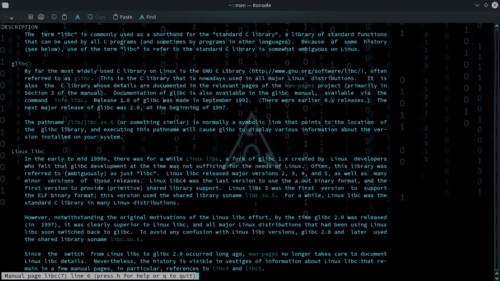

Linux 程序员手册

每次你从事 C 语言编程时，你肯定会用到一个或另一个内置的功能，比如 printf、scanf、puts 等等。所有的标准 C 能力都被编译成一个文件，命名为“**标准 C 库**或 **libc** 。C 标准库为任务、I/O 处理、内存管理、数学计算、宏(“宏指令”)提供了数据定义和函数——它是一种规则或模式，指示某些输入应该如何映射到替换输出。通过将程序员可访问的计算指令安排为单个程序解释，宏被用于使编程任务不那么乏味和不那么容易出错。libc 还提供其他一些操作系统服务。一些语言在它们自己的库中包含了标准 C 库的功能。该库可能会被修改以更好地适应语言的结构，但是操作语义是可以比较的。例如，C++语言在命名空间 td 中包含了 C 标准库的功能。在 Python 2 中，举例来说，内置的记录对象被定义为“利用 C 的 stdio 包实现”。Rust 有一个名为 libc 的工具箱，它允许几个 C 函数。同样，很多…很多…事情要谈。

> libc 包含了任何 C 程序都可以使用的所有标准功能。它在执行时“链接”到二进制文件。从利用的角度来看，理解 libc 非常重要，因为我们可以将控制流转移到 libc 函数。现在我们将重点关注**系统功能**。

在常规的堆栈溢出攻击中，我们知道没有堆栈保护。因此，我们用注入堆栈的外壳代码的地址覆盖返回地址，并执行它。然而，如果易受攻击的程序的堆栈被保护(NX 位被设置)，我们就不能再执行我们的外壳代码。这些都是我们之前讨论过的，这就是我们如何开始 ROP 或面向返回的编程。

> 在 ret-to-libc(ret 2 libc)技术中，返回地址将用指向 libc 库中 system()函数的内存地址覆盖。

# c 库函数—系统()

```
The C library function  **int system(const char *command)** passes the command name or program name specified by command to the host environment to be executed by the command processor and returns after the command has been completed.
```

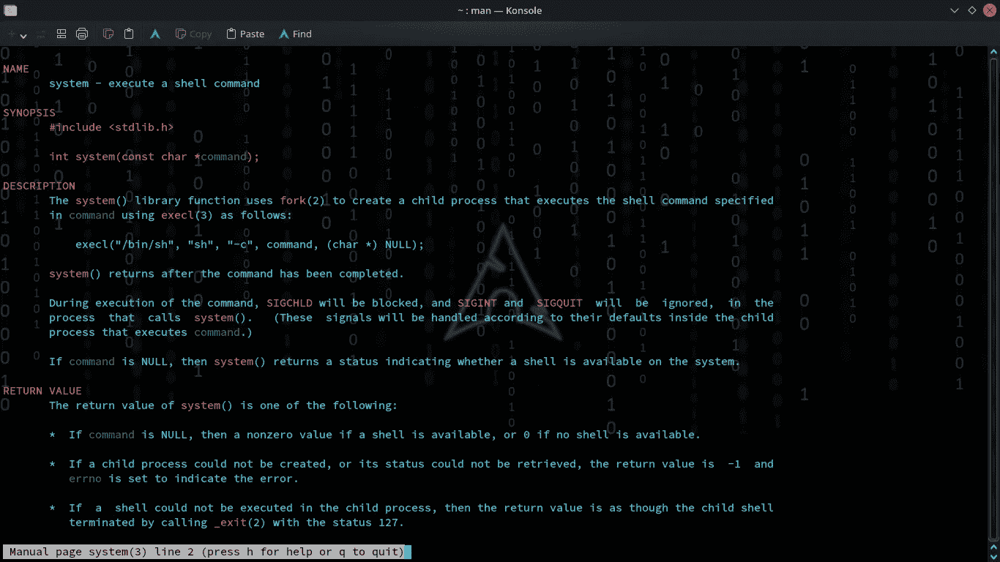

够了吗？；)

## 剥削的概念

> 当我们将返回指针覆盖到 system()函数的地址时，程序就会跳转到 system()函数。当命令参数被执行时我们传递的命令。我们希望易受攻击的程序产生外壳，所以我们让易受攻击的程序调用**系统("/bin/sh ")。**

## 例子

让我们举个例子。如果你注意到代码是我自己做的，让我的追求者了解情况，那就太理想了。**在“我们触及核心话题”之前，不要预测真实环境中的这种场景(这些都是公平的必需品)**

例子

函数溢出易受攻击。所以表演不要出错，让我们开始吧。

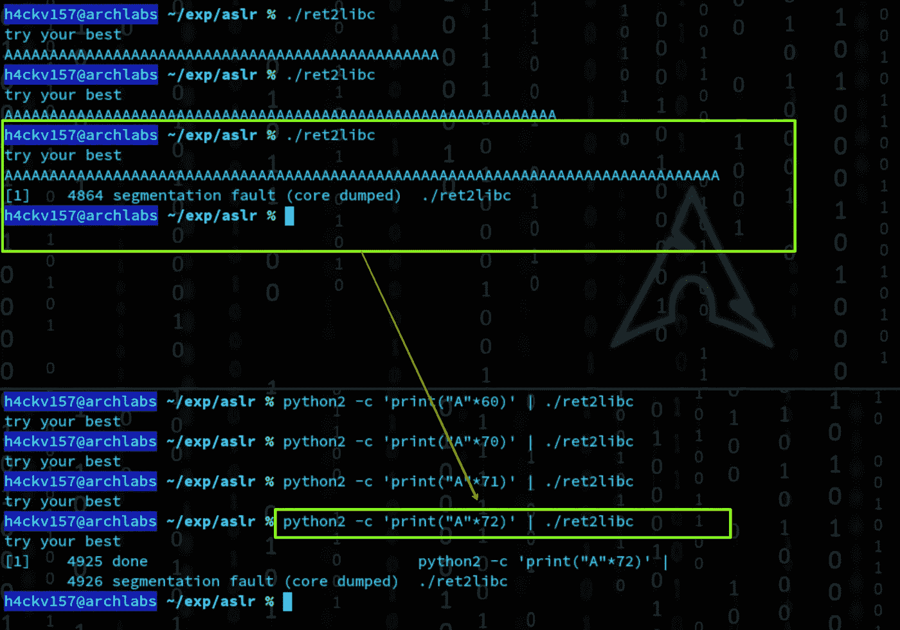

分段故障

> 万一你迷路了或没有得到什么，这意味着要么你没有覆盖基本的，否则，你没有贡献时间在前面的部分。

**分段故障**！！&通过 python 确定偏移量。现在是调试的时候了。

```
python2 -c 'print("A"*72)' > expgdb -q ./ret2libcr < exp
```

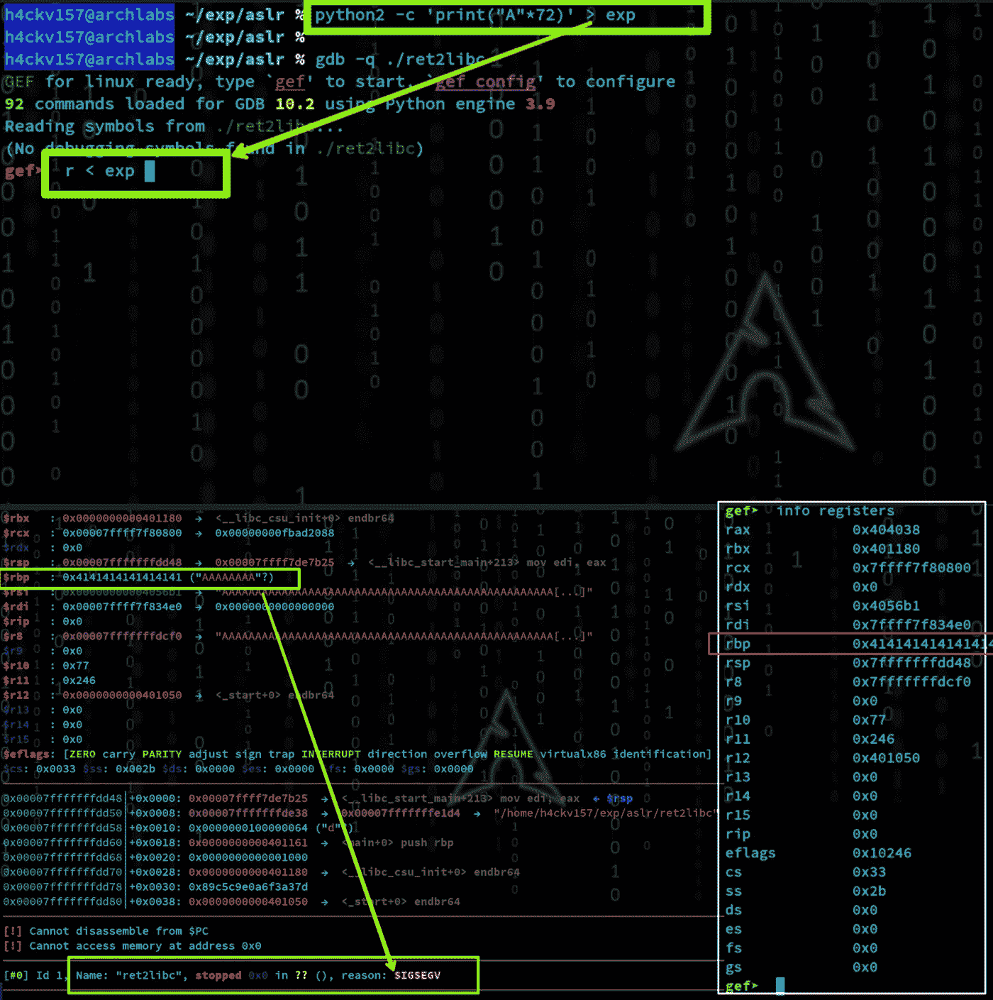

rbp 溢出

很明显，我们将控制指令指针 rip 来执行我们想要的指令。我在上面精确地美化了剥削的概念。我会让它发生的。首先，让我们使用 ldd 来发现 libc 的基址。

```
Cmd: **ldd** Ldd is a Linux command-line utility that’s utilized in case a user needs to know the shared library conditions of an executable or indeed that of a shared library. Itprints the shared objects (shared libraries) required by each program or shared object specified on the command line.
```

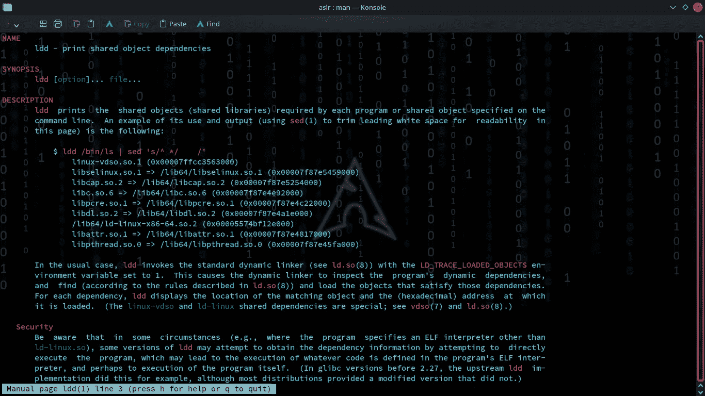

ldd

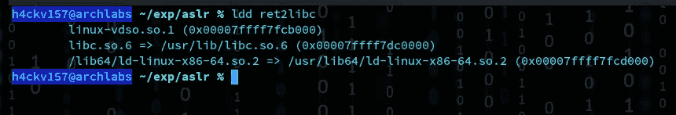

libc.so.6

这里我们得到了 libc 的基地址。现在让我们算出弹出 shell 的“系统函数”& argument“/bin/sh”的地址。

```
Cmd: **readelf***readelf is a program for displaying various information about object files on Unix-like systems such as objdump.*
```

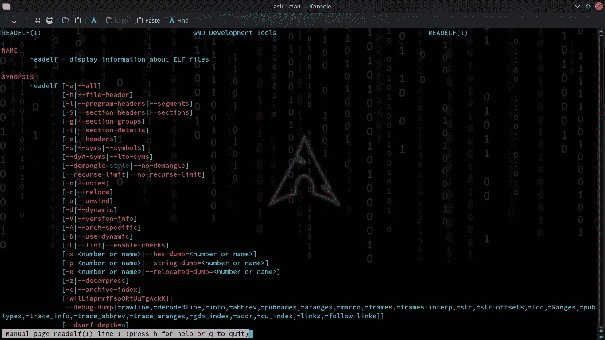

readelf

```
Cmd: **strings***It could be a complex task for a human to discover out content from an executable file. The binary files, such as program records, contain human-readable content. It basically focuses on determining the contents of and extricating content from the binary files.*
```

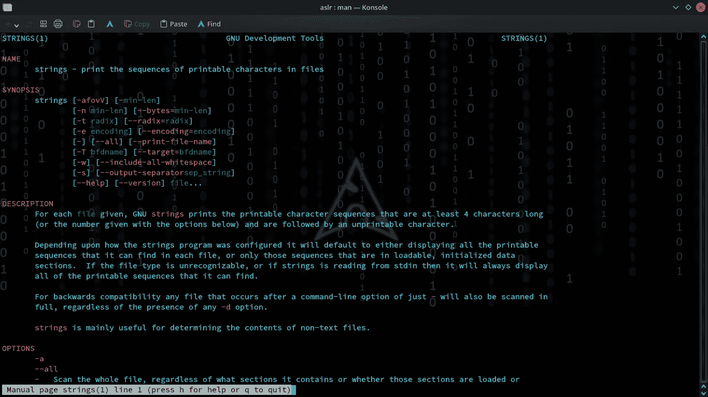

用线串

我们利用这些命令来查找“系统函数”的地址&参数“/bin/sh”&如果您对相应的标志有任何疑虑，请查阅 Linux 手册。

```
Cmd: **readelf -s /usr/lib/libc.so.6 | grep system**Cmd: **strings -a -t x /usr/lib/libc.so.6 | grep /bin/sh**
```

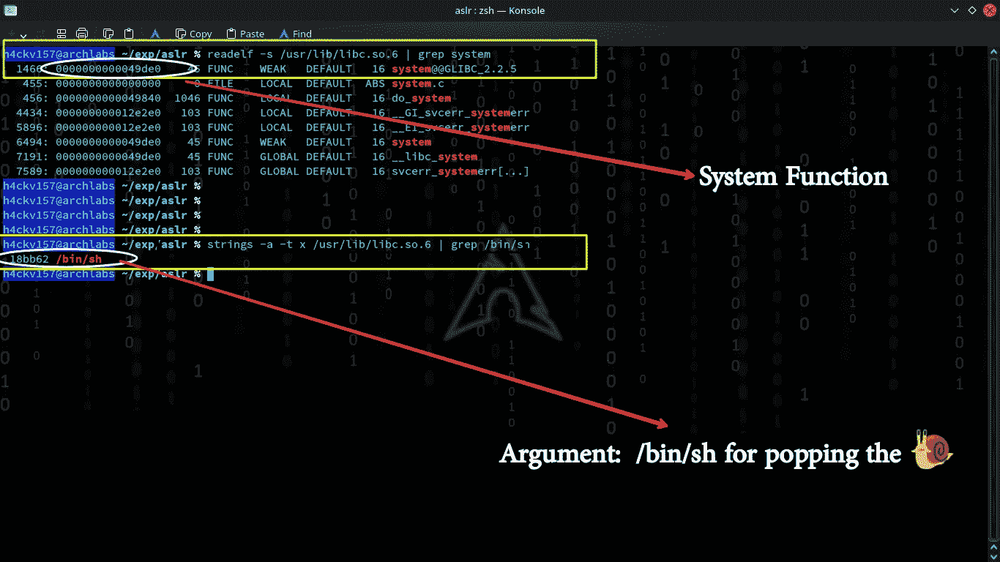

我们都拿到了:)

我们将利用二进制文件中的小汇编片段，称为“小工具”这些小工具通常从堆栈中弹出一个或多个寄存器，然后调用 ret。我们可以用这些小工具建立一个假的调用栈来连续执行它们，将我们控制的值弹出到寄存器中，然后跳转到系统结束(如第— > [0x000002](https://7h3h4ckv157.medium.com/?p=b4658238ee62) 部分所述)。

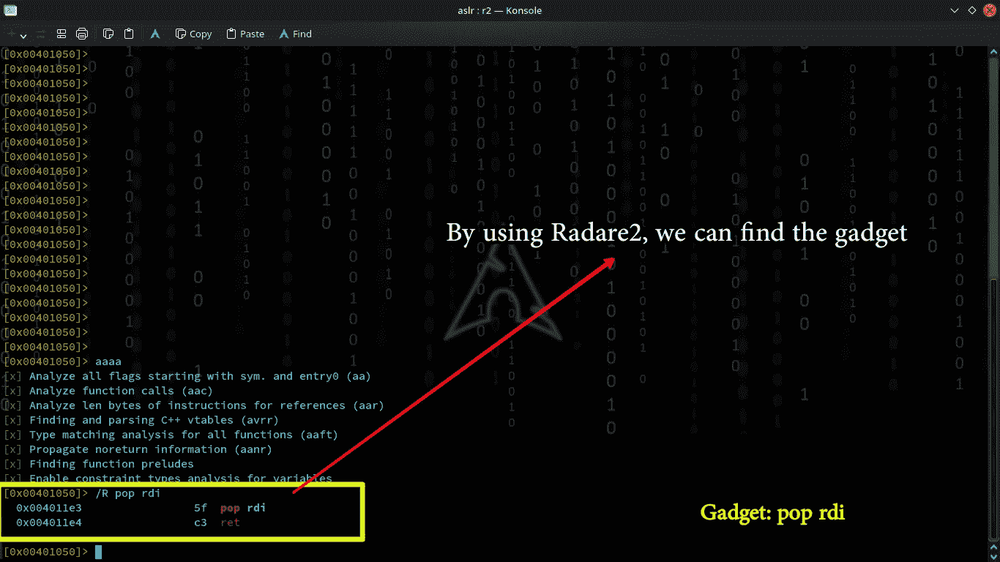

pop rdi

# **漏洞利用开发**

我们已经理解了一切需要剥削的东西。通过使用 python2，让我们开发我们的漏洞&弹出外壳:)

利用. py

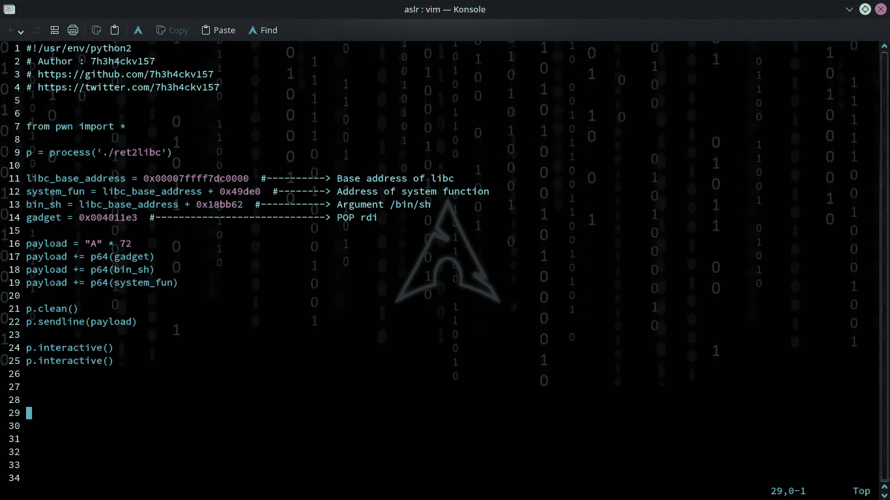

利用. py

理想情况下，我通过 python 编写了一个巧妙的利用脚本。现在让我们运行它。

> 耶！我们绕过了没有外壳代码的 NX。

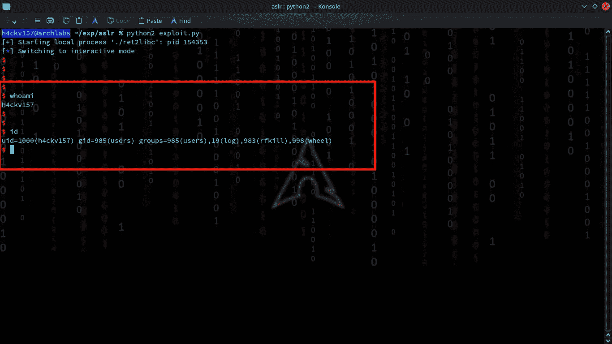

我们拿到壳了

> 这个策略成功了。稳定的外壳被弹出。我们有效绕过了 NX bit 的安全实现。

> 你是否遗漏了栈上的外壳代码注入？
> 大概你会觉得，即使我们注入，也因为 NX 位而弹出不了壳。

> *正如我常说的，* ***黑客永不言弃！***

# 功能介绍:mprotect()

```
*'m' for memory & 'protect' for protection*
```

映射内存区域，也称为共享内存区域，可以作为在进程间交换数据的大型池。在类 Unix 操作系统中， **mprotect()** 是一个 POSIX 系统调用，用于控制内存保护。mprotect()是一种保护功能。它为内存映射设置保护。

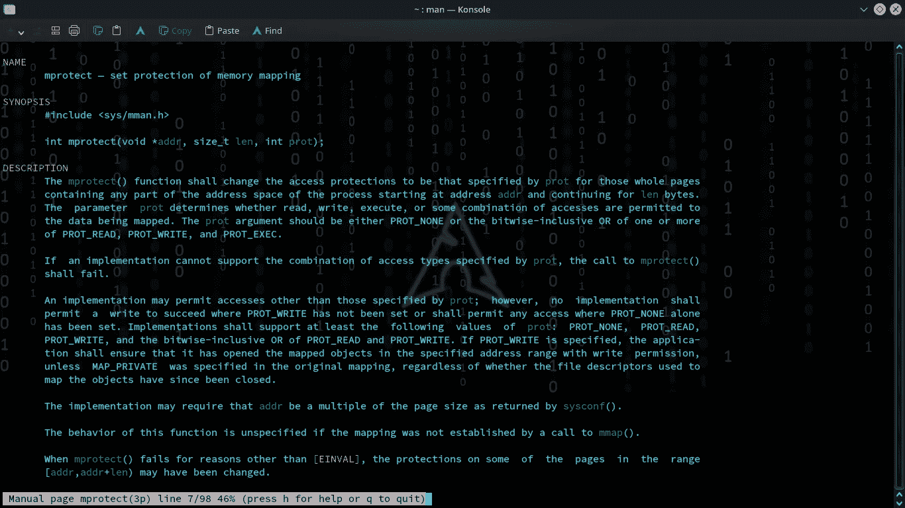

更多信息，请查阅 Linux 手册

## 摘要

```
***#include <sys/mman.h>*** ***int mprotect(void *addr, size_t len, int prot);*** 
```

## 使用的参数:

```
***addr***: *Is the starting address of the region for which the protection has to be changed.****len***: *Is the length of the region, in bytes, whose protection has to be changed*.***prot****: Is the desired protection of the memory mapped region.*
```

既然清楚了 addr & len，现在我们来谈谈 **prot** 。

mprotect()函数将访问保护更改为由 *prot* 指定的访问保护，用于包含从地址 *addr* 开始并延续到 *len* 字节的进程地址空间的任何部分的整个页面。参数 *prot* 指定是否允许对正在映射的数据进行读、写、执行或某种访问组合。

```
**PROT_NONE:** *The memory cannot be accessed at all.*

**PROT_READ:** *The memory can be read.*

**PROT_WRITE:** *The memory can be modified.*

**PROT_EXEC:** *The memory can be executed.*
```

# **剥削**

有许多技术可以通过使用 mprotect()函数来绕过 NX 堆栈。让我们通过在堆栈&上注入外壳代码来执行一个合适的区域。

```
*function:* **mprotect(void *addr, size_t len, int prot);**1\. Pass the stack address on ***addr**2\. The desirable size as **len** (here we choose stack length in hex)3\. Finally, **PROT_EXEC** has to be set in **prot** for making the selected area executable.**PROT_EXEC**: *The memory can be used to store instructions which can then be executed.*
```

> “--”
> “r-”
> “-w-”；
> “rw-”；
> “-x”；
> “r-x”；
> "-wx "；
> “rwx”；

所以我们需要在 **RDI** 寄存器中设置堆栈地址，在 **RSI** 寄存器中设置长度，在 **RDX** 寄存器中设置值 **0x7 (rwx)** 。(64 位的调用约定是 RDI、RSI 等中的参数……)

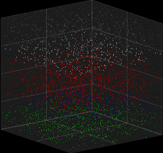

我们在这里已经讨论过: [0x000002](/into-the-art-of-binary-exploitation-0x000002-sorcery-of-rop-b4658238ee62)

*万一你看起来完全迷路了，没关系！需要时间去理解。尝试在技术层面进行概述，而不是记忆。*


> 我正在利用我们处理过的相同的二进制来阐述 ret2libc。所以是时候建立我们的功勋了。

*通过调试，可以发现 mprotect 的地址。*

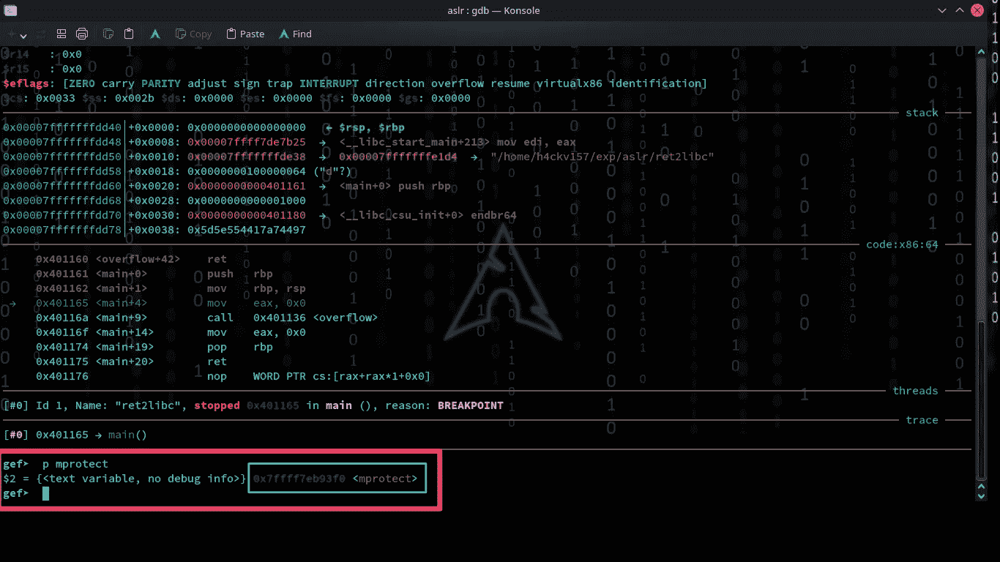

*堆栈地址必须在 addr 中传递。我们必须通过调试来检查堆栈。所有这些概念以前都讨论过。所以我要催一下题目。我们需要将堆栈地址放入 RDI 寄存器*

```
*The next step is to set* the length (len) in the **RSI** register and the value **0x7** (rwx) in the **RDX** register.
```

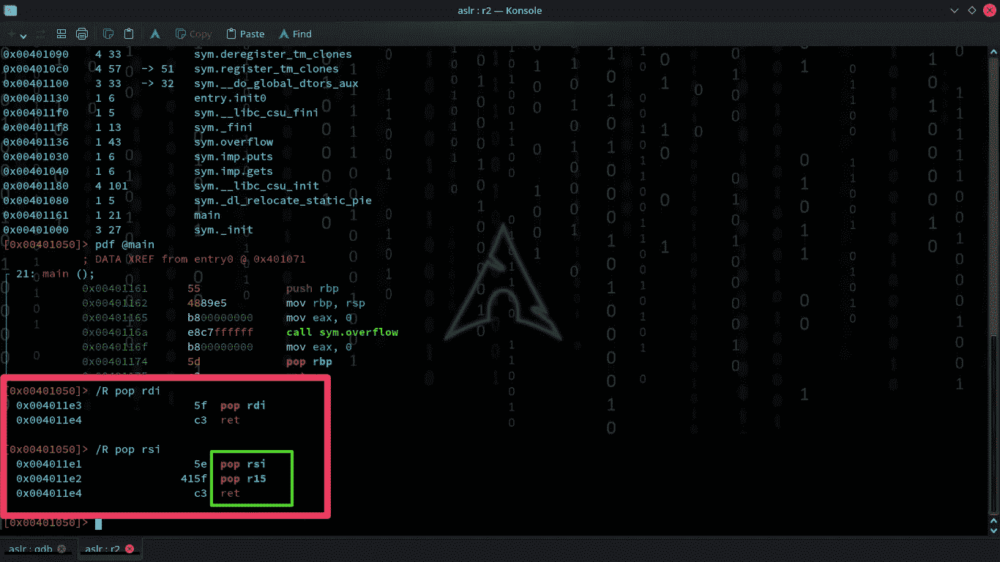

我通常利用 radare2 寻找 rdi、rsi 等简单的工具。

*在 ret 之前，pop rsi 小工具后面是 pop r15 指令。*

> 流行 rsi
> 流行 r15
> ret
> 
> 注:因此，我们必须构建一个漏洞，以丰富 r15 的垃圾。

利用 ldd，我们可以确定 libc 地址(已经检查过)。利用 [**ROPgadget**](https://github.com/JonathanSalwan/ROPgadget) ，能够发现小工具 RDX。(在我们的二进制文件中找不到 RDX，我们必须查看 libc)。

```
ROPgadget.py --binary <path-to-libc>  | grep "pop rdx ; ret"
```

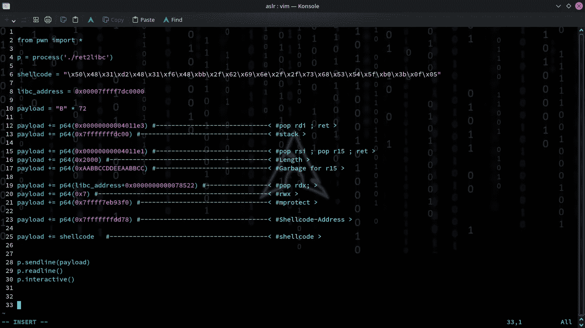

```
*By invoking the mprotect() function we made the stack zone executable & hence, we were able to infuse our shellcode. The rip pointed zone (shellcode) was then executed, and we got the shell.*
```

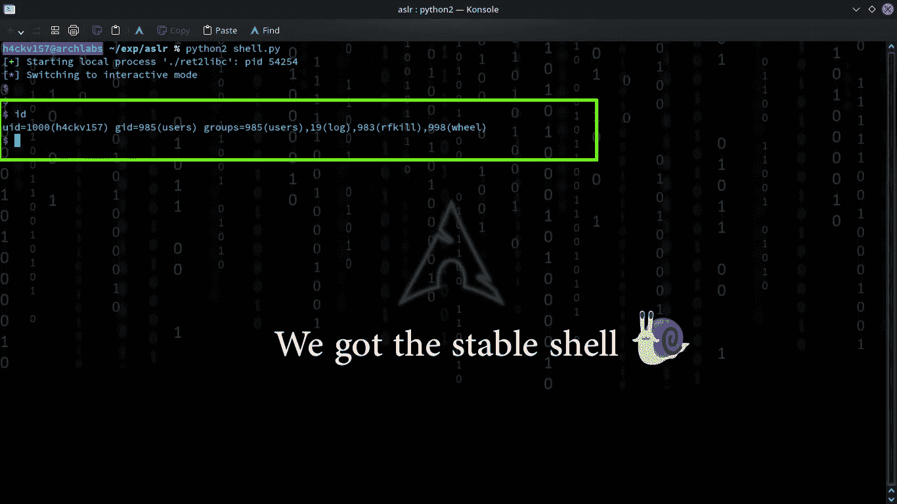

任务完成

*同样，我们可以通过其他技术弹出外壳*。 *NX 给出了几个级别的保证，但不是几吨。这在某种程度上限制了攻击者处理初始问题的灵活性，但是考虑到他可以利用这个漏洞来执行 shell，这就不太安全了。*


> 要吸取的教训:
> **NX 不能“单枪匹马”地保护一个程序不被利用。**


- NX RIP -

# 一切都结束了吗？有什么安全的编译吗？

> *没有所谓的“* ***安全编译*** *”有一些安全缓解措施，但根据漏洞的种类，您通常可以绕过它们。*

那都完成了吗？我们绕过所有的安全技术了吗？


好问题…

> 最简单的回答是:没有

# 强大的 ASLR

**地址空间布局随机化(ASLR)** 是一种计算机安全技术，旨在防止利用内存损坏漏洞。ASLR 随机编排进程关键数据范围的地址空间位置，包括可执行文件的基址和堆栈位置、加载和库，以阻止攻击者可靠地跳转。攻击者试图对 NX 启用的二进制文件执行 return-to-libc 攻击时，必须找到要执行的代码(就像我们之前绕过 NX 一样)。攻击者需要的位置是随机放置的，并且增加了安全性。如果攻击者不知道目标进程使用的地址，那么 ROP、ret-to-libc 和其他利用机制将会是疯狂的。


ASLR 概念

ASLR 在 64 位系统上工作得更好，因为这些系统提供了更大的熵(随机化潜力)。ASLR 通过随机化它使用的内存布局的偏移量，使攻击者更难成功执行缓冲区溢出攻击，从而增强了系统的控制流完整性。注意“checksec”不会把你牵连到 ASLR，因为保护是*机器*的属性，而不是*二进制*的属性。下面显示的命令将告诉您 ASLR 是否在您的系统上启用。

```
cat /proc/sys/kernel/randomize_va_spaceOutput0 = Disabled
1 = Conservative Randomization
2 = Full Randomization
```

> **“所以我们接下来的任务是绕过 NX+ASLR”**

> NX & ASLR 的浪漫创造了一个有影响力的债券内置保护。我们需要努力。一旦 ASLR 被绕过，使用面向返回的编程来利用 NX 通常是很简单的。

> 我们能做到吗？我们如何打破它…？

> 这需要一种实用的招魂术

*我不想把它写得太长，花时间在你的头上，所以暂时，我现在就结束这个话题。你需要花些力气来弄清楚事情是如何运作的。我个人也厌恶填鸭式喂养。在接下来的文章中，我将演示如何做到这一点。在那之前，保持好奇。别忘了和我联系。*

***我的推特*id:****@**[**7h 3 H4 ckv 157**](https://twitter.com/7h3h4ckv157)


待续..！！