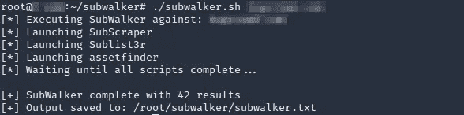

# Bug Bounty 自动化简介:Bash 工具链

> 原文：<https://infosecwriteups.com/intro-to-bug-bounty-automation-tool-chaining-with-bash-13e11348016f?source=collection_archive---------1----------------------->

Bash 脚本是一个简单的概念，它可以让 bug 赏金猎人自动化重复的任务，并在高级漏洞上花费更多的时间，通常会导致更高的回报。

工具链就是这样，使用 Bash 脚本来集成以预定义模式执行的多个工具。这篇文章讨论了工具链在 bug 赏金自动化中的使用，并介绍了一个新的枚举工具添加到你的侦查过程中！


卡斯帕·卡米尔·鲁宾在 [Unsplash](https://unsplash.com/s/photos/program?utm_source=unsplash&utm_medium=referral&utm_content=creditCopyText) 上的照片

## 介绍

自动化是 bug 赏金猎人的最新趋势，每天都有新的框架发布。这包括从具有用户界面和后端数据库的成熟解决方案到定制 Bash 脚本的集合。所有这些都有其用途，这取决于用户偏好的控制水平和测试深度。

bug bounty 自动化的一些明显优势包括:

*   轻松识别易受攻击的漏洞。
*   持续侦察以捕捉变化的环境。
*   通过自动化重复性任务最大化时间和利润。

## Bash 脚本

Bash 脚本可以很好地介绍自动化领域，因为它非常灵活。用户能够使用他们现有的工具和方法立即开始。无需构建框架的每个组件，只需添加最适合您流程的开源工具。这就是为什么这种方法也有利于不精通任何特定语言但了解被测试的基本技术的猎人。

Bash 的另一个好处是语言独立性。这使得猎人可以选择最适合的工具，而不用考虑底层的编程语言。我看到和使用的许多 bug bounty 工具都是用 Python 或 Go 编写的。Bash 允许两者都被执行、解析并合并到进一步的自动化过程中；假设所有工具和依赖项都已预装。

## 例子

例如，下面的脚本将使用[sub craper](https://github.com/m8sec/subscraper)执行子域枚举，并将结果传递给 [Tomnomnom 的 http probe](https://github.com/tomnomnom/httprobe)来检查活动主机。任何添加到 *out_of_scope.txt* 的地址或 DNS 名称将在主动枚举之前被删除，以遵守计划指南:

```
#!/usr/bin/env bash
#Usage: ./enum.sh domain(dot)comTARGET=$1
python3 subscraper.py $TARGET -o subdomains.txt
cat subdomains.txt |grep -v "$(cat out_of_scope.txt)"|httprobe
```

一个更复杂的实现来自 N [ahamsec 的 lazyrecon](https://github.com/nahamsec/lazyrecon) 。它使用 Bash 脚本链接各种工具和技术，在传统的 recon 过程中自动执行多个步骤。然后生成一个用户友好的 HTML 报告来显示结果数据。

## SubWalker【工具掉落！]

自动化的另一个意想不到的应用是提高精确度。范围内的每个 IP 地址和子域都是发现更多漏洞的机会。因此，我们希望确保我们的工具尽可能提供最准确、最全面的结果。

在最近的搜索中，我发现子域枚举工具的结果各不相同，甚至那些使用相似资源的工具也是如此。下面演示了三个针对同一个全域性程序的枚举工具，并比较了所识别的子域数量:


如您所见，结果的数量并不一致，并且因工具而异。因此，为了确保我得到最准确的结果，同时保持只运行一个命令的简单性，我创建了 [SubWalker](https://github.com/m8sec/SubWalker) ！

https://github.com/m8sec/SubWalker**地铁** - [地铁](https://github.com/m8sec/SubWalker)

Subwalker 是一个简单的 Bash 脚本，它链接了 3 个常见的子域枚举工具:[sub craper](https://github.com/m8r0wn/subscraper)、 [AssetFinder](https://github.com/tomnomnom/assetfinder) 和 [Sublist3r](https://github.com/aboul3la/Sublist3r) 。每个都同时执行以减少时间，并分析结果以提供一个没有重复的输出文件。该工具独特的计数技术允许将结果和重叠的结果结合起来，以确保准确性和有效性。假设每个工具都使用被动方法来收集信息，这种方法不会对目标域产生任何额外的干扰或开销。



**包装完毕**

值得注意的是，自动化不应该完全取代手工测试。通常只有通过手动分析和用户交互才能发现结果。然而，Bash 脚本是自动化重复任务的一个很好的方式，可以腾出时间花在更高级的发现上，这通常会带来更高的回报。

感谢阅读！在 [m8sec.dev](https://m8sec.dev/) 找到更多关于我的信息，并关注更多关于我的 bug bounty 旅程的文章。

*免责声明:所有内容仅用于教育目的。作者不对信息的使用负责。不要对你不拥有或没有明确许可的系统进行测试。*