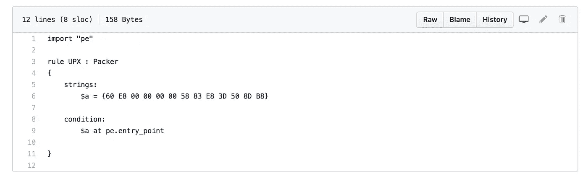

# 使用 YARA 检测恶意软件简介

> 原文：<https://infosecwriteups.com/intro-to-malware-detection-using-yara-eacab8373cf4?source=collection_archive---------0----------------------->

## 开始使用 YARA 检测恶意软件所需的一切


迈克尔·盖格在 [Unsplash](https://unsplash.com?utm_source=medium&utm_medium=referral) 上的照片

你有没有想过恶意软件是怎么检测出来的？恶意软件扫描器是如何工作的？Gmail 怎么知道你得到的可疑附件是“危险”的？

毕竟，恶意软件有各种形状和大小，没有一个特征可以告诉你一个文件是否会造成伤害。

# 如何检测恶意软件？

恶意软件检测通常通过识别已知恶意文件的某些特征来完成。

检测恶意软件的一种方法是计算可疑文件的哈希，并将其与已知恶意软件的哈希进行比较。

有时，防病毒软件会扫描文件中的特定字符串，以识别特定的恶意软件类型或整个系列。反病毒软件也可能搜索特定病毒或特洛伊木马的典型字节序列。

我们今天要讨论的工具，YARA，采用了后一种方法。让我们深入了解 YARA 如何检测恶意软件文件，如何安装和使用 YARA，以及如何为定制的恶意软件检测编写自己的 YARA 规则！

# 什么是 YARA？

YARA 是一种通过创建寻找某些特征的描述来识别恶意软件的工具。每个描述可以是文本或二进制模式。这些描述被称为“规则”。通过使用指定正则表达式模式的规则，YARA 能够检测文件中可能表明该文件是恶意的特定模式。

通过使用十六进制模式、纯文本模式、通配符、不区分大小写的字符串和特殊运算符，YARA 规则在检测各种恶意软件签名时可以变得非常多样和有效。

让我们看看下面的例子。(这里的例子摘自 https://yara.readthedocs.io/en/latest/[YARA 官方文件](https://yara.readthedocs.io/en/latest/))

```
rule silent_banker : banker
{
    meta:
        description = "This is just an example"
        threat_level = 3
        in_the_wild = true
    strings:
        $a = {6A 40 68 00 30 00 00 6A 14 8D 91}
        $b = {8D 4D B0 2B C1 83 C0 27 99 6A 4E 59 F7 F9}
        $c = "UVODFRYSIHLNWPEJXQZAKCBGMT"
    condition:
        $a or $b or $c
}
```

上述规则告诉 YARA，任何包含以下字符串之一的文件:

```
6A 40 68 00 30 00 00 6A 14 8D 91
8D 4D B0 2B C1 83 C0 27 99 6A 4E 59 F7 F9
"UVODFRYSIHLNWPEJXQZAKCBGMT"
```

应该被标记为沉默的银行家木马。注意，前两个字符串是十六进制模式，第三个是文本模式。

(静默银行家木马是一种木马病毒，它会从您的计算机中窃取银行凭证。点击了解更多信息[。)](https://cynmackley.com/2008/02/15/beware-of-the-silent-banker/)

# 安装 YARA

YARA 是多平台的，支持基于 Windows 和 Unix 的系统。您既可以将它用作命令行工具，也可以将其用作 Python 脚本中的 Python 扩展。

关于在不同平台上安装 YARA 和安装 Python 扩展的完整指南，请参考官方文档[这里](https://yara.readthedocs.io/en/latest/gettingstarted.html#compiling-and-installing-yara)。在本文中，让我们来看看如何从源代码 tarball 安装 YARA。

首先，下载 YARA 最新版本的 tarball，并为编译做好准备:

```
tar -zxf yara-3.11.0.tar.gz
cd yara-3.11.0
./bootstrap.sh
```

接下来，下载 YARA 需要的依赖项。你需要 **automake** 、 **libtool** 、 **make** 、 **gcc** 和 **pkg-config** 。

```
sudo apt-get install automake libtool make gcc pkg-config
```

接下来，编译并安装 YARA:

```
./configure
make
sudo make install
```

最后，通过运行测试用例，检查所有的东西都正确安装了:

```
make check
```

# 获取一组要使用的规则

虽然您可以编写自己的规则，但 Github 上有大量定义良好的 YARA 规则文件可供下载。

例如，您可以在 **awesome-yara** 存储库中找到已经编写好的 YARA 规则列表:

[](https://github.com/InQuest/awesome-yara) [## 审讯/真棒-亚拉

### 令人敬畏的 YARA 规则、工具和资源的精选列表。灵感来源于 awesome-python 和 awesome-php。YARA 是一个…

github.com](https://github.com/InQuest/awesome-yara) 

除了分析恶意软件，YARA 还可以用来分析文件的性质和分类文件内容。 **yara-forensics** 存储库包含通过检测神奇字节来确定文件类型的规则。

[](https://github.com/Xumeiquer/yara-forensics) [## Xu meiquer/yara-法医

### Yara 是恶意软件研究人员(和其他所有人)的模式匹配瑞士刀。基本上 Yara 允许我们扫描…

github.com](https://github.com/Xumeiquer/yara-forensics) 

您只需进入这些存储库，找到扫描您正在寻找的签名的规则，并使用该文件作为您的 YARA 命令输入。您可以使用以下命令在 Github 上下载一个规则文件主机:

```
curl -o FILENAME LINK_TO_FILE
```

其中 FILENAME 是下载文件将要保存的本地文件名，LINK_TO_FILE 是文件的在线地址。

## 下载特定的规则文件

例如，假设您想要使用 VirusTotal 的 [*sample.rules*](https://github.com/VirusTotal/yara/blob/master/sample.rules) 。

一旦你在 Github 上打开这个文件，你会看到一个这样的窗口:



当你点击右上角的“原始”链接时，该链接会将你带到存储路径 *sample.rules* 的 URL。在这种情况下，URL 是[https://raw . githubusercontent . com/virus total/yara/master/sample . rules](https://raw.githubusercontent.com/VirusTotal/yara/master/sample.rules)。

只需运行以下命令，将副本下载到您的计算机上:

```
curl -o Desktop/sample.yara [https://raw.githubusercontent.com/VirusTotal/yara/master/sample.rules](https://raw.githubusercontent.com/VirusTotal/yara/master/sample.rules)
```

现在，您的桌面上已经有了存储在 *sample.yara* 文件中的规则副本！

# 运行 YARA

要从命令行运行 YARA，请运行以下命令:

```
yara [OPTIONS] RULES_FILE TARGET
```

RULES_FILE 指向存储您要使用的 YARA 规则的文件，而 TARGET 指向要扫描的文件、文件夹或进程。

例如，让我们用 YARA 分析一个随机文件是否是 PDF！

我们首先需要从 **yara_forensics** 存储库中下载识别 PDF 的规则文件:

```
curl -o Desktop/pdf.yara [https://raw.githubusercontent.com/Xumeiquer/yara-forensics/master/file/pdf.yar](https://raw.githubusercontent.com/Xumeiquer/yara-forensics/master/file/pdf.yar)
```

然后，我们可以对想要分析的文件运行 YARA 规则:

```
yara Desktop/pdf.yara TARGET_FILE_TO_ANALYZE
```

# 如何编写自己的 YARA 规则

当然，如果你找不到网上发布的符合你需要的 YARA 规则，你就需要自己写规则了！

YarGen 是一个生成 YARA 规则的工具。给定恶意软件文件，YarGen 能够生成 YARA 规则。它通过识别在恶意软件文件中发现的字符串来生成 YARA 规则，同时也删除在非恶意文件中出现的已知字符串。YarGen 包括一个字符串和操作码的大型数据库，已知这些字符串和操作码也会出现在非恶意文件中。

您可以在 Github 上找到 YarGen:

[](https://github.com/Neo23x0/yarGen) [## Neo23x0/yarGen

### __ ______ ______/ ____/__ ____ / / / / __ `/ ___/ / __/ _ \/ __ \ / /_/ / /_/ / / / /_/ / __/ / / / \__, /\__,_/_/…

github.com](https://github.com/Neo23x0/yarGen) 

## 安装 YarGen

首先，在 Github 页面的[发布区](https://github.com/Neo23x0/yarGen/releases)下载 YarGen 的最新版本，并解压文件。源代码以 zip 文件或 tarball 的形式提供。

接下来，确保您已经安装了所有的依赖项。您可以运行以下命令:

```
sudo pip install pefile cdsudo pip install scandir lxml naiveBayesClassifier
```

最后，将 **cd** 放入 YarGen 目录并运行以下命令来下载内置数据库。数据库被保存到**中。/dbs** 子目录。

```
python yarGen.py —-update
```

## 运行 YarGen

YarGen 有许多规则生成选项。要查看命令行参数，请运行:

```
python yarGen.py —-help
```

要使用包含的数据库来生成规则，只需运行以下命令:

```
python yarGen.py -m PATH_TO_MALWARE_DIRECTORY
```

此命令将扫描 PATH_TO_MALWARE_DIRECTORY 下的恶意软件文件并为其创建规则。在当前目录中会创建一个名为 **yargen_rules.yar** 的文件，包含生成的规则。

# 祝你好运！

还有许多检测恶意软件的方法，但 YARA 是一种检测和分类许多不同类型的恶意文件的强大方法。祝你在使用 YARA 的旅途中好运！

感谢阅读。我错过了什么吗？随时让我在 Twitter 上知道:[https://twitter.com/vickieli7](https://twitter.com/vickieli7)。

[](https://twitter.com/vickieli7) [## 维基利

### vickieli 的最新推文(@ vickieli7)。书呆子的专业调查员。黑客和安全。创造上帝…

twitter.com](https://twitter.com/vickieli7) 

*关注* [*Infosec 报道*](https://medium.com/bugbountywriteup) *获取更多此类精彩报道。*

[](https://medium.com/bugbountywriteup) [## 信息安全报道

### 收集了世界上最好的黑客的文章，主题从 bug 奖金和 CTF 到 vulnhub…

medium.com](https://medium.com/bugbountywriteup)