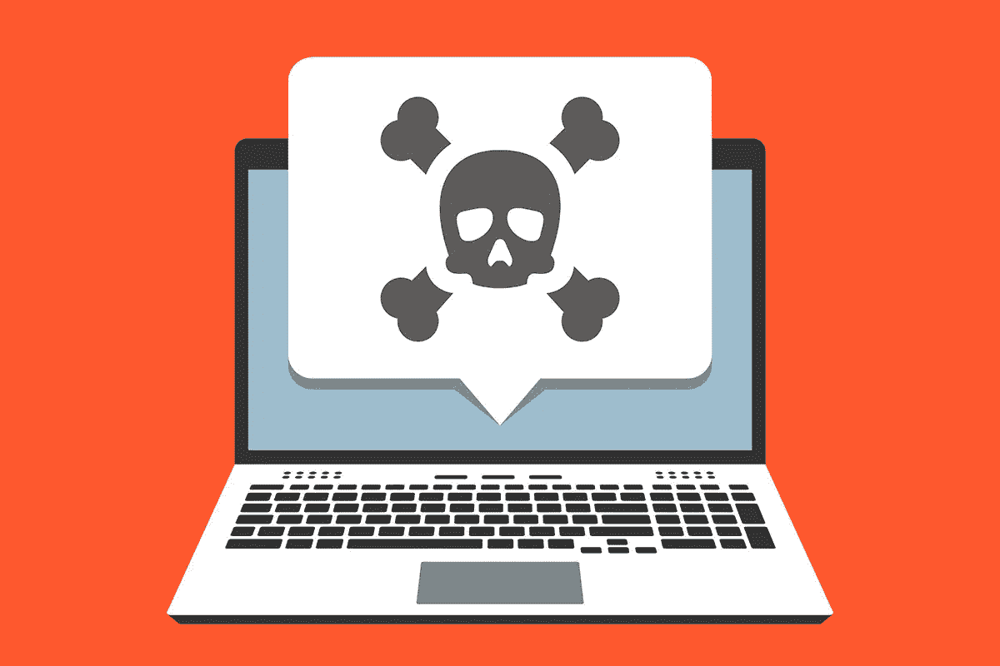

# 恶意软件及其类型介绍

> 原文：<https://infosecwriteups.com/intro-to-malware-its-types-94033dc9525f?source=collection_archive---------1----------------------->

我们经常混淆和混淆一些网络安全相关的术语，最终导致误解。各种类型的恶意软件也是如此，所有这些恶意软件彼此紧密相连，因为它们只有一个目标，即在有或没有用户交互的情况下，在系统或网络上执行一些恶意任务。在这篇文章中，我试图涵盖一些常见的恶意软件。我已经尽可能地让这变得简单，这样你们就不会忘乎所以，并对恶意软件及其类型有一个基本的了解。所以让我们开始吧

**恶意软件**

一个实际上被设计来执行一些恶意任务的软件。恶意软件被设计成能够在系统中删除、更改或创建后门，以获得对系统的未授权访问。病毒、蠕虫、木马等。所有这些都属于恶意软件的范畴。Mirai 未来组合恶意软件于 2016 年 8 月被发现。这种恶意软件将运行 Linux 的设备(主要是物联网设备)转变为僵尸网络，并以 IP 相机和家用路由器等 IP 设备为目标。一旦设备被感染，它们就会参与 DDOS 攻击。该恶意软件对被感染的所有者 Brains Kreb 的网站造成了大约 320，000 美元的损失。

**病毒**

病毒是一段恶意代码，它通过将自身附加到另一段可执行代码上来进行复制。当其他可执行代码运行时，病毒也执行并有机会感染其他文件并执行任何其他恶意操作。梅利莎病毒是 1999 年 3 月 26 日发现的一种群发邮件病毒。该病毒的目标是微软的 Word 宏和 outlook 系统。该病毒通过带有标记为重要内容的电子邮件感染系统，它包含一个文档，一旦打开就会显示明确的内容，同时向联系人列表中的 50 个用户生成相同的电子邮件。这种病毒造成了价值 8000 万美元的损失。

**虫**

蠕虫是试图进入网络和计算机系统的代码片段。一旦入侵发生，蠕虫将在受影响的系统上创建自己的新副本。Stuxnet 是 2010 年发现的一种影响伊朗核浓缩设施的计算机蠕虫病毒。Stuxnet 是一种复杂的蠕虫病毒，它利用了多个零日攻击漏洞。一旦系统被感染，它会寻找西门子制造的特定型号的 PLC，这些 PLC 专门用于核电站的铀浓缩。蠕虫改变了 PLC 程序，使得离心机以不规则的方式旋转，从而损坏正在使用的精密设备。这种蠕虫造成了价值 2430 亿美元的损失

**木马**

特洛伊木马是一种看似无害的软件，但实际上，它能够隐藏在众目睽睽之下，在受影响的系统上进行恶意活动。风暴蠕虫木马于 2007 年 1 月 17 日被发现。木马感染了使用微软操作系统的系统。特洛伊木马是通过包含特殊主题的电子邮件传播的，这些主题会诱使用户打开电子邮件，并且电子邮件中还附有一个 exe 文件。一旦被执行，计算机可能成为僵尸网络的一部分，或者容易受到远程攻击。它造成了 8000 万美元的损失。

**后门**

后门程序是一种软件，由黑客/对手安装，用于保持对系统的未授权访问，该系统最初是通过某种方式受到危害的。后门确保系统访问，即使初始访问丢失或被检测到。2019 年 12 月 28 日，在一个名为《塞勒姆镇》的游戏中发现了一个数据漏洞，影响了 780 万用户。用户手机上安装了后门程序，窃取了用于购买游戏高级功能的密码和信用卡信息

**间谍软件**

一种恶意软件，监视用户在系统上的活动，并在未经用户同意的情况下向远程位置发送信息。按键记录程序是最常见的间谍软件。Hammas 网络攻击者植入了 2014 年发现的针对军用移动设备的间谍软件。该间谍软件通过 Google play 商店的假冒应用程序传播，并被伪装成合法应用程序。一旦安装，间谍软件能够窃取军事数据。该间谍软件影响了 100 多名使用该应用程序的人

**Rootkit**

rootkit 是一种非法的恶意软件，在没有用户的情况下，knowledge 在系统上维护命令，并设计为在操作系统上执行不正常的操作。UEFI rootkit 是在 2018 年发现的，它基本上是在一个名为 LoJack 的正版软件中发现的，这是一个防盗软件。趋势科技将该 rootkit 命名为 LoJax。当 LoJax 被放入系统时，它提供系统操作系统的接口，并确保它在计算机加电时立即执行。即使卸载了目标操作系统，LoJax 仍保留在 UEFI 中。

**勒索软件**

一种恶意软件，对用户文件或系统文件进行加密，并要求以电子方式支付赎金，以便解密或以可读形式取回文件。Crypto locker 勒索软件于 2013 年 9 月 5 日首次被发现。Cryptolocker 使用了一种针对使用微软系统的特洛伊木马。该木马通过电子邮件发送，激活后使用 RSA 加密本地硬盘上的所有文件。crypto locker 勒索软件在被发现的一年中造成了超过 2700 万美元的损失

**犯罪软件**

恶意软件旨在使用恶意方式从用户处获取个人、财务或基于身份的信息，例如使用键盘记录器、社交工程等。犯罪软件通常以金融信息、银行账户、用户账户等为目标。Conficker 于 2008 年 11 月首次被检测到，目标是微软操作系统。它通过利用操作系统流和对管理员帐户执行字典攻击来传播。在发现恶意软件时，被感染计算机的总数估计为 1000 万到 1500 万

**Scareware**

Scareware 也是一种恶意软件，它通过恐吓人们面临的威胁(如系统中的安全问题或系统锁定)来迫使人们安装恶意的可执行文件。Scareware 然后引诱人们安装可执行文件，导致捕捉击键，以获取信用卡信息等。Spysheriff 发现在 2005 年本身是反间谍软件，它分发虚假的威胁给用户，用户感到害怕，并安装了该软件，造成对用户的恶意活动

**广告软件**

广告软件是不需要的软件，它在您的系统上显示弹出广告，主要是在 web 浏览器中。它可能将自己伪装成合法程序，并欺骗您安装它。2017 年发现的火球是网页浏览器劫持者。当它影响到您的系统时，它会接管系统的网络浏览器，将当前的网络浏览器变成一个虚假的搜索引擎，并向其投放大量广告。火球危害了全球 2.5 亿台电脑

**广告**

一种传播恶意软件的广告类型，将包含广告的恶意软件注入合法网站或在线广告中。2013 年，一场广告战影响了雅虎。该恶意软件使用跨站点脚本安装恶意程序，导致勒索软件攻击。这影响了全球使用雅虎的 69 亿用户

**文件较少的恶意软件**

不依赖任何文件并使用合法程序感染系统的恶意软件。它不会在硬盘上留下任何活动，并且基于内存，即 RAM。这些类型的恶意软件使用合法工具，因此很难阻止。2017 年发现的 Operation Cobalt Kitty 是一种 APT，它使用无文件恶意软件，使用鱼叉式网络钓鱼攻击作为初始 IOC(危害指标)，以组织高层管理人员为目标。APT 展示了使用自定义 power shell 有效负载的多个后门安装，旨在窃取专有商业信息。该 APT 的初步危害显示，包括域控制器在内的 40 台 PC 和服务器受到危害

**APT(高级持续威胁)**

高级持续威胁(APT)是一个宽泛的术语，用于描述一种攻击活动，在这种攻击活动中，入侵者或一组入侵者在网络上建立非法的长期存在，以挖掘高度敏感的数据。Ghostnet 于 2009 年 3 月被发现，被归类为 APT。包含特洛伊木马的电子邮件被发送到包含相关信息的组织。一旦木马被安装，它连接到 C2 服务器。C2 服务器发送指令下载名为 Ghost RAT 的特洛伊木马，使得攻击者能够实时访问运行 Microsoft OS 的系统。Ghostnet 每年造成 1000 多万美元的损失

**关于我**

我是一名网络安全爱好者，正在攻读信息安全硕士学位，并试图进入全职网络安全职业生涯。