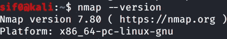
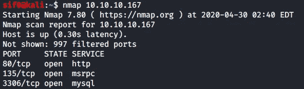
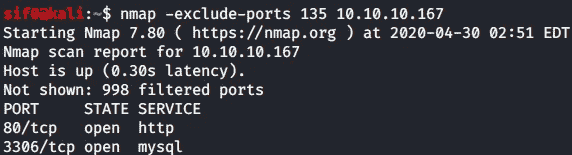
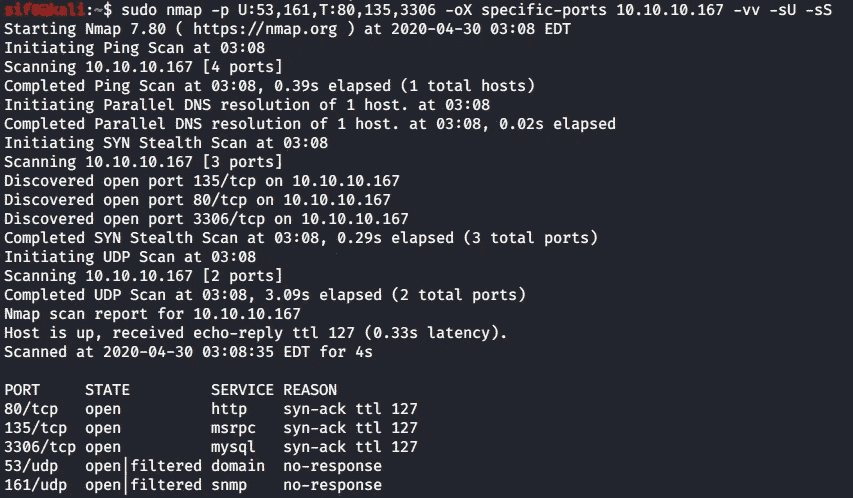

# Nmap 简介

> 原文：<https://infosecwriteups.com/intro-to-nmap-192c1796bb39?source=collection_archive---------0----------------------->

我决定写一些关于安全专家常用工具的文章。本系列的目标是介绍一个工具是如何工作的，它在哪里有用，并可能留下一些您可以采用的技巧。我将从一个名为 Nmap 的扫描工具开始。


[https://nmap.org/](https://nmap.org/)

**什么是 Nmap？**

来自官网，【https://nmap.org/】:

```
Nmap ("Network Mapper") is a free and open source ([license](https://nmap.org/data/COPYING)) utility for network discovery and security auditing.  Many systems and network administrators also find it useful for tasks such as network inventory, managing service upgrade schedules, and monitoring host or service uptime.
```

Nmap 的作者是戈登·费奥多·里昂。它的历史很有趣，你可以在这里查看:[https://nmap.org/book/history-future.html](https://nmap.org/book/history-future.html)。

## Nmap 与其他扫描器的区别在于:

Nmap 最好的一点是它是免费和开源的，非常灵活和通用。Nmap 通常用于确定网络中的活动主机、这些主机上的开放端口、这些开放端口上运行的服务以及该端口上该服务的版本标识。它还可以运行漏洞评估脚本来确定服务是否易受攻击。渗透测试人员可以使用它来识别开放端口，以收集有关目标的更多信息，或者安全管理员可以使用它来识别系统中未使用的开放端口。由于其实用性，安全社区长期以来一直认为 Nmap 是用于网络映射和主机识别的事实上的工具。

## 使用 Nmap:

如果你用的是 Kali Linux，Nmap 肯定是装的。您可以通过运行以下命令进行检查:

```
# nmap --version
```



如果您使用的是 Linux 的其他发行版，并且计划在不同的操作系统中安装 Nmap，那么您可以遵循本页的安装指南:[https://nmap.org/book/install.html](https://nmap.org/book/install.html)。

# Nmap 如何工作(从技术上讲可能不是正确的解释):

Nmap 的工作原理是向目标发送大量数据包，然后目标以特定的方式做出响应。例如，Nmap 可以向目标发送数据包，指定端口 80(通常是 HTTP 服务)。现在目标有了特定的响应，这对应于一种状态(打开、关闭、过滤)。如果端口是打开的，Nmap 根据响应识别正在运行的 HTTP 服务的类型(Apache、Nginx、IIS 等)。).然后，使用另一个检查来识别版本，并继续下去。

Nmap 有一个服务记录，它映射到对该类型请求的一种类型的响应，最终导致 Nmap 正确地确定什么服务及其版本。但是这并不是绝对可靠的，因为 Nmap 有时会将运行在该端口上的服务弄错(如果您没有使用标志进行更繁琐的检查的话)，因为该端口通常用于特定的服务。**注意**Nmap 扫描最好以管理员或 root 权限运行，因为 Nmap 发送原始数据包，而作为特权用户是发送原始数据包的要求(因为它们远低于 OSI 模型)。

# Nmap 语法:

现在，在我开始举例之前，我想分解一下 Nmap 语法通常是如何构造的，因为记住这一点是很好的做法。虽然根据我的经验，标志的顺序在大多数时候并不重要(有些情况下是如此)。事实上，要进行扫描，Nmap 只需要一个目标。这种格式不明确，也不是必需的，但是根据文档，Nmap 遵循以下格式:

```
nmap [scan type] [options] [target specification]
```

我将以上述格式提供每个字段的简短分类。

## 常见的 Nmap 扫描类型:

Nmap 根据您的需要有各种扫描类型。常见的有 SYN 扫描(-sS)、TCP 连接扫描(-sT)、UDP 扫描(-sU)。请注意，SYN 扫描和 TCP 扫描利用了[三次握手](https://www.geeksforgeeks.org/tcp-3-way-handshake-process/):

1.  **SYN 扫描** (-sS)通过向目标发送“SYN”来识别要打开的端口。如果它收到 SYN-ACK 或 SYN，它会将该端口标记为开放。如果它收到一个“RST”，它将端口标记为已过滤。
2.  **TCP 扫描** (-sT)通过等待三次握手的完成来识别要打开的端口。
3.  **UDP 扫描** (-sU)对于识别目标上开放的 UDP 端口非常有用。它将特定的 UDP 数据包发送到已知的 UDP 端口。

## 常见 Nmap 选项:

Nmap 有大量的选项，取决于你的扫描需要什么。基本上，您应该使用以下内容:

1.  **将您的 Nmap 扫描保存到文件。** Nmap 可以分别使用-oN、-oX 和-oG 标志以 3 种格式(普通输出、XML 输出和 greppable 输出)保存您的扫描。如果您想以所有格式保存它，请使用-oA 标志。还有一个-oS 标志，它以脚本 kidde 或“l33t speak”格式输出您的扫描。
2.  **添加详细度标志。** Nmap 可以选择使用(-v)标志打印出更多信息。您可以通过将扫描期间的结果打印到标准输出(-vv，-vvv 或-v2，-v3)来增加详细程度(例如，已识别的开放端口、扫描问题等。).您也可以使用原因标志(双划线原因)。这些标志有助于您计划下一步要做什么，因为 Nmap 在扫描后才会显示其结果，所以您已经有了初步数据。
3.  **利用计时选项。**您可以使用其中一个标志-T0、-T1、-T2、-T3、-T4、-T5 来使用适合您目的的计时模板，这些标志分别代表偏执、鬼鬼祟祟、彬彬有礼、正常、好斗和疯狂。这些模板决定了扫描的积极程度，并且根据您所在网络的带宽和资源而定。-T0 和-T1 扫描对 IDS 规避有用，但可能太慢。当没有提到这些标志时，T3 或 normal 是 Nmap 的默认行为。

## 通用 Nmap 目标规范:

Nmap 允许各种目标规格，但可以简单的分为两部分:**端口**和 **IP/host** 。

1.  Nmap 允许使用“**-p”**标志的**端口规范**。您可以为特定协议指定单个端口、端口范围、排除的端口和端口:

```
# Specifying a single port(port 21):
nmap -p21 10.10.10.10
# Specifying a port range(port 21 to 1000):
nmap -p21-1000 10.10.10.10
# Specifying a port range but exclude port 22:
nmap -p21-1000 -exclude-ports 22 10.10.10.10
# Specifying a TCP-specific or UDP-specific port:
# nmap -sU -sS -p T:21,22,25,80,U:53,161 10.10.10.10 
```

**注意:**要同时扫描特定于 TCP 和特定于 UDP 的端口，需要存在-sU 标志，并且至少有一种 TCP 扫描类型(-sT、-sF 或-sS)

2.Nmap 接受**主机名、IP 地址、网络范围**、**等。**您还可以使用-iL 标志为其提供一个文件，其中包含 IP 地址或网络列表。它还允许您从目标中排除特定的主机或网络:

```
# Scanning a specific hostname:
nmap target.domain.com 
# Scanning a specific IP address:
nmap 10.10.10.10
# Scanning a network range:
nmap 10.10.10.1-254 or nmap 10.10.10.0/24
# Scanning a network range but exclude few IP addresses:
nmap 10.10.10.0/24 --exclude 10.10.10.167
```

**注意:**如果不指定特定端口，Nmap 会扫描最常用的前 1000 个 TCP 端口。

# 将所有这些放在一起:

以下是 Nmap 使用的几个具体示例:

```
Scanning an IP address with no flags used:
```



它提到了前 1000 个 TCP 端口中，997 个被过滤，其中 3 个是开放的。Nmap 能够识别端口 80 运行 http，135 运行 msrpc，3306 运行 mysql。

```
Scanning an IP address but excluding a specific TCP port:
```



扫描同一个主机，扫描输出只找到 2 个端口，因为我故意跳过了端口 135。

```
Scanning an IP address targeting a specific TCP and UDP port and saving it to a XML file called “specific-ports” with verbosity of level 2:
```



我能够扫描 TCP 和 UDP 端口，并在扫描仍在运行时得到一个部分已打开的通知，并将它保存到一个 XML 文件中以备将来使用。

## 总结:

Nmap 是一个非常有用的工具，不仅对于安全专业人员，而且对于 IT 从业者，因为它的多功能性。🍻🍻