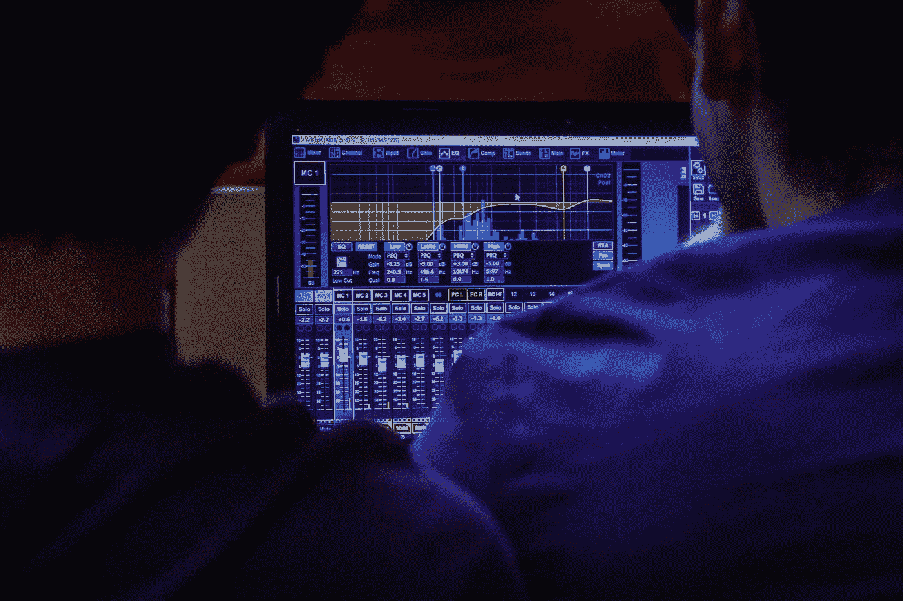
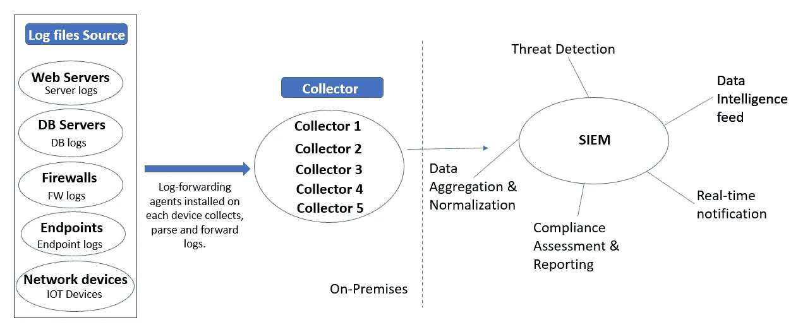
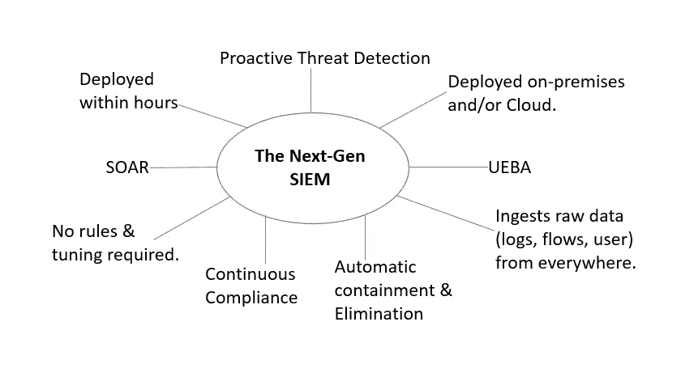
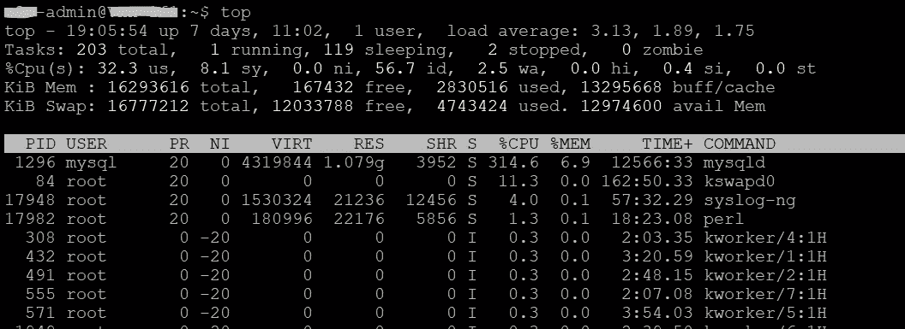
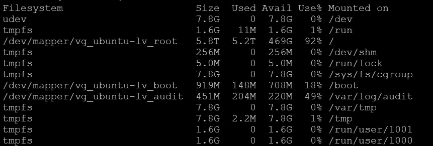
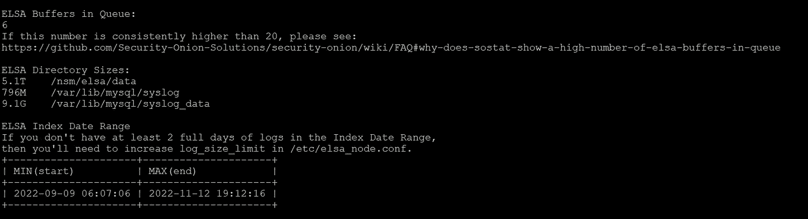

# SIEM 收集器问题疑难解答

> 原文：<https://infosecwriteups.com/intro-to-troubleshooting-siem-collector-issues-be92d01d19a6?source=collection_archive---------1----------------------->

## 蓝队足球活动

**安全信息&事件管理(SIEM)** 提供安全事件的整合视图，并对潜在威胁立即做出响应。

市场上有几家 SIEM 提供商。一些已知的有:微软 Azure Sentinel，IBM，LogRhythm，Splunk，AlienVault 等。



由 [Jametlene Reskp](https://unsplash.com/@reskp?utm_source=medium&utm_medium=referral) 在 [Unsplash](https://unsplash.com?utm_source=medium&utm_medium=referral) 上拍摄的照片

## 什么是收藏家？

Collector 只是一个用于从源收集日志并将其转发给 SIEM 的设备。每个设备上安装的日志转发代理用于促进源和收集器之间的收集。



高级 SIEM 体系结构流程图



安全分析师角色的其中一项任务可能要求您对一些基本的 SIEM 收集器相关问题进行故障排除。这包括:

*   收集器高磁盘使用率
*   自动关闭规则(ACR)无法关闭警报
*   原木损失
*   收集器索引范围预警
*   查询 API 和统计 API 问题
*   任务运行者问题
*   SIEM 离线—红灯警报！

## 收集器问题疑难解答

如果收集器运行的是 Linux 操作系统，那么登录到收集器后，使用下面显示的命令进行查询。

*   **检查收集器的健康状态**

分析师应该执行的另一项检查是收集器的“健康状态”——这可以通过查询以下内容来查找任何潜在的问题。

```
df -h ##check for any high disk volume usage
sudo sostat #check for buffer queue and index date range
top #check what's using the processor and memory
```

*   **高 CPU 使用率**

当关于日志收集器超过平均阈值的警报触发时，通过登录到该收集器的设备(*大概是 linux 操作系统*)并运行以下命令进行调查:

```
top #check what's using the processor and memory
#Restart any services to resolve the issue.
```



**顶部**

*   **高磁盘使用率**

如果日志收集器已达到超过 95%的临界阈值，请重新启动主机以清除一些磁盘空间并稳定磁盘使用水平。

```
df -h #check for any high disk volume usage
#Reboot Host, wait for sometime and then check the disk space status again.
```



**df -h**

*   **解决 ACR 问题**

使用以下工具定位停滞的作业(正在运行的流程):

```
ps aux | grep <proc_name>
```

如果 ACR 脚本运行超过 10 分钟，则尝试使用以下步骤重新启动它:

```
ps aux | grep <autoclose script> #Search PID for autoclose script
kill -9 <PID> #Kill the process. The service should then re-start on its own
```

*   **调查日志丢失(LoL)问题—查询每小时日志计数**

如果收集器未能在规则中定义的设定时间内接收到事件日志，则会触发该规则。然后为该问题创建警报。

```
In SIEM, select the specific collector that is not receiving the logs. Now run the query against that collector to return the list of Azure Security logs received per hour. This allows analyst to see when the last log was received.
```

*   **收集器索引范围警报**

```
sudo sostat #check for buffer queue and index date range
```



**sudo sostat**

*   **解析查询 API 和统计 API**

不正常的查询 API 和统计 API 表示 web 服务器暂时不可用。这可以通过运行以下命令来解决:

```
systemctl status <webserver i.e. apache2> #check the status of the webserver.
systemctl restart <webserver i.e. apache2> #restart the webserver
```

那都是乡亲们！

## 来自 Infosec 的报道:Infosec 每天都有很多内容，很难跟上。[加入我们的每周简讯](https://weekly.infosecwriteups.com/)以 5 篇文章、4 条线索、3 个视频、2 个 GitHub Repos 和工具以及 1 个工作提醒的形式免费获取所有最新的 Infosec 趋势！