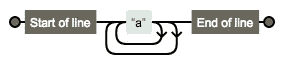
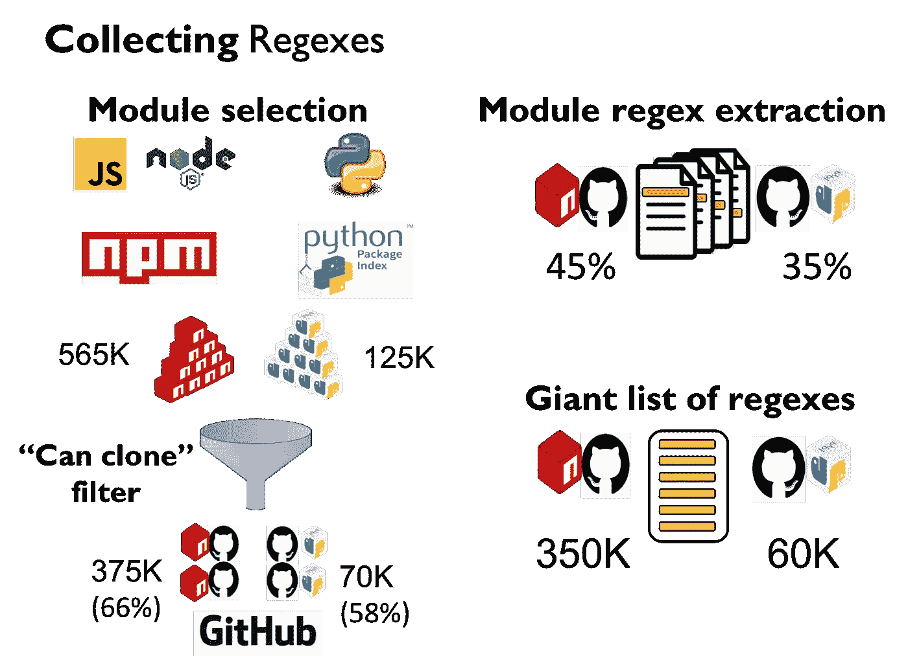
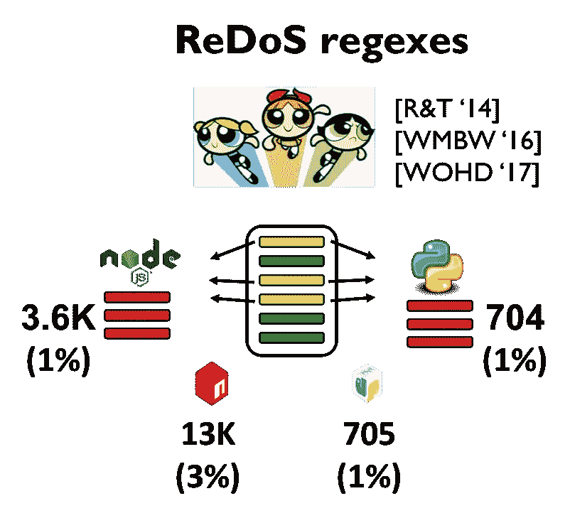
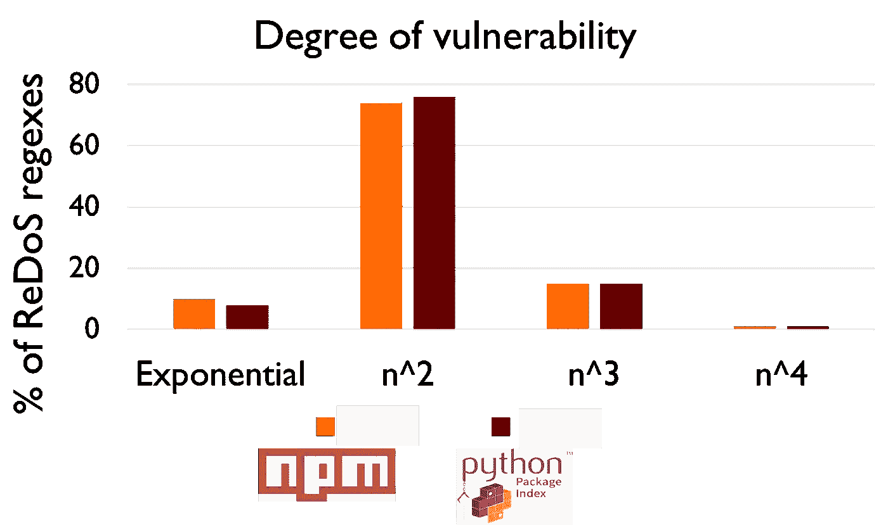
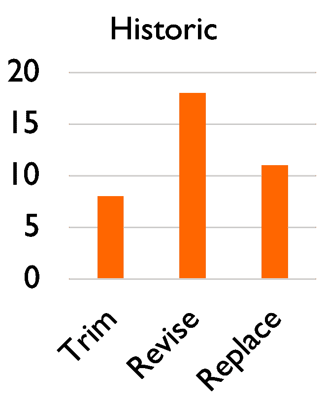

# 正则表达式拒绝服务在实践中的影响

> 原文：<https://infosecwriteups.com/introduction-987fdc4c7b0?source=collection_archive---------0----------------------->

这是 2018 年在 ESEC/FSE 发表的研究论文 [*【正则表达式拒绝服务(REDOS)在实践中的影响:生态系统规模的实证研究*](http://people.cs.vt.edu/~davisjam/downloads/publications/DavisCoghlanServantLee-EcosystemREDOS-ESECFSE18.pdf) *e，*的简介。我是第一作者；Christy Coghlan 、 [Francisco Servant](http://people.cs.vt.edu/fservant/) 和 [Dongyoon Lee](http://people.cs.vt.edu/dongyoon/) 组成了团队。

如果你想了解 ReDoS，请看我的 [ReDoS 备忘单](https://levelup.gitconnected.com/the-regular-expression-denial-of-service-redos-cheat-sheet-a78d0ed7d865)。

# 摘要

开发人员将正则表达式(*regexe*)用于许多目的。有时这可能会通过*正则表达式拒绝服务(ReDoS)* 导致安全漏洞。正则表达式通常用在面向客户端的 web 服务器中，作为输入验证步骤。例如，正则表达式是回答问题“我刚从客户端得到的字符串看起来像电子邮件吗？”以这种方式使用时，正则表达式匹配在不受信任的输入上快速运行是很重要的。

不幸的是，先前的研究表明，一些正则表达式匹配在输入长度上具有多项式甚至指数复杂性。这种不良行为要求程序对不受信任的输入执行“ *ReDoS regex* ”。尽管不受信任的输入在 web 领域很常见，但是 ReDoS 正则表达式有多常见呢？

在这个项目中，我们研究了 ReDoS 正则表达式在实践中的发生率。简而言之，我们:

*   从大约 500，000 个 npm 和 pypi 模块中提取了大约 400，000 个唯一的正则表达式；
*   确定了这些正则表达式中有多少是 ReDoS 正则表达式(~1%)*(见底部后续)；
*   测量它们的复杂性(大多数是二次的，在典型的台式计算机上大约 10K 字符时开始缓慢执行)；
*   标签化的普通正则表达式系列(我们有数百个不同的正则表达式来识别电子邮件！);
*   探索了启发式方法识别 ReDoS 正则表达式的有效性(大量误报)；和
*   研究了开发人员如何修复 ReDoS 正则表达式(修剪、修改或替换)。

# 介绍

正则表达式( *regexes* )是文本处理的便捷工具。人们使用它们进行输入验证。例如，问题“用户输入的字符串看起来像电子邮件吗？”可以使用正则表达式来回答。

因为正则表达式通常被认为非常有用，所以它们被内置到大多数现代编程语言中。每种编程语言都有自己的*正则表达式引擎*，它接受一个正则表达式和一个字符串，并决定正则表达式*是否匹配字符串*。

事实证明，判断一个正则表达式是否匹配一个字符串的代价是很高的。大多数编程语言中的正则表达式匹配具有最坏情况下的指数复杂度，也可以具有多项式复杂度(二次、三次等。).

# 正则表达式拒绝服务(ReDoS)

当这些昂贵的正则表达式匹配之一被恶意方触发时，它可能导致正则表达式拒绝服务(ReDoS)。如果计算资源可以转移到昂贵的正则表达式匹配，而不是合法用户，这将拒绝合法用户的服务。

自 20 世纪 70 年代以来，学术界一直在讨论这种类型的昂贵行为，据我所知，它与 web 安全问题的相关性在 2003 年首次被注意到。然而，还没有大规模的野外红学研究，我一直认为这是一个学术上的小把戏，而不是实践中的严重问题。然而，在我的[时间感](https://medium.com/@davisjam/a-sense-of-time-for-javascript-and-node-js-68c9114f5d48)项目中，我惊讶地发现 npm 中报告的安全漏洞中大约有 10%是 ReDoS 漏洞。这让我想知道 ReDoS 在实践中是否是一个严重的问题。

## ReDoS regex 示例 1:来自微软的指数用户名

在一些探索性的工作中，我们在微软的一个项目中发现了这个正则表达式。它用于匹配 Windows 用户名。

```
*/^[a-zA-Z0–9]+([._]?[a-zA-Z0–9]+)*$/*
```

在许多语言中，这个正则表达式对输入“aaa…aaa！”是指数的。这里有一个你可以在 Node.js 中尝试的例子:

```
*/^[a-zA-Z0–9]+([._]?[a-zA-Z0–9]+)*$/.exec('a'.repeat(100) + '!')*
```

## ReDoS regex 示例 Django 中的二次电子邮件

我们在姜戈找到了这个正则表达式。它被用来匹配邮件。

```
/^\S+@\S+\.\S+$/
```

在许多语言中，这个正则表达式对于输入“@@@…@@”是二次的。这里有一个你可以在 Node.js 中尝试的例子:

```
/^\S+@\S+\.\S+$/.exec('@'.repeat(100000))
```

## 为什么这些正则表达式匹配需要这么长时间？

大多数正则表达式引擎使用一种简单的回溯算法，其工作原理如下:

*   像你期望的那样匹配字符。
*   任何时候你有选择，尝试一条路。如果不行，以后再试试另一个。
*   如果找到匹配，返回成功。

这种算法意味着，如果有超过线性数量的可能路径要尝试，那么正则表达式引擎将花费超过线性的时间。

下面是一个最坏情况指数行为的正则表达式示例。这是上面显示的用户名的 Microsoft regex 的简化版本。



/^(的铁路图？:a+)+$/。由[https://regexper.com](https://regexper.com/)生成

让我们想想它在字符串“aaa！”上的行为。

*   每当正则表达式引擎看到一个“a”时，它可以从“a”顶点获取内部循环或外部循环。
*   这意味着，它看到的每一个“a”都会使它在不匹配时尝试的路径数量增加一倍:“它已经尝试的所有路径，然后是这个特定“a”上的内部循环或外部循环”。
*   最后的“！”确保正则表达式引擎不会沿着这些路径找到匹配项。
*   所以有了三个 a，我们有 2*2*2 条路可以走。如果我们添加另一个“a”，我们将有(2*2*2)*2 条路径可以尝试。对于这种形式的输入，行为将是“a”数量的指数。

# 收集正则表达式

正如我前面提到的，在我之前研究了 npm 模块中的拒绝服务攻击之后，我对大量 ReDoS 正则表达式的可能性持怀疑态度。为了检查 ReDoS 正则表达式在野外有多普遍，我们首先收集了我们能得到的所有正则表达式。

该图显示了我们如何收集正则表达式进行分析。

*   获取 npm (JavaScript)和 pypi (Python)注册表中所有模块的列表。
*   保留那些我们可以克隆的存储库。
*   从 JavaScript (npm)和 Python (pypi)文件中静态提取正则表达式。我们发现正则表达式被广泛使用:我们研究的 45%的 npm 模块和 35%的 pypi 模块至少包含一个正则表达式。
*   减少到(巨大的)唯一正则表达式列表。



正则表达式收集过程

# 识别 ReDoS 正则表达式

该图显示了我们如何从庞大的正则表达式列表(“语料库”)中识别 ReDoS 正则表达式。

*   应用 ReDoS 正则表达式检测器(见[此处](https://github.com/davisjam/vuln-regex-detector)为驱动程序)。
*   在感兴趣的语言中动态验证他们认为危险的正则表达式(NPM→node . js；pypi → Python)。
*   确定有多少模块在其 GitHub/etc 中包含这些正则表达式。项目。

我们在 npm 和 pypi 中发现了类似的结果。



我们如何识别 ReDoS 正则表达式

## 我们在显著的地方发现了 ReDoS 正则表达式

我们找到了 ReDoS 正则表达式(eek！)在:

*   MongoDB
*   哈比神
*   姜戈

我们也找到了他们(双 eek！)在:

*   Node.js 核心库
*   Python 核心库

令人高兴的是，所有这些问题现在都得到了解决。

# ReDoS 正则表达式有多脆弱？

对于不同大小的输入，我们计算了正则表达式引擎对这些 ReDoS 正则表达式执行正则表达式匹配所花费的时间。大多数正则表达式都有二次复杂度。一些是指数或立方的。

同样，我们在 npm 和 pypi 中发现了相似的结果。



ReDoS 正则表达式的漏洞程度

# 大家是怎么修复 ReDoS 正则表达式的？

我们想了解人们在代码中识别 ReDoS 正则表达式后是如何修复它们的。我们查看了在 [CVE](http://cve.mitre.org/) 和 [Snyk.io](https://snyk.io/) 数据库中报告的 37 个 ReDoS 漏洞的修复程序。

开发人员使用三种策略之一:

*   **Trim** 不要碰正则表达式。只需修剪输入，使其不要太长，从而限制最坏情况的行为。只要(1)合法输入不应该“太长”(例如 500 个字符)，这就可以了。);以及(2)最坏情况的行为不是指数的。
*   **修改**调整正则表达式，使它不再容易被重做，但它仍然匹配同一种语言。或者类似的。要小心——我们看到了几个案例，其中修改后的正则表达式对于一种输入变得安全，但是对于新样式的输入却很脆弱。
*   **替换**用字符串操作替换正则表达式。



开发人员如何修复重做正则表达式

然后，我们向 284 个项目发送了漏洞披露，描述了其中可能存在的重做正则表达式。其中 48 个项目给出了修复方案。“修订”仍然是最受欢迎的选项。有趣的是，许多修改后的正则表达式与原始正则表达式匹配的字符串集不同。

# 结论

我们相信我们的研究表明

*   ReDoS 在实践中确实是个问题，而且
*   从业者社区需要更好的工具来检测和修复 ReDoS 正则表达式。

# 更多信息

1.  全文可从[这里](http://people.cs.vt.edu/~davisjam/downloads/publications/DavisCoghlanServantLee-EcosystemREDOS-ESECFSE18.pdf)获得。它有更多的细节和额外的内容。
2.  幻灯片在这里是。
3.  研究人工制品在芝诺多[这里](https://zenodo.org/record/1294301)。它包括我们在 npm 和 pypi 模块中识别的大约 400K 个唯一的正则表达式，以防您碰巧需要一个庞大的正则表达式语料库。
4.  我们的 ReDoS regex 检测器集合的驱动程序在 GitHub [这里](https://github.com/davisjam/vuln-regex-detector)维护。

# 更新—2019 年 11 月 7 日

在通用语言项目期间([博客在这里写](https://medium.com/@davisjam/why-arent-regexes-a-lingua-franca-esecfse19-a36348df3a2))，我们改进了超线性正则表达式检测器，以消除假阴性。使用改进的检测器，我们发现**多达 10%的正则表达式表现出最坏情况下的超线性行为**。那可是比我们报道的*多了一个数量级！*

**关注* [*Infosec 报道*](https://medium.com/bugbountywriteup) *获取更多此类精彩报道。**

*[](https://medium.com/bugbountywriteup) [## 信息安全报道

### 收集了世界上最好的黑客的文章，主题从 bug 奖金和 CTF 到 vulnhub…

medium.com](https://medium.com/bugbountywriteup)*