# TShark 简介

> 原文：<https://infosecwriteups.com/introduction-to-tshark-b425fc86ef0d?source=collection_archive---------2----------------------->

大家好，我是 Sudeepa Shiranthaka，我带来了另一篇新文章。在这篇短文中，我将对 Tshark 的用法做一个简短的介绍。是的，当然，这可能是非常初学者友好的，但我也是一个 beginner🥰.所以，我想和你们分享我的知识。

TShark 是一个网络协议分析器。它允许您从实时网络中捕获数据包数据，或从先前保存的捕获文件中读取数据包，或者将这些数据包的解码形式打印到标准输出，或者将数据包写入文件。TShark 的原生捕获文件格式是 pcap 格式，这也是 tcpdump 和其他各种工具使用的格式。

*如果没有设置任何选项，TShark 将像 tcpdump 一样工作。它将使用 cap 库从第一个可用的网络接口捕获流量，并在 stdout 上显示每个接收到的数据包的摘要行。*

本文涵盖的内容:

1.  如何使用 Wireshark 捕获网络流量

2.如何将保存的流量导出为. pcap 文件

3.你能用 Tshark 做些什么😀

1.  **如何使用 Wireshark 捕获网络流量**

首先，打开 Wireshark。在我的例子中，Wireshark 预装在 kali-Linux 中。如果没有，您可以使用[这个](https://www.wireshark.org/download.html)在您的操作系统上安装 Wireshark。

然后选择您的网络接口(eth0)并导航到浏览器，搜索您想要浏览的相关网站。

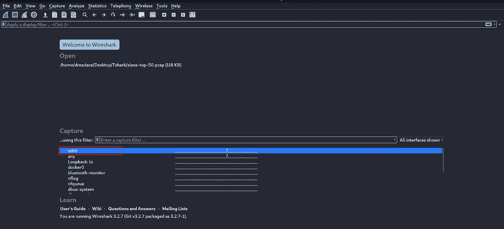

图 1: Wireshark 开放接口

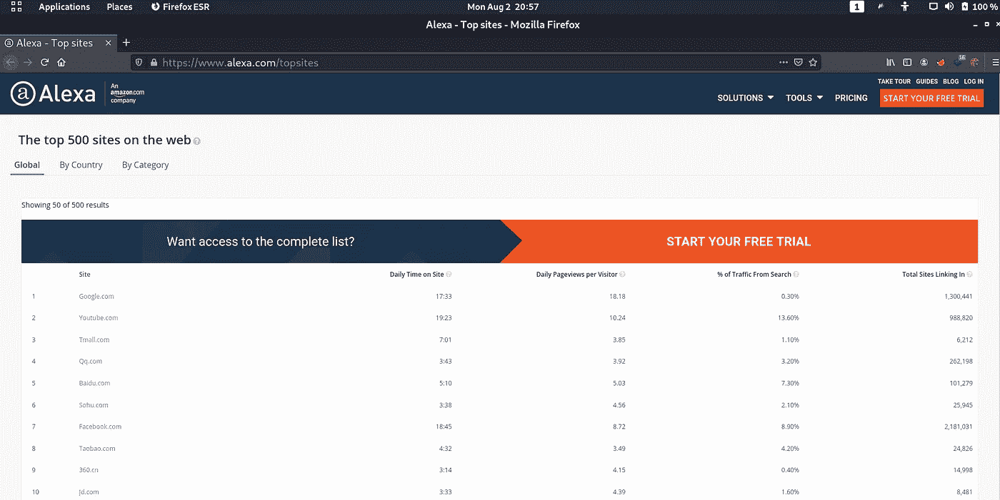

图 2:浏览网站

然后 Wireshark 将捕获该请求。

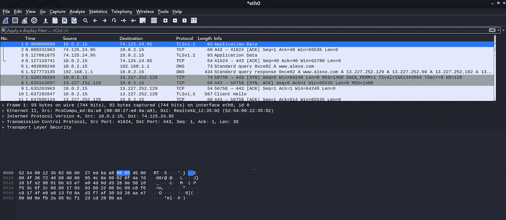

图 3:捕获的 Web 请求

**2。如何将保存的流量导出为. pcap 文件**

要将此请求保存为 pcap 文件，我们需要停止数据包捕获。为此，您可以使用菜单栏中编辑选项卡下的红色**按钮**。

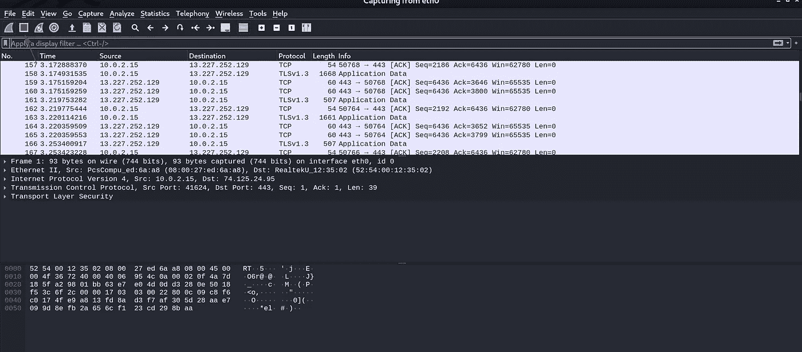

图 4:停止数据包捕获

然后导航到菜单栏中的**文件**选项卡，并选择**另存为。**然后提供文件名并选择 **Wireshark/tcpdump pcap** 作为类型。

所以，现在我们已经准备好了 pcap 文件来进行分析。

**3。你可以用 Tshark** 做什么😀

首先，对于任何工具，我将使用 Tshark 的手册页。

***语法:*** *man tshark*

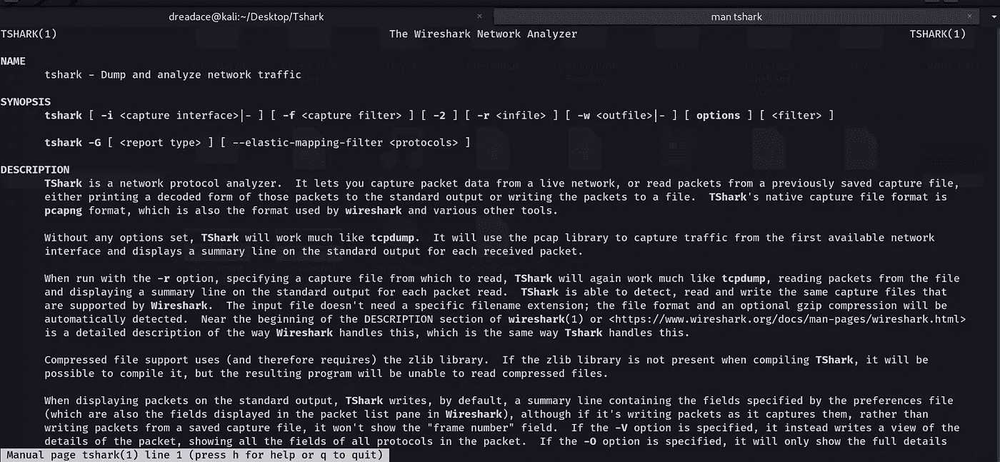

图 tshark 的手册页

这将给出 Tshark 的所有细节，包括标志和选项。

*   **读取 pcap 文件**

为了读取 pcap 文件，我们使用 Tshark 的-r 选项。它显示所有数据包。( -r infile *)*

***语法:****t shark-r example . cap*

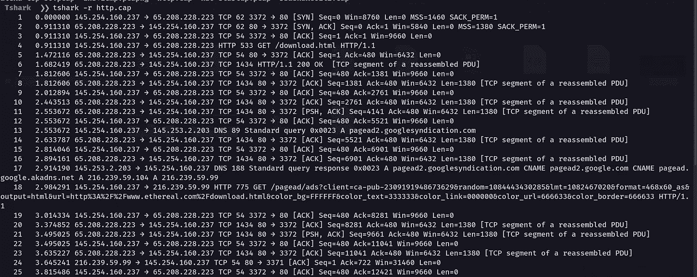

图 6:读取 pcap 文件

*   **仅读取 pcap 文件的前 10 行**

***语法:****t shark-r Alexa-top-50 . pcap | head*

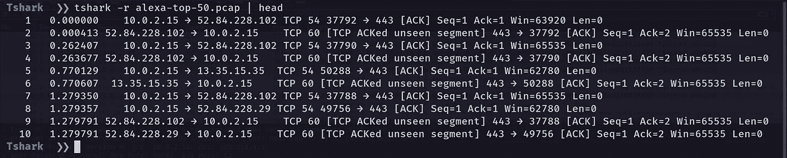

图 7:只读取 pcap 文件中的前 10 行

*   **读取 pcap，不解析名称(第 3 层或第 4 层)**

***语法:****t shark-NR http . cap*

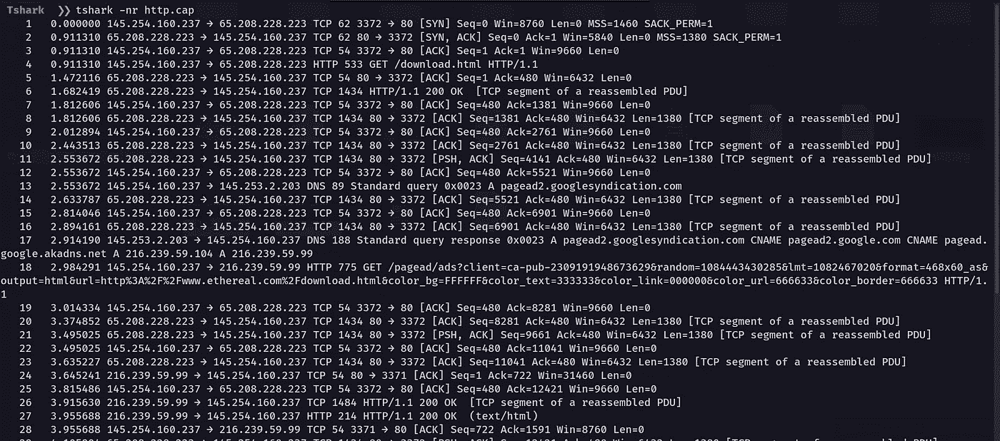

图 8:读取没有解析名称的 pcap

*   **读取带有特定主机 IP 地址的数据包。**

***语法:***tshark-r Alexa-top-50 . pcap IP . host = = " 192 . 168 . 1 . 1 "

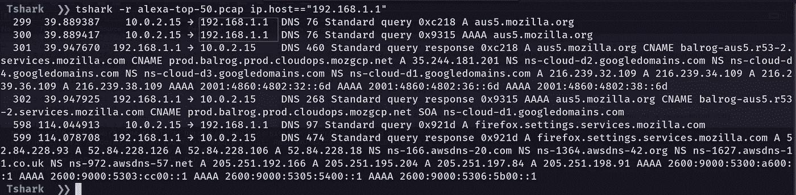

图 9:读取带有特定 IP 的数据包

*   **具有特定源 IP 地址的数据包列表**

***语法:****tshark-r Alexa-top-50 . pcap IP . src = = " 10 . 0 . 2 . 15 "*

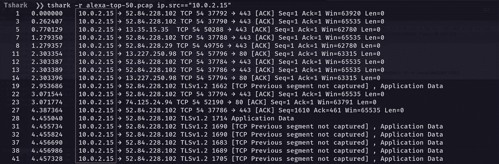

图 10:读取带有特定源 IP 的数据包

*   **具有特定目的 IP 地址的数据包列表**

***语法:****t shark-r Alexa-top-50 . pcap IP . dist = = " 10 . 0 . 2 . 15 "*

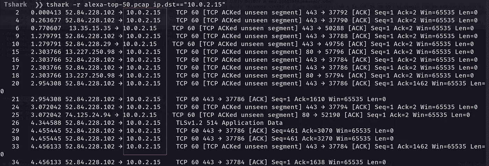

图 11:读取带有特定目的 IP 的数据包

*   **将 Tshark 输出重定向到新文件**

**语法:**

*t shark-r Alexa-top-50 . pcap-w/home/dread ace/Desktop/t shark/output . pcap IP . dst = = " 192 . 168 . 1 . 4 "*

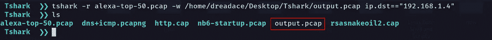

图 12:将 tshark 输出保存到一个新文件

*   **读取一个 pcap，使用显示过滤器" http.request.method==GET"**

***语法:****t shark-R http . cap-R " http . request . method = = GET "-2*

**-R:** 读取-过滤

**-2:** 执行两遍分析。这导致 tshark 缓冲输出，直到整个第一遍完成，但允许它填充需要未来知识的字段，如“帧中的响应#”字段。还允许正确计算重组帧相关性

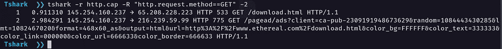

图 13:添加显示过滤器 http.request.method == GET

*   **读取一个 pcap，显示 TCP SYN 数据包没有发送到端口 80，不解析名称:**

***语法:****t shark-R Alexa-top-50 . pcap-n-R " not TCP . port = = 80 and TCP . flags = = 0x 0002 "-2*

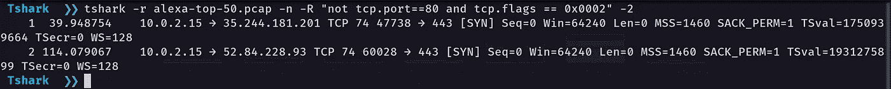

图 14:读取并显示未发送到端口 80 的 TCP SYN 数据包，不解析名称

*   **在 pcap 中打印 TCP 会话**

***语法:****t shark-n-r http . cap-q-z conv，tcp*

**-n:** 禁用网络对象名称解析(如主机名、TCP、UDP 端口名)；-N 选项可能会覆盖这个选项。

**-z conv，type** [，filter]:创建一个表格，列出在抓图中可以看到的所有对话。

**-问:**在捕获数据包时，不显示捕获到的数据包的连续计数，这在将捕获保存到文件时是正常显示的；相反，
只是在捕获结束时显示捕获的数据包数量。

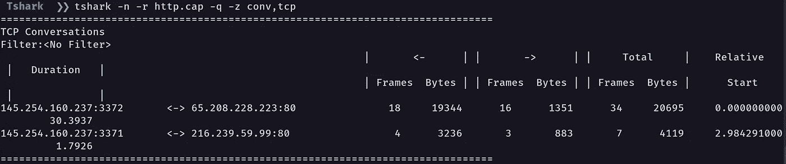

图 15:在 pcap 中打印 TCP 对话

*   **打印 pcap 中的 HTTP 用户代理**

***语法:***t shark-NR http . cap-R " http . user _ agent "-2-Tfields-e http . user _ agent

我们可以使用以下类型的 **-T** 。您可以使用手册页了解详细信息。

**-T:**ek | fields | JSON | JSON raw | pdml | PS | psml | tabs | text
设置查看解码数据包数据时的输出格式。

图 16:在 pcap 中打印 HTTP 用户代理

*   **在 pcap 中打印 X.509 证书**

***语法:****T shark-R Alexa-top-50 . pcap-T fields-R " SSL . handshake . certificate "-e x509 sat . printable string-2*

这里我们使用了 ssl.handshake.certificate 过滤器。

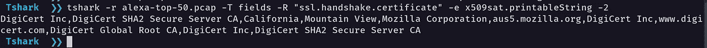

图 17:打印 X.509 证书

于是，我们来到了文章的结尾。我想你会从这篇关于 tshark 工具和基本包分析的文章中学到一些东西。谢谢，让我们来看看另一篇文章。注意安全，再见👋。

你可以在上找到我😊：

领英:[www.linkedin.com/in/sudeepashiranthaka](http://www.linkedin.com/in/sudeepashiranthaka)

中:[https://sudeepashiranthaka97.medium.com/](https://sudeepashiranthaka97.medium.com/)

推特:https://twitter.com/sudeepashiran97