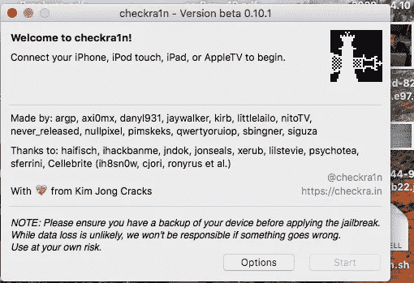
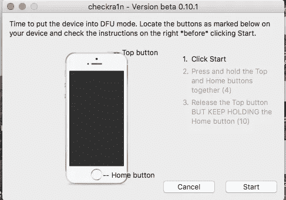
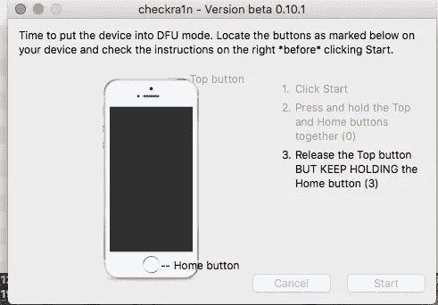
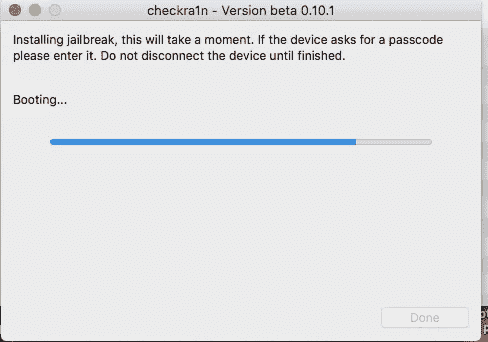
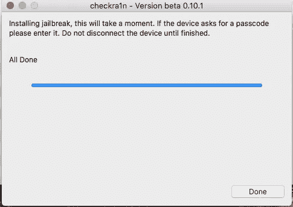
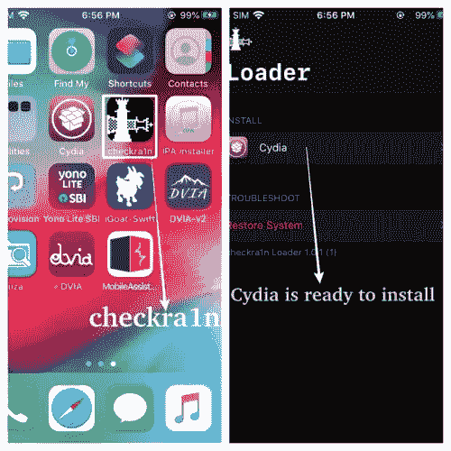
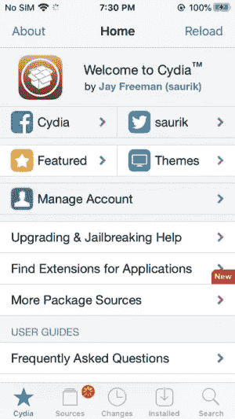

# iOS 应用安全实验室设置[第 1 部分]

> 原文：<https://infosecwriteups.com/ios-application-security-lab-setup-part-1-22c6b872c39b?source=collection_archive---------1----------------------->

大家好！这是斯里尼瓦斯。

这是我第一篇关于 iOS 应用安全的博文。

最近由于新冠肺炎的封锁，我有机会测试一个 iOS 应用程序。在测试期间，我没有任何合适的 **iOS 测试实验室**，所以后来我开始在网上浏览各种博客来修改我的知识，那时我发现大多数工具和程序都过时了。所以我在这上面花了更多的时间来收集工作方法，然后我决定在这篇博客上和大家分享我的知识。

**前言:**

完成这篇文章后，你将会明白如何用简单的步骤越狱一个 iPhone 设备。

**所需工具:**

1.  iPhone SE(即 iOS 13.4.1)
2.  MacBook Air(即 macOS High Sierra 10.13.6)

为了开始测试 iOS 应用程序，我们需要越狱我们的 iPhone。到目前为止，我们有两种流行的越狱方式。

1.  栓系越狱-> iOS 移动设备开机时与电脑连接。
2.  无束缚越狱-> iOS 移动设备开机时不需要与电脑连接。

所以在这里我用栓系越狱来越狱 iPhone 5s。所以为了实现这一点，这里我使用了**checkra 1n(**https://checkra . in**)。**

如何通过 **checkra1n 越狱 iOS？**

> **Checkra1n** (别名 checkrain)是终极**越狱**工具，使用永久**越狱**漏洞来**越狱**你的 iPhone。它非常可靠和健壮，特别是对于一个仍在测试模式下运行的工具。它可以快速可靠地破解各种旧设备。它还安装了一个 SSH 服务器和其他实用程序，这是一个额外的好处，让这个工具成为想要深入了解设备内部的研究人员和爱好者的理想选择。

访问 https://checkra.in 网站并[下载](https://assets.checkra.in/downloads/macos/33356fd4adabe88b787e1db36ac624833c32416124a40ec00d3089d659f21a5f/checkra1n%20beta%200.10.1.dmg)最新的 checkra1n 应用程序。下载应用程序后，安装它。后来界面看起来像下面。

将设备连接到计算机。显示为“iPhone SE (iOS 13.4.1)正常模式连接。”尽管移动设备需要进入 DFU 模式来安装越狱。

**如何在 iPhone 上启用安全模式？**

> 第一步:关掉你的 iPhone。
> 
> 第二步:一旦设备完全关闭，按住电源按钮打开它。
> 
> 第三步:一旦你的 **iOS** 设备亮起，按住音量降低按钮，直到你看到苹果标志。
> 
> 第四步:当 **iOS** 设备启动后，它将处于**安全模式**。

所以我的设备现在处于安全模式。通过查看 checkra1n 状态，您可以了解。

按照以下步骤申请越狱。

> 步骤 1:启用 DFU 模式后，点击 checkra1n 应用程序上的开始按钮。
> 
> 第二步:然后你的设备将重新启动，然后按住中心按钮和电源按钮 4 秒钟。
> 
> 第三步:然后释放电源按钮，保持按住 home 键 3 秒钟以上，然后释放它。

一旦完成上述步骤，剩下的安装过程将自动完成。完成这个过程后，你的设备就越狱了，可以安装 Cydia 了。

现在你可以在你的设备中找到 Checkra1n 应用程序。如果您打开该应用程序，您可以看到 Cydia 已经准备好安装。

**cy dia 是什么？**

> Cydia 是一款用于 iOS 的软件包管理器移动应用程序，用户可以在越狱的 iPhones、ipad 和 iPod touch 设备上找到并安装未经苹果授权的软件。它还指通过 Cydia 软件访问 iOS 上的软件的数字分发平台。

最后，我们用 **checkra1n** 成功越狱。👏

在我的下一篇文章中，我将详细介绍如何连接你的设备与 SSH，SFTP 和安装未签名的 IPA。

感谢您的阅读。

如果你对此有任何疑问，请随时联系我。

推特:[https://twitter.com/srinivasch09](https://twitter.com/srinivasch09)

我特别感谢[阿兹哈尔](https://twitter.com/cyberaon)和[哈莎·瓦汉](https://twitter.com/harshah3r3)的指正。:)