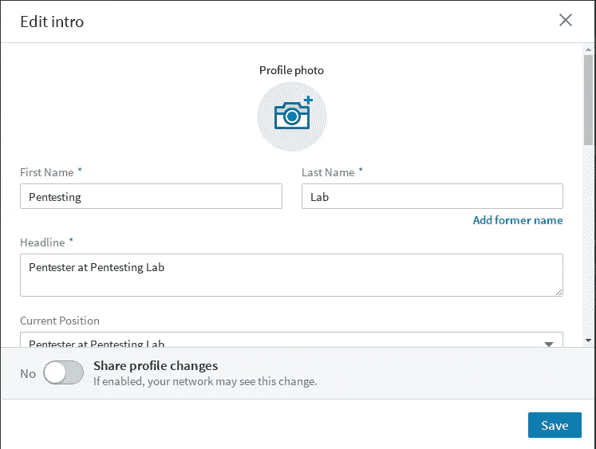
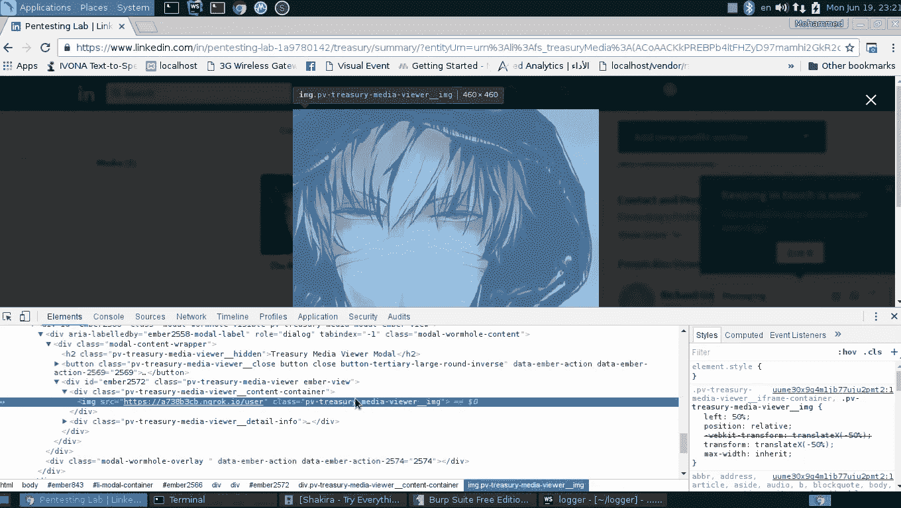
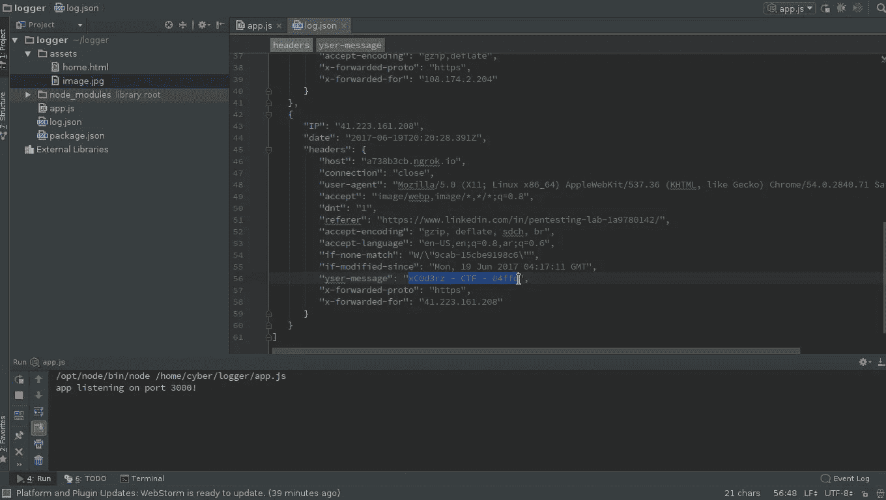
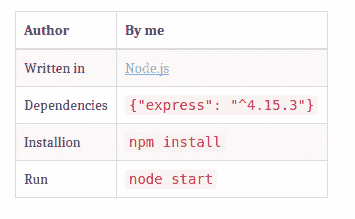
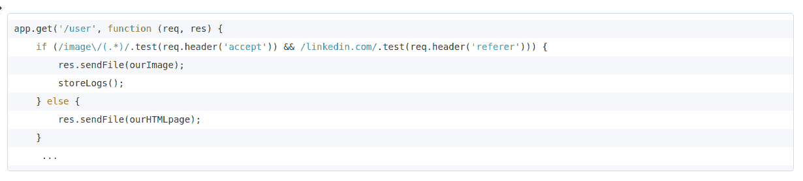
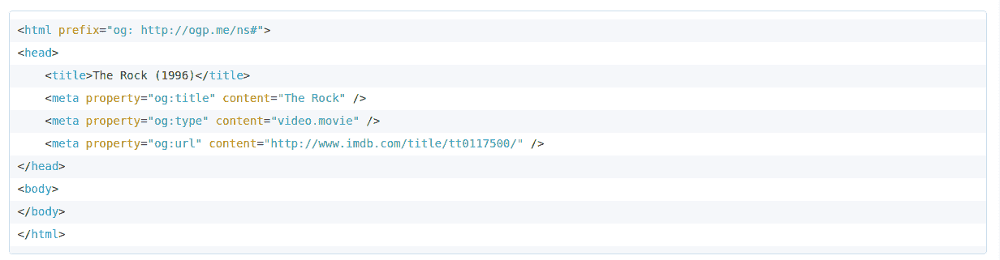

# linkedin.com 的 IP 地址泄露漏洞

> 原文：<https://infosecwriteups.com/ip-address-disclosure-vulnerability-in-linkedin-com-5830fb7476b9?source=collection_archive---------2----------------------->


# 摘要

该漏洞会导致 IP 泄漏，从而执行有害操作，例如通过使用 Metasploit 框架接管用户的机器。

# 复制步骤

**第一步:**

*   用你的用户名替换`{user-name}`，然后点击`[https://www.linkedin.com/in/{user-name}/edit/topcard](https://www.linkedin.com/in/{user-name}/edit/topcard/.).`



**第二步:**

*   转到媒体部分，然后添加链接。
    当`com.linkedin.voyager.feed.urlpreview.PreviewImage`无法获得预览图片时，将使用我们的链接作为`preview-image`在这种情况下，你应该避免元标签中的任何图片链接。
*   Linkedin 网址预览端点
    `https://www.linkedin.com/voyager/api/feed/urlpreview/{URL}`

**例如:**

**添加** `**https://a738b3cb.ngrok.io/user**` **时，我们得到:**

*   反应

```
{  
   **"data"**:{  
      **"$deletedFields"**:[        ],
      **"value"**:{  
         **"com.linkedin.voyager.feed.urlpreview.PreviewCreationSuccessful"**:"0ZVEtnT7kRtbMZxlzyoLnQ==,root,value,com.linkedin.voyager.feed.urlpreview.PreviewCreationSuccessful"
      },
      **"$type"**:"com.linkedin.voyager.feed.urlpreview.UrlPreviewResponse",
      **"$id"**:"0ZVEtnT7kRtbMZxlzyoLnQ==,root"
   },
   **"included"**:[  
      {  
         **"$deletedFields"**:[           ],
         **"data"**:"0ZVEtnT7kRtbMZxlzyoLnQ==,root,value,com.linkedin.voyager.feed.urlpreview.PreviewCreationSuccessful,data",
         **"$type"**:"com.linkedin.voyager.feed.urlpreview.PreviewCreationSuccessful",
         **"$id"**:"0ZVEtnT7kRtbMZxlzyoLnQ==,root,value,com.linkedin.voyager.feed.urlpreview.PreviewCreationSuccessful"
      },
      {  
         **"urn"**:"urn:li:article:7726755832606755082",
         **"previewImages"**:[           ],
         **"$deletedFields"**:[  
            "description",
            "update"
         ],
         **"resolvedUrl"**:"https://a738b3cb.ngrok.io/user",
         **"source"**:"a738b3cb.ngrok.io",
         **"id"**:"urn:li:article:7726755832606755082",
         **"type"**:"com.linkedin.voyager.feed.urlpreview.UrlPreviewResponse",
         **"title"**:"The Rock",
         **"url"**:"https://a738b3cb.ngrok.io/user",
         **"$type"**:"com.linkedin.voyager.feed.urlpreview.UrlPreviewData",
         **"$id"**:"0ZVEtnT7kRtbMZxlzyoLnQ==,root,value,com.linkedin.voyager.feed.urlpreview.PreviewCreationSuccessful,data"
      }
   ]
}
```

*   如果响应上的`previewImages`键是空数组，`com.linkedin.voyager.feed.urlpreview.PreviewImage`将使用`resolvedUrl`作为预览图像。



当用户访问个人资料并点击**查看更多**时，预览图像将直接在后台加载。

*   我为 request header 添加了一个名为`User-Message`(错误地输入了`*yser-Message*`)的新 header 标签。


*   我可能会在日志中获得包含其内容的 header 标记。



我们得到了旗帜:P

# 攻击脚本/工具

是用 Node.js 写的 [express.js](https://expressjs.com/) 应用。



*   我们需要检查`accept`和`referer`标题标签，以检测请求是否来自`linkedin.com`



*   如果`accept` & `referer`匹配，则流式传输图像并将该请求有效载荷存储在`log.json`中
*   除非发送一个没有任何用于图像的元标签的 html 页面



在我的 github [repo](https://github.com/xc0d3rz/IP-Address-Disclosure-Vulnerability-in-linkedin.com) 上查看完整代码

# 可开发性

由于攻击者的配置文件是公开可访问的，因此该漏洞可能会影响给定域中的所有用户，因为如果攻击者的配置文件被平台上的任何其他用户查看，该漏洞也是公开可见的。此外，这可用于对受害者(或访问该页面的任何用户)执行操作，并可能导致远程控制用户的机器。这可能是因为用户自己导航到攻击者的配置文件，或者攻击者以某种方式诱使受害者导航到该配置文件。

# 影响

接管用户的机器将允许攻击者执行有害的操作。
[一个关于如何用 metasploit](https://null-byte.wonderhowto.com/how-to/hack-like-pro-exploit-and-gain-remote-access-pcs-running-windows-xp-0134709/) 瞄准公共 IP 的大话题。

# 概念证明