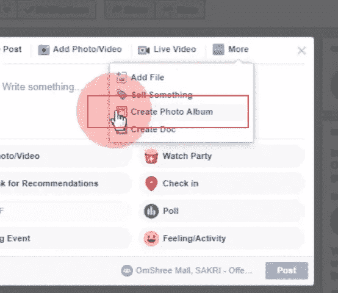
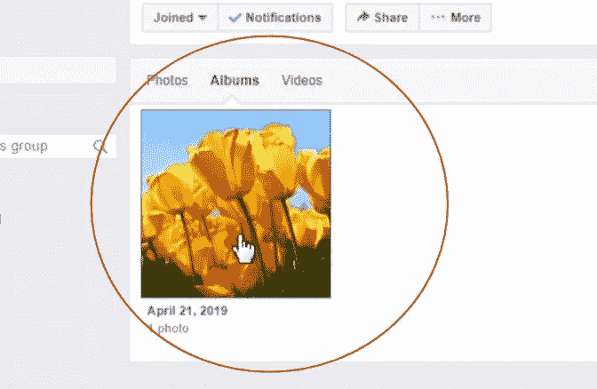
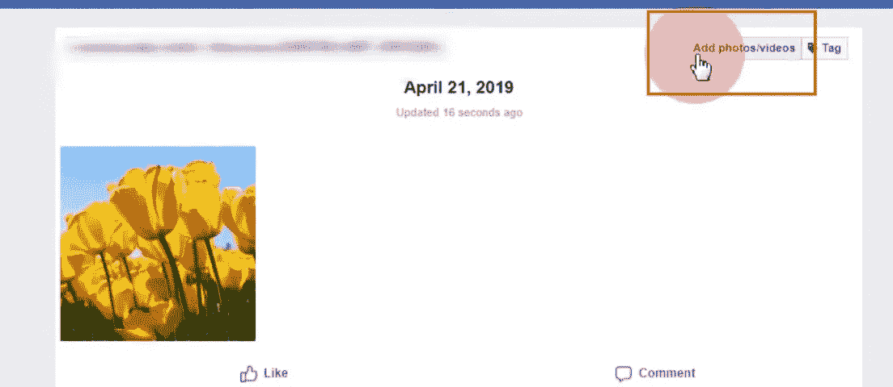
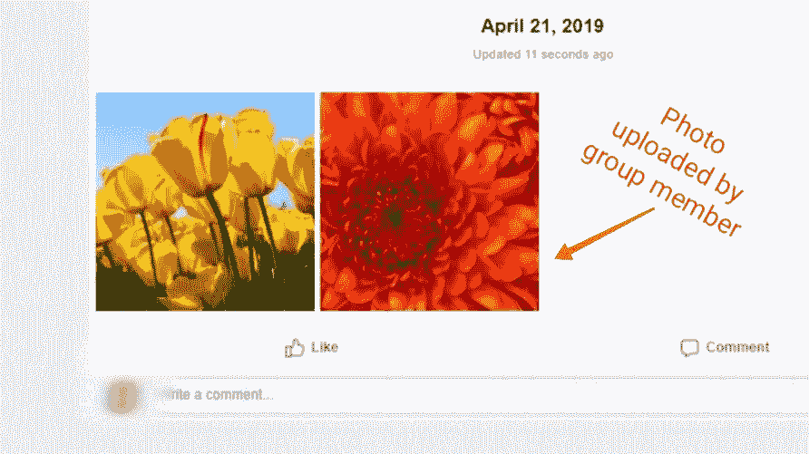
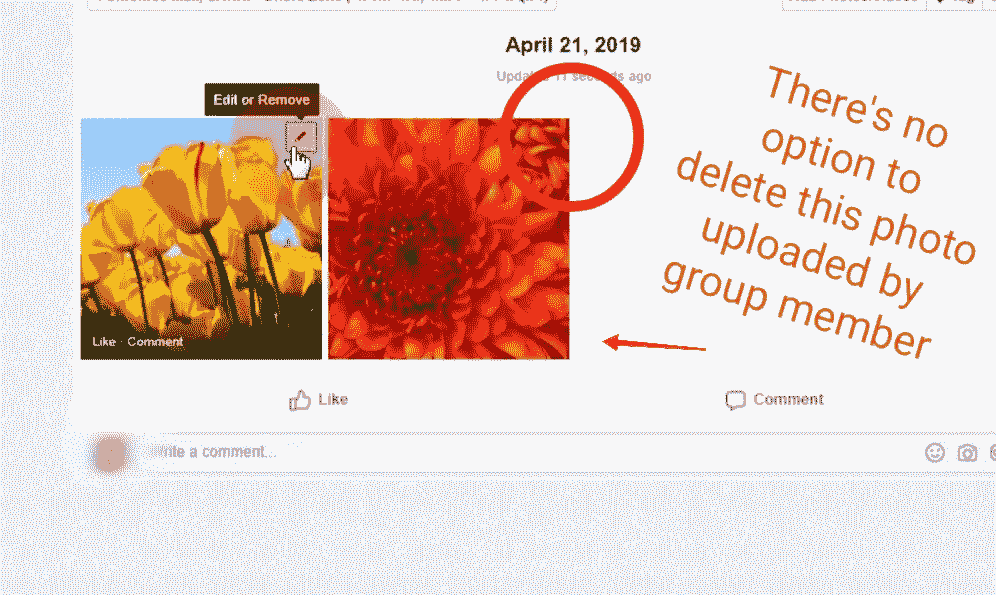
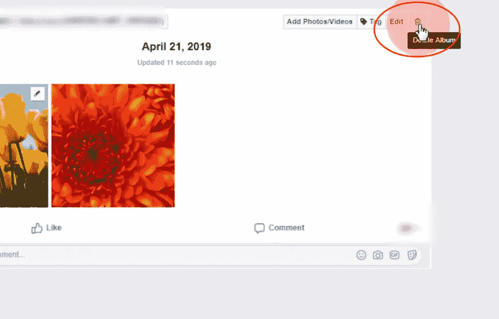
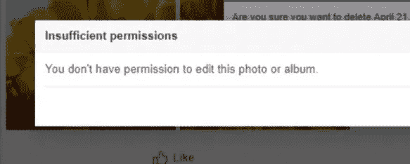
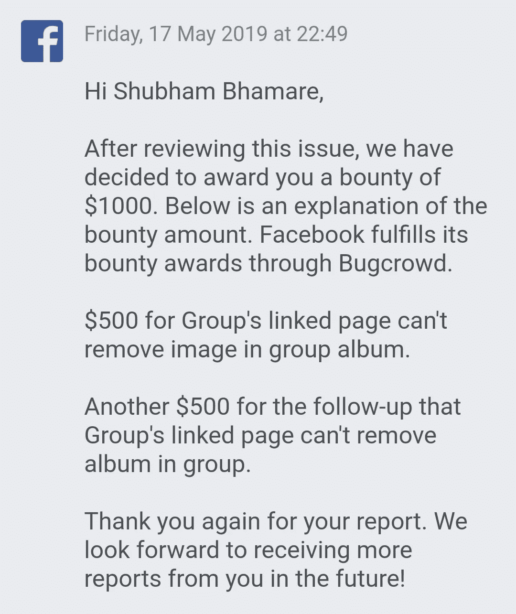

# 在某些情况下，不可删除的脸书集团相册照片和整个相册(奖金:1000 美元)

> 原文：<https://infosecwriteups.com/irremovable-facebook-group-album-photos-and-entire-album-under-certain-circumstances-bounty-1000-b1b2a870b8e0?source=collection_archive---------0----------------------->

嗨，伙计们，又是舒巴姆·巴玛雷。在这篇文章中，我将告诉你我的一个非常简单的脸书错误，它是在我当时没有心情测试，只是浏览我们在脸书的业务组时偶然发现的。

因此，在某些情况下，脸书群组管理员无法删除群组相册照片以及整个相册。

所以不浪费时间，让我们开始吧！👉

===

**设置和场景:**

1)脸书组，其中只有一个页面(ABC)是管理员。

2)攻击者(XYZ)是一个脸书用户，他是上述组的成员。

平台:[脸书网](https://www.facebook.com)

===

**复制步骤:**

1)从 ABC 的角度来看，以小组为单位创建相册。

在群组中创建相簿

ABC 制作的相册

2)从 XYZ 的角度出发，在上面的相册中添加一些照片。

将照片添加到相册

小组成员上传的照片(XYZ)

3)现在，当 ABC 试图删除 XYZ 添加的照片时，将没有任何删除它们的选项。即使 ABC 使用其他平台，如 Android/iOS/Lite 应用程序、移动网站来删除这些照片，这也是不可能的。

没有删除群组成员上传的照片的选项

> **ABC 将只能删除他/她自己的照片。作为该组的管理员，他应该能够删除其他组成员添加的照片。但是当我报告这个问题时，我没有任何选择。**

===

**修复和绕过:**

团队通过在其他组成员添加的照片上添加编辑按钮修复了此问题。但当我验证修复时，我发现如果组管理员试图删除整个相册(如果它包括其他成员的照片)，他/她将无法删除它，因为它会显示一条错误消息。

删除相册按钮

删除整个相册时显示错误消息

第二个问题背后影响是，如果恶意成员在相册中添加了数千张不合适的照片，那么组管理员将无法删除整个相册。他/她必须一张一张地删除每张照片。

我们还可以想象，如果多个群组成员向相册中添加了数千张不合适照片，会发生什么。😁

===

**赏金:**

1000 美元(初始报告 500 美元，绕过修复或发现第二个问题 500 美元)

脸书悬赏 1000 美元

===

**时间线:**

> 2019 年 4 月 21 日:发送报告
> 2019 年 4 月 24 日:预审
> 2019 年 4 月 27 日:预审
> 2019 年 5 月 15 日:修复
> 2019 年 5 月 16 日:修复绕过/发现第二个问题
> 2019 年 5 月 17 日:完全修复
> 2019 年 5 月 17 日:奖励 1000 美元

===

**外卖:**

1)在浏览某样东西的时候(即使你没有打猎的心情)，总是要观察某样东西是否按预期工作。

2)不要透露你的发现，直到你完全相信它不会有任何旁路。😉检查另一个端点/功能是否存在类似问题。

3)有时候你只需要逻辑思维，而不需要什么高级的工具或者知识。因为逻辑==魔术。😊

4)如果你是第一次接触脸书 bug bounty，试着最大限度地找到逻辑错误。

===

感谢您的阅读！敬请关注我的下一篇文章，别忘了关注我的 [**【脸书】**](http://facebook.com/theshubh77)[**Twitter**](http://twitter.com/theshubh77)[**LinkedIn、**](https://linkedin.com/in/theshubh77) 和**[**insta gram**](http://instagram.com/theshubh77)**。😊****

**===**

## **来自 Infosec 的报道:Infosec 每天都有很多内容，很难跟上。[加入我们的每周简讯](https://weekly.infosecwriteups.com/)以 5 篇文章、4 个线程、3 个视频、2 个 GitHub Repos 和工具以及 1 个工作提醒的形式免费获取所有最新的 Infosec 趋势！**