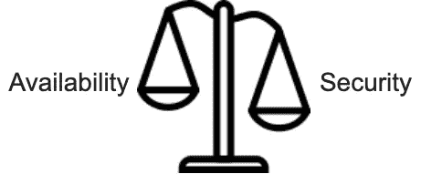
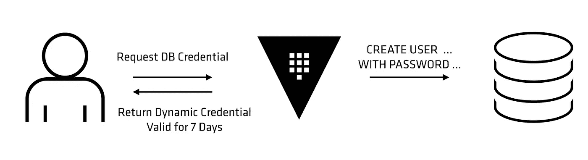

# 您的组织安全地处理机密吗？

> 原文：<https://infosecwriteups.com/is-your-organization-handling-secrets-securely-16bbdb15fe4f?source=collection_archive---------0----------------------->

## 避免硬编码秘密的秘密


我记得在我的应用程序安全之旅的早期，我们曾经在后端代码中识别硬编码的秘密，在几乎每个源代码审查项目中，那时我经常努力想出考虑成本和整体架构的最佳补救措施。

基于对这种非常普遍的硬编码秘密的学习和遗忘的一点经验，我想就此写点东西。在这个故事中，我将讨论与硬编码秘密相关的问题，以及我们可以有效解决这个问题的方法。

最后，我们还将快速比较云市场领导者 AWS 和 HashiCorp 的 Vault 提供的解决方案，以有效、安全地管理机密。

# 硬编码秘密的问题

如果你过去做过代码审查，我敢肯定你肯定会遇到硬编码的秘密问题。如果没有，请查看下面的代码片段，它显示了数据库凭据是在应用程序源代码中硬编码的:

```
**public** **final** Connection getConnection() **throws** SQLException{ **return** DriverManager.getConnection("jdbc:mysql://localhost/dbName","username", "password");}
```

敏感数据如 ***秘密密钥、私有密钥、SSH 密钥、访问/秘密密钥*** *、* ***第三方秘密和 API 密钥*** 等。不应在应用源代码或您的基础设施中作为代码(IaC)进行硬编码，即 Chef、Ansible、Puppet、Terraform 脚本。以下是与硬编码机密相关的问题:

## **内部威胁**


对源代码中的秘密进行硬编码违反了基本安全性 ***最小特权原则*** ，因为任何人都可以访问代码/VCS(Github、Gitlab 等。)也可以通过秘密访问底层服务/操作。想象一下，所有的应用程序开发人员/QA 工程师都可以访问这些被认为是秘密的敏感信息，从而使其容易被内部攻击所泄露。

## **外部威胁**


在应用程序的服务器遭到破坏并且攻击者能够访问代码的情况下，所有这些硬编码的秘密都是非常有趣的信息🤑这有助于攻击者横向移动。

想象一下，一旦驻留在 DMZ 中的 web 服务器(可通过互联网访问)受到威胁，代码中硬编码的秘密将帮助攻击者到达位于内部网络中的 DB 服务器，从而进一步渗透。

## **安全性与可用性**



一旦应用程序/服务投入生产，并且由于违反/合规性要求而需要更改硬编码的机密，更改就会变得更加麻烦，因为这可能会影响系统的可用性，从而导致直接的业务影响。

## **分布式访问控制&管理**

与硬编码机密相关的另一个问题是访问控制和审计。因为秘密分布在不同的地方，即应用程序代码、配置文件、基础结构脚本(IaC)等。在我们的版本控制系统中，我们既没有细粒度的访问控制，也没有有效执行审计跟踪的方法来识别何时、何地以及谁访问了这些秘密。

N **ote** :有一段[艾蒙·达德加尔](https://medium.com/u/3a8ff4bf8a68?source=post_page-----16bbdb15fe4f--------------------------------)的精彩视频，他非常精彩地讲述了**秘密蔓延的问题**——秘密遍布我们不同地方的基础设施的情况。

# 安全有效的秘密管理要求

我们有各种解决方案可用于管理机密，如 HashiCorp Vault、AWS Secrets Manager、Azure Key Vault、Google Secret Manager、Cloud HSMs、内部 HSMs 和其他内部解决方案。在本节中，我们将讨论一个有效且安全的 secret manager 解决方案的几个基本要求，显然除了具有**高可用性**和**可伸缩性**。

## 安全储存和运输

机密应安全地存储和传输(TLS ),即机密不仅应加密，还应在静止和传输期间 ***安全地加密*** 。应该使用强大的加密算法，并且应该安全地管理用于加密秘密的密钥！

> 听起来像是先有蛋还是先有鸡的问题？


秘密管理解决方案很好地处理了这一点。例如，HashiCorp Vault 使用加密密钥对所有秘密进行加密，加密密钥本身使用主密钥进行加密，并与加密数据一起存储。主密钥不存储在任何地方。Vault 使用 [Shamir 的秘密共享算法](https://en.wikipedia.org/wiki/Shamir's_Secret_Sharing)将主密钥分割成 5 份，其中任何 3 份都需要重建主密钥。一旦生成了主密钥，我们就可以解密加密密钥，从而解密秘密数据。你可以在这里了解更多信息[。](https://www.vaultproject.io/docs/concepts/seal)

## **细粒度访问控制&审计**

秘密管理器解决方案应该具有细粒度的访问控制，以允许一组用户/服务访问特定的秘密，而不是每个人都可以访问所有内容。此外，除了访问控制之外，还应该对访问机密的人员、时间和方式有很强的可见性，这有助于我们跟踪访问请求，也更容易确保符合内部政策和法规标准。

## 机密的定期/按需轮换

秘密轮换是安全秘密管理的另一个基本要求。要么我们需要定期轮换机密以符合组织的 ISMS 政策/法规要求(例如:PCI-DSS ),要么我们需要在数据泄露等情况下按需轮换机密。如果不能顺利实施，机密的轮换可能会对系统的可用性和稳定性产生重大影响。

一些秘密管理解决方案已经有效地解决了这个问题。如果我们谈论 **AWS Secrets Manager** ，它允许在 **AWS Lambda** 功能的帮助下进行无缝的定期/按需轮换。

它本身就知道如何为[支持的亚马逊 RDS 数据库](https://docs.aws.amazon.com/secretsmanager/latest/userguide/intro.html#rds-supported-database-list)轮换机密，也让我们能够为不支持的数据库/第三方服务轮换机密。换句话说，如果我们需要为受支持的 Amazon RDS 数据库轮换密码，那么 Secrets Manager 会为我们提供 Lambda 函数，否则对于任何不受支持的数据库或服务，我们必须提供 Lambda 函数的代码。你可以在这里阅读更多相关信息[。](https://docs.aws.amazon.com/secretsmanager/latest/userguide/rotating-secrets.html)

如果你和我一样，也想知道 AWS 如何解决由于秘密 的 ***传播延迟而可能发生的停机问题。你可以看看[这个](https://docs.aws.amazon.com/secretsmanager/latest/userguide/rotating-secrets-two-users.html)。***

现在我们已经讨论了秘密管理器的基本属性，我们知道如何安全地管理秘密，以及如何与需要它的用户/服务安全地共享它。

**坚持住！**虽然秘密在秘密管理器中是安全的，但您是否意识到我们仍然面临着秘密可能从安全的秘密管理器外部泄露的风险？


# 动态秘密

即使我们可以在访问 secret manager 时安全地管理内部的秘密，但如果访问秘密的实体没有安全地处理它，那该怎么办呢？考虑一个场景，其中应用程序在日志文件中记录数据库密码。这是还应该管理的剩余风险。

此外，对于静态密码，所有需要访问服务的实体将共享同一组凭证，并且在违规的情况下，我们应该为每个实体更改密码，这可能非常麻烦。或者，在动态秘密的情况下，我们可以很容易地识别大海捞针，并且只为受危害的实体改变秘密。

让我们来看看 HashiCorp Vault 是如何优雅地处理这个问题的:



在高级别上，动态秘密是按需生成的，并且对于客户端是唯一的，而不是预先定义并共享的静态秘密。Vault 将每个动态机密与租约相关联，并在租约到期时自动销毁凭据。

# HashiCorp 的 Vault 和 AWS Secret Manager 的快速比较

## 费用

*   HashiCorp 的 Vault 有开源和企业两个版本。开源版本为秘密管理提供了重要的特性。实际使用成本取决于用于部署 Vault 的服务器
*   AWS Secret Manager(ASM)是由 AWS 提供的托管服务。实际的使用成本取决于存储的机密数量和用于与 ASM 对话的 API 调用。

## **生态系统**

*   Vault 提供了一个独立于供应商的保密管理解决方案。它可以用一个通用的 API 在任何云或数据中心工作
*   ASM 与 AWS 生态系统紧密相连

## 秘密轮换

*   Vault 允许我们创建每个实例都唯一的动态机密，并支持使用机密自动轮换。
*   ASM 为一些受支持的数据库提供了无缝的秘密轮换，并为不受支持的实体提供了 Lambda 函数。

## 动态秘密

*   Vault 支持动态机密
*   ASM 不支持动态机密

尽管实现一个解决方案在很大程度上取决于组织内的多种约束，例如当前的云平台。然而，总的来说，基于 Vault 的功能和与云无关的特性，我相信它是管理秘密的更好的解决方案。

# 参考

*   https://www.vaultproject.io/docs/internals/architecture
*   [https://docs . AWS . Amazon . com/secrets manager/latest/user guide/intro . html](https://docs.aws.amazon.com/secretsmanager/latest/userguide/intro.html)
*   [https://www.hashicorp.com/blog/why-we-need-dynamic-secrets/](https://www.hashicorp.com/blog/why-we-need-dynamic-secrets/)
*   [https://discuse . hashi corp . com/t/how-does-hashi corp-vault-compare-to-tools-like-AWS-secrets-manager/3024](https://discuss.hashicorp.com/t/how-does-hashicorp-vault-compare-to-tools-like-aws-secrets-manager/3024)
*   [https://www . cloud journey . io/articles/security/AWS _ secrets _ manager _ vs _ hashi _ vault-su/](https://www.cloudjourney.io/articles/security/aws_secrets_manager_vs_hashi_vault-su/)