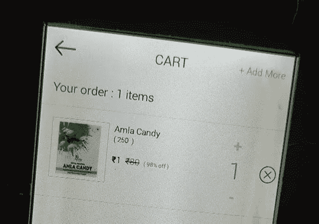
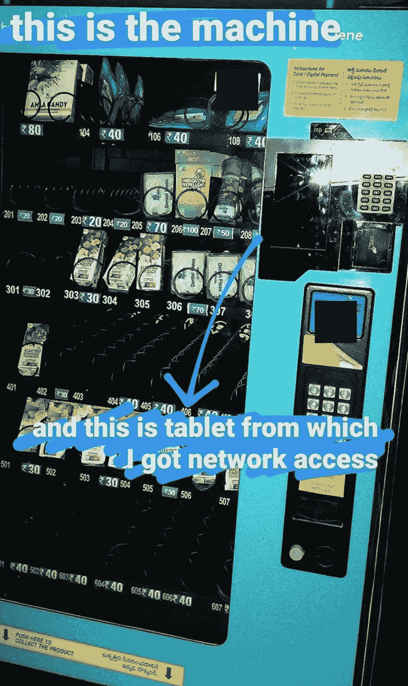
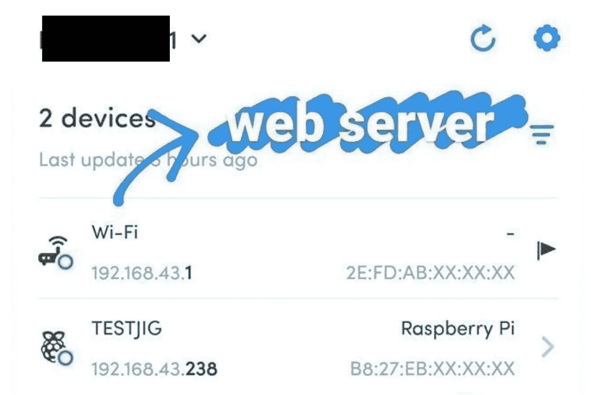
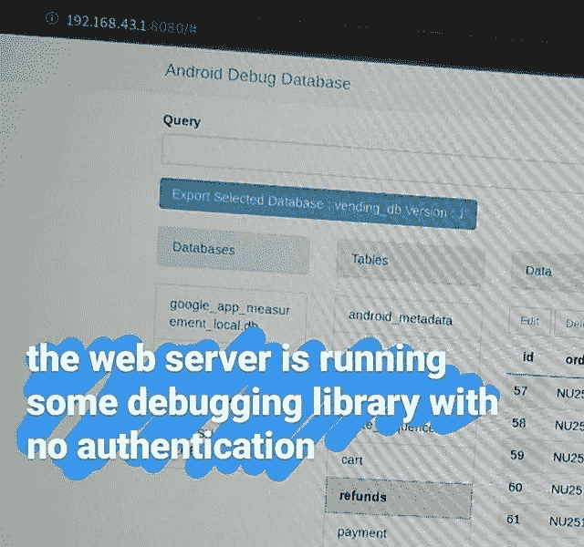
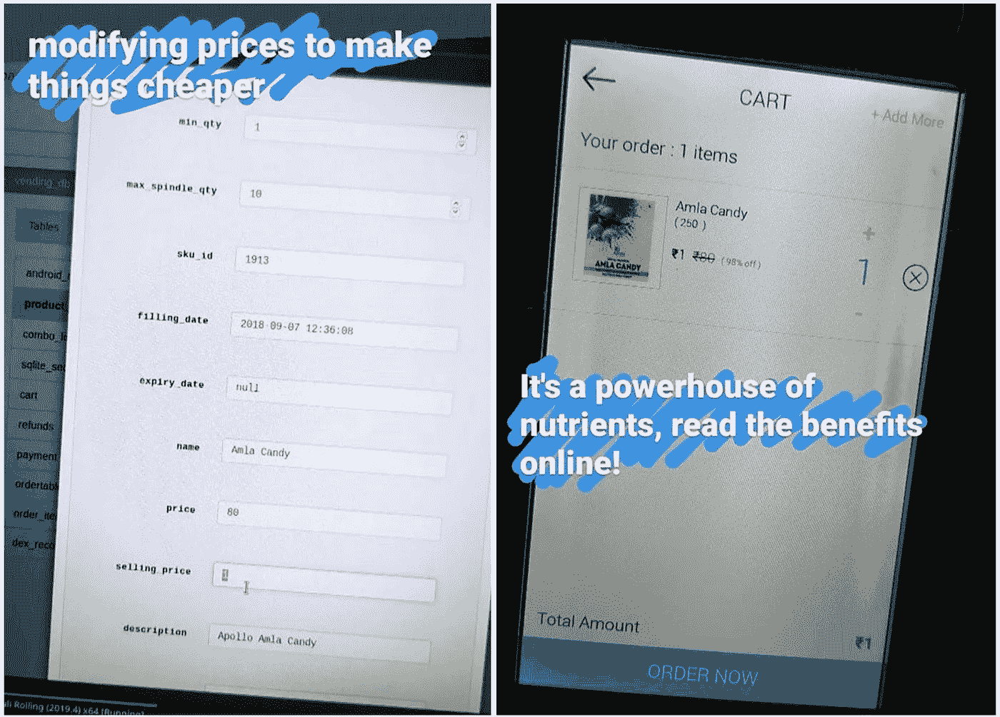

# 我是如何黑进你的自动售货机的

> 原文：<https://infosecwriteups.com/its-not-hard-to-hack-smart-73c928a5276b?source=collection_archive---------3----------------------->

## 对我 4000 年前所做的一件事的详细记述

要知道我是如何把价格从₹80 降到₹1 的，我们需要回到几个月前

2020 年 5 月 3 日“封锁日 40”，在我当时呆的校园内，海得拉巴的 Gachibowli。那天晚上，饭后，当我在校园里散步时，我看到一个无线热点上的智能自动售货机，这就是这个故事的开始。

# 无线网络在哪里？！

这种自动售货机相当标准，但通过连接一个 android 平板电脑来做一些事情，如接受无现金支付和发送遥测数据，从而变得“智能”。原始输入被禁用，因此我们可以忽略这些内容。这款平板电脑运行着一个购物车应用程序，可以保存物品清单以及我之前提到的其他东西。所有这些都是在平板电脑本身创建的无线热点上进行的。

# 耶！没有 MAC 过滤器！

用通常的 android 手势退出应用程序很简单。之后，我进入设置应用程序，获得了热点的名称和密码，成功地将我的手机连接到它…

Fing 使用他们的专利技术进行设备识别…他们也没有付钱让我写这个！

用[手指](https://play.google.com/store/apps/details?id=com.overlook.android.fing)快速扫描网络(就像我通常连接网络时做的那样)以获得 Wi-Fi(这是一个充当路由器的平板电脑)和一个树莓 Pi 来控制自动售货机。

# 新手机，没有认证！？

去了我的房间，拿了笔记本电脑

在 dot1 上运行端口扫描，告诉我端口 8080 是打开的，当我从浏览器访问它时...我得到一个 Android 调试数据库页面，向我显示各种信息，而没有执行任何身份验证。

# “默认无安全性”数据库

开源并不总是意味着安全

快速的谷歌搜索把我指向了它的 [GitHub 库](https://github.com/amitshekhariitbhu/Android-Debug-Database)，它说这个数据库 GUI【直接】与 android 环境的共享偏好进行交互。厉害！所以，它不仅仅是从 android 应用程序使用的内存中获取数据…我还可以添加或删除东西，完成对数据库的访问。更具体地说…

把这两个放在同一个图像中花了我一个小时

至于早期的 Raspberry Pi，它在默认端口上运行 SSH 和 VNC 服务器，用于远程访问、查看销售分析和远程管理设备。都有密码保护，我可以暴力破解，但这是一个足够好的安全措施，可以阻止我在 12:08 分破解它。

物联网现在已经存在，因此，基本的访问控制机制和身份验证措施必须嵌入到这些自动售货机和其他智能家居设备的应用软件中，并且在设置过程中默认开启。这不仅可以阻止任何人进入你的“智能”冰箱，知道你一天可以喝多少酸奶，还可以阻止任何人移动到其他设备，在你的智能家居上完全开启机器人先生。

我最初在这次黑客攻击中拍摄的照片被删除了。查看下面我的下一个帖子，了解我是如何从 Instagram 服务器上取回它们的。

 [## 解决问题实际上是什么样子

### 我弄丢了自动售货机黑客的概念证明。我是怎么拿回来的？

medium.com](https://medium.com/bugbountywriteup/my-personal-ctf-challenge-4016e9c176b3)