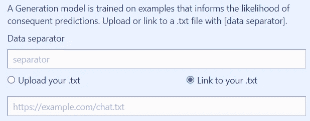
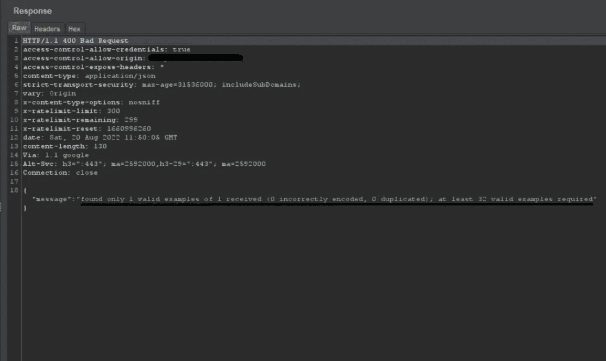
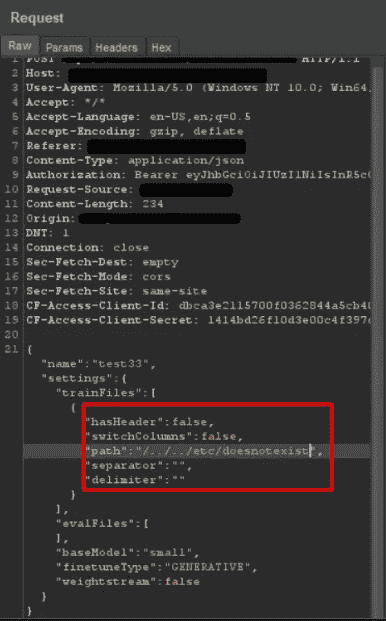
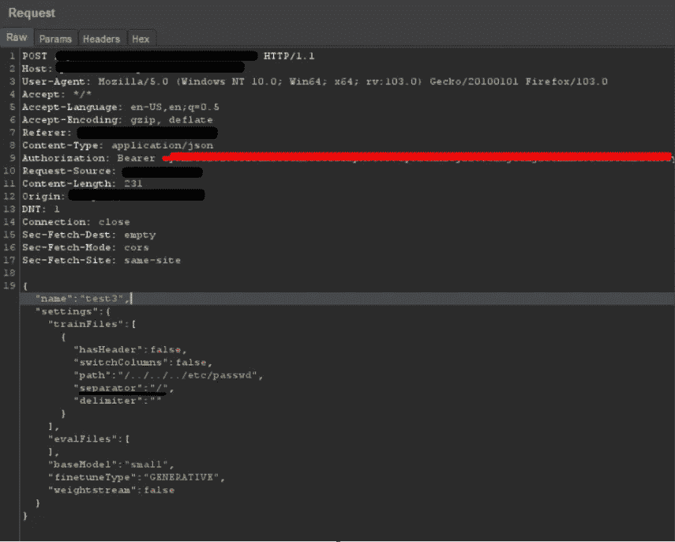
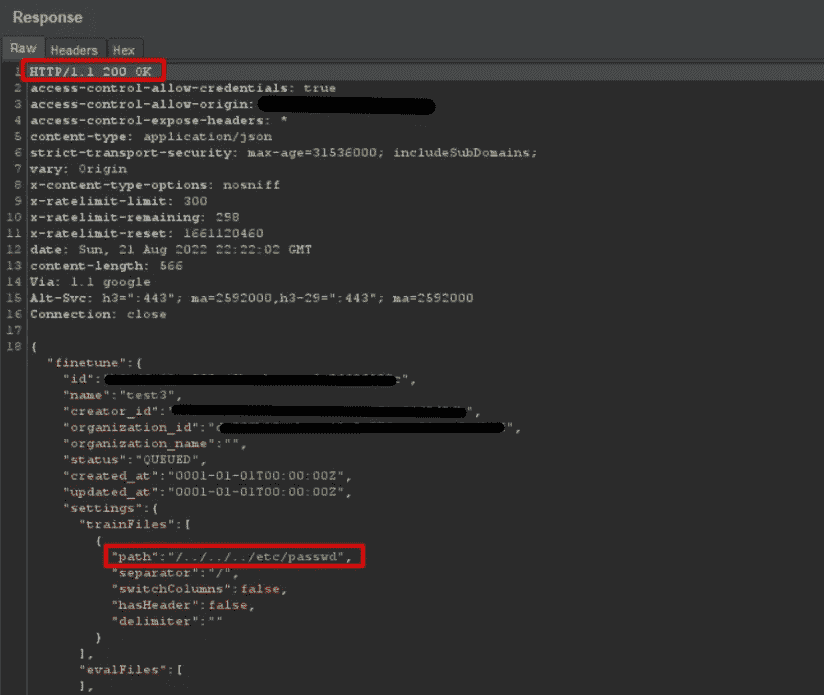
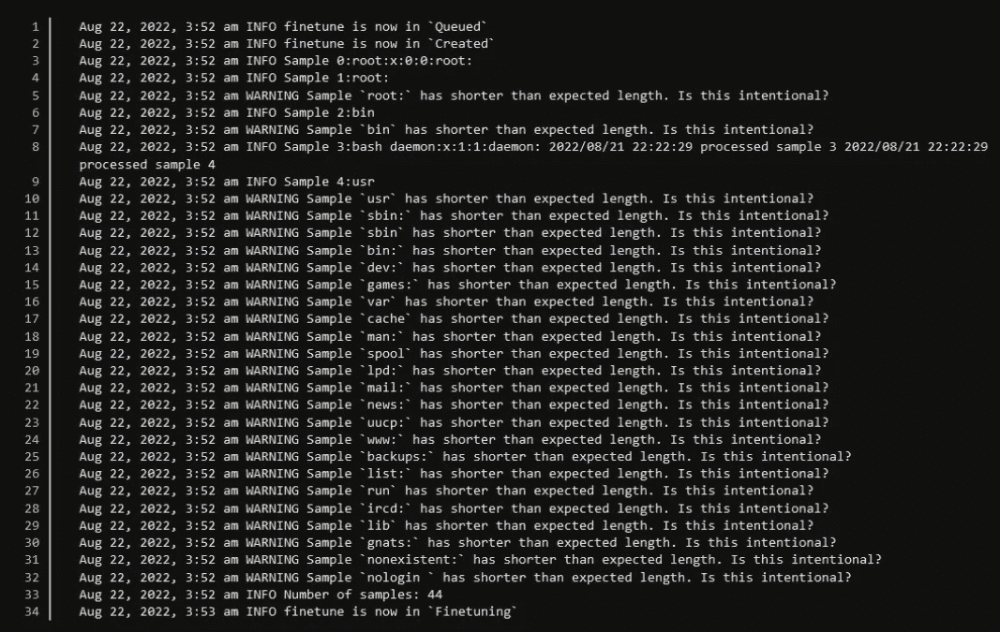

# 这是小事:打破一个人工智能

> 原文：<https://infosecwriteups.com/its-the-little-things-breaking-an-ai-40c30ae85f37?source=collection_archive---------0----------------------->

一个微小观察的故事导致了一个重要的发现。

TL；dr——提供人工智能路径遍历有效载荷，并获取本地文件作为回报。

# 介绍

关于人工智能接管地球并导致体力劳动失业的争论没完没了。嗯，至少不是今天！让我们来探索一下，在一个 AI 模型中，不可信的用户输入是如何导致本地系统文件泄露的！

几个月前，我偶然发现了 CatCorp，一家将 NLP 模型构建为 API 服务的公司，这可以被视为软件即服务(SaaS)经济的下一个上升趋势。

应用程序非常简单。登录后，你会看到一个仪表盘，用来创建和训练你自己的人工智能模型。创建模型包括选择模型类型和大小，然后输入数据分隔符和您的训练数据。这可以通过上传一个. txt 文件来完成，该文件包含要提供给 AI/应用程序的数据，也可以引用一个指向预先上传的。txt 文件托管在您想要的网站上。

数据上传后，处理就开始了。这是一个 5 阶段的过程。

数据处理>微调>导出模型>部署 API >就绪。

因此，这需要一段时间。

它们还提供了一个**特性**来**查看**通过所述过程发生的**日志**。

# 发现和开发

在修补应用程序时，我深入研究了模型创建特性和到您的。txt 组件引发了我的兴趣。我开始模糊周围，并馈入一个基本的路径遍历有效载荷，如 **/../../../etc/doesnotexist** 只是为了检查服务器如何响应。

在我们开始之前，让我们绕一个弯来看看这个请求实际上是什么样子的

这是一个非常基本的请求，传入名称、路径(链接到。txt)和模型创建所需的其他相关属性。现在，让我们回过头来看看那些引起我兴趣的回复吧！

# 请求/响应 A(有效路径)

请求 A

回应 A

# 请求/响应 B(无效路径)

请求 B

回应 B

仔细观察响应，我们发现一个常见的 linux 详细错误，表明应用程序确实在**遍历**目录并试图获取所请求的文件！

酷！但是，我们实际上如何披露这些文件呢？！提供任何有效文件，比如说 **/etc/hosts** 或 **/etc/passwd** 抛出一个需求错误，如**响应 A** 所示。我在这个问题上被困了几个小时。

尽管我确实有一个成功的响应显示了本地文件的内容，但是我不记得是怎么做到的了！谢天谢地，我没有关闭我的打嗝会议，一个简单的搜索揭示了这里的罪魁祸首。这都是关于一个单独的数据分隔符，即: **(/)** 。

你能相信吗？一个单一的字符是所有决定这将是一个关键与否！

这就是它的工作原理

正如屏幕截图中所显示的，我们所要做的就是传递一个微小的分隔符，它为我们通过一个甜蜜的旁路漏洞提取本地文件的一部分做好了准备！

新响应

这是新的回应。请注意，当提供有效的文件名时，它与最初的响应有什么不同。这强调了像上述问题那样寻找微小线索的必要性。

继续，一旦请求成功，我们可以简单地重新访问仪表板，点击创建的 AI 模型并**查看****日志**，这将为我们带来所请求文件*(此处/etc/passwd)* 的部分内容，如下面的截图所示。

正在公开/etc/passwd 的内容

对于这个星球上的任何一个黑客来说，这都是一个极度兴奋的景象，足以让 vuln 被认为是一个关键！

# 原因？/可能的解释

> 我最大的猜测是提供的分隔符，以某种方式打破/中断了输入流，结果部分呈现了文件内容，作为错误/警告消息的一部分。

今天到此为止，各位！一会儿见。

这个 bug 是与 https://twitter.com/_rajesh_ranjan_ 合作的

**时间线:-**

报告日期:2022 年 8 月 20 日

获奖日期:2022 年 9 月 16 日

**外卖:-**

注意你的打嗝记录，留意哪怕是最小的输入字段！

在 DMs 系统中，欢迎任何反馈:-[https://twitter.com/ThisIsDK999](https://twitter.com/ThisIsDK999)

安静点。✌️

## 来自 Infosec 的报道:Infosec 每天都有很多内容，很难跟上。[加入我们的每周简讯](https://weekly.infosecwriteups.com/)以 5 篇文章、4 个线程、3 个视频、2 个 GitHub Repos 和工具以及 1 个工作提醒的形式免费获取所有最新的 Infosec 趋势！