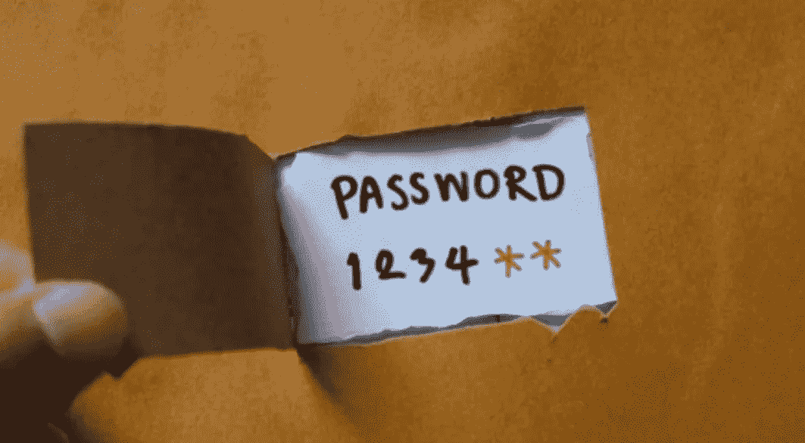

# IW 周刊# 12:$ 0 到$150，000/月的心态，缩放 RCE，滥用 FB 功能，绕过 CSRF 保护，等等。

> 原文：<https://infosecwriteups.com/iw-weekly-12-o-to-150-000-month-mindset-zoom-rce-abusing-fb-features-bypass-csrf-protection-abf86efeca5e?source=collection_archive---------1----------------------->

嘿👋

欢迎来到第十二期的**Infosec Weekly**——这是一份周一的时事通讯，将 Infosec 的精华直接发送到您的收件箱。

在今天的版本中，我们以 5 篇文章、4 个线程、3 个视频、2 个 Github repos 和工具以及 1 个工作提醒的格式纳入了新鲜出炉的 Infosec 内容，以帮助您最大限度地从这份简讯中受益，并在您的职业生涯中向前迈出一大步。

听起来很有趣？让我们开始吧👇

**📝5 篇信息安全文章**

**#1** [**待定意向:pentester 的观点**](https://valsamaras.medium.com/pending-intents-a-pentesters-view-92f305960f03) **由** [**@Ch0pin**](https://twitter.com/ch0pin)

**#2** [**找到这里如果分析 javascript 文件会导致远程代码执行**](https://melotover.medium.com/can-analyzing-javascript-files-lead-to-remote-code-execution-f24112f1aa1f) **。**

[**@ melo tover**](https://twitter.com/melotover)**通过分析管理面板路径中的 Javascript 代码实现了 RCE，在那里他使用文件名重命名功能将文件类型从白名单更改为黑名单，并获得了 RCE。**

**#3** [**滥用脸书功能造成永久账号混乱(逻辑漏洞)**](https://medium.com/@terminatorLM/abusing-facebooks-feature-for-a-permanent-account-confusion-logic-vulnerability-d7f5160f373a)

**阅读**[**@ terminator lm**](https://twitter.com/terminatorLM)**如何滥用脸书上的逻辑漏洞，通过锁定用户永久登录攻击者控制的帐户，导致 2FA 绕过/拒绝服务。**

**#4** [**从开放重定向到 RCE 一周**](https://medium.com/@byq/from-open-redirect-to-rce-in-one-week-66a7f73fd082)

[**@byq**](https://medium.com/@byq) **转身打开重定向到 RCE 几个主机上的邮件。利用 PHP 中不安全的反序列化进行 Ru 分组。**

**#5** [**诡异邮件验证绕过**](https://medium.com/@vaibhavatkale/weird-email-verification-bypass-96c793c36d7e)

[**@ vaibhav-at kale**](https://www.linkedin.com/in/vaibhav-atkale/)**披露了一个很好的提示，通过创建多个帐户来检查电子邮件验证令牌旁路。**

**🧵4 趋势线程**

**#1** [**查看此牛逼破访问控制提示线程**](https://twitter.com/_zwink/status/1532768070359568386?t=hCO8j0mOw7vCJYf0wpC9Ew&s=19) **来自** [**@_zwink**](https://twitter.com/_zwink)

**#2** [**7 方法你可以尝试通过**](https://twitter.com/harshbothra_/status/1533071083015811072?t=FJOx3TkwX0O5zYpp1vH6Eg&s=19)[**@ harshbothra _**](https://twitter.com/harshbothra_?lang=en)绕过 CSRF 保护

****#3** [**由**](https://twitter.com/itspeterc/status/1534205155914264576)[**@ itspeterc**](https://twitter.com/itspeterc)披露一个未修复的谷歌云平台漏洞**

******#4** [**一个好听的 SSRF 绕过解说线程**](https://twitter.com/thecyberzeel/status/1536985431199588358?t=b60aa0q1q49-YgcflJiZWQ&s=19) **来自**[**@ cyber zeel**](https://twitter.com/thecyberzeel?lang=en)****

******📽️ 3 个有见地的视频******

******#1** [**缩放 RCE、VMware Auth Bypass、GitLab 存储 XSS【Bug Bounty 播客】**](https://youtu.be/91rxtCsw470)****

******惊人的 Bug Bounty 播客由** [**Day [0]**](https://www.youtube.com/channel/UCXFC76FDHZRVes6_lZqwLBA) **讲解一些很酷的漏洞| XML 节走私在 Zoom 中针对 MitM 攻击，一个奇怪的 auth 旁路，一个 Gitlab 存储的 XSS 和基于 CSP 旁路的小工具，以及一个利用路径遍历/去同步来对抗 NGINX Plus 的有趣技术。******

******#2** [**从 0 美元到 15 万美元/月—黑客方法&心态**](https://youtu.be/lxEsSlh1ua8)****

******如果你在《bug bounty》里苦于找不到 bug，那就按**[**@ _ zwink**](https://twitter.com/_zwink?lang=en)**查看这个视频。他讨论了在昆虫赏金猎人中成功的最重要的因素是什么，并列出一个容易遵循的多步骤公式。******

******#3** [**OAuth 2.0 和 OpenID Connect(说白了)**](https://youtu.be/996OiexHze0)****

****开发者倡导者 Nate Barbettini 用简单的英语分解了 OpenlD 和 OAuth 2.0。****

******⚒️2 Github 库&工具******

******# 1**[**osme deus**](https://github.com/j3ssie/osmedeus)**by**[**@ j 3s iejjj**](https://twitter.com/j3ssiejjj)****

******这是一个用于攻击性安全的工作流引擎。它旨在建立一个灵活的基础，允许您建立自己的侦察系统，并在大量目标上运行它。******

******# 2**[**hakooriginfinder**](https://github.com/hakluke/hakoriginfinder)**by**[**@ hakkluke**](https://twitter.com/hakluke)****

****检查这个发现反向代理背后的原始主机的强大工具。用于绕过 WAFs 和其他反向代理。****

******💰1 工作警报⚠️******

****[**Quantiphi 招聘 Jr .网络安全工程师。在这里申请。**](https://www.linkedin.com/jobs/view/3126032699)****

****这星期就这些了。希望你喜欢这些令人难以置信的发现，并从今天的时事通讯中学到一些新东西。****

******在我们说再见之前……******

****如果你觉得这篇时事通讯很有趣，并且知道其他人也会感兴趣，如果你能把它转发给他们，我们将不胜感激📨****

****如果您有问题、意见或反馈，请回复此邮件或在 Twitter [@InfoSecComm](https://twitter.com/InfoSecComm) 上告诉我们。****

****下周再见。****

****很多爱****

****编辑团队，****

****[信息安全报道](https://infosecwriteups.com/)****

*****这份简讯是我们与“神奇大使”合作制作的。*****

*****资源贡献者:* [*尼辛 R*](https://twitter.com/thebinarybot)*(*[*thebotsite . me*](https://www.thebotsite.me/)*)，* [*迈赫迪·哈桑·雷蒙*](https://twitter.com/remonsec) *，* [*马尼凯什·辛格*](https://twitter.com/X71n0?t=WYKqmnE22AY_ZAq73FeCOA&s=09) *，* [*维奈·库马尔*](https://twitter.com/R007_BR34K3R)****

*****通迅格式由:* [*Nithin R*](https://twitter.com/thebinarybot) ，[*Bhavya Jain*](https://twitter.com/bhavyajain_30)*，*[*Vinay Kumar*](https://twitter.com/R007_BR34K3R)*。*****

****如果您希望加入我们的大使频道并为时事通讯投稿，请使用您的 discord 用户名回复此电子邮件。****