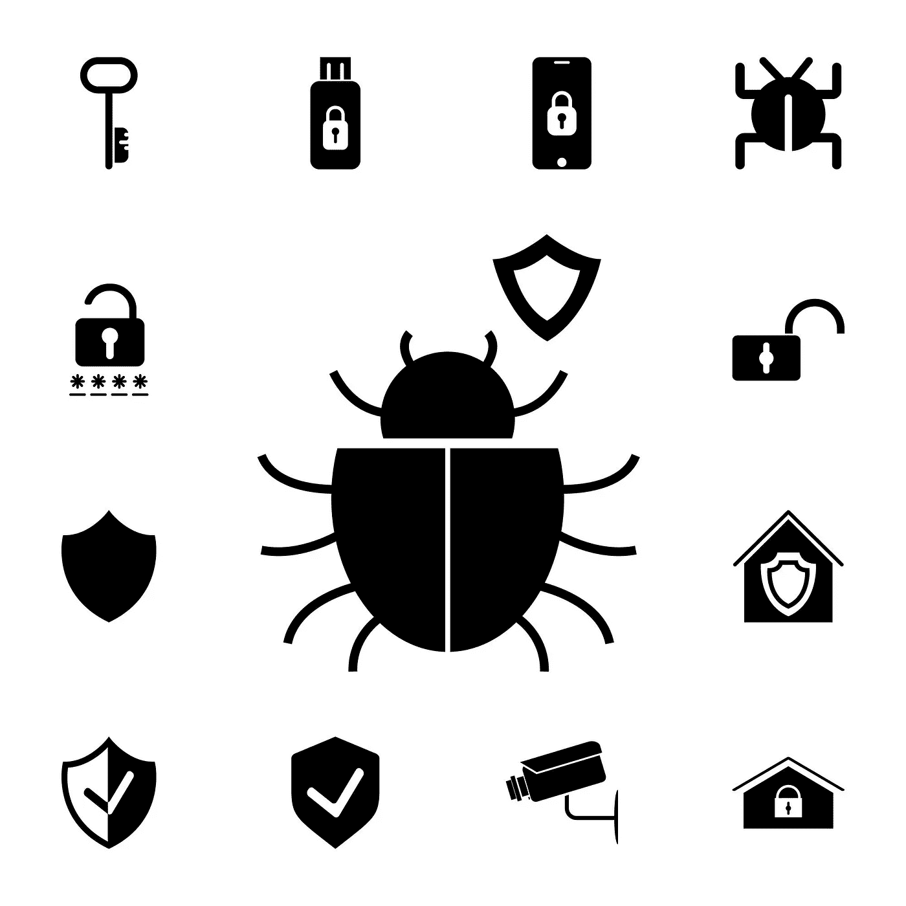

# 《IW 周刊》第 14 期:100 万美元奖金，臭虫奖金提示，即将到来的 CTF 事件，API 攻击，绕过。NET，自动填充凭证被盗，等等。

> 原文：<https://infosecwriteups.com/iw-weekly-14-1m-bounty-bug-bounty-tips-upcoming-ctf-events-api-attacks-bypassing-net-2f6ed3439976?source=collection_archive---------1----------------------->

嘿👋

欢迎来到第十四期的 **Infosec Weekly** —这是一份周一的时事通讯，将 Infosec 的精华直接发送到您的收件箱。

在今天的版本中，我们以 5 篇文章、4 个线程、3 个视频、2 个 Github repos 和工具以及 1 个工作提醒的形式，策划了本周需要您关注的所有令人惊叹的 Infosec 内容，以帮助您最大限度地从这份简讯中受益，并在您的职业生涯中向前迈出一大步。

**新增**部分:即将到来的 CTF 事件🔥

激动吗？让我们开始吧👇

# 📝5 篇信息安全文章

**# 1**[**Dhakal _ Bibek**](https://dhakalbibek.medium.com/)**写了一篇关于** [**访问控制漏洞的文章，价值 2000 美元**](https://medium.com/pentesternepal/access-control-worth-2000-everyone-missed-this-idor-access-control-between-two-admins-9745eaf15d21) **，他在那里分享了他解决访问控制漏洞的方法。**

许多 web 应用程序安全测试人员不知道一些简单而有用的 bug 搜索特性。这里有一篇由[**0x black bird**](https://0xblackbird.github.io/about)**撰写的关于** [**如何从你的网络浏览器**](https://0xblackbird.github.io/blog/post4) **中寻找漏洞的详细博文。**

**#3** [**绕过。NET 序列化绑定器**](https://codewhitesec.blogspot.com/2022/06/bypassing-dotnet-serialization-binders.html?m=1)**:DevExpress(CVE-2022–28684)和微软 Exchange(CVE-2022–23277)案例分析作者**[**@ mwulftange**](https://twitter.com/mwulftange)**。**

**#4 阅读**[**@ PwningEth**](https://twitter.com/PwningEth)**如何通过** [**披露一个关键的设计缺陷来保护 Moonbeam network，在各种 DeFi 项目中保护超过 1 亿美元的资产**](https://mirror.xyz/pwning.eth/okyEG4lahAuR81IMabYL5aUdvAsZ8cRCbYBXh8RHFuE) **并获得 100 万美元和 5 万美元的奖金。**

你知道你的浏览器的自动填充凭证可以通过跨站脚本(XSS)被窃取吗？ **。泰坦实验室的团队已经在这篇博客中展示了它。**

# 🧵4 趋势线程

**#1** [**巴关·博林娜**](https://twitter.com/XCriminal_) **分享他关于** [**如何获取调试参数的小技巧。**](https://twitter.com/XCriminal_/status/1541297463549902850?t=1U6BUvW_bYBEIjVajZ-56A&s=19)

**#2 看看**[**SM9l**](https://twitter.com/_Sm9l)**关于** [**全自动一行程序来测试 SSRF**](https://twitter.com/_Sm9l/status/1541013111225942017?t=bOOqE4unLoM3RhRy8p0ILg&s=19) **使用**[**@ pdiscoveryio**](https://twitter.com/pdiscoveryio)**的 interactsh。**

**#3 你是 API pentester 还是即将成为一名 API pentester？**[**ab hay Bhargav**](https://twitter.com/abhaybhargav)**分享一个关于** [**被低估的#API 攻防**](https://twitter.com/hashtag/API?src=hashtag_click) **的很棒的线程，你不要错过。**

有没有想过 bug 猎人如何能够编写自己的安全检查，并且总是比别人领先一步？
[**@ Jason Haddix**](https://twitter.com/Jhaddix)**分享了一条关于《bug bounty》中** [**自动化之王的秘密的深度信息线索。**](https://twitter.com/Jhaddix/status/1542192205166612480?t=qmHRqAFDZCFk-534M5Gk2w&s=19)

# 📽️ 3 有见地的视频

**#1 查看** [**本·萨德吉普尔**](https://www.youtube.com/c/Nahamsec) **如何解释信息安全领域当前的热门话题之一，即** [**攻击面管理(ASM)**](https://www.youtube.com/watch?v=sbkXpSeW77c) **当涉及到数据收集时。**

**#2 结账** [**实战钓鱼考核**](https://youtu.be/QU55YGVyedk) **课程由** [**格雷厄姆·赫尔顿**](https://www.youtube.com/c/GrahamHelton) **Part — 1 免费制作。**

**# 3**[**Jhaddix**](https://www.youtube.com/c/jhaddix)**已经上传了一个关于** [**如何有效使用 waymore 工具**](https://youtu.be/4c_1n26hmlk) **的视频。看看这个。**

# ⚒️2 Github 库和工具

**#1 从历史内容发现中发现隐藏端点&参数使用**[**@ xnl _ h4ck 3r**](https://twitter.com/xnl_h4ck3r)**的** [**WayMore 工具**](https://github.com/xnl-h4ck3r/waymore) **。在 web 评估过程中，此类内容发现的最佳工具。**

**# 2**[**@ AnubhavSingh _**](https://twitter.com/AnubhavSingh_)**为 pentesters 和 bug 猎人做了一份精选的 Android 安全资料和资源清单。本资源库将指导您如何从** [**开始使用 Android pentesting**](https://github.com/dn0m1n8tor/AndroidPentest101)**。**

# 💰1⚠️工作预警

NBD 阿联酋航空公司安全工程师职位空缺。

[**此处适用**](https://www.linkedin.com/posts/uneiza_hiring-security-engineer-activity-6947518353645187072-nR-k?utm_source=linkedin_share&utm_medium=android_app)

**地点:迪拜**

# 🎮即将到来的 CTF 活动

**# 1 Hacky Holidays——解锁城市危机**

[**https://hackyholidays.io/**](https://hackyholidays.io/)

[**https://ctftime.org/event/1687**](https://ctftime.org/event/1687)

**Fri，2022 年 7 月 8 日 10:00 世界协调时+00:00**

**权重:0 分**

持续时间:18 天

**#2 浮士德 CTF 2022——攻防**

[**https://2022.faustctf.net/**](https://2022.faustctf.net/)

[**https://ctftime.org/event/1598**](https://ctftime.org/event/1598)

**2022 年 7 月 9 日星期六 12:00 UTC+00:00**

**体重:99 分**

**持续时间:9 小时**

**#3 vsCTF 2022 —危险**

[**https://ctf.viewsource.me/**](https://ctf.viewsource.me/)

[**https://ctftime.org/event/1658**](https://ctftime.org/event/1658)

**2022 年 7 月 9 日星期六 16:00 UTC+00:00**

**重量:0 分**

**持续时间:1 天**

这星期就这些了。希望你喜欢这些令人难以置信的发现，并从今天的时事通讯中学到一些新东西。

**在我们说再见之前……**

如果你觉得这篇时事通讯很有趣，并且知道其他人也会感兴趣，如果你能把它转发给他们，我们将不胜感激📨

如果您有问题、意见或反馈，请回复此邮件或在 Twitter [@InfoSecComm](https://twitter.com/InfoSecComm) 上告诉我们。

下周再见。

很多爱

编辑团队，

[信息安全报道](https://infosecwriteups.com/)

*这份简讯是我们与“神奇大使”合作制作的。*

*资源贡献者:* [*尼辛 R*](https://twitter.com/thebinarybot)*(*[*thebotsite . me*](https://www.thebotsite.me/)*)，* [*阿尤什辛格*](https://twitter.com/AyushSingh1098) ， [*马尼凯什辛格*](https://twitter.com/X71n0?t=WYKqmnE22AY_ZAq73FeCOA&s=09) ， [*维奈库马尔*](https://twitter.com/R007_BR34K3R) *，* [*比马尔 k*](https://twitter.com/sr_b1mal)

*通迅格式由:* [*尼辛 R*](https://twitter.com/thebinarybot) ， [*巴维亚贾因*](https://twitter.com/bhavyajain_30) ， [*维奈库马尔*](https://twitter.com/R007_BR34K3R) *，* [*西达尔特*](https://twitter.com/illucist_) *。*

如果您希望加入我们的大使频道并为时事通讯投稿，请使用您的 discord 用户名在 Twitter[@ InfoSecComm](https://twitter.com/InfoSecComm)*上与我们联系。*