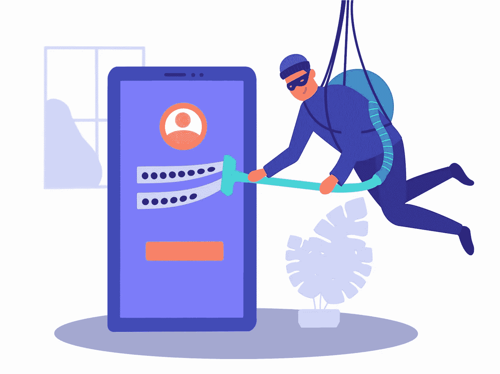

# IW 周刊#15:管理员帐户接管，IDOR 破解认证，网络诈骗，黑暗网络访问等。

> 原文：<https://infosecwriteups.com/iw-weekly-15-admin-account-takeover-idor-broken-authentication-cyberchef-alternatives-dark-web-ce821697e49e?source=collection_archive---------3----------------------->

嘿👋

欢迎来到第十五期的 **Infosec Weekly** —这是一份周一的时事通讯，将 Infosec 的精华直接发送到您的收件箱。

在今天的版本中，我们以 5 篇文章、4 个线程、3 个视频、2 个 Github repos 和工具、1 个工作提醒和即将举行的 CTF 活动的形式，策划了本周需要您关注的所有令人惊叹的 Infosec 内容，以帮助您最大限度地从这份简讯中受益，并在您的职业生涯中向前迈出一大步。

激动吗？让我们开始吧👇

# 📝5 篇信息安全文章

**#1 查看这篇关于**[**@ Mahmoud Youssef**](https://twitter.com/0xmahmoudJo0)**如何通过** [**奇怪的密码重置功能**](https://link.medium.com/lz14zf36krb) **接管管理员帐户的详细文章。**

**#2 关于** [**IDOR —破解认证**](https://redmethod.hashnode.dev/idor-broken-authentication?s=09) **的完整详细指南由**[**@ Shay Rand**](https://hashnode.com/@Shay)**给你一个完整的“如何思考和测试”的思路。**

**# 3**[**@ Frans ROSén**](https://twitter.com/fransrosen)**对于如何在 OAuth-flow 中仍然存在众多方法来窃取某些泄漏令牌做了大量研究。在这里阅读他的研究:-** [**在登录 OAuth-flows**](https://labs.detectify.com/2022/07/06/account-hijacking-using-dirty-dancing-in-sign-in-oauth-flows/) 中使用“辣身舞”进行帐户劫持

**#4 你会搜索旧节目吗？如果没有，请阅读关于** [**@Zunaid 麦合木提**](https://ivreznap.medium.com/) **如何能够在一个旧的私有程序** **中找到一个** [**有趣的权限提升漏洞。**](https://ivreznap.medium.com/interesting-privilege-escalation-in-an-old-private-program-225d27253e13)

**#5 一个有趣的 bug 链接引出**[**【PII】苹果用户(＄10k)**](https://ahmdhalabi.medium.com/pii-disclosure-of-apple-users-10k-d1e3d29bae36)**以及**[**@ Ahmad hala bi**](https://ahmadhalabi.net/biography/)**如何能够绕过程序的修复。**

# 🧵4 趋势线程

**#1 有没有想过好的 CyberChef 工具替代品？**[**@ Matt**](https://twitter.com/mattnotmax/)**s**[**短螺纹固网车的替代品和补充工具**](https://twitter.com/mattnotmax/status/1544279967122407424?s=20&t=kC9Byjua6WT-ev9FlBVAXw) **有你想要的。**

从一开始就准备好你的源代码审查技能？[**@ Ananda Dhakal**](https://twitter.com/dhakal_ananda/)**的 twitter 线程:** [**一个线程——源代码审核的资源**](https://twitter.com/dhakal_ananda/status/1544574015779606529?t=kb-B5IJfENymNZb7sLgnHw&s=19) **会对你有很大的帮助。**

**#3** [**当一个程序有一个类似站点的作用域时，你会怎么做。* (es|com|cn…)**](https://twitter.com/PhilippeDelteil/status/1545346122448883714?t=HvlxIMBU1RVYfQmKtZcPRg&s=19) **？**[**@ Philip Delteil**](https://twitter.com/PhilippeDelteil/)**用一条信息丰富的 twitter 帖子分享了他对这一场景的看法。**

**# 4**[**@ insider PhD**](https://twitter.com/InsiderPhD/)**在**[**# bugbounttips**](https://twitter.com/hashtag/bugbountytips?src=hashtag_click)**标签中放了一个很棒的 API 思维导图，如果你打算学习它，可以帮你有个想法。**
[**什么是 API？是什么让他们与众不同？现在有哪些 API？**](https://twitter.com/InsiderPhD/status/1544677186736619520?t=QvJHij3iZQJHsTnqA2NX3g&s=19)

# 📽️ 3 有见地的视频

有没有想过进入黑暗网络，探索它的秘密和阴谋？希斯·亚当斯又名[**@ the cyber mentor**](https://twitter.com/thecybermentor)**上传了一个关于** [**如何在 2022 年安全访问暗网**](https://youtu.be/EgXeXmNecto) **的很棒的视频。**

**#2 在 youtube 上观看**[**@ mastersinit 1**](https://twitter.com/MastersinIT1)**的精彩视频采访，了解更多关于** [**网络安全的真实世界|网络安全对话 Sainath Volam**](https://youtu.be/GG3aCxIw-2M) **。**

**#3 想用**[**@ 0x TiB 3 rius**](https://twitter.com/0xtib3rius)**学习 Json WebTokens 和 solve labs？看看他的这个视频，为 JWT 学习和解决实验室:-** [**Web App 周三(6/22/22) — Portswigger JWT 实验室**](https://youtu.be/qJR2g41n-uc) **。**

# ⚒️2 Github 库和工具

**#1 一个组织良好的 github 库，包含** [**bugbounty 评论集**](https://github.com/alexbieber/Bug_Bounty_writeups) **被划分为 Owasp 十大漏洞。**

**# 2**[**Koh**](https://github.com/GhostPack/Koh)**是一个 C#和信标对象文件(BOF)工具集，允许通过有目的的令牌/登录会话泄漏来捕获用户凭证材料。**

# 💰1⚠️工作预警

**#1** [**QualySec 招聘渗透测试实习生**](https://www.linkedin.com/posts/qualysectech_hiring-requirments-pentestinginterns-activity-6950063879028641792-Avb2/)

[**此处适用**](https://www.linkedin.com/posts/qualysectech_hiring-requirments-pentestinginterns-activity-6950063879028641792-Avb2/) **。**

地点:布巴内斯瓦尔

# 🎮即将到来的 CTF 活动

**#1 wtfCTF 2022 v2.0 —危险**

[**http://wtfctf.wearemist.in/**](http://wtfctf.wearemist.in/)

[**https://ctftime.org/event/1693**](https://ctftime.org/event/1693)

**Fri，2022 年 7 月 15 日 12:00 世界协调时+00:00**

**体重:19 分**

**持续时间:2 天**

**#2 HTB 商业 CTF 2022:脏钱——危险**

[**https://www.hackthebox.com/events/htb-business-ctf-2022**](https://www.hackthebox.com/events/htb-business-ctf-2022)

[**https://ctftime.org/event/1685**](https://ctftime.org/event/1685)

**Fri，2022 年 7 月 15 日 13:00 世界协调时+00:00**

**重量:24 分**

**持续时间:2 天 6 小时**

**#3 加密 CTF 2022——危险**

[**https://cr.yp.toc.tf/**](https://cr.yp.toc.tf/)

[**https://ctftime.org/event/1573**](https://ctftime.org/event/1573)

**Fri，2022 年 7 月 15 日 14:00 世界协调时+00:00**

**体重:48 分**

**持续时间:1 天**

**#4 想象力 CTF 2022 —危险**

[**https://2022.imaginaryctf.org/**](https://2022.imaginaryctf.org/)

[**https://ctftime.org/event/1670**](https://ctftime.org/event/1670)

****Fri，2022 年 7 月 15 日 20:00 世界协调时+00:00****

****重量:24 点****

****持续时间:3 天****

**这星期就这些了。希望你喜欢这些令人难以置信的发现，并从今天的时事通讯中学到一些新东西。**

****在我们说再见之前……****

**如果你觉得这篇时事通讯很有趣，并且知道其他人也会感兴趣，如果你能把它转发给他们，我们将不胜感激📨**

**如果您有问题、评论或反馈，请回复此邮件或在 Twitter [@InfoSecComm](https://twitter.com/InfoSecComm) 上告诉我们。**

**下周再见。**

**很多爱**

**编辑团队，**

**[信息安全报道](https://infosecwriteups.com/)**

***这份简讯是我们与“神奇大使”合作制作的。***

***资源贡献者:* [*阿尤什·辛格*](https://twitter.com/AyushSingh1098) ， [*马尼凯什·辛格*](https://twitter.com/X71n0?t=WYKqmnE22AY_ZAq73FeCOA&s=09) ， [*维奈·库马尔*](https://twitter.com/R007_BR34K3R) *，* [*比马·k·萨胡*](https://twitter.com/sr_b1mal) *，* [*莫希特·赫姆昌达尼*](https://twitter.com/mohitkchandani) *，***

***通迅格式由:* [*西达尔特*](https://twitter.com/illucist_) ， [*Bhavya Jain*](https://twitter.com/bhavyajain_30) ，[*Vinay Kumar*](https://twitter.com/R007_BR34K3R)*。***

**如果您希望加入我们的大使频道并为时事通讯投稿，请在 Twitter 上用您的 discord 用户名向我们发送 DM。**