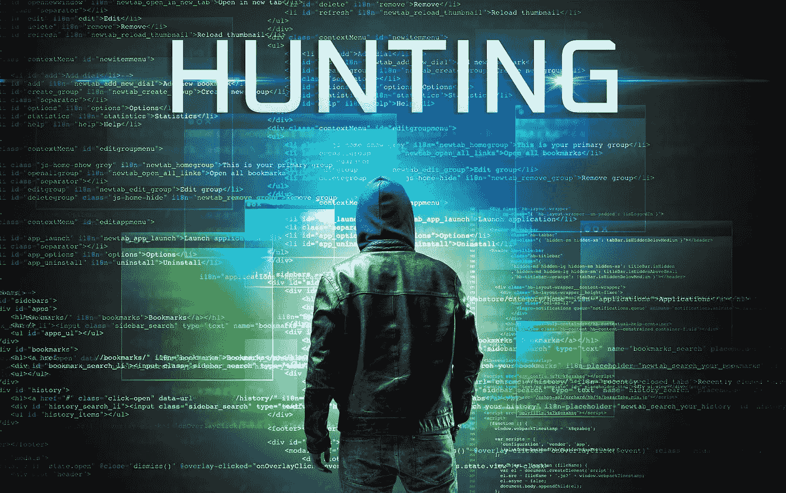

# IW 周刊#16: AWS 漏洞，威胁追踪，反射 XSS，测试资源，命令注入和更多…

> 原文：<https://infosecwriteups.com/iw-weekly-16-aws-vulnerability-threat-hunting-reflected-xss-pentesting-resource-command-1b172801f2b7?source=collection_archive---------1----------------------->

嘿👋

欢迎来到第十六期的 **Infosec Weekly** —这是一份周一的时事通讯，将 Infosec 的精华直接发送到您的收件箱。

网络安全世界正在发生如此多的新事物，以至于很难跟上！🥲

我们已经为您完成了所有的艰苦工作，选择了本周引起我们注意的最顶尖的 Infosec 材料。格式为:5 篇文章、4 个线程、3 个视频、2 个 Github repos 和工具、1 个工作提醒和即将到来的 CTF 活动，帮助您最大限度地从这份简讯中受益，并在您的职业生涯中向前迈出一大步。

激动吗？让我们开始吧👇

# 📝5 篇信息安全文章

**# 1**[**@ GAF nit Amiga**](https://blog.lightspin.io/author/gafnit-amiga)**解释了在 AWS IAM 验证器** **中检测到的三个漏洞，它们都是由同一代码行引起的。**

**# 2**[**@ OriginalSicksec**](https://twitter.com/originalsicksec?lang=en)**的新博客谈到了** [**你如何找到并滥用网址缩写给 ATO 或者信息泄露**](https://sicks3c.medium.com/abusing-url-shortners-for-fun-and-profit-c83c67713916) **。**

**# 3**[**@ dajon**](https://medium.com/@dajon)**分享一篇详细的博客，让你从** [**Null 到 Bug Hunter for IDOR 漏洞**](https://medium.com/@dajon/null-to-bug-insecure-direct-object-reference-4cf96c6eeb0f) **。**

**# 4 Tableau 服务器中的**[**@ go secure _ Inc**](https://twitter.com/gosecure_inc?lang=en)**发现了一个漏洞，该漏洞可能允许恶意参与者通过反射的 XSS** **从应用程序中提取** [**敏感数据。**](https://www.gosecure.net/blog/2022/07/13/tableau-server-leaks-sensitive-information-from-reflected-xss/)

**# 5**[**@大卫法国**](https://twitter.com/threatpunter) **分享一些** [**威胁狩猎和安全监控小技巧，帮助防御练习者**](https://medium.com/threatpunter/okta-threat-hunting-tips-62dc0013d526) **保护自己的 Okta 环境免受攻击。**

# 🧵4 趋势线程

**# 1**[**@ sec _ r0**](https://twitter.com/sec_r0)**在** [**上分享他最新的安全 zine，一枪搞定 6 种不同类型的网络攻击**](https://twitter.com/sec_r0/status/1547850533142007811?t=lHWS4pF2k2tZMlSk7RLjsA&s=19) **像僵尸网络、MITM、DNS 欺骗等。**

**# 2**[**@蛮逻辑**](https://twitter.com/brutelogic) **幽默地分享了** [**一个更新新鲜的 XSS 多语者**](https://twitter.com/brutelogic/status/1546823781519441922?t=Eq8xGl0OJd-UYqcUCY9qUw&s=19) **在一条推文中回复了他正在建设的 XSS 多语者博客。**

**#3 始于五旬节？下面是一个由**[**@布兰登罗西**](https://twitter.com/0xconda) **到** [**的五旬节领域入门的详细线程。**](https://twitter.com/0xconda/status/1545760671085871104?s=21&t=R5Wq47umg0IkLYgAKZzltw)

**#4 你一定会喜欢这个** [**快速一个眼线笔找到 XSS 在尺度**](https://twitter.com/ReconOne_/status/1547304157916307457?s=20&t=K3mQEj59yssFaBHm5NwJgA)**[**@ re cone**](https://twitter.com/ReconOne_)**。****

# **📽️ 3 有见地的视频**

****# 1**[**@ Z-winK**](https://twitter.com/_zwink)**在他的 Bug Bounty Bootcamp 系列中上传了一个新视频——**[**与一个真实的目标**](https://youtu.be/eSpOgl8l7AY) **一起工作，他在视频中看到了 Zseano 的 FastFoodHackings 网站的 15 个漏洞。****

****# 2**[**@ pwn function**](https://twitter.com/PwnFunction)**的新视频名为** [**如何预测随机数**](https://www.youtube.com/watch?v=-h_rj2-HP2E) **上哪儿他就用 z3 破解 JavaScript 中的 Math.random 方法。****

****# 3**[**@ Rana _ _ Khalil**](https://twitter.com/rana__khalil)**的新长版视频是关于 Lab#5** [**命令注入带外数据渗出**](https://youtu.be/v_UVXSTkSfA)**

# **⚒️2 Github 库和工具**

****#1** [**DBNS(数据库细胞核扫描仪)**](https://github.com/FleexSecurity/dbns)**by**[**fleex security**](https://github.com/FleexSecurity)**通过将结果保存在数据库中，您可以简单地跟踪您的细胞核扫描结果，****

****# 2**[**Apkleaks**](https://github.com/dwisiswant0/apkleaks)**by**[**@ dwisiswant 0**](https://twitter.com/dwisiswant0)**扫描 APK 文件寻找 URIs，端点&秘密。****

# **💰1⚠️工作预警**

****#1 查看** [**岗位角色**](https://www.linkedin.com/posts/rohit-sarkar-8773aa16a_hi-all-aujas-is-hiring-interested-please-activity-6952896603275812864-xQWQ/?utm_source=linkedin_share&utm_medium=android_app) **发帖人** [**奥雅网络安全**](https://www.aujas.com/) **。****

****所需经验:2 至 4 年。****

****在此申请:-** [**Web app 安全—手机 app 安全—代码审查**](https://www.linkedin.com/posts/rohit-sarkar-8773aa16a_hi-all-aujas-is-hiring-interested-please-activity-6952896603275812864-xQWQ/?utm_source=linkedin_share&utm_medium=android_app)**

# **🎮即将到来的 CTF 活动**

****# 1 BD sec CTF 2022——危险****

**职业黑客、学生和网络安全爱好者的危险风格 CTF。**

**[https://bdsec-ctf.com/](https://bdsec-ctf.com/)**

**[https://ctftime.org/event/1699](https://ctftime.org/event/1699)**

**世界协调时 2022 年 7 月 20 日星期三 15:00+00:00**

**权重:0 分**

**持续时间:1 天**

****# 2 CTF 2022 年列克星敦信息学锦标赛—危险事件****

**列克星敦高中主办的初学者友好的危险风格的 CTF**

**[https://lit.lhsmathcs.org/](https://lit.lhsmathcs.org/)**

**[https://ctftime.org/event/1694](https://ctftime.org/event/1694)**

**Fri，2022 年 7 月 22 日 15:00 世界协调时+00:00**

**重量:23 分**

**持续时间:2 天 12 小时**

**这星期就这些了。希望你喜欢这些令人难以置信的发现，并从今天的时事通讯中学到一些新东西。**

****在我们说再见之前……****

**如果你觉得这篇时事通讯很有趣，并且知道其他人也会感兴趣，如果你能把它转发给他们，我们将不胜感激📨**

**如果您有问题、评论或反馈，请回复此邮件或在 Twitter [@InfoSecComm](https://twitter.com/InfoSecComm) 上告诉我们。**

**下周再见。**

**很多爱**

**编辑团队，**

**[信息安全报道](https://infosecwriteups.com/)**

***这份简讯是我们与“神奇大使”合作制作的。***

***资源贡献者:* [*阿尤什·辛格*](https://twitter.com/AyushSingh1098) ， [*维奈·库马尔*](https://twitter.com/R007_BR34K3R) *，* [*比马·k·萨胡奥*](https://twitter.com/srb1mal) *，* [*莫希特·凯姆昌达尼*](https://twitter.com/mohitkchandani) *，* [*哈迪克·辛格*](https://twitter.com/Kxddah?t=_Ghby7u5rNBfUxzzjEZUUw&s=09) *和***

***通迅格式由:* [*西达尔特*](https://twitter.com/illucist_) 和 [*哈迪克辛格*](https://twitter.com/Kxddah?t=_Ghby7u5rNBfUxzzjEZUUw&s=09) *。***

***如果您希望加入我们的大使频道并为时事通讯投稿，请在 Twitter 上用您的 discord 用户名向我们发送 DM。***