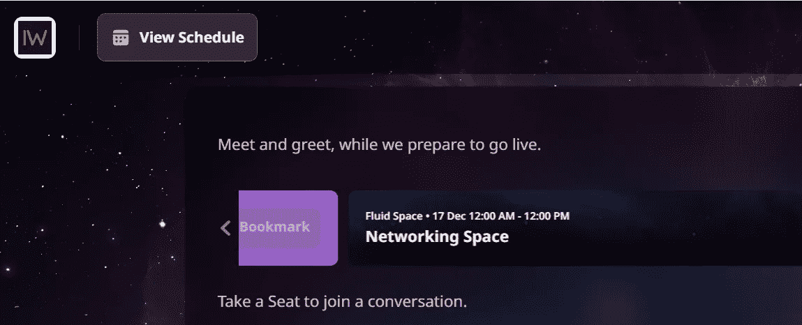
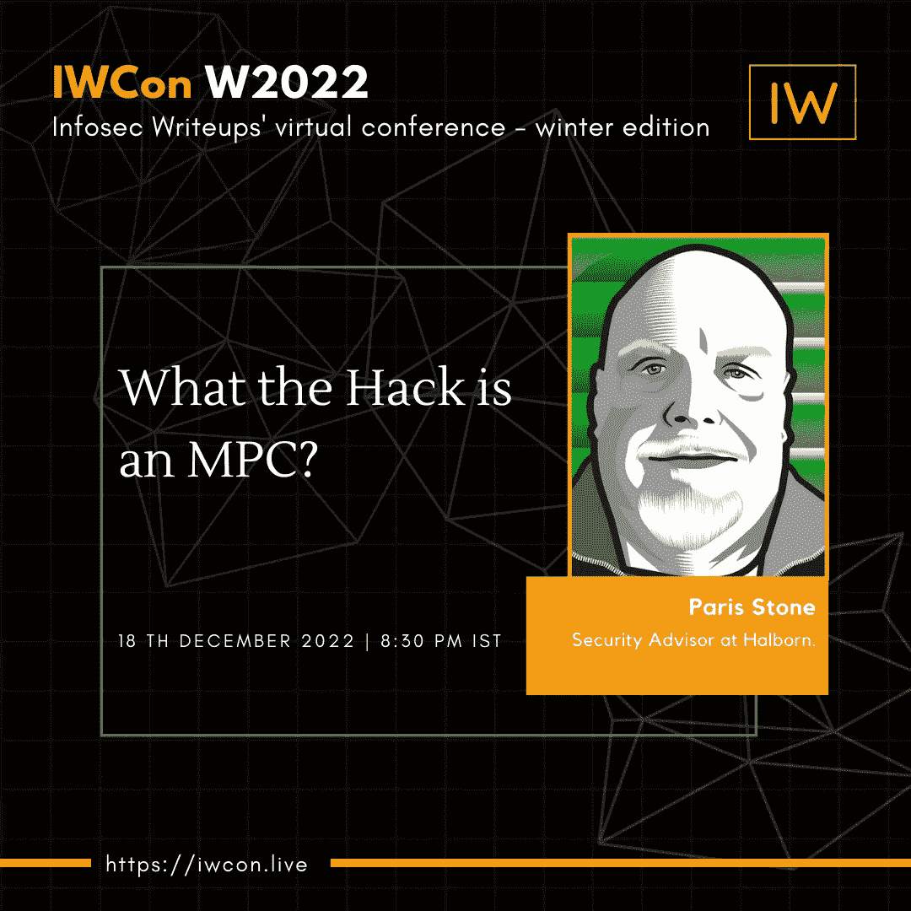

# IWCON2022 网络室现已开放+新扬声器发布

> 原文：<https://infosecwriteups.com/iwcon2022-networking-rooms-are-now-open-new-speaker-announcement-de2394b4fd0e?source=collection_archive---------6----------------------->

## 加入来自世界各地专家的超酷信息安全讨论！

图片由作者提供。

亲爱的黑客:

没有网络方面，任何会议都是不完整的。

这就是为什么-# iwcon 2022 的超酷网络室这次将开放 48 小时！

通过这种方式，来自世界各地的人们可以加入进来&结交一些了不起的 infosec 朋友，而不用考虑他们的时区。

如果您已经注册了该活动，请加入并开始对话！

如果您还没有注册， [**保存您现在的座位**](https://iwcon.live/) **。**

PS:如果你想知道虚拟网络会议是什么样子的，请点击这里查看 IWCON 早期版本的一些片段

# 公告:我们有一个新的发言者！

我们在最后时刻迎来了一位令人惊叹的新演讲者！

屡获殊荣的解决方案公司 Halborn 的安全顾问 Paris Stone 将在**上发表演讲:MPC 是什么？**

时间:2022 年 12 月 18 日晚 8 点 30 分，IST。

想了解更多信息吗？ [**今天就预订机票吧！**](https://iwcon.live/)

# 有什么问题吗？我们是来解决这些问题的。

如果您有任何问题、疑虑或阻碍您参加 IWCON 2022 的障碍，我们很乐意回答。

请回复此邮件(或在下方留下评论)，我们将尽快回复您。

期待在 IWCON 2022 上与您见面。

[***今天就预订座位*** 。](https://razorpay.com/payment-button/pl_K8cxPtmUyBH2PC/view)

最佳，
编辑团队
Infosec 报道。