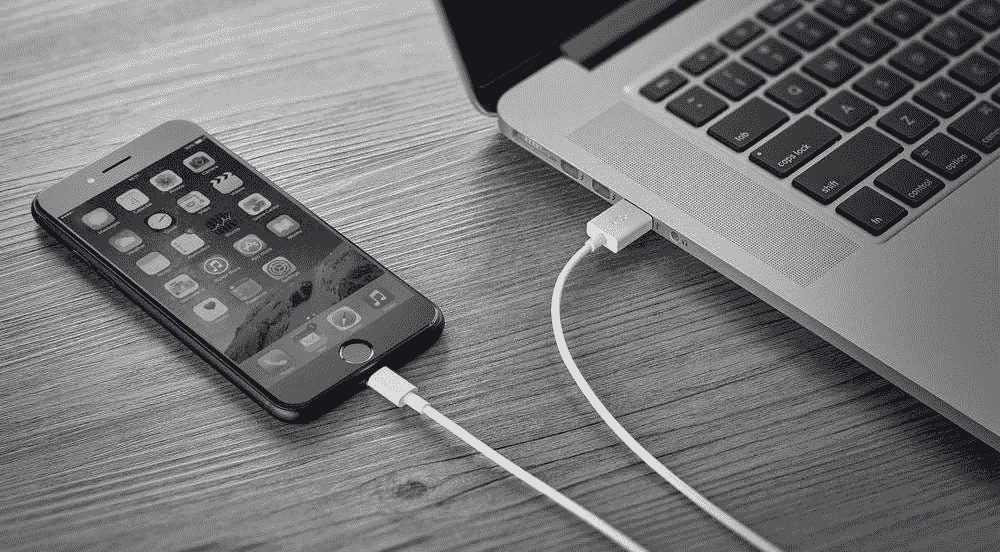

# 在没有 Mac 的情况下越狱 iOS(1/4):计划

> 原文：<https://infosecwriteups.com/jailbreaking-ios-without-a-mac-1-4-the-plan-b49c0edc1759?source=collection_archive---------1----------------------->

使用带有(半)合法工具的 Linux 安装未签名的 iOS 应用(越狱的前提条件是什么)。

考虑以下情况:我们有一个工厂安装的 iOS 设备(**这里是 iPhone 5S** )带有最近的 [iOS 版本](https://en.wikipedia.org/wiki/IOS_version_history#iOS_12) (12.4.8)，我们想越狱它。**我们有一个 Linux 桌面**(以下指南中的 [Arch Linux](https://www.archlinux.org/) )，一个用于 iPhone 设备的 [lightning](https://en.wikipedia.org/wiki/Lightning_(connector)) 线缆，仅此而已。比如**我们没有安装 [macOS](https://en.wikipedia.org/wiki/MacOS) 的正版苹果硬件**。

有很多免费的 iOS 越狱解决方案。大部分是分布在[的 iOS 应用。ipa](https://en.wikipedia.org/wiki/.ipa) 文件格式包。越狱程序的先决条件是在 iPhone 设备上安装和运行这些应用程序。

浏览越狱解决方案， [Pwn20wnd](https://twitter.com/Pwn20wnd) 的那个叫 **unc0ver** 的好像比较合适。最新版本可以从“官方” [unc0ver.dev](https://unc0ver.dev/) 网站下载(更早的版本带源码也可以在其专用的 [github repo](https://github.com/pwn20wndstuff/Undecimus) 中获得)。

最先进的越狱工具。iOS 11.0–13.5

唯一的问题是**我们不能在非越狱设备**上安装它**，因为它缺少有效的签名**。

# 签名问题

虽然在 Android 设备上安装第三方应用程序可以使用自签名证书，但 iOS(无越狱)**只接受由官方 Apple CA** 签名的证书。如果没有 Apple CA 批准的签名。无法安装和运行 ipa 包文件。

有各种级别的代码签名解决方案:

*   使用(付费)开发者帐户:对于 Apple Store，企业级开发/测试(在多个设备上)
*   免费 Apple ID:用于在个人设备上进行开发/测试。

当然，通过 Apple Store 分发类似越狱的恶意应用是不可能的。

有时候你可以找到一些签署了某种企业级开发证书的可下载越狱应用，可能会起作用(通过 lightning cable 空中安装或侧装后，在 iOS 设置中接受开发证书)，但迟早会被苹果屏蔽(证书会被撤销)。此外，这些越狱应用程序可能与“官方”越狱发行版略有不同，因此使用这些应用程序显然是一个额外的风险因素。

最干净的解决方案应该是**使用一个免费的 Apple ID 绑定到要越狱的设备**上，**为 unc0ver app 创建一个自定义的有效签名**。

# 使用免费的 Apple ID 进行代码签名

̵i̵s̵(在撰写本文时)有一个简单的多平台 GUI 解决方案，用于代码签名和部署 iOS 应用程序(as。ipa 文件)下载到 iOS 设备，使用的是一个名为 [Cydia Impactor，](http://www.cydiaimpactor.com/)的免费苹果 ID，但不幸的是(在苹果/XCode API 升级后)在 2019 年它停止了工作。

有替代的第三方解决方案(不是针对 Linux，而是在 Windows 上)现在可能可以工作，直到签名过程中有一些更新的升级，但是**有一个健壮的、官方的代码签名方法:使用苹果开发者工具 XCode 本身**。在设备绑定免费 Apple ID 的情况下使用 XCode 对 app(尤其是 unc0ver 越狱 app)进行签名后，就可以在 iPhone 上安装运行了。

只有一个小问题:XCode 只能在 macOS 上运行。

# 运行没有苹果硬件的 macOS

所以问题是:有没有可能在 Linux 操作系统上运行 XCode(或者在非苹果正版硬件上)？感谢一些伟大的人，这是可能的。

有一个有趣的项目叫做 [Darling](https://github.com/darlinghq/darling) ，它是一个用于 Linux 的 macOS 仿真层(可以把它想象成在 Linux 上运行 Windows 二进制文件的 [Wine](https://www.winehq.org/) )。不幸的是，这是在早期阿尔法状态，运行 XCode(和连接 iPhone)仍然没有工作。

一个更难的解决方案是虚拟化:myspaghetti/macos-virtualbox 是 virtualbox 最新 macos 系统的“按钮”安装程序。只要运行这个脚本，它就可以下载和安装所有东西，而无需用户交互。很快，一个几乎全功能的 macOS 虚拟化系统就准备好了。但是 USB 出现了一个问题:无法将 iPhone 设备连接到访客 macOS 虚拟机。

另一个**高效的虚拟化平台是** [**QEMU/KVM**](https://wiki.archlinux.org/index.php/KVM) 。由 [Dhiru Kholia](https://twitter.com/DhiruKholia) 开发的 [OSX-KVM](https://github.com/kholia/OSX-KVM) 项目是一个在 QEMU/KVM(例如在 Linux 主机上)上下载、安装和运行 macOS 的最新解决方案。这个解决方案的一个很大的优点就是 QEMU/KVM **支持** [**使用 IOMMU 从主机到访客的 PCI passthrough**](https://wiki.archlinux.org/index.php/PCI_passthrough_via_OVMF) (如果你的[硬件支持 IOMMU](https://en.wikipedia.org/wiki/List_of_IOMMU-supporting_hardware) )。因此，有可能将整个 USB 设备传递给访客，并且通过这种方式**有可能将 iPhone 连接到虚拟 macOS 系统**(而不用担心主机和访客上不工作、不兼容的 USB 驱动程序)。

因此，让我们在 OSX-KVM 项目中使用 QEMU/KVM，并使用 IOMMU 遍历整个 USB 控制器。在此之后，可以使用 XCode 对连接的 iPhone 进行代码签名(甚至重新签名)。

# 这个计划

所以让我们总结一下:

*   使用 [OSX-KVM](https://github.com/kholia/OSX-KVM) 项目安装 QEMU/KVM 虚拟化 macOS 系统(第 2/4 部分)
*   配置 USB 控制器的 PCI 直通，以将 iPhone 连接到来宾虚拟机(第 3/4 部分)
*   使用 XCode 为连接的 iPhone 签署 unc0ver 越狱应用程序(或其他任何东西)并安装它(第 4/4 部分)。

优于其他解决方案的优点:

*   因此，**你也将拥有一台功能齐全的 macOS** 虚拟机，并与 iPhone 相连。
*   与使用一键式解决方案相比，我们可以更好地理解和控制流程。
*   这个过程的理论**将在未来**起作用，而第三方解决方案将在苹果升级和修改 API 或其他之后失效。
*   “只”需要信任官方的越狱应用，**不需要信任完全未知来源的可能的恶意二进制文件。**
*   没有必要在你的主机上安装危险的(可能是恶意的)工具。甚至 macOS 虚拟机也保持干净。
*   一切都是免费的。

缺点:

*   这个过程肯定比其他一键式(或无线)解决方案**复杂得多**。
*   你需要一个**有足够资源的最新主机硬件**。

细节将在接下来的部分中介绍。请继续关注，第 2 部分是关于安装虚拟化 macOS 系统的。