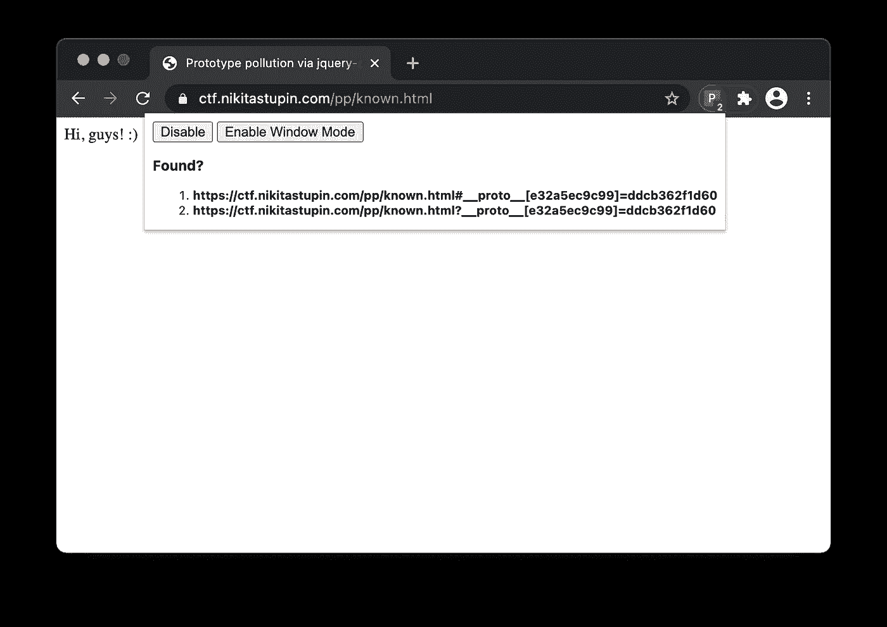
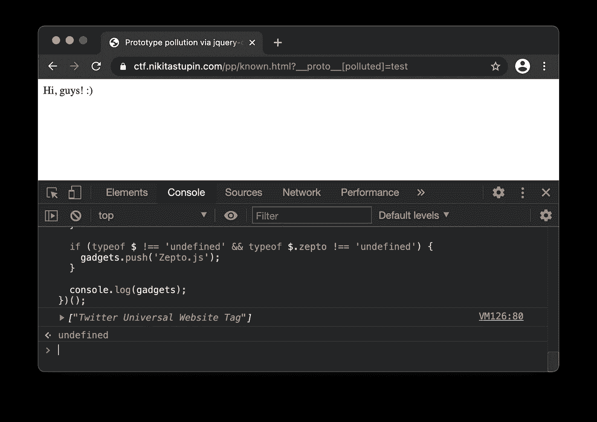
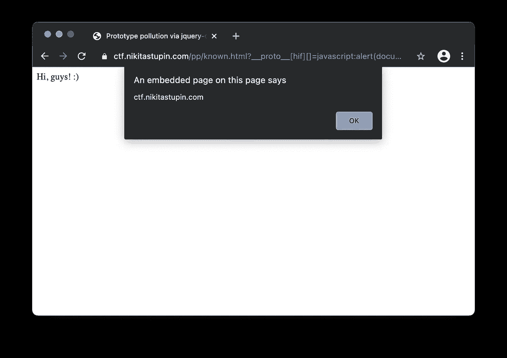
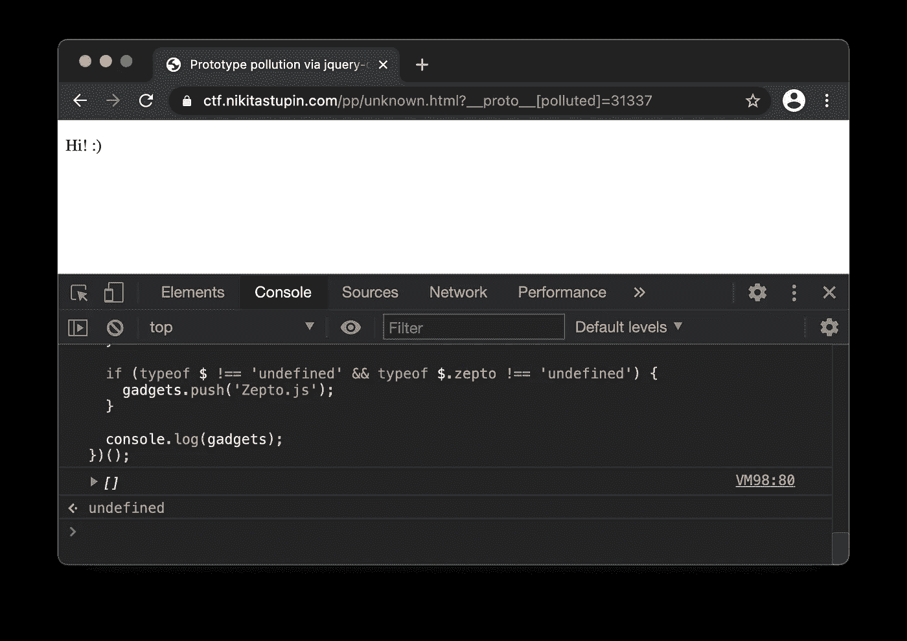
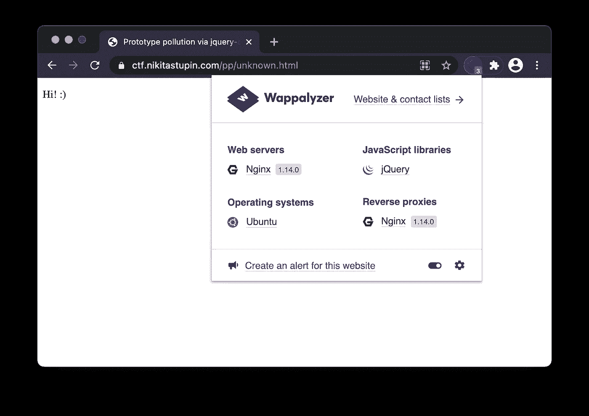
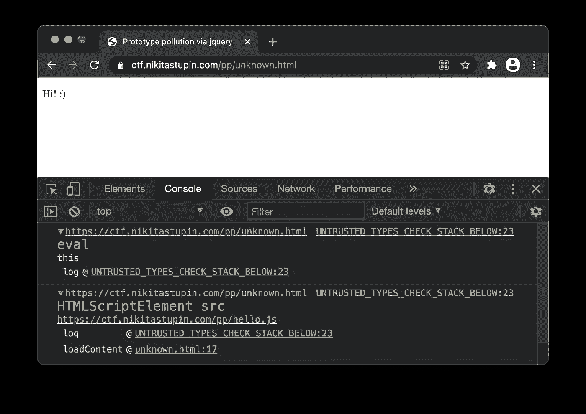
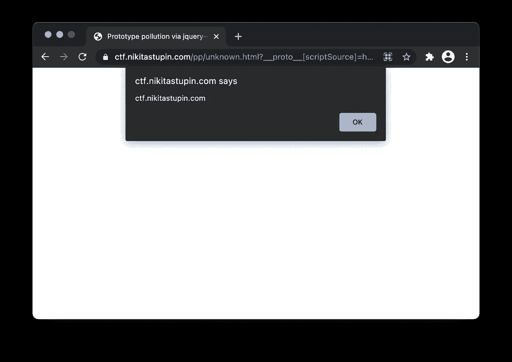
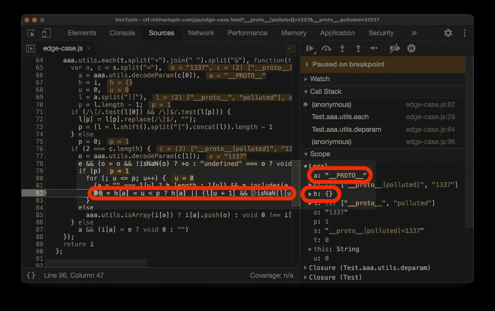

# JavaScript 原型污染:发现和利用的实践

> 原文：<https://infosecwriteups.com/javascript-prototype-pollution-practice-of-finding-and-exploitation-f97284333b2?source=collection_archive---------0----------------------->

如果你关注参与 bug bounty 计划的研究人员的报告，你可能知道 JavaScript 原型污染漏洞的类别。如果您第一次没有看到这个短语，那么我建议您填补这个空白，因为这个漏洞可能会导致服务器和客户端完全受损。您使用或开发的产品中至少有一个运行在 JavaScript 上:web 应用程序的客户端部分、桌面(电子)、服务器(节点)或移动应用程序。

这篇文章将帮助你深入原型污染的话题。在**和**章节中，什么是原型污染？您将了解 JavaScript 对象和原型是如何工作的，以及它们的具体功能是如何导致漏洞的。在**客户端原型污染**和**服务器端原型污染**小节中，您将了解如何在现实情况中搜索和利用该漏洞。最后，您将了解如何保护您的应用程序，以及为什么最常见的保护方法很容易被绕过。

在继续下一节之前，我建议您打开开发人员工具，亲自尝试一下本文中给出的示例，以便获得一些实践经验和对材料的更深入理解。

# JavaScript 特性

原型污染漏洞是 JavaScript 语言独有的。因此，在处理漏洞本身之前，我们需要了解导致漏洞的 JavaScript 特性。

## 目标

JavaScript 中对象是如何存在的？打开[开发者工具](https://developers.google.com/web/tools/chrome-devtools/open)并创建一个包含两个属性的简单对象。

我们可以通过两种主要方式访问对象的属性。

如果我们试图访问一个不存在的属性会发生什么？

我们得到了值`undefined`，这意味着属性丢失了。到目前为止一切顺利。

在 JavaScript 中，函数可以像普通变量一样处理(更多信息请参考[一级函数](https://developer.mozilla.org/en-US/docs/Glossary/First-class_Function)文章)，所以对象方法被定义为属性，事实上也确实如此。将`foo()`方法添加到`o`对象中并调用它。

姑且称之为`toString()`法。

突然，`toString()`方法被执行，即使`o`对象没有`toString()`方法！我们可以使用`Object.getOwnPropertyNames()`功能对此进行检查。

事实上，只有三个属性:`name`、`surname`和`foo`。`toString()`方法从何而来？

## 对象原型

就实体数量而言，JavaScript 是最少的。几乎任何实体都是包含数组、函数甚至类定义的对象！我们会在课堂上更详细地讲到这里。

在 JavaScript 中，没有大多数程序员共同理解的类。如果您以前没有遇到过 JavaScript 中的类，但是有使用其他语言中的类的经验，那么我建议的第一件事是忘记您所知道的关于类的一切。

所以，假设你有两个实体:一个[对象](https://developer.mozilla.org/en-US/docs/Web/JavaScript/Data_structures#data_and_structure_types)和一个[原语](https://developer.mozilla.org/en-US/docs/Web/JavaScript/Data_structures#data_and_structure_types)(数字、字符串、`null`等)。).如何使用它们来实现继承这样一个方便的类特性呢？您可以选择每个对象将拥有的特殊属性。它将包含对父级的引用。我们姑且称这个属性为`[[Prototype]]`。好吧，如果我们不想从父类继承所有的属性和方法呢？让我们从父类中选择一个特殊的属性，将从该属性中继承属性和方法，并将其命名为`prototype`！

有几种方法[可以找出一个物体](https://developer.mozilla.org/en-US/docs/Learn/JavaScript/Objects/Object_prototypes)的原型，例如，通过使用`Object.getPrototypeOf()`方法。

我们只返回了`[Object.prototype](https://developer.mozilla.org/en-US/docs/Web/JavaScript/Reference/Global_Objects/Object)`，它是 JavaScript 中几乎所有对象的原型。确定这是一个`Object.prototype`非常简单。

当你通过`o.name`或`o['name']`访问一个对象属性时，实际上执行以下操作:

1.  JavaScript 引擎在`o`对象中搜索`name`属性。
2.  如果属性存在，则返回该属性。否则，获取`o`对象的原型，并在其中搜索属性！

所以结果是，`toString()`方法实际上是在`Object.prototype`中定义的，但是因为在创建一个对象时，它的原型被隐式地赋给了`Object.prototype`，所以我们几乎可以为任何事情调用`toString()`方法。

反过来，父节点也可以有原型，父节点的父节点，以此类推。从一个对象到`null`的原型序列被称为原型链或[原型链](https://developer.mozilla.org/en-US/docs/Web/JavaScript/Inheritance_and_the_prototype_chain)。在这方面，一个小备注:当访问一个属性时，在整个原型链中搜索该属性。

以对象`o`为例，原型链比较短，只有一个原型。

对于`window`对象就不能这么说了。

顺便说一下，根据上下文的不同，JavaScript 中的“原型”一词至少可以指三种不同的东西:

*   内部属性`[[Prototype]]`。它被称为 internal，因为它位于 JavaScript 引擎的“内部”，我们只能通过特殊函数`__proto__`、`Object.getPrototypeOf()`和其他函数来访问它。
*   prototype 属性:Object.prototype、Function.prototype 等。
*   `__proto__`属性。这是一种罕见且不太正确的用法，因为从技术上讲`__proto__`是一个 getter / setter，它只获取对对象原型的引用并返回它。

# 什么是原型污染？

术语原型污染是指[基本对象](https://developer.mozilla.org/en-US/docs/Web/JavaScript/Reference/Global_Objects#fundamental_objects)的`prototype`属性发生变化的情况。

执行这段代码后，几乎任何对象都将拥有一个值为`42`的`age`属性。例外情况有两种:

*   如果在对象上定义了`age`属性，它将覆盖原型的相同属性。
*   如果对象不是从`Object.prototype`继承的。

原型污染在代码中可以是什么样子？考虑程序`pp.js`。

如果攻击者控制了参数`a`和`v`，他们可以将 a 设置为`'__proto__ '`，将`v`设置为任意字符串值，从而将`test`属性添加到`Object.prototype`。

恭喜你，我们刚刚发现原型污染！"但是有哪个头脑正常的人会使用这样的结构呢？"—你可能会问。的确，这种例子在现实生活中很少出现。然而，在某些情况下，有一些看似无害的构造允许我们添加或更改`Object.prototype`的属性。具体的例子将在下面的章节中讨论。

# 客户端原型污染

2020 年中期开始积极探索客户端原型污染。目前，当有效载荷在请求参数中(在`?`之后)或在片段中(在`#`之后)时，向量被很好地研究。此漏洞通常会升级为反射 XSS。

很有可能有效负载不仅可以在请求参数或片段中传递，还可以保存在服务器上。因此，有效负载将在每次访问某个页面的每个用户都起作用，不管他是否访问了恶意链接。

## 寻找原型污染

让我们试着在一个脆弱的地点找到污染的原型。最简单的方法是为谷歌 Chrome 安装 [PPScan](https://github.com/msrkp/PPScan) 扩展并访问易受攻击的页面。

我们可以看到分机上的计数器现在等于 2。这意味着其中一个有效载荷工作良好。如果我们单击扩展图标，我们将会看到有效负载证明存在漏洞。

*PPScan 扩展正在运行*

让我们用手试试其中的一个有效负载:点击链接`https://ctf.nikitastupin.com/pp/known.html?__proto__[polluted]=test`，打开开发者工具并检查结果。

太好了，有效载荷起作用了！不幸的是，客户机原型污染本身并不构成严重的危险。您最多可以用它来创建一个客户端 DoS，这可以通过更新页面来处理。

# 影响和小工具

在客户端，升级到 XSS 是最有趣的。可用于将原型污染升级到其他漏洞的 JavaScript 代码称为 gadget。一般来说，我们要么有一个众所周知的小工具，要么我们必须自己寻找小工具。搜索新的小玩意要花很多时间。

## 使用现有小工具

首先，检查一下[black fan/client-side-prototype-pollution](https://github.com/BlackFan/client-side-prototype-pollution)资源库或[跨站脚本(XSS)备忘单](https://portswigger.net/web-security/cross-site-scripting/cheat-sheet#prototype-pollution)中现有的小工具是有意义的。

至少有两种方法可以检查已知的小工具:

*   使用 [Wappalyzer](https://chrome.google.com/webstore/detail/wappalyzer/gppongmhjkpfnbhagpmjfkannfbllamg?hl=en) 插件。
*   使用脚本 [fingerprint.js](https://gist.github.com/nikitastupin/b3b64a9f8c0eb74ce37626860193eaec) 。

让我们使用第二种方法，但首先我们要了解它是如何工作的。通常，小工具将在全局上下文中定义特定的变量，通过这些变量的存在，您可以确定小工具的存在。例如，如果您使用 Twitter 广告，您可能会使用 Twitter 通用网站标签，该标签将定义`twq`变量。 [fingerprint.js](https://gist.github.com/nikitastupin/b3b64a9f8c0eb74ce37626860193eaec) 主要检查全局上下文中的特定变量。我从[black fan/client-side-prototype-pollution](https://github.com/BlackFan/client-side-prototype-pollution)借用了小工具和它们对应的变量。

复制脚本并在易受攻击的页面的上下文中执行。

[*fingerprint . js*](https://gist.github.com/nikitastupin/b3b64a9f8c0eb74ce37626860193eaec)*显示页面有 Twitter 通用网站标签小工具*

看起来该页面有一个 Twitter 通用网站标签小工具。我们在[black fan/client-side-prototype-pollution](https://github.com/BlackFan/client-side-prototype-pollution)中找到了这个小工具的描述，最重要的是，我们对带有现成有效载荷的 [PoC](https://github.com/BlackFan/client-side-prototype-pollution/blob/004bf5353f6f30b720f3d68c5aca5191531f35d6/gadgets/twitter-uwt.md#poc) 部分感兴趣。在易受攻击的站点`[https://ctf.nikitastupin.com/pp/known.html?__proto__[hif][]=javascript:alert(document.domain)](https://ctf.nikitastupin.com/pp/known.html?__proto__[hif][]=javascript:alert(document.domain).)` [上测试有效载荷。](https://ctf.nikitastupin.com/pp/known.html?__proto__[hif][]=javascript:alert(document.domain).)

*在一个知名小工具的帮助下，原型污染成功运行*

几秒钟后，梦寐以求的`alert ()`出现了，太棒了！

## 寻找新的小工具

没有小工具的时候我们该怎么办？我们去`https://ctf.nikitastupin.com/pp/unknown.html`看看，确保它容易受到原型污染`[https://ctf.nikitastupin.com/pp/unknown.html?__proto__[polluted]=31337](https://ctf.nikitastupin.com/pp/unknown.html?__proto__[polluted]=31337.)` [。](https://ctf.nikitastupin.com/pp/unknown.html?__proto__[polluted]=31337.)

不过，这一次 [fingerprint.js](https://gist.github.com/nikitastupin/b3b64a9f8c0eb74ce37626860193eaec) 没有找到小工具。

[*fingerprint . js*](https://gist.github.com/nikitastupin/b3b64a9f8c0eb74ce37626860193eaec)*没找到那个小玩意*

尽管 Wappalyzer 报告了 jQuery 的存在，但这是一个误报，因为在站点`[https://ctf.nikitastupin.com/pp/unknown.html](https://ctf.nikitastupin.com/pp/unknown.html.)` [上使用了 jquery-deparam 库。](https://ctf.nikitastupin.com/pp/unknown.html.)

*来自 Wappalyzer 插件的误报响应*

有几种方法可以找到新的小工具:

1.  [文件描述符/不可信类型](https://github.com/filedescriptor/untrusted-types/tree/old)。在撰写本文时，该插件有两个版本:`main`和`old`。我们将使用`old`，因为它比`main`简单。这个插件最初是为 DOM XSS 搜索开发的，细节可以在视频[中找到。](https://youtu.be/CNNCCgDkt5k)
2.  [pollute.js](https://github.com/securitum/research/tree/master/r2020_prototype-pollution) 。这个工具是如何工作的，以及它允许你发现哪些漏洞，可以在文章[原型污染——绕过客户端 HTML 杀毒软件](https://research.securitum.com/prototype-pollution-and-bypassing-client-side-html-sanitizers/)中读到。
3.  使用调试器，用手搜索。

让我们使用第一种方法。安装插件，打开控制台，进入`https://ctf.nikitastupin.com/pp/unknown.html`。总的来说，[file descriptor/untrusted-types](https://github.com/filedescriptor/untrusted-types/tree/old)扩展只是记录所有可能导致 DOM XSS 的 API 调用。

*我们使用*[*file descriptor/untrusted-types*](https://github.com/filedescriptor/untrusted-types/tree/old)*插件来搜索新的小工具*

在我们的情况下，只有两种情况。现在，我们需要手动检查每种情况，看看我们是否可以使用原型污染来改变任何变量，以实现 XSS。

第一个是带有`this`参数的`eval`，我们跳过了它。在第二种情况下，我们看到某个 HTML 元素的`src`属性被赋予了值`https://ctf.nikitastupin.com/pp/hello.js`。转到堆栈跟踪，转到`loadContent @ unknown.html:17`，我们会看到下面的代码。

这段代码加载了`s`脚本。脚本源由`scriptSource`变量设置。`scriptSource`变量依次采用已经存在的`window.scriptSource`值，或默认值`"https://ctf.nikitastupin.com/pp/hello.js"`。

这就是我们的小玩意所在的地方。有了原型污染，我们可以在`Object.prototype`上定义一个任意的属性，它当然是一个`window`原型。我们尝试添加值`Object.prototype.scriptSource =` ，为此，转到`[https://ctf.nikitastupin.com/pp/unknown.html?__proto__[scriptSource]=https://ctf.nikitastupin.com/pp/alert.js](https://ctf.nikitastupin.com/pp/unknown.html?__proto__[scriptSource]=https://ctf.nikitastupin.com/pp/alert.js.)` [。](https://ctf.nikitastupin.com/pp/unknown.html?__proto__[scriptSource]=https://ctf.nikitastupin.com/pp/alert.js.)

*使用新装置成功运行原型污染*

这就是我们的`alert()`！我们刚刚为一个特定的站点找到了一个新的小工具。

你可能会说这是一个人为的例子，你不会在现实世界中找到它。然而，在实践中，这种情况会发生，因为构造`var v = v || "default"`在 JavaScript 中很常见。例如，用于 [leizongmin/js-xss](https://github.com/leizongmin/js-xss/) 库的小工具，在文章[原型污染-绕过客户端 HTML 清理器](https://research.securitum.com/prototype-pollution-and-bypassing-client-side-html-sanitizers/)的“xss”部分中有所描述，就使用了这种结构。

## 边缘情况

除了通常的向量`__proto__[polluted]=1337`和`__proto__.polluted=31337`之外，有一次我碰到了一个奇怪的案例。那是在一个大网站上。不幸的是，该报告尚未披露，所以没有名字。我的私人搜索插件 prototype pollution 报告了一个漏洞，但是不可能使用法线向量来重现它。我坐下来想弄清楚发生了什么事。漏洞已经被修复，但我们有一个副本。

导航至`https://ctf.nikitastupin.com/pp/bypass.html?__proto__[polluted]=1337&__proto__.polluted=31337`。打开开发者工具，检查漏洞是否起作用。

看起来这个漏洞没有起作用，但是让我们更深入地研究一下源代码。

已经熟悉的函数`deparam`用参数`location.search`调用。让我们看看函数定义。

我们立即明白我们正在处理的是精简的代码，因此会更加困难。接下来，我们注意到熟悉的线条`"__proto__"`、`"constructor"`和`"prototype"`。最有可能的是，这是一个参数黑名单，这意味着开发人员已经尝试修复该漏洞。但是为什么插件会发现漏洞呢？我们进一步了解。

进一步理解静力学中的精简源代码是极其困难的，所以我们在`h = h[a] = u < p ? h[a] || (l[u + 1] && isNaN(l[u + 1]) ? {} : []) : o`行放了一个断点。在如下所示的行上设置断点。为什么会在上面？事实是，插件注意到它的原型污染，这就是为什么从它开始似乎是最合乎逻辑的。重新加载页面并进入调试器。

*使用调试器寻找修复旁路*

现在我们看到一个可能导致漏洞的构造:`h = {}; a = "__PROTO__"; h = h[a] = ...`。为什么漏洞不起作用？事实是`__PROTO__`和`__proto__`是不同的标识符。下一个想法是弄清楚黑名单是如何应用的，并试图找到一个变通办法。在使用调试器几个小时后，我理解了函数的内部逻辑:`toUpperCase()`应用于黑名单中的单词，并试图绕过这个操作，但尝试都不成功。

我决定从大处着眼来处理我还没见过的代码。在所有有助于爬行的东西中，只剩下一行了。

乍一看，这个字符串处理数组(例如，`a[0]=31&a[1]=337`被解析为`a = [31, 337]`)。如果您仔细观察，那么普通对象(例如，`b=42`)也由该行处理。尽管这个代码没有直接导致原型污染，但是没有使用黑名单，说明这是一个规避的希望！

我记得有一个[案例](https://github.com/richardgirges/express-fileupload/issues/239)，原型污染以类似的方式被修复(黑名单`__proto__`、`constructor`、`prototype`)，另一个研究人员绕过了这个，能够改变`toString`类型的属性，最终 DoS。我的第一个想法是将`includes()`方法改为返回`false`。但是后来我意识到我只能添加一个字符串，当`includes`是一个字符串并且我们对它进行了一个调用`()`时，一个异常发生了(`includes is not a function`)并且脚本不再工作。

之后，我想起 JavaScript 中的数组是普通对象，因此数组元素可以通过方括号访问。

顺着这个思路，我得到了一个思路，你可以先把`__proto__`放在一个数组元素里，然后通过索引访问这个元素，从而绕过黑名单。

在第`aaa.utils.isArray(i[a]) ...`行设置断点。尝试有效载荷`https://ctf.nikitastupin.com/pp/bypass.html?v=1337`，进入调试器，点击“单步执行下一个函数调用”。结果，`i[a] = o`被执行，我们检查`i`的值。

如果指定`__proto__`而不是`v`会怎么样？尝试有效载荷`https://ctf.nikitastupin.com/pp/bypass.html?__proto__=1337`，此时`i[a] = [i[a], o]`被执行，我们检查`i`的值。

哇哦。结果是一个非常花哨的对象，但最重要的是解析下面的参数时会用到这个对象！你可能会问，这对我们有什么帮助？答案就在一步之遥。

移除先前的断点，并在潜在易受攻击的构造上的第`h = h[a]`行添加一个断点。我们还将向有效载荷添加另一个参数`https://ctf.nikitastupin.com/pp/bypass.html?__proto__=1337&o[k]=leet`。我们进入调试器并检查`h[0]`的值。

突然，我们可以访问`Object.prototype`！要理解为什么会发生这种情况，让我们记住(JavaScript 中的数组元素可以通过使用方括号来访问，索引可以是字符串，(2)如果在对象上没有找到属性，则在原型链中继续搜索。所以结果是，当我们执行`h["0"]`时，对象`h`上不存在的属性`"0"`取自原型`h.__proto__`，其值为`Object.prototype`。

所以如果我们把`o`改成`0`，那么我们可以给`Object.prototype`加一个属性？禁用断点，尝试`https://ctf.nikitastupin.com/pp/bypass.html?__proto__=1337&0[k]=leet`并检查结果。

我想你自己已经想明白了。

# 服务器端原型污染

这一切都始于[Olivier Arteau——NodeJS 应用中的原型污染攻击](https://youtu.be/LUsiFV3dsK8)、[原型污染 nsec18](https://github.com/HoLyVieR/prototype-pollution-nsec18) 。Oliver 在[几个 npm 包](https://hackerone.com/holyvier?filter=type%3Apublic&type=user)中发现了原型污染漏洞，其中包括一个最受欢迎的 [lodash](https://www.npmjs.com/package/lodash) 包([CVE-2018–3721](https://cve.mitre.org/cgi-bin/cvename.cgi?name=CVE-2018-3721))。lodash 包用于 JavaScript 生态系统的许多应用程序和包中。特别是，它被用在流行的 [Ghost](https://github.com/TryGhost/Ghost) CMS 中，由于这个原因，CMS 容易受到远程代码执行的攻击，利用这个漏洞不需要认证。

## 寻找原型污染

如果没有源代码，这类漏洞很难检测和利用。例外情况是当你有一个 CVE 和一个现成的有效载荷。但是假设我们有源代码。代码中有哪些地方需要注意？这种漏洞在哪里最常见？

哪些语言结构容易出现漏洞？

最常见的是，原型污染出现在以下结构/操作中:

*   对象的递归合并(例如， [jonschlinkert/merge-deep](https://github.com/jonschlinkert/merge-deep)
*   克隆对象(例如， [jonschlinkert/clone-deep](https://github.com/jonschlinkert/clone-deep) )
*   将 GET 参数转换为 JavaScript 对象(例如， [AceMetrix/jquery-deparam](https://github.com/AceMetrix/jquery-deparam) )
*   将`.toml`或`.ini`配置文件转换为 JavaScript 对象(例如， [npm/ini](https://github.com/npm/ini) )

我们可以追踪一种模式:那些将复杂数据结构(例如，`.toml`)作为输入并将其转换为 JavaScript 对象的操作是易受攻击的。

**动态分析**

让我们从动态开始，因为它更容易理解和应用。该算法非常简单，并且已经在 [find-vuln](https://github.com/HoLyVieR/prototype-pollution-nsec18/tree/master/find-vuln) 中实现:

1.  下载 npm 包。
2.  调用包中的每个函数，用一个 pagelode 作为参数。
3.  检查漏洞是否起作用。

[find-vuln.js](https://github.com/HoLyVieR/prototype-pollution-nsec18/blob/master/find-vuln/find-vuln.js) 唯一的缺点是它不检查`constructor.prototype`，因此错过了一些漏洞，但这个缺口很容易修复。

使用类似的算法，我发现了 [CVE-2020-28449](https://cve.mitre.org/cgi-bin/cvename.cgi?name=CVE-2020-28449) 、 [CVE-2020-28450](https://cve.mitre.org/cgi-bin/cvename.cgi?name=CVE-2020-28450) 、[CVE-2020–28460](https://cve.mitre.org/cgi-bin/cvename.cgi?name=CVE-2020-28460)以及 [merge-deep](https://github.com/jonschlinkert/merge-deep) 包中的一个漏洞。我通过 Snyk 报告了这两个漏洞。有了第一个，一切都很顺利，但是有了第二个，一个搞笑的情况就出来了。发送报告后，维护者很长时间没有取得联系，结果 GitHub 安全实验室发现了同样的漏洞，设法更早地联系到维护者并进行注册([GHSL-2020–160](https://securitylab.github.com/advisories/GHSL-2020-160-merge-deep))。

一般来说，即使现在对 find-vuln.js 做一些小的改动，你也能发现 npm 包中的漏洞。

**静态分析**

使用简单的 grep 很难发现这种类型的漏洞，但是使用 [CodeQL](https://securitylab.github.com/tools/codeql) 可以非常成功地进行搜索。现有的 [CodeQL 查询](https://github.com/github/codeql/tree/main/javascript/ql/src/Security/CWE-915)实际上发现了真实包中的原型污染，尽管目前并没有覆盖该漏洞的所有变体。

## 影响

假设我们发现了一个易受原型污染的库。这个漏洞能对系统造成多大的破坏？

在 NodeJS 环境中，这几乎总是有保证的 DoS，因为您可以覆盖一个基本函数(例如，`Object.prototype.toString()`)，并且对该函数的所有调用都将返回一个异常。让我们看看流行的 [expressjs/express](https://github.com/expressjs/express) 服务器的例子。

安装依赖项并启动服务器。

在终端的另一个选项卡中，我们发送有效载荷。

正如你所看到的，在发送有效载荷之后，服务器失去了处理甚至简单的 GET 请求的能力，因为 express 内部使用了`Object.keys()`，我们成功地将它从一个函数变成了一个数字。

在 web 应用程序中，您通常可以加速远程代码执行。通常，这是通过模板引擎完成的。操作的细节可以在下面的文章中找到。

*   [AST 注入，原型污染 RCE](https://blog.p6.is/AST-Injection/)
*   [现实世界 JS — 1](https://blog.p6.is/Real-World-JS-1/)
*   [NodeJS 应用中的原型污染攻击](https://github.com/HoLyVieR/prototype-pollution-nsec18/blob/master/paper/JavaScript_prototype_pollution_attack_in_NodeJS.pdf)

# 减轻

有不同的方法来修复这个漏洞，让我们从最流行的选项开始。

## 现场黑名单

大多数情况下，开发人员只是将`__proto__`添加到黑名单中，并不复制该字段。即使有经验的开发人员也会这样做(例如 [npm/ini 案例](https://github.com/npm/ini/commit/56d2805e07ccd94e2ba0984ac9240ff02d44b6f1))。

通过使用`constructor.prototype`而不是`__proto__`很容易绕过这个修复。

一方面，这种方法易于实现并且通常足以修复漏洞，另一方面，它没有消除问题，因为仍然存在改变 Object.prototype 和其他原型的可能性。

## `Object.create(null)`

您可以使用没有原型的对象，然后修改原型将是不可能的。

缺点是这个对象会进一步破坏某些功能。例如，有人可能想在这个对象上调用`toString()`并得到`o.toString is not a function`的响应。

## `Object.freeze()`

另一个选项是使用`[Object.freeze()](https://developer.mozilla.org/en-US/docs/Web/JavaScript/Reference/Global_Objects/Object/freeze)`功能冻结`Object.prototype`。之后，对象。原型无法修改。

然而，有一些陷阱:

*   修改`Object.prototype`的依赖关系可能会中断。
*   一般来说，你需要冻结`Array.prototype`和其他物体。

## JSON 模式

您可以根据预定义的 [JSON 模式](https://json-schema.org)验证输入数据，并丢弃所有其他参数。例如，您可以使用带有`additionalProperties = false`参数的 [avj](https://github.com/ajv-validator/ajv) 库来实现这一点。

# 结论

JavaScript 原型污染是一个极其危险的漏洞，需要从寻找新载体的角度和寻找新工具(利用)的角度进行更多的研究。在客户端，当有效载荷保存在服务器上时，向量根本没有开发，因此有进一步研究的空间。

此外，JavaScript 还有许多其他有趣的功能可以用于新的漏洞，例如 [DEF CON 安全模式——潇峰——发现隐藏属性来攻击 Node js 生态系统](https://youtu.be/oGeEoaplMWA)。毫无疑问，JavaScript 的其他微妙之处会给应用程序的安全性带来同样严重或更严重的后果。

# 感谢

首先感谢[奥利维耶](https://twitter.com/_holyvier_)、[米查兹·本特考斯基](https://twitter.com/SecurityMB)、[谢尔盖·博布罗夫](https://twitter.com/Black2Fan)、 [s1r1us](https://twitter.com/S1r1u5_) 、 [po6ix](https://twitter.com/po6ix) 、[威廉·鲍林](https://twitter.com/wcbowling)关于原型污染话题的文章、报道和节目，分享给大家。没有他们，这项研究很难开始:)

谢尔盖·博布罗夫和[米哈伊尔·叶戈罗夫](https://twitter.com/0ang3el)合作寻找漏洞。

感谢[阿廖娜·马南尼科娃](https://www.facebook.com/alyona.mv)、阿纳托利·卡秋申、[亚历山大·巴拉巴诺夫](https://habr.com/ru/users/AlexanderBarabanov/)、[丹尼斯·马克鲁申](https://twitter.com/makrushind)和[德米特里·热雷格里亚](https://twitter.com/Zherya)对本文的校对、反馈和其他帮助。

# 参考

*   [black fan/客户端原型污染](https://github.com/BlackFan/client-side-prototype-pollution) / [跨站脚本(XSS)备忘单](https://portswigger.net/web-security/cross-site-scripting/cheat-sheet#prototype-pollution)
*   [原型污染——绕过客户端 HTML 杀毒程序](https://research.securitum.com/prototype-pollution-and-bypassing-client-side-html-sanitizers/)
*   [PPScan](https://github.com/msrkp/PPScan)
*   [AST 注入，原型污染 RCE](https://blog.p6.is/AST-Injection/)
*   [现实世界 JS — 1](https://blog.p6.is/Real-World-JS-1/)
*   [原型污染攻击在 NodeJS 中的应用](https://github.com/HoLyVieR/prototype-pollution-nsec18/blob/master/paper/JavaScript_prototype_pollution_attack_in_NodeJS.pdf)
*   [“一个让互联网无污染的故事”——在野外开发客户端原型污染](https://blog.s1r1us.ninja/research/PP)

示例:

*   [通过 Wistia 嵌入式代码在 www.hackerone.com 上反射 XSS](https://hackerone.com/reports/986386)
*   [【toolbox.teslamotors.com】HTML 通过原型注入污染/潜在 XSS](https://bugcrowd.com/disclosures/57b28008-4653-4dec-88c3-4d38e40023ff/toolbox-teslamotors-com-html-injection-via-prototype-pollution-potential-xss)
*   [不和谐桌面 app RCE](https://mksben.l0.cm/2020/10/discord-desktop-rce.html)

示例(节点):

*   [通过最新的 Kibana 7.6.2 在云上远程执行代码](https://hackerone.com/reports/852613)
*   [即将推出的 Kibana 7.7.0 中的远程代码执行](https://hackerone.com/reports/861744)

杂项:

*   [DEF CON 安全模式——潇峰——发现隐藏属性攻击节点 js 生态系统](https://youtu.be/oGeEoaplMWA)