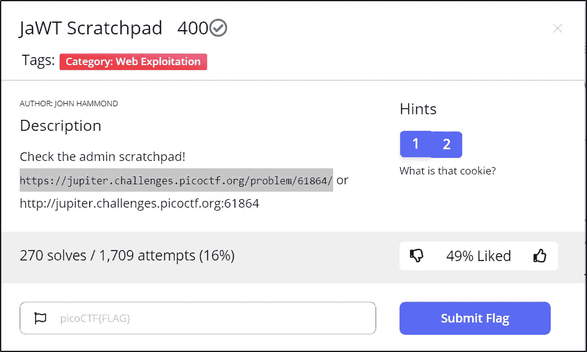
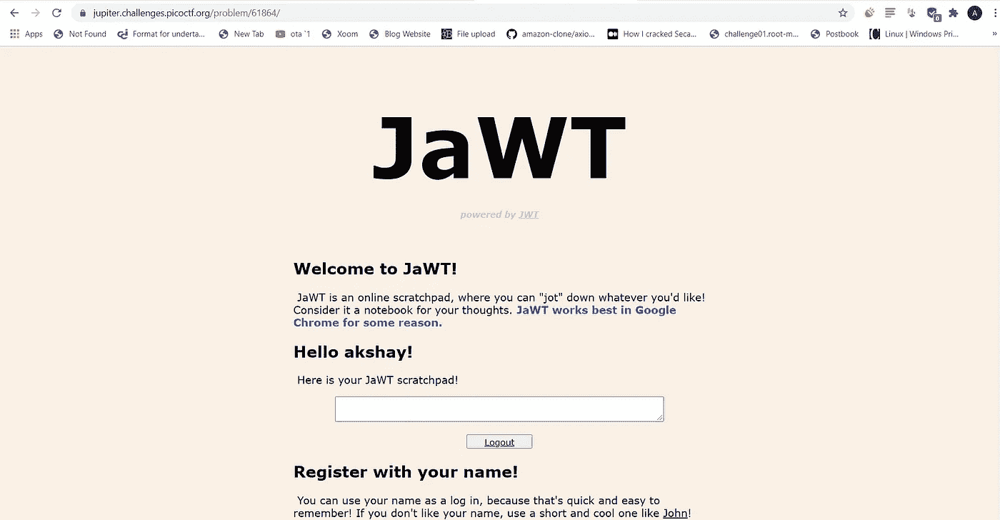
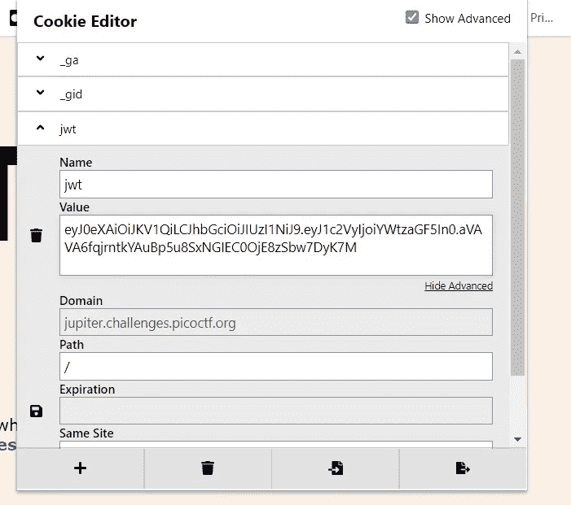
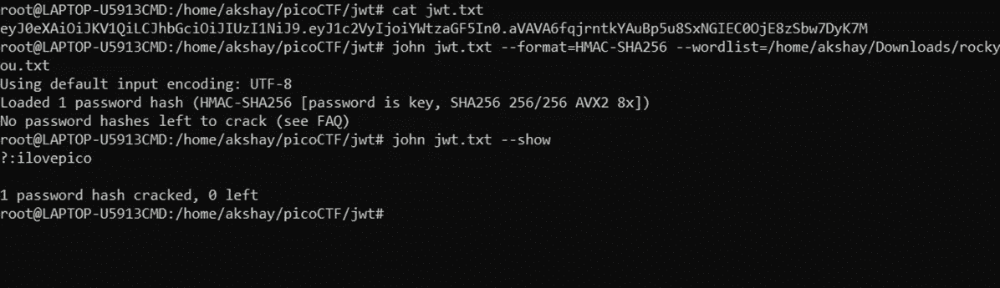
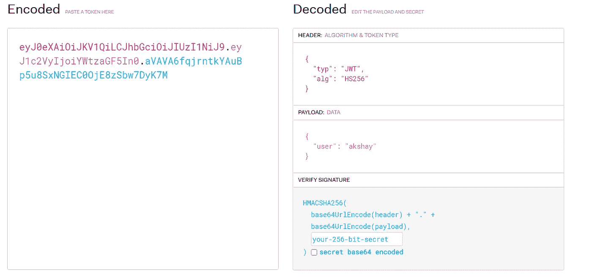
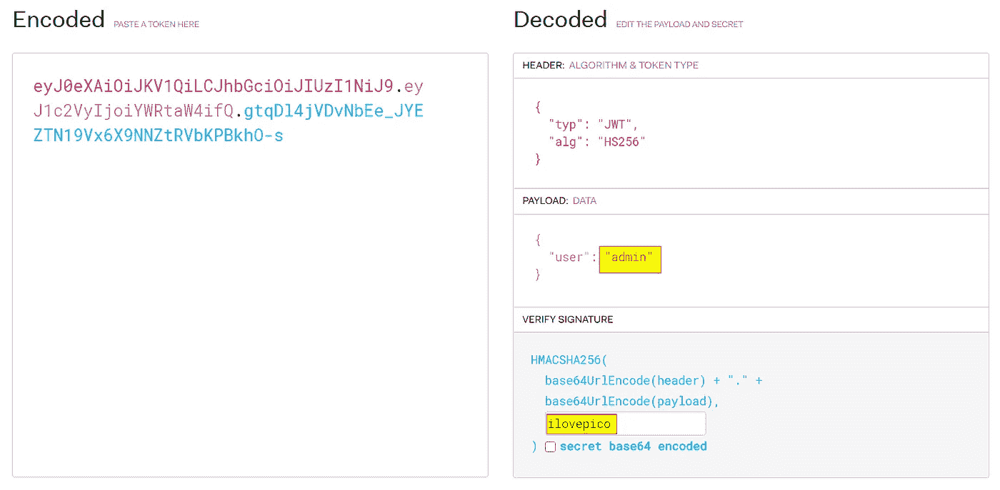
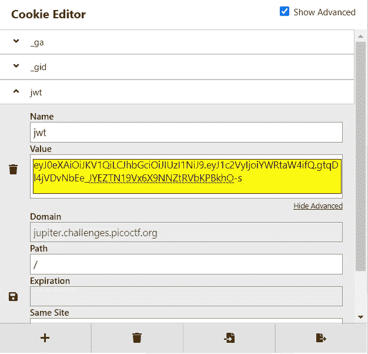
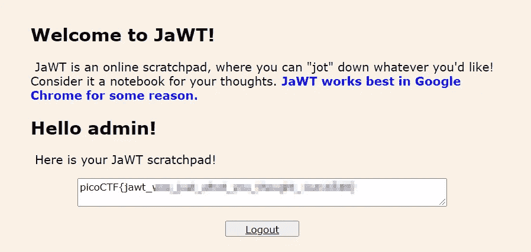

# JaWT 草稿栏

> 原文：<https://infosecwriteups.com/jawt-scratchpad-picoctf-93766d81fd8e?source=collection_archive---------0----------------------->

阿克谢·辛德撰写

这种挑战属于网络开发的范畴。理解如何操作和使用 jwt(Json Web 令牌)是一个很好的挑战。

JWT

## 什么是 JWT，它是如何工作的？

JSON Web Token ( **JWT** )是一个开放标准(RFC 7519)，它定义了一种紧凑的自包含方式，以 JSON 对象的形式在各方之间安全地传输信息。该信息可以被验证和信任，因为它是数字签名的。

访问 URL 并验证您的身份。

网页

看看这个提示，它告诉我们要小心饼干。你可以使用 Chrome 开发者工具(F12)或者这个叫做 **Cookie 编辑器**的很酷的扩展。我将使用 Cookie 编辑器。

让我们来理解这个饼干背后的概念(JWT)。

cookie 被分成三部分，中间用一个*点隔开。*

1.  *页眉*

*第一部分由一个头组成，它基本上告诉我们使用哪种类型的算法。它是 base64URL 编码的字符串。解码后我们得到了下面的字符串:*

> *{"typ":"JWT "，" alg":"HS256"}*

*2.有效载荷*

*第二部分是有效载荷，也是 base64URL 编码的，它几乎包含了用户名。(可用于访问控制)。在这个 CTF，我们以“akshay”的身份登录。*

> *{"user":"akshay"}*

*3.签名*

*该部分验证令牌并检查令牌是否被篡改。因此，如果我们尝试将令牌或用户字段的值更改为 admin，本部分不会允许这种情况发生，并且会给出错误。*

## *利用 jwt。*

*这里的令牌使用的是 HS256 算法。因此，如果一个弱密钥被用来签署一个令牌，那么也许我们可以尝试暴力攻击来获取该密钥。*

*我将使用 [JohnTheRipper](https://github.com/openwall/john) 。*

**

*暴力攻击*

*获得密钥后，我们可以用它来签署一个令牌，并尝试以管理员的身份进行访问。*

*这个[站点](https://jwt.io/)允许您生成和验证 JSON Web 令牌。*

**

*输入您的密钥并生成令牌。*

**

*复制我们生成的令牌，并使用 cookie 编辑器粘贴它。*

**

*令牌已复制*

*单击“保存”按钮并刷新页面以获得管理员访问权限。*

**

*成功*

*谢谢你😃祝你黑客愉快💻*