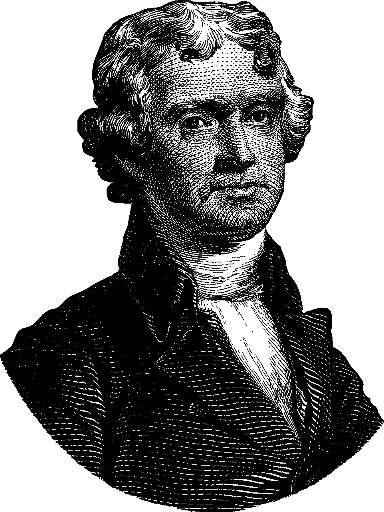
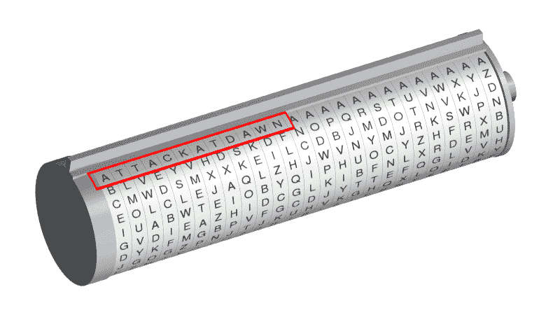
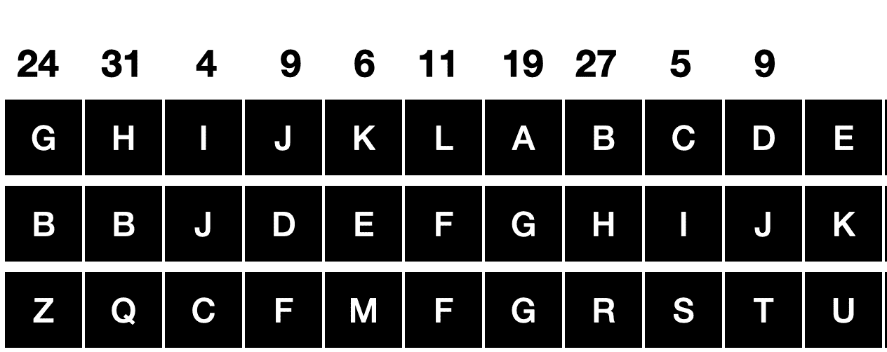
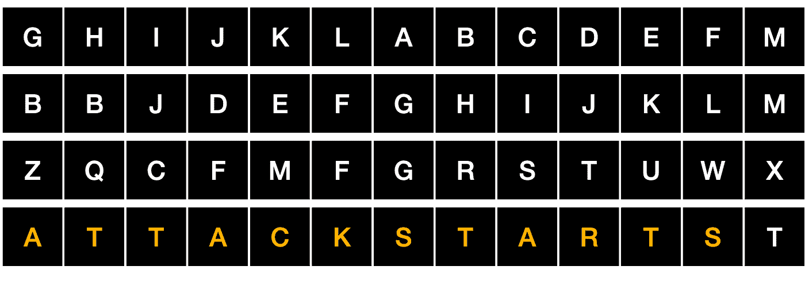
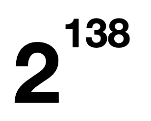

# 杰斐逊密码轮

> 原文：<https://infosecwriteups.com/jefferson-cipher-wheel-44db92c88efb?source=collection_archive---------1----------------------->

# 美国总统托马斯·杰斐逊以他对密码学的好奇和兴趣而闻名。他最著名的密码发明是**密码轮**，他起初不相信它足够安全，实际上选择了另一种密码系统，尽管他自己的系统要安全得多

**杰佛逊实际上创造了一种多字母密码，它使用了英语字母表的多种替代物**

他使用了 36 个圆盘轮，每个圆盘上都印有英文字母，每个圆盘都有不同的排列**(随机顺序)**

第二张盘有另一个随机的顺序，然后是第三张，以此类推…

# 将 36 个磁盘一个接一个地插入到圆筒型装置中，但是是按照只有双方知道的顺序(发送者和接收者)

例如，如果我们的有序磁盘看起来像这样:

**编号为 24 的磁盘将首先插入圆筒，然后是 31 号磁盘，4…**

这种类型的排列导致**巨大的密钥空间**

为了编写加密的消息，发送者订购磁盘并将字母排成一行以便阅读

例如，让我们发送密码消息**“攻击开始”**

然后查看文本的任何其他行(为了我们的示例，让我们假设发送者选择了另一行，该行被移动了 3 个位置),并将该行的其余字母复制到纸张中

**我们得到一个密码信息，随机的字母，没有任何意义**

# 编码后的信息被发送给接收者，他将按照磁盘的顺序一个接一个地排列字母，然后寻找组成合理单词的字母行

**杰弗逊轮的键槽竟然= 36！(36x35x34x33…..)**

托马斯·杰斐逊实际上已经成功地将密钥空间计算为 372 后跟 39 个零。如果我们用二进制来计算，那么这是一个 138 位的密钥

出自:**秘籍—** 初学密码学手册

[https://www.amazon.com/gp/product/B08YDDDZ24?pf _ rd _ r = 7 yjfxkva6k 09 zadd 2m 3&pf _ rd _ p = 6 fc 81 c 8 c-2 a38-41 C6-a68a-f 78 c 79 e 7253 f&PD _ rd _ r = e 7442957-b52e-41eb-866 a-e3e 8 B3 a7 e 94d&PD _ rd _ w = v2 tak&PD _ rd _ WG = 0 zvm 1&ref _。](https://www.amazon.com/gp/product/B08YDDDZ24?pf_rd_r=7YJFFXKVA6K09ZADD2M3&pf_rd_p=6fc81c8c-2a38-41c6-a68a-f78c79e7253f&pd_rd_r=e7442957-b52e-41eb-866a-e3e8b3a7e94d&pd_rd_w=V2tak&pd_rd_wg=0ZVM1&ref_=pd_gw_unk)